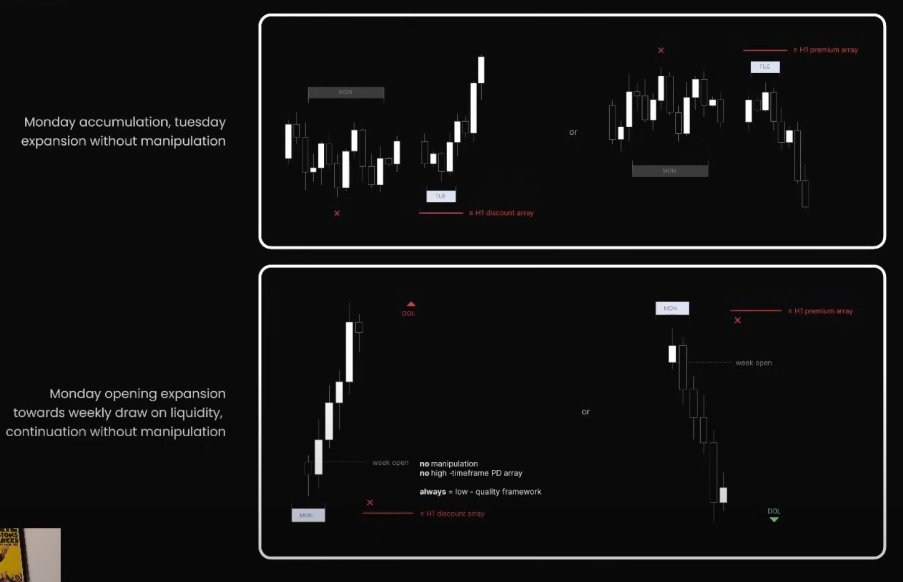
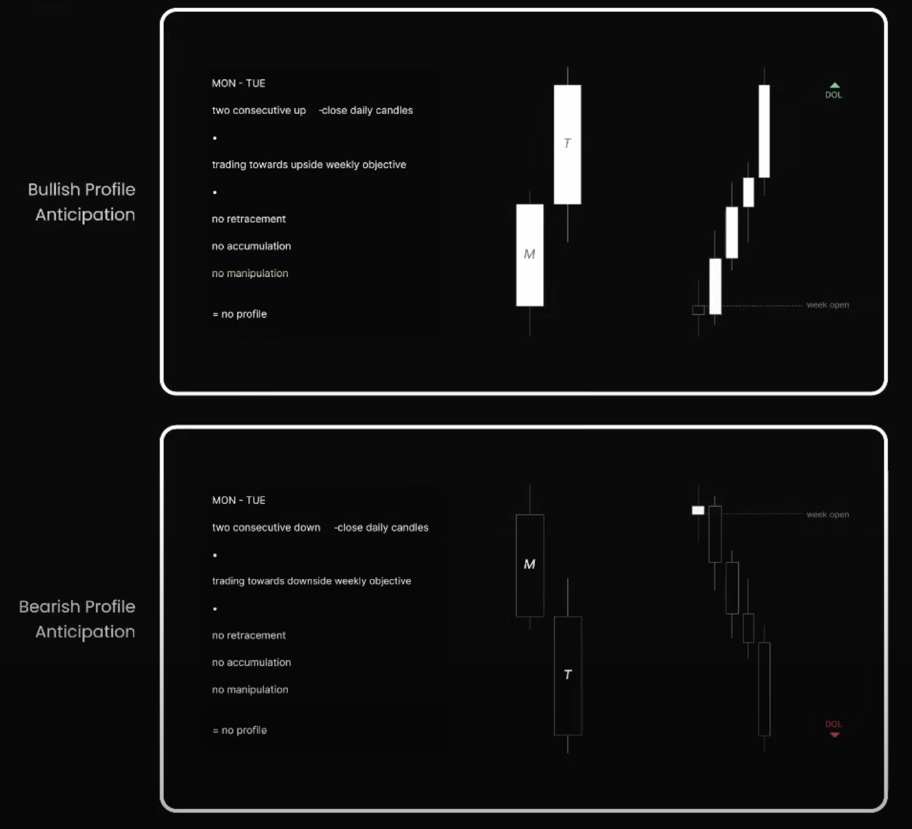

## 🧠 Tư duy gốc rễ

Negative Condition là những trường hợp thị trường di chuyển mà **không có sự thao túng rõ ràng (manipulation)**, **không tạo ra vùng tích lũy (accumulation)**, và **không chạm các PDA có ý nghĩa cao** (Order Block, FVG, v.v.). Những tình huống này thường có **xác suất thấp** để mở rộng bền vững và không phù hợp để giao dịch theo hệ thống ICT.

> Không có trap – Không có liquidity sweep – Không đáng tin để entry.

---

## 📉 Các mẫu hình minh họa

### 🔹 Trường hợp 1 – Monday Accumulation, Tuesday Expansion nhưng **không Manipulation**

- T2 breakout mà không có dấu hiệu "giả vờ đẩy ngược".
- Không có dấu hiệu vào vùng Premium/Discount rõ ràng.
- Biểu đồ mất chất lượng, không có logic để entry.

### 🔹 Trường hợp 2 – Monday mở rộng thẳng theo hướng tuần

- Mở cửa tuần = bắt đầu đẩy giá → không hề tạo trap.
- Không vào bất kỳ PD Array nào (OB, FVG...).
- **Always = low-quality framework** (trong ảnh).

> Dấu X màu đỏ thể hiện **thiếu tín hiệu xác nhận đáng tin cậy** để vào lệnh.

---

## ⚠️ Dấu hiệu nhận biết Negative Condition

| Dấu hiệu                        | Giải thích                                                |
| ------------------------------- | --------------------------------------------------------- |
| ❌ Không có trap hoặc false move | Không xuất hiện Judas swing, Spring, hoặc Liquidity Sweep |
| ❌ Không chạm vùng PDA           | Không vào OB, FVG, hoặc vùng Premium/Discount quan trọng  |
| ❌ Không có chuyển đổi cấu trúc  | Không có MSB rõ ràng, BOS lỏng lẻo                        |
| ⚠️ Expansion xảy ra quá sớm      | Monday đã mở rộng mạnh theo hướng tuần                    |

---

## 📚 Từ khóa kỹ thuật

- **PD Array**: Các cấu trúc kỹ thuật như Order Block, Fair Value Gap, Equal High/Low, Rejection Block... dùng để làm điểm vào lệnh.
- **Judas Swing**: Pha "lừa đảo" ban đầu của tuần dùng để quét thanh khoản, trước khi đảo chiều thật sự.
- **No Manipulation = No Trade**: Không có trap thì không có lý do để entry theo ICT.

---

## ❌ Cảnh báo

> **Không giao dịch trong Negative Condition**.  
> Vì
>
> - Dễ bị "false bias"
> - Không có vùng kỹ thuật hỗ trợ entry
> - Thiếu logic vận động từ Smart Money

---

## **Negative Condition: Unfavorable Midweek Reversal Condition**

> **Negative Condition** = khi thị trường không thỏa mãn cấu trúc để xảy ra reversal giữa tuần.  
> **"No profile"** nghĩa là: KHÔNG CÓ entry chất lượng theo ICT.

---

### 🔺 Trường hợp 1: **Bullish Profile Anticipation thất bại**

**Mô tả cấu trúc:**

- Monday và Tuesday là 2 nến tăng mạnh liên tiếp (`two consecutive up`).
- Giá đang **giao dịch hướng tới mục tiêu thanh khoản phía trên** (upside weekly objective).
- **Không có retracement**, không có trap, không có vùng tích lũy.

**Kết luận:**  
➡️ Không có cơ sở để Midweek Reversal xuất hiện (vì T2 không trap).  
➡️ Không hình thành "Judas swing" hay tín hiệu vào lệnh.

**Chú thích trong hình:**

- DOL (Draw on Liquidity) nằm ở phía trên.
- Week open ở dưới, giá chạy lên suốt không hề quay lại.

---

### 🔻 Trường hợp 2: **Bearish Profile Anticipation thất bại**

**Mô tả cấu trúc:**

- Monday và Tuesday là 2 nến giảm mạnh liên tiếp (`two consecutive down`).
- Giá đang **di chuyển về mục tiêu thanh khoản phía dưới** (downside weekly objective).
- Không có vùng tích lũy, không có pullback, không có trap để hình thành cấu trúc ICT.

**Kết luận:**
➡️ Không có vùng cấu trúc kỹ thuật để reverse.  
➡️ Không nên cố bắt đáy vì không có logic của Smart Money.

---

### 🧠 Ý nghĩa chiến lược

| Điều kiện | Mô tả |
|----------|--------|
| **No retracement** | Không có dấu hiệu phản kháng giá |
| **No accumulation** | Không có tích lũy để tạo trap cho reversal |
| **No manipulation** | Thiếu Judas Swing hoặc stop hunt |
| **No profile** | Không nên áp dụng ICT vì thiếu logic hành vi của Smart Money |

---

### 🛑 Khi gặp Negative Midweek Reversal

- **Không entry chỉ vì giá "quá cao/quá thấp"** – ICT không dựa vào cảm tính.
- **Chờ trap rõ ràng**: phải có pullback, tích lũy, BOS hoặc MSB.
- **Không ép thị trường vào framework ICT khi nó không hợp**.

---

## ✅ Checklist để loại bỏ Negative Condition

| Câu hỏi                             | Đáp án cần có    |
| ----------------------------------- | ---------------- |
| Có vùng tích lũy T2-T3 không?       | ✅ Có             |
| Có tín hiệu manipulation?           | ✅ Có             |
| Có BOS/MSB rõ ràng?                 | ✅ Có             |
| Có về chạm PDA zone?                | ✅ Có             |
| Nếu 1 trong 4 yếu tố trên không có? | ❌ KHÔNG VÀO LỆNH |

---

## 🧭 Tổng kết

> Negative Condition = cấu trúc thị trường không lý tưởng.  
> Khi bạn thấy giá chạy “đẹp quá” từ thứ Hai, mà không hề có vùng trap hay liquidity sweep, thì đó không phải món ăn của Smart Money – mà là trò chơi của Retail trader bị hút theo tin tức hay volume.

---
