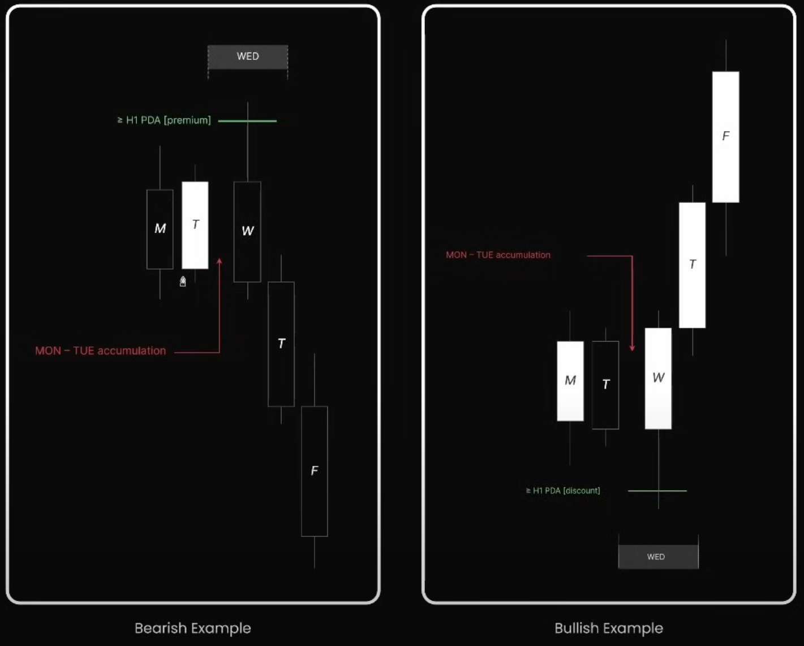

## 🧠 Tư duy gốc rễ

"Accumulation" không chỉ là vùng đi ngang. Trong bối cảnh ICT, nó là **giai đoạn Smart Money tích trữ vị thế**, thường xảy ra vào thứ Hai – thứ Ba, với mục đích tạo điều kiện cho một đợt mở rộng (expansion) sau đó.

> Smart Money không vội vã, họ "build vị thế" khi thị trường còn chưa rõ hướng.

---

## 📈 Biểu đồ minh họa

### 🔻 Bearish Example

- T2-T3 sideway → **Accumulation zone**.
- T4 (Wednesday) test vùng **Premium PDA** (OB/FVG cao).
- Sau đó: T5-T6 mở rộng giảm mạnh.

### 🔺 Bullish Example

- T2-T3 tích lũy ở vùng thấp.
- T4 test vùng **Discount PDA** → hình thành **Spring** nhẹ.
- T5-T6 mở rộng tăng.

---

## 📌 Đặc điểm nhận diện

| Đặc điểm                    | Mô tả                                   |
| --------------------------- | --------------------------------------- |
| 📊 Monday - Tuesday sideway  | Biên độ hẹp, không phá cản quan trọng   |
| 🧲 Vào vùng PDA (OB/FVG)     | T4 test PDA → bật mạnh                  |
| 🚀 T5-T6 mở rộng rõ xu hướng | Tạo candle lớn, xác nhận breakout       |
| 📅 Accumulation thường ngắn  | Diễn ra 1-2 ngày, không kéo dài cả tuần |

---

## 🧠 Cách giao dịch

| Kịch bản             | Hành động                        |
| -------------------- | -------------------------------- |
| T2-T3 đi ngang       | Quan sát, không vào lệnh sớm     |
| T4 test vùng PDA     | Setup entry theo hướng ngược lại |
| Giá break mạnh T5-T6 | Có thể re-entry theo hướng chính |

---

## 📚 Từ khóa kỹ thuật

- **Accumulation (Tích lũy)**: Giai đoạn thị trường đi ngang để Smart Money gom hàng hoặc phân phối kín.
- **PDA (Premium/Discount Array)**: Các vùng như OB, FVG, EQH, EQl tại khu vực giá cao/thấp.
- **Spring**: Pha đẩy nhẹ xuống dưới vùng hỗ trợ để tạo thanh khoản trước khi đảo chiều.
- **Expansion**: Giai đoạn mở rộng biên độ, bắt đầu sau accumulation.

---

## 📌 Mối liên hệ với các profile khác

| Nếu đầu tuần là Accumulation | Cuối tuần thường là...         |
| ---------------------------- | ------------------------------ |
| Midweek Reversal             | Nếu có trap T4                 |
| Classic Expansion            | Nếu breakout rõ T3-T4          |
| Following Expansion          | Nếu tuần trước đã có expansion |

---

## 🎯 Tổng kết

> **Accumulation là cách Smart Money chuẩn bị cho bước đi lớn.** Nếu bạn nhìn thấy Monday – Tuesday tích lũy và Wednesday test vùng kỹ thuật, thì đó chính là tín hiệu cho một trong các profile có xác suất cao nhất.

---