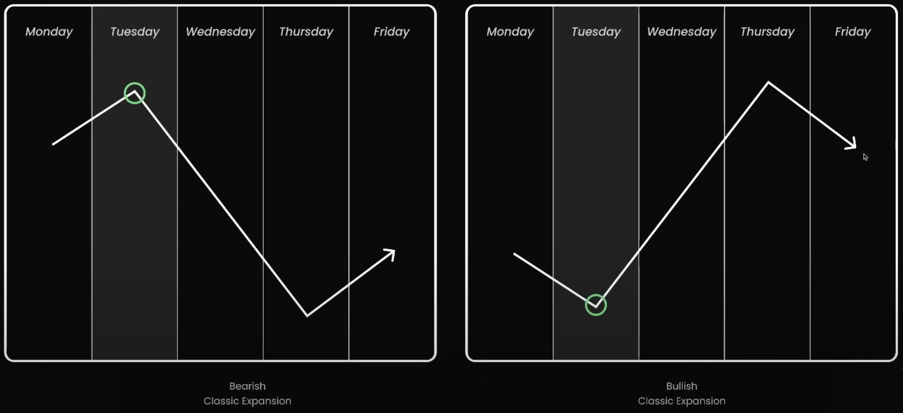
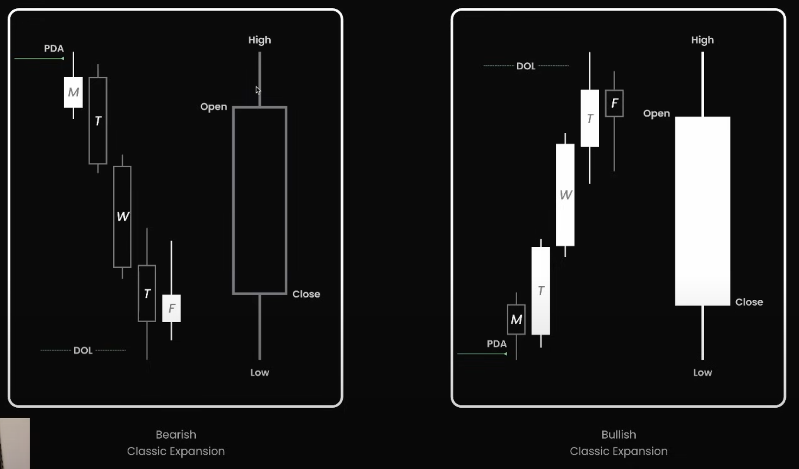
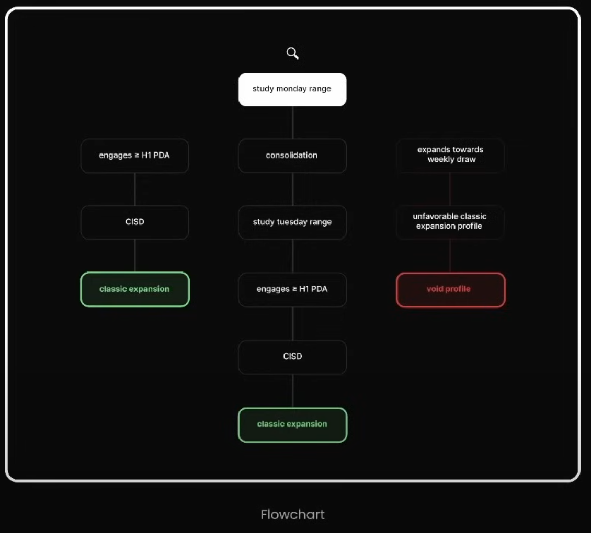
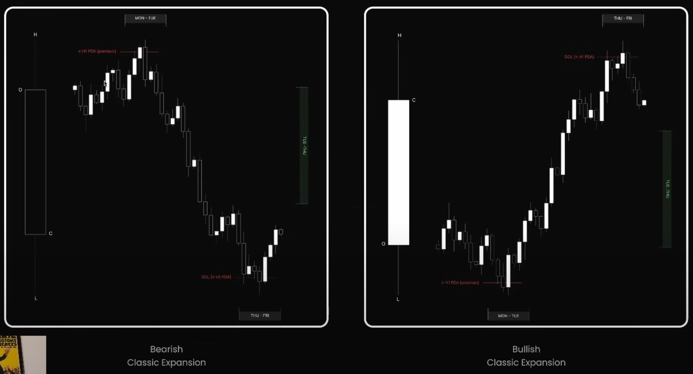

## 🧠 **1. Tư duy gốc rễ: Mô hình tạo xu hướng sau trap**

Thị trường **không đi ngay vào xu hướng.** Trước khi tăng hoặc giảm, nó **cần thanh khoản.**

> ❝ Trước khi đi lên – giá cần "đạp xuống" để gom lệnh Long ở giá tốt.  
> Trước khi đi xuống – giá cần "phóng lên" để kích hoạt lệnh Short hoặc cắt lệnh Long yếu. ❞

👉 Đây là bản chất của mô hình Classic Expansion:  
**Mở rộng xu hướng sau khi đã làm sạch thị trường khỏi phe yếu.**

---

## 🔍 **2. Cách thị trường giăng bẫy đầu tuần**

Vào thứ Hai:

- **Retail trader** sẽ đặt SL ở đỉnh/đáy của tuần trước
- **Smart Money (SM)** sẽ không đụng vào vội. Họ để retail lộ ra vị trí
- Giá sẽ đi “bình thường” → tạo ảo giác thị trường tích lũy hoặc chờ tin

**Đến sáng thứ Ba**, mọi thứ bắt đầu:

- Giá **ra khỏi vùng Monday range** theo một hướng  
- Retail tưởng đó là breakout → **vào lệnh đu bám**
- Nhưng không! Đó là một **liquidity raid (quét stop)**

> Đây là giai đoạn “làm mồi” – **SM đạp xuống để gom** (nếu bullish), hoặc đẩy lên để xả (nếu bearish)

---

## ⚙️ **3. Khi nào Expansion thực sự bắt đầu?**

Sau khi trap hoàn tất, thị trường **bắt đầu tạo dấu hiệu đổi chiều rõ ràng**, như:

- **BOS (Break of Structure)** – phá swing high/low quan trọng
- Xuất hiện **OB hoặc FVG** → nơi SM vừa đặt lệnh
- Cấu trúc dần chuyển sang:  
  - **Higher high / Higher low** nếu bullish  
  - **Lower high / Lower low** nếu bearish

Từ đó, ta có **expansion phase** – giai đoạn giá **di chuyển “mượt” theo hướng chính**, rất đáng tin cậy.

## Hành vi nến tuần kết hợp Daily

- **Bearish Classic Expansion** (trái):
  - T2 engage PDA (Supply, OB...) phía trên  
  - Sau đó giá sụp mạnh xuyên DOL  
  - T4–T5 là đoạn mở rộng chính của xu hướng giảm  

- **Bullish Classic Expansion** (phải):
  - Monday engage vùng Demand (OB/FVG)  
  - Giá bắt đầu mở rộng lên sau khi phá DOL  
  - T4–T5 tạo đỉnh → đóng nến tuần full body tăng

---

## 🔍 Flowchart Nhận Diện Classic Expansion

> **Mục tiêu**: Phân loại thị trường trong tuần có đang mở rộng theo mô hình **Classic Expansion** (bullish/bearish) hay không.

Flowchart có **3 nhánh chính**:

---

### ✅ **[Nhánh trái] – Mô hình Classic Expansion lý tưởng từ thứ 2**

#### 1. `study monday range`

→ Quan sát biên độ cao–thấp của ngày thứ 2

#### 2. `engages ≥ H1 PDA`

→ Nếu giá **chạm hoặc tiếp cận vùng PDA quan trọng** trên khung H1  
(Ví dụ: Order Block, FVG, EQH/EQL, Liquidity Pool…)

➡️ **PDA = Premium/Discount Array** – những điểm mà tay to có thể ra tay.

#### 3. `CISD`

→ **CISD = Clear Indication of Smart Distribution**  
✅ Tức là giá cho thấy rõ dấu hiệu tay to phân phối (short) hoặc gom hàng (long)

→ **Kết luận**: 👉 _**Classic Expansion xác nhận**_  
→ Thị trường có khả năng mở rộng giá rõ ràng sau đó.

---

### ✅ **[Nhánh giữa] – Tình huống phải chờ thêm tín hiệu thứ 3**

> Khi thứ 2 là phiên đi ngang (consolidation), chưa đủ dữ liệu

#### 1. `study monday range`

→ Giá đi ngang hoặc không chạm PDA

#### 2. `consolidation`

→ Xác nhận thị trường đang **sideways** đầu tuần

#### 3. `study tuesday range`

→ Quan sát hành vi mở rộng trong ngày thứ 3

#### 4. `engages ≥ H1 PDA`

→ Nếu giá **chạm PDA** từ thứ 3 trở đi…

#### 5. `CISD`
  
→ Có dấu hiệu smart money xuất hiện?

➡️ **Kết luận**: 👉 _**Classic Expansion có thể xác nhận muộn**_

---

### ❌ **[Nhánh phải] – Thị trường không phù hợp mô hình**

#### 1. `expands towards weekly draw`

→ Giá mở rộng không theo hướng thuận lợi (đi ngược PDA)

#### 2. `unfavorable classic expansion profile`

→ Hành vi giá không giống với mô hình Classic Expansion

➡️ **Kết luận**: 👉 _**Void Profile – loại bỏ Classic Expansion**_  
📌 Phải chuyển qua các mô hình khác như Midweek Reversal, Consolidation Reversal, Accumulation...

---

### 📌 Tóm tắt chiến lược

| Nhánh | Ý nghĩa                            | Chiến lược                                |
| ----- | ---------------------------------- | ----------------------------------------- |
| Trái  | Classic Expansion bắt đầu từ thứ 2 | Entry sớm, kỳ vọng mở rộng mạnh           |
| Giữa  | Classic Expansion bắt đầu từ thứ 3 | Entry trễ hơn, cần kiên nhẫn chờ tín hiệu |
| Phải  | Không phải Classic Expansion       | Loại bỏ mô hình, chuyển chiến lược khác   |

---

Dựa vào hình ảnh bạn vừa gửi (`Weekly Candle + Hourly Profile` của **Classic Expansion**), mình sẽ **viết lại và giải thích kỹ** phần này theo kiểu Feynman – dễ hiểu, rõ ràng, kèm chú thích đầy đủ:

---

## 📌 Weekly Candle + Hourly Profile trong **Classic Expansion**

### 🔻 Trái – **Bearish Classic Expansion**

#### 🧩 Cấu trúc hình thành

- **Thứ Hai – Thứ Ba**:  
  Giá **di chuyển lên vùng Premium** (PDA H1 – khu vực giá cao hơn giá trị thực tế), tạo **trap** và kích hoạt lệnh Sell từ Smart Money.

- **Sau đó giá đảo chiều giảm mạnh**, phá vỡ cấu trúc, tạo MSB (Market Structure Break).

- **Thứ Tư – Thứ Sáu**:  
  Giá **giảm sâu về vùng Discount** (giá thấp hơn giá trị thực), hướng tới **DOL (Draw on Liquidity)** – tức là khu vực có nhiều thanh khoản để Smart Money hấp thụ.

#### 💡 Ý nghĩa

- Đây là mô hình phân phối điển hình:  
  Giá được đẩy lên đầu tuần → thu hút Buyer retail → rồi bán tháo → mở rộng về cuối tuần.

- Weekly candle lúc này là **nến đỏ mạnh**, close gần đáy → xác nhận Bearish Classic Expansion.

---

### 🔺 Phải – **Bullish Classic Expansion**

#### 🧩 Cấu trúc hình thành

- **Thứ Hai – Thứ Ba**:  
  Giá di chuyển xuống vùng Discount → chạm PDA H1 → tạo đòn bẩy mua vào của Smart Money.

- Từ đây, giá **bật mạnh lên**, vượt qua MSB và giữ đà tăng.

- **Thứ Tư – Thứ Sáu**:  
  Giá tiếp tục mở rộng đi lên, hướng về **DOL phía trên** (vùng có thanh khoản của các seller đặt stop-loss phía trên đỉnh).

#### 💡 Ý nghĩa

- Đây là mô hình tích lũy:  
  Đầu tuần thu hút lệnh bán từ retail → Smart Money gom hàng tại PDA → sau đó đẩy giá mở rộng lên.

- Weekly candle lúc này là **nến xanh lớn**, close gần đỉnh → xác nhận Bullish Classic Expansion.

---

### 🧠 Tổng kết nhanh

| Điều kiện           | Bearish Classic Expansion          | Bullish Classic Expansion          |
| ------------------- | ---------------------------------- | ---------------------------------- |
| Giá đầu tuần        | Đẩy lên Premium (PDA)              | Kéo xuống Discount (PDA)           |
| Hành vi Smart Money | Bán ra từ vùng cao                 | Mua vào từ vùng thấp               |
| MSB                 | Xảy ra sau trap đầu tuần           | Xảy ra sau cú đảo chiều đầu tuần   |
| Giá cuối tuần       | Giảm mạnh về vùng thanh khoản thấp | Tăng mạnh lên vùng thanh khoản cao |
| Weekly Candle       | Đóng cửa gần đáy (nến đỏ)          | Đóng cửa gần đỉnh (nến xanh)       |

---

## 🎯 **4. Tại sao mô hình này được gọi là “Classic”?**

Vì đây là **mô hình nguyên bản, hiệu quả cao nhất** mà ICT từng dạy. Nó:

- Dựa trên tính lặp lại của thị trường tài chính (liquidity-based)
- Khai thác tâm lý của người chơi nhỏ: sợ mất cơ hội, đặt SL sai chỗ, vào quá sớm
- Và tận dụng quyền kiểm soát của tay to để điều hướng giá

> Classic Expansion chính là “cú chạy xu hướng đẹp nhất” – nhưng chỉ xảy ra **sau khi tay to đã thanh trừng xong.**

---

## 📌 **5. Tóm lại: Classic Expansion là gì (về bản chất)?**

| Yếu tố               | Ý nghĩa bản chất                                         |
| -------------------- | -------------------------------------------------------- |
| **Monday Range**     | Cái bẫy chờ retail tự lộ diện                            |
| **Tuesday Trap**     | Hành động lấy liquidity – không phải breakout thật       |
| **BOS**              | Tín hiệu cho thấy trap hoàn tất – dòng tiền đã đảo chiều |
| **OB/FVG xuất hiện** | Dấu vết của Smart Money – nơi có thể entry               |
| **Expansion**        | Đoạn thị trường chạy “thật” – ít nhiễu, theo xu hướng    |

---

> ❝ Thị trường giống như một con sư tử. Trước khi săn mồi, nó cần dụ con mồi ra chỗ trống. Classic Expansion là lúc nó vồ mồi – sau khi đã dụ xong bằng Monday và thứ Ba. ❞

---
