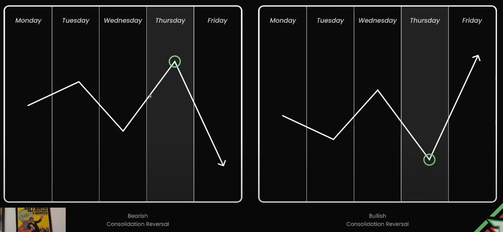
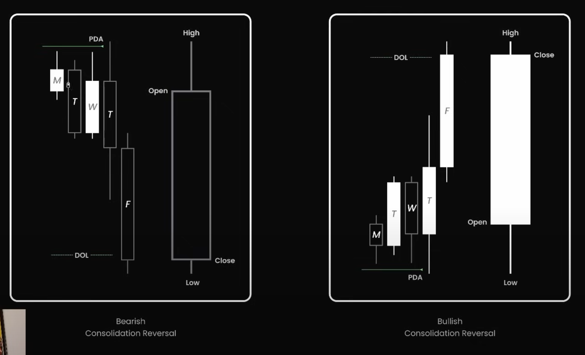
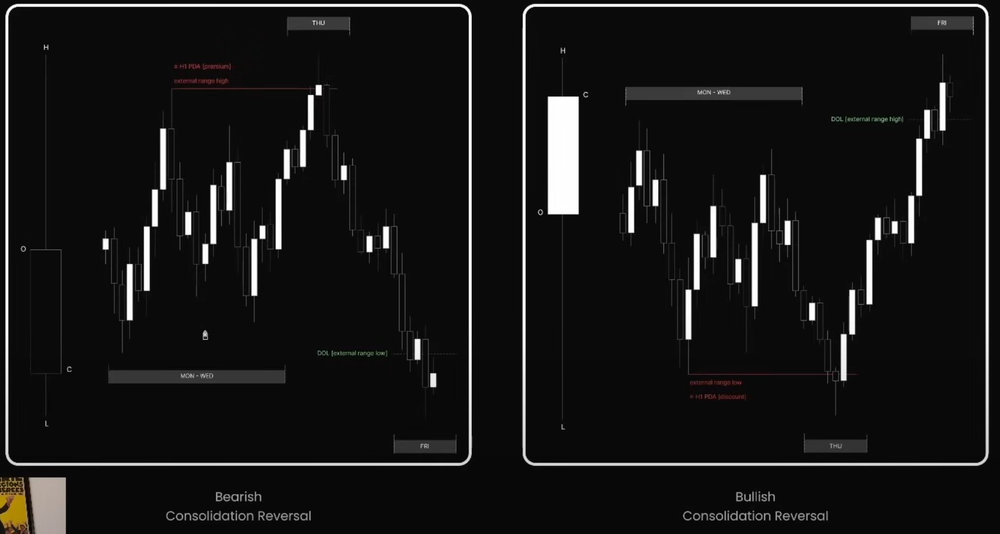

## 📌 Bản chất hình thành

Consolidation Reversal là mẫu hình mà thị trường đi ngang trong 3–4 ngày đầu tuần (thường từ Monday đến Thursday), sau đó breakout vào cuối tuần (thường vào thứ Năm hoặc thứ Sáu) theo hướng ngược lại với kỳ vọng đám đông.

- Đây là “trò lừa” điển hình của Smart Money.
- Nó tích lũy liquidity ở cả 2 đầu range, rồi chọn hướng phá.

---

## 🔁 Cấu trúc hoạt động

- **Monday–Wednesday:** Giá đi ngang trong biên độ hẹp → tạo cảm giác "ổn định", "cạn sóng", hoặc thị trường đang tích lũy để đi tiếp.
- **Thursday:**
  - Giá phá vỡ range (thường là lên đỉnh hoặc xuống đáy).
  - Nhiều trader đu theo breakout và bị trap.
- **Friday:**
  - **Cú reversal mạnh mẽ theo hướng ngược lại.**
  - Di chuyển mở rộng xuyên biên range ban đầu.

- Trái: Bearish Consolidation Reversal – bẫy breakout lên, sau đó dump.
- Phải: Bullish Consolidation Reversal – bẫy breakout xuống, sau đó pump.

---

## 📊 Mô hình nến tuần

- Nến tuần có thể có **râu dài ở hai đầu** nếu trap được cả 2 bên buy/sell side liquidity.
- Candle đóng cửa ngược hướng với cú breakout đầu tiên trong tuần.

### 🔻 *Bearish Consolidation Reversal* (hình bên trái)

- **Monday – Wednesday**:  
  - Giá di chuyển trong biên độ hẹp.  
  - Đôi khi tạo ra các tín hiệu giả của bullish (nến trắng đầu tuần).
  - Có thể test vùng **PDA (Premium Array)** phía trên.  
  - Trader bị dụ vào lệnh Long.

- **Thursday**:  
  - Một cây nến tăng nữa tạo cảm giác breakout thành công.  
  - Nhưng sau đó bị “absorption” hoặc "bull trap".  

- **Friday**:  
  - Đảo chiều mạnh mẽ xuống dưới.  
  - Đóng cửa tuần nằm gần đáy → xác nhận mẫu hình đảo chiều giảm.

📌 **DOL (Draw on Liquidity)** sẽ nằm dưới đáy vùng tích lũy → là mục tiêu hút giá của Smart Money.

---

### 🔺 *Bullish Consolidation Reversal* (hình bên phải)

- **Monday – Wednesday**:  
  - Giá đi xuống nhẹ (nhưng không tạo momentum rõ ràng).  
  - Vùng này được gọi là tích lũy hoặc stop hunt trước khi tăng.

- **Thursday**:  
  - Có thể tạo một đáy thấp hơn (false breakdown).  
  - Thường tap vùng **PDA (Discount Array)** – tức giá chiết khấu.

- **Friday**:  
  - Reversal mạnh với một nến tăng lớn vượt DOL.  
  - Trader bị trap Short phải cover, góp phần đẩy giá mạnh hơn.

📌 Đỉnh của nến Friday thường hướng đến vùng **DOL (Draw on Liquidity)** phía trên, là nơi tập trung thanh khoản bán.

---

## 🔄 Flowchart – Consolidation Reversal

Dưới đây là phần giải thích chi tiết về **Flowchart của Consolidation Reversal** – kèm chú thích các từ khóa quan trọng:

---

## 🔄 **Flowchart – Consolidation Reversal**

### ✅ Nhánh trái (Kích hoạt mẫu hình)

1. **Study Thursday Range**  
   → Xem xét hành vi giá trong ngày **Thứ Năm**.

2. **MON–WED internal rangetion**  
   → Từ **Thứ Hai đến Thứ Tư**, giá nằm trong vùng sideway (không breakout khỏi biên độ rõ ràng).

3. **Engages external range**  
   → Trong ngày **Thứ Năm**, giá đâm **vượt ra ngoài vùng sideway** trước đó.

4. **CISD** (Character Is Shifted Delivery):  
   → Biến động cho thấy có sự chuyển hướng của dòng tiền lớn (chẳng hạn phá vỡ liquidity, tạo MSB, phản ứng mạnh ở OB/FVG…).

5. **✅ Consolidation Reversal**  
   → Mẫu hình hợp lệ.

---

### ❌ Nhánh phải (Vô hiệu hóa mẫu hình)

1. **MON–WED internal range**  
   → Ba ngày đầu vẫn là sideway.

2. **Remains internal range**  
   → Nhưng đến **Thứ Năm**, giá **vẫn không breakout**, không có sự can thiệp của Smart Money.

3. **Void Profile**  
   → Không đủ điều kiện là Consolidation Reversal.

---

### 💡 Ghi nhớ

- **Consolidation Reversal** thường là trap lớn nhất trong tuần, khi giá tạo sideway rồi breakout giả và đảo chiều mạnh.
- **Thứ Năm** là ngày then chốt – cần xem liệu có sự can thiệp thực sự (CISD) hay chỉ là noise.

---

Dưới đây là phần **giải thích chi tiết hình Consolidation Reversal – Bearish & Bullish**, với chú thích các khái niệm trọng yếu trong ICT Weekly Profile.

---

## 📊 **Consolidation Reversal – Weekly Candle + Hourly Profile**

## 🟥 Bearish Consolidation Reversal (bên trái)

### Diễn biến

- **Monday – Wednesday**: Giá tích lũy trong biên độ hẹp (gray box).
- **Thursday**

  - Giá **breakout lên vùng cao của range (external range high)**.
  - Chạm vùng **PDA (premium zone)** – là vùng có khả năng smart money sẽ bán.

- **Friday**
  - Đảo chiều mạnh, đóng cửa thấp – xác nhận xu hướng giảm.

### Từ khóa

| Ký hiệu | Ý nghĩa |
|--------|--------|
| **External Range High** | Giá phá lên trên vùng tích lũy |
| **≥ H1 PDA (premium)** | Khu vực có khả năng phân phối (định giá cao) |
| **DOL (external range low)** | Mục tiêu thu hút thanh khoản bên dưới |

---

## 🟩 Bullish Consolidation Reversal (bên phải)

### Diễn biến

- **Monday – Wednesday**: Giá sideway hoặc giảm nhẹ.
- **Thursday**
  - Giá **break xuống vùng thấp của range** (external range low).
  - Chạm vùng **PDA (discount zone)** – là nơi có khả năng Smart Money sẽ mua vào.
- **Friday**
  - Đảo chiều mạnh, đẩy giá lên, đóng cửa cao hơn – xác nhận xu hướng tăng.

### Từ khóa

| Ký hiệu | Ý nghĩa |
|--------|--------|
| **External Range Low** | Giá phá xuống dưới vùng tích lũy |
| **≥ H1 PDA (discount)** | Vùng mua hấp dẫn của Smart Money |
| **DOL (external range high)** | Target phía trên nơi có thanh khoản |

---

## 🧠 Ý nghĩa chiến lược

- **Không nên trade trong đầu tuần** khi giá đang đi ngang.
- Kiên nhẫn đợi đến **thứ Năm hoặc thứ Sáu**, canh dấu hiệu sweep + MSB để vào theo hướng reversal.
- Cực kỳ hiệu quả khi đi kèm Order Block, Imbalance, hoặc Rejection Block từ khung H1/H4.

---

## 🧩 Điều kiện xác nhận

- Thị trường phải tích lũy đủ lâu trong tuần.
- Cần có dấu hiệu thanh khoản bị lấy cả hai đầu.
- Cú break cuối tuần phải rõ ràng, dứt khoát và đi kèm volume.

---
