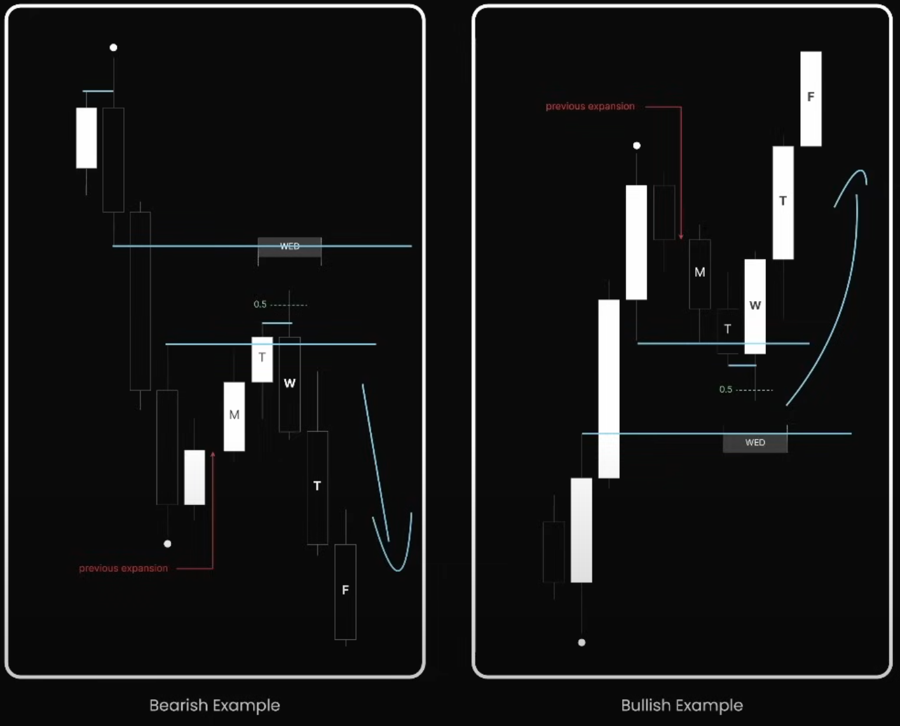

## 🧠 **Tư duy gốc rễ**

Trong ICT, **một đợt mở rộng mạnh** (Classic Expansion, Midweek Reversal...) sẽ **để lại dấu vết thanh khoản bị lấy đi**. Tuần sau đó, smart money **không vội vàng tạo expansion mới**, mà thay vào đó:

- Tái tích lũy quanh vùng vừa lấy thanh khoản.
- Kiểm định lại vùng PDA (Order Block, FVG…).
- Di chuyển chậm để **hút thêm thanh khoản**.

Do đó, tuần sau một đợt expansion hiếm khi “bung tiếp”.

---

## 📈 **Bản chất hình thành**

Following Expansion xảy ra khi:

- Tuần trước đã **mở rộng mạnh** theo một hướng (ví dụ giảm mạnh về FVG hoặc OB).
- Giá chạm vùng PDA quan trọng, tạo dấu hiệu reversal hoặc dừng lại.
- Tuần kế tiếp:
  - Di chuyển yếu hơn.
  - Có xu hướng kiểm tra lại vùng expansion hoặc đảo chiều nhẹ.
  - Hành vi như “lấy hơi” trước pha kế tiếp.

---

## 🔎 **Cách nhận diện**

Dựa trên các đặc điểm sau:

| Đặc điểm | Mô tả |
|---------|------|
| ✅ Tuần trước đã mở rộng rõ ràng | Có cấu trúc Classic Expansion, Midweek Reversal... |
| 🟨 Tuần này di chuyển nhỏ hơn | Biên độ hẹp, thường tích lũy |
| 🔁 Quay lại kiểm định PDA tuần trước | OB, FVG, Breaker Block… |
| 🔄 Có thể tạo **pullback** hoặc **sideway** | Không có xu hướng mạnh |

---

## 🧩 **Ví dụ điển hình**

### 🔻 Bearish Example

- Tuần trước có expansion giảm.
- Tuần sau giá **pullback về vùng 0.5 retracement** (giữa range) và vùng PDA (ví dụ: OB/FVG).
- T3-T4 kiểm định lại rồi tiếp tục giảm.
- Hành vi: **pullback nhẹ → tiếp diễn giảm**.

### 🔺 Bullish Example

- Tuần trước có expansion tăng mạnh.
- Tuần kế: M-W tạo pullback xuống vùng discount (dưới 0.5).
- T4-T5 bật tăng mạnh.
- Hành vi: **giá “nạp lại lực” trước khi tiếp diễn xu hướng tăng**.

---

## 🧠 **Chiến lược giao dịch**

| Kịch bản | Hành động |
|--------|----------|
| Nếu tuần trước mở rộng **giảm** → tuần này kiểm định lại FVG/OB trên | Chờ short từ OB hoặc chờ tiếp tục phá đáy sau tích lũy |
| Nếu tuần trước mở rộng **tăng** → tuần này pullback về demand | Chờ long tại OB dưới |
| Không giao dịch breakout mạnh trong tuần này | Vì đây là tuần điều chỉnh |

---

## 📘 **Ghi chú quan trọng**

- Following Expansion KHÔNG PHẢI LÀ mô hình reversal mạnh, mà giống như một pha “nghỉ” kỹ thuật.
- Cần dùng khung tuần + daily để xác định rõ hành vi tuần trước.

---
