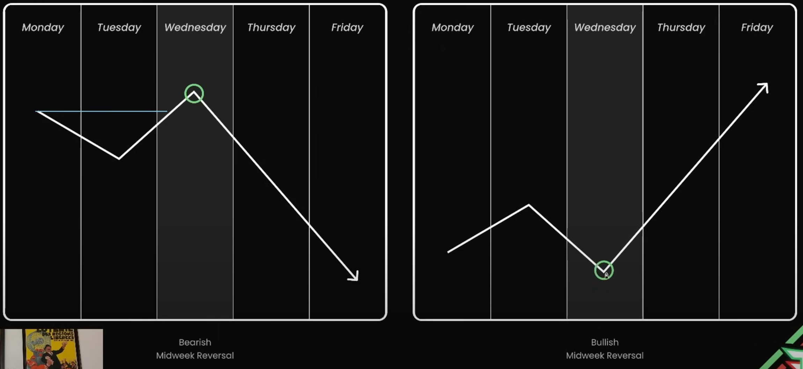
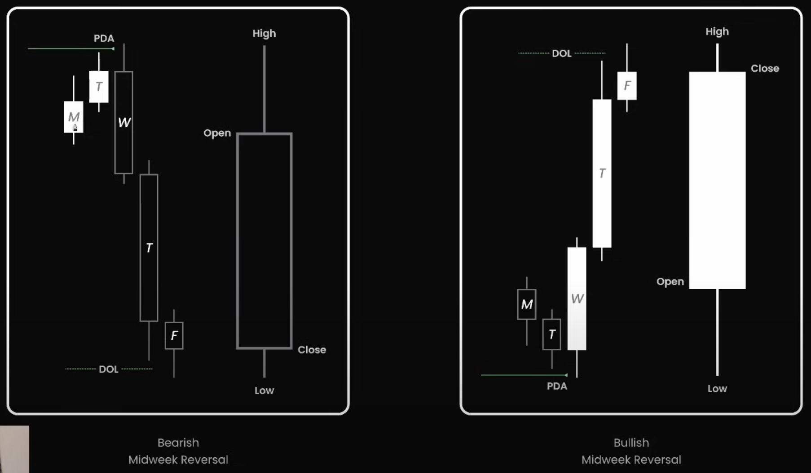
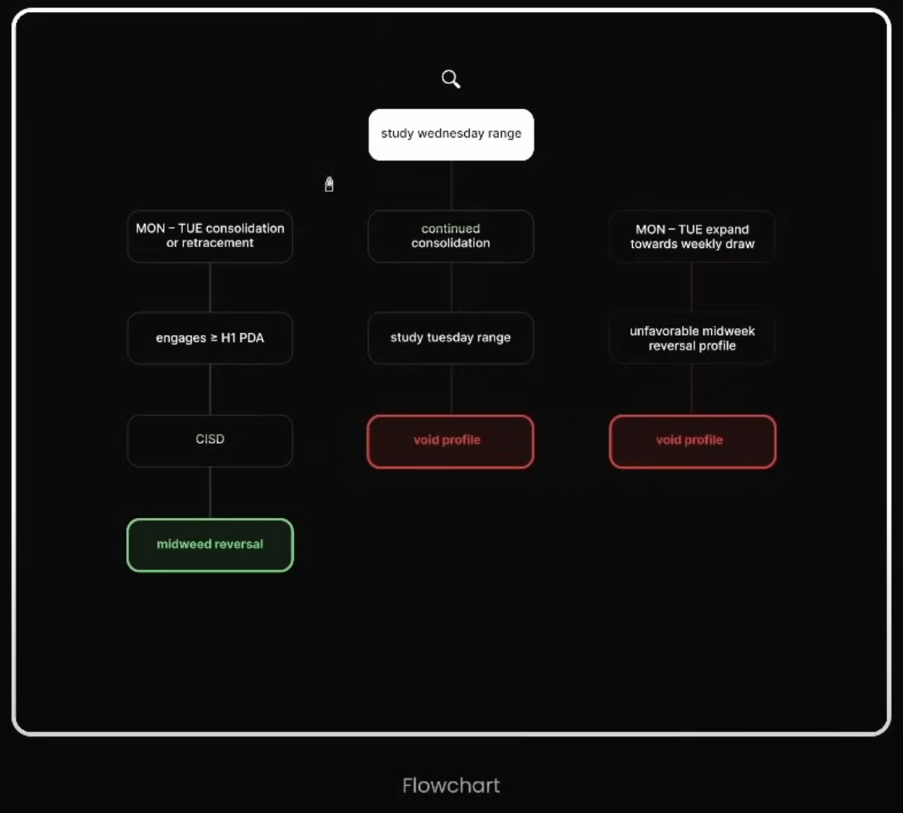
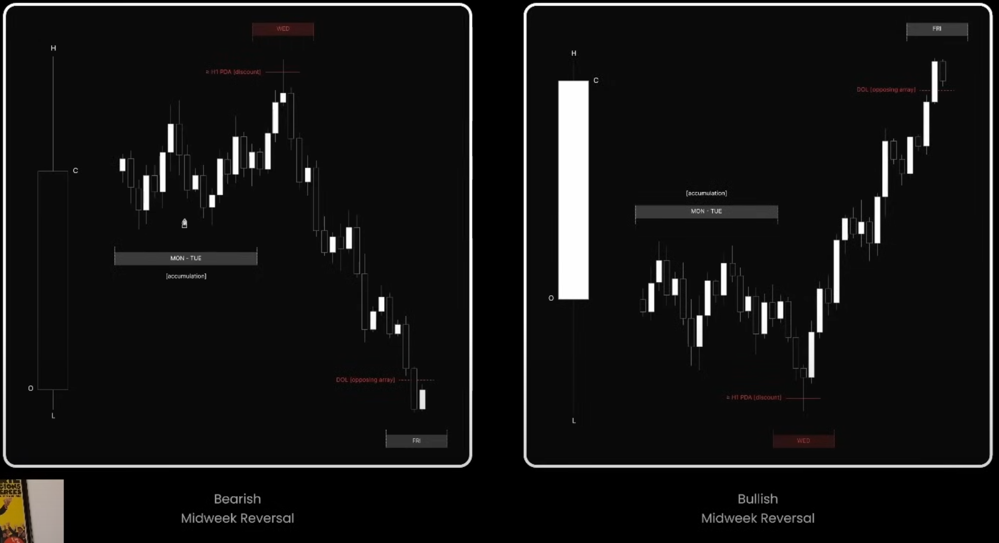
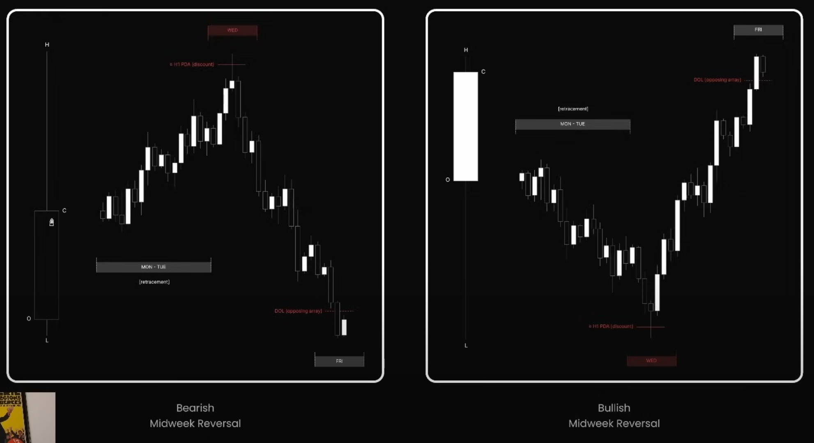

 
## 🧠 **Bản chất gốc rễ**

Midweek Reversal là **mẫu giá mang tính "trap reversal" giữa tuần**, trong đó:

- Đầu tuần (Thứ Hai & Thứ Ba) thiết lập **một hướng giá giả (false move)** – dụ retail theo trend.
- Sau đó, từ **Thứ Tư trở đi**, thị trường đảo chiều **mạnh mẽ**, đi theo hướng thật của Smart Money.

Cấu trúc này thường **phục vụ mục tiêu thanh khoản (Liquidity Draw)** – ví dụ:  
đẩy giá lên để **quét sell stop**, sau đó đảo chiều giảm để **thu hút buyer tiếp tục bị kẹt hàng**.

---

## 🔍 **Đặc điểm kỹ thuật**

| Thời điểm     | Hành động chính                                  |
| ------------- | ------------------------------------------------ |
| **Monday**    | Sideways / False Move bắt đầu hình thành         |
| **Tuesday**   | Tiếp tục đẩy giá theo hướng "giả"                |
| **Wednesday** | **Đảo chiều mạnh** – tạo MSB, chấm dứt hướng giả |
| **Thursday**  | Giá mở rộng theo hướng mới (thật)                |
| **Friday**    | Kết thúc đợt mở rộng, đôi khi hồi nhẹ / sideway  |

---

## 🔁 **Tâm lý thị trường**

| Đối tượng         | Tâm lý điển hình                            |
| ----------------- | ------------------------------------------- |
| **Retail Trader** | Thấy giá breakout đầu tuần → vào theo trend |
| **Smart Money**   | Dẫn giá đến vùng thanh khoản → đảo chiều    |

➡ Đây là mẫu trap kinh điển:  
**Smart Money đợi đến giữa tuần để đảo ngược hướng đi của đám đông.**

---

## 🧩 Mô hình hành vi: Bearish vs Bullish

### **Bearish Midweek Reversal** (trái hình)

- **Mon–Tue**: Giá tăng lên chạm **PDA (Premium Draw Area)**.
- **Wed**: Đảo chiều, phá vỡ đáy Tuesday → tạo **MSB**.
- **Thu–Fri**: Giá trượt nhanh xuống **DOL (Draw on Liquidity)** – nơi có sell-side liquidity.

### **Bullish Midweek Reversal** (phải hình)

- **Mon–Tue**: Giá giảm về vùng **PDA (Discount Area)**.
- **Wed**: Tạo đáy → đảo chiều bullish → **phá đỉnh Tuesday (MSB)**.
- **Thu–Fri**: Giá tăng tiếp lên vùng liquidity phía trên.

---

## 🧭 Flowchart

> **Giúp bạn lọc nhiễu và nhận diện sớm tín hiệu đảo chiều giữa tuần một cách chính xác, tránh bị trap.**

---

### **🌿 Nhánh trái – Có khả năng xảy ra Midweek Reversal**

| Bước  | Nội dung                               | Giải thích                                                                                                                      |
| ----- | -------------------------------------- | ------------------------------------------------------------------------------------------------------------------------------- |
| **1** | `MON–TUE consolidation or retracement` | Hai ngày đầu tuần không rõ xu hướng, giá đi ngang hoặc điều chỉnh nhẹ – điều kiện tiền đề để trapping xảy ra.                   |
| **2** | `engages ≥ H1 PDA`                     | Giá chạm đến vùng PDA (Premium/Discount Array – vùng mà Smart Money quan tâm trên khung H1).                                    |
| **3** | `CISD`                                 | “Change in State of Delivery” – thay đổi trong cách giá di chuyển, ví dụ: xuất hiện MSB, thanh khoản bị quét, OB được phản ứng. |
| **✅** | `Midweek Reversal`                     | Nếu đủ 3 điều kiện trên thì khả năng cao sẽ có đảo chiều giữa tuần.                                                             |

---

### **🔴 Nhánh giữa – Void Profile: Không nên giao dịch**

| Bước  | Nội dung                  | Giải thích                                                                                                         |
| ----- | ------------------------- | ------------------------------------------------------------------------------------------------------------------ |
| **1** | `continued consolidation` | Giá tiếp tục đi ngang đến tận Wednesday, không có hướng cụ thể hoặc thanh khoản đáng kể.                           |
| **2** | `study Tuesday range`     | Phân tích khung giá ngày Tuesday, nhưng nếu không có tương tác rõ ràng thì nên **void profile** (bỏ qua mẫu hình). |
| **🚫** | `Void Profile`            | Không có setup rõ ràng, không nên kỳ vọng đảo chiều giữa tuần.                                                     |

---

### **🔴 Nhánh phải – Void Profile: Mẫu hình không phù hợp**

| Bước  | Nội dung                               | Giải thích                                                                                                                                          |
| ----- | -------------------------------------- | --------------------------------------------------------------------------------------------------------------------------------------------------- |
| **1** | `MON–TUE expand towards weekly draw`   | Hai ngày đầu tuần đã mở rộng mạnh theo hướng của **weekly draw on liquidity** (ví dụ: chạy nhanh về phía FVG hoặc Liquidity Pool trong khung tuần). |
| **2** | `Unfavorable midweek reversal profile` | Giá đã chạy hết mục tiêu hoặc bị kéo quá xa → khả năng đảo chiều thấp.                                                                              |
| **🚫** | `Void Profile`                         | Không kỳ vọng đảo chiều – không đúng mẫu hình.                                                                                                      |

---
## Hourly Profile

### 🔻 **Bearish Midweek Reversal** (Trái)

#### 🗓️ Cấu trúc tuần

- **Monday–Tuesday**: Thị trường dao động sideway, không tạo hướng rõ ràng → gọi là “accumulation phase”.
- **Wednesday**: Có cú breakout giả lên vùng cao, quét qua **PDA (≥ H1 Premium Array)**.
- Sau khi chạm PDA, **CISD** xuất hiện → giá đảo chiều xuống mạnh.

#### 📊 Chi tiết kỹ thuật

| Thành phần                   | Giải thích                                                                    |
| ---------------------------- | ----------------------------------------------------------------------------- |
| **MON–TUE: Accumulation**    | Vùng sideway tích lũy, thường tạo cảm giác an toàn cho cả buyers & sellers.   |
| **WED: ≥ H1 PDA (discount)** | Giá tăng lên chạm vùng giá Premium – nơi Smart Money đặt sẵn lệnh bán.        |
| **DOL (opposing array)**     | Mục tiêu sau cú đảo chiều là vùng liquidity ngược hướng – thường là đáy tuần. |
| **Friday**                   | Giá đóng cửa dưới vùng DOL, hoàn tất cú “midweek trap”.                       |

➡️ **Ý tưởng giao dịch**:  
Chờ giá breakout lên vùng cao vào **thứ 3** → xác nhận MSB hoặc OB → vào lệnh Sell targeting DOL.

---

### 🔺 **Bullish Midweek Reversal** (Phải)

#### 🗓️ Cấu trúc tuần

- **Monday–Tuesday**: Giá đi ngang → tạo vùng tích lũy, không rõ hướng.
- **Wednesday**: Giá giảm mạnh, quét đáy, chạm vào vùng **PDA (≥ H1 Discount)** → xuất hiện reversal.
- **Thursday–Friday**: Giá đảo chiều tăng mạnh, phá các vùng kháng cự phía trên, đóng tuần gần đỉnh.

#### 📊 Chi tiết kỹ thuật

| Thành phần                   | Giải thích                                                                 |
| ---------------------------- | -------------------------------------------------------------------------- |
| **MON–TUE: Accumulation**    | Tạo vùng sideway dưới đáy.                                                 |
| **WED: ≥ H1 PDA (discount)** | Giá giảm mạnh về vùng Discount → nơi Smart Money có thể bắt đáy.           |
| **DOL (opposing array)**     | Vùng phía trên (liquidity cluster) → là mục tiêu cuối cùng trong pha tăng. |
| **Friday**                   | Giá thường đóng cửa cao, sát vùng DOL phía trên.                           |

➡️ **Ý tưởng giao dịch**:  
Chờ giá giảm mạnh vào **thứ 3 hoặc thứ 4** → chạm PDA (Discount) + xuất hiện MSB → vào lệnh Buy targeting DOL.

---

## 🛠 **Cách nhận diện Midweek Reversal**

1. **Tìm Mon–Tue** có hướng giá rõ ràng (breakout mạnh)
2. Quan sát nếu **giá đảo chiều mạnh vào Wednesday (NY session)** → chú ý MSB
3. Nếu có dấu hiệu đảo chiều → đó là tín hiệu sớm của Midweek Reversal
4. Theo dõi giá **di chuyển xa khỏi DOL (Draw on Liquidity)** sau cú đảo

---

## ⚙ Chiến lược ứng dụng

| Giai đoạn            | Hành động chiến lược                          |
| -------------------- | --------------------------------------------- |
| Mon–Tue              | Không FOMO theo breakout                      |
| NY Session Wednesday | Quan sát dấu hiệu **MSB** & **OB hình thành** |
| Thu–Fri              | **Trade theo hướng mới** (sau reversal)       |

---

## 🧭 Ghi nhớ từ khóa

- **False Move**: Chuyển động giá đầu tuần nhằm dụ trader retail.
- **Draw on Liquidity (DOL)**: Mục tiêu mà giá hướng đến để hấp thụ thanh khoản.
- **MSB**: Dấu hiệu cho thấy xu hướng đã đổi (Market Structure Break).
- **OB (Order Block)**: Vùng chốt lệnh của Smart Money, nơi reversal thường bắt đầu.

---
