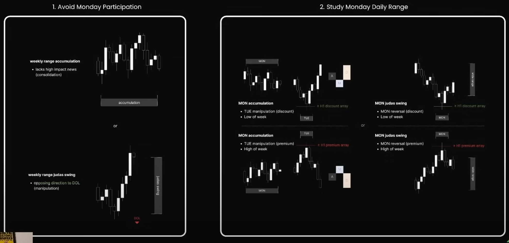

## **Tư duy gốc rễ:**

Monday Protocol không đơn giản là tìm kiếm cơ hội giao dịch vào thứ Hai, mà là sử dụng hành vi giá trong ngày này như một **kim chỉ nam để dự đoán cấu trúc cả tuần**. Việc hiểu rõ cấu trúc range của thứ Hai sẽ giúp xác suất xác định được direction, entry và target trong những ngày còn lại tăng đáng kể.

---

## **Bản chất hình thành:**

- Thị trường vào thứ Hai thường đi **trong biên độ hẹp** để xây dựng vùng range ban đầu cho tuần mới.
- Đây chính là nơi để Market Maker tạo ra **liquidity trap**, sau đó sẽ phá vỡ nó vào thứ Ba hoặc thứ Tư.
- **Range ngày thứ Hai** đóng vai trò là điểm neo để xác định các điểm phá vỡ hoặc reversion sau đó.

---

## **Mục tiêu sử dụng Monday Protocol:**

- **Xác định "smart money range"** → vùng hoạt động tiềm năng của dòng tiền lớn.
- **Tìm điểm phá vỡ hoặc phản ứng từ Range Monday** vào các ngày thứ Ba, Tư, Năm.
- **Không trade trong ngày thứ Hai nếu không có clear liquidity event.**

---

## **Phân loại cấu trúc Monday Protocol:**

Dựa trên cách giá phản ứng với Monday Range trong các ngày sau, có thể chia thành 3 trường hợp:

### ✅ **Ideal Monday Range Setup**

- Giá tạo ra một vùng range gọn gàng (có thể đo được cao-thấp).
- Không có quá nhiều wick hoặc quét nhiễu.
- Liquidity nằm ngoài Range, chờ bị khai thác trong ngày tiếp theo.

### ❌ **Unfavorable Setup**

- Giá xuyên phá Range ngay trong ngày thứ Hai → mất tính định hướng.
- Có quá nhiều quét wick tạo sự mơ hồ.

### 🔁 **Reversion Setup**

- Giá phá Range Monday vào thứ Ba → đảo chiều quay ngược lại vào giữa tuần.

---

## **Key Levels trong Monday Protocol:**

- **High & Low của Monday** → biên xác định range.
- **Opening Price (Open of Week)** → xác định bias (bullish hay bearish).
- **Liquidity Pools quanh Range Monday**.

---

## **Kết hợp Monday Protocol với Classic Expansion & Midweek Reversal:**

- **Classic Expansion**: Nếu thứ Hai đi ngang và thứ Ba phá vỡ mạnh, nhiều khả năng là classic profile đang diễn ra.
- **Midweek Reversal**: Nếu Monday-Tuesday đi về một phía và Wednesday tạo reversal, cần kiểm tra xem thứ Hai có đóng vai trò vùng trap không.

---

## Monday Protocol Sumary

### 🧭 **1. Avoid Monday Participation (Tránh giao dịch thứ Hai)** – *Khung trái ảnh*

#### ✅ **Mục tiêu**

Không trade thứ Hai, mà quan sát để xác định xem thứ Hai là:

- **Accumulation** – tích lũy
- **Judas Swing** – bẫy giả

---

#### 🔹 **Weekly Range Accumulation** *(ảnh trên trái)**

- Giá di chuyển chặt chẽ, sideway.
- Không có tin tức mạnh, volume thấp → thị trường đang tích lũy.
- Thường xảy ra khi chưa có lý do để đẩy giá đi đâu cả (chờ thứ Ba – news hoặc liquidity).

🔸 **Kết luận**: KHÔNG vào lệnh, đợi phản ứng thứ Ba.

---

#### 🔹 **Weekly Range Judas Swing** *(ảnh dưới trái)*

- Giá **đi ngược hướng DOL** → ví dụ: phá đỉnh để làm trap rồi quay đầu giảm cả tuần.
- Đây là bẫy của smart money để thu hút retail fomo (false breakout).
- Judas Swing rất dễ nhầm với true expansion nếu không quan sát kỹ thứ Ba.

🔸 **Kết luận**: Tuyệt đối tránh vào lệnh khi chưa chắc đó là bẫy.

---

### 🔍 **2. Study Monday Daily Range (Phân tích chi tiết hành vi thứ Hai)** – *Khung phải ảnh*

### A. **MON Accumulation → TUE Manipulation**

- Thứ Hai di chuyển yếu (accumulation).  
- Thứ Ba sẽ là ngày tạo bẫy để mở rộng:
  - Nếu **manipulation tại discount** (quét đáy) → thứ Ba tạo đáy → tuần tăng.
  - Nếu **manipulation tại premium** (quét đỉnh) → thứ Ba tạo đỉnh → tuần giảm.

🟢 **Đặc điểm:**

- Tăng xác suất nếu thứ Ba chạm vùng **≥ H1 PDA** như FVG, OB.
- Tạo vùng High/Low cho tuần.

---

### B. **MON Judas Swing**

- Thứ Hai tự tạo bẫy (phá đáy/đỉnh mạnh) rồi quay đầu ngay trong ngày.
- Không đợi đến thứ Ba để tạo manipulation.

🔴 **Đặc điểm:**

- Đáy hoặc đỉnh thứ Hai thường trở thành **Low/High of Week**.
- Kết hợp cực mạnh với các vùng OB/FVG nằm ở premium/discount.

---

## 🎯 Ý nghĩa chiến lược

| Nhận diện | Ý nghĩa |
|-----------|--------|
| Accumulation | Không nên vào lệnh, chờ tín hiệu thứ Ba |
| Judas Swing | Dễ bị trap nếu vào sớm, cần xác định reversal rõ ràng |
| TUE phản ứng | Là tín hiệu kích hoạt bias trong tuần |

---

## ✅ Checklist xác định Monday Protocol hiệu quả

| Yếu tố | Có / Không |
|--------|------------|
| Range Monday rõ ràng | ✅ |
| Có liquidity ngoài range? | ✅ |
| Thứ Ba phản ứng thế nào với Range? | Theo dõi |
| Giá có vượt qua DOL không? | Check bias |
| Có phản ứng với PDA từ H1 trở lên không? | Cực kỳ quan trọng |

---