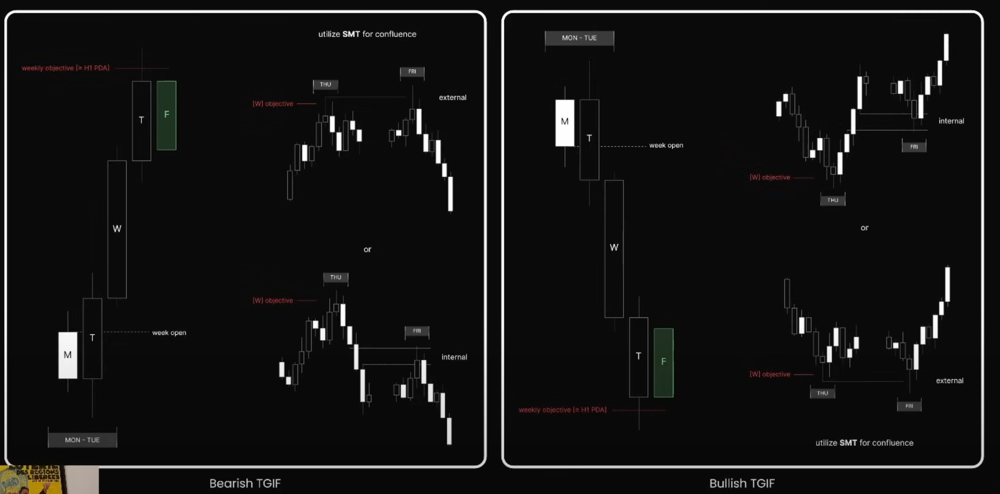

## 🎯 **TGIF Setup – Counter-Trend vào Thứ Sáu**

TGIF (Thank God It's Friday) Setup là **cơ hội giao dịch đảo chiều hoặc chạy theo xu hướng ngắn trong ngày Thứ Sáu**, thường xuất hiện **sau khi mục tiêu trong tuần đã đạt**, và thị trường bắt đầu phản ứng.

---

## 🧩 **1. Cấu trúc cơ bản TGIF Setup**

TGIF Setup chia thành 2 loại:

- **Bearish TGIF** – khi thị trường đạt đỉnh tuần, chuẩn bị đảo chiều giảm.
- **Bullish TGIF** – khi thị trường đạt đáy tuần, chuẩn bị đảo chiều tăng.

TGIF có thể hoạt động ở cả hai dạng:

- **Internal objective**: đảo chiều trong biên độ tích lũy tuần.
- **External objective**: quét thanh khoản rồi đảo chiều ngoài biên độ.

---

## 🔻 **Bearish TGIF Setup**

### ➤ Cấu trúc

- Thứ Hai → Thứ Tư: đà tăng rõ ràng (bullish delivery).
- Thứ Năm: chạm vào vùng thanh khoản quan trọng (`Weekly Objective = H1 PDA`).
- Thứ Sáu: đảo chiều từ đỉnh tuần → tìm entry sell.

### ➤ Mô hình minh họa (trái ảnh)

- Mở cửa tuần ở dưới.
- W, T tăng mạnh, F hình thành nến giảm (hoặc weak high).
- Cần **kết hợp SMT divergence** để tăng xác suất (ví dụ: một cặp tiền không tạo đỉnh mới, một cặp thì có → tín hiệu divergence).

### 🧠 Lưu ý

- Dùng SMT, FVG, hoặc OB để tìm điểm vào lệnh risk thấp.
- Target là điểm open tuần, hoặc low của thứ Ba, thứ Tư.

---

## 🔺 **Bullish TGIF Setup**

### ➤ Cấu trúc

- Thứ Hai → Thứ Tư: đà giảm rõ ràng (bearish delivery).
- Thứ Năm: chạm vào đáy thanh khoản (`Weekly Objective = H1 PDA`).
- Thứ Sáu: đảo chiều từ đáy tuần → tìm entry buy.

### ➤ Mô hình minh họa (phải ảnh)

- Mở cửa tuần ở trên.
- W, T giảm mạnh, F hình thành bullish engulf hoặc rejection candle.
- Có thể sử dụng SMT để xác nhận đáy ngắn hạn.

---

## ✅ **Key Confirmations**

| Tín hiệu | Ý nghĩa |
|---------|--------|
| **SMT (Smart Money Tool)** | Divergence giữa 2 cặp → xác nhận đảo chiều |
| **PDA H1** | Point of Interest khung H1 (OB, FVG, EQH/ EQL...) |
| **Thu –> Fri Reaction** | Cần có phản ứng từ vùng giá quan trọng trong thứ Năm để vào lệnh thứ Sáu |

---

## 📌 **Ý nghĩa chiến lược**

TGIF Setup không phải lúc nào cũng xuất hiện, nhưng:

- Là **cơ hội cuối cùng trong tuần** để tận dụng phần mở rộng hoặc đảo chiều.
- Đặc biệt hiệu quả nếu **điểm đảo chiều trùng với weekly objective (DOL)**.
- Rất hợp để đánh **scalping hoặc intraday** nếu đã có sẵn định hướng trong tuần.

---
