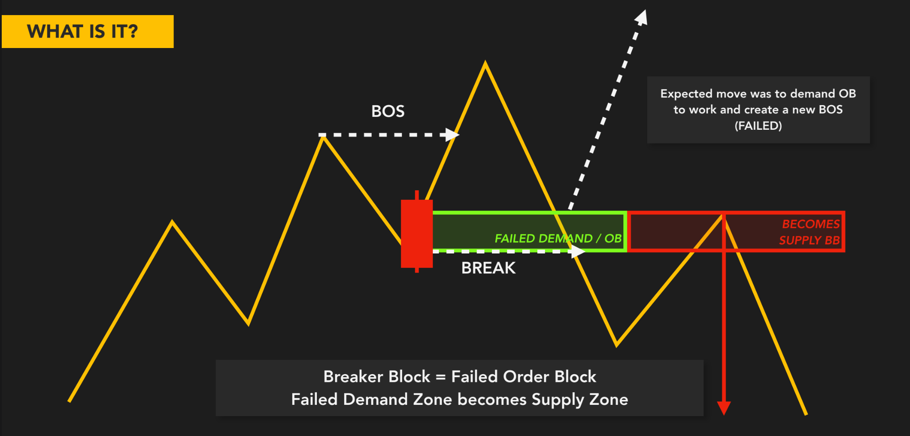
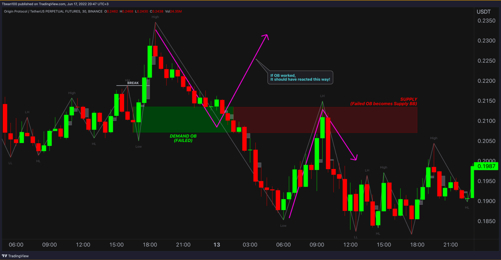
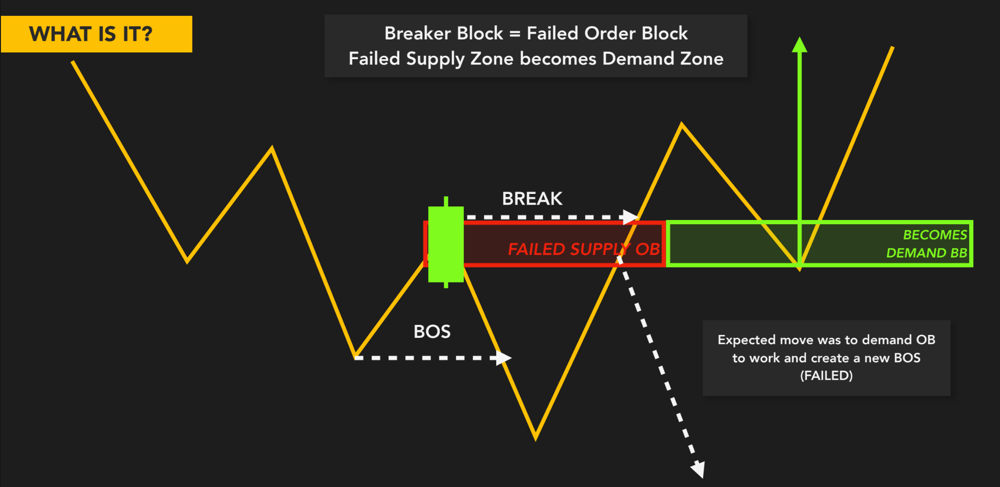
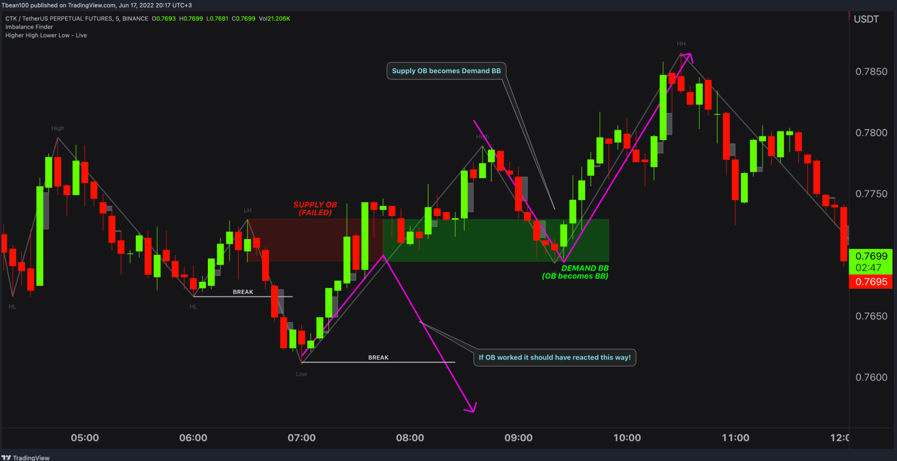
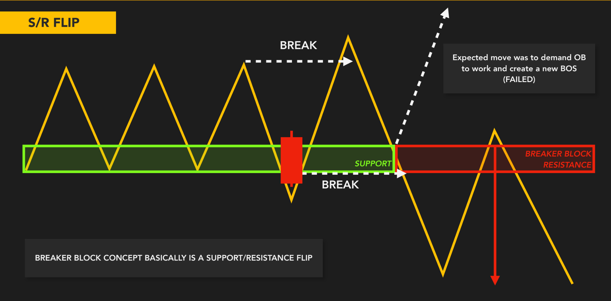
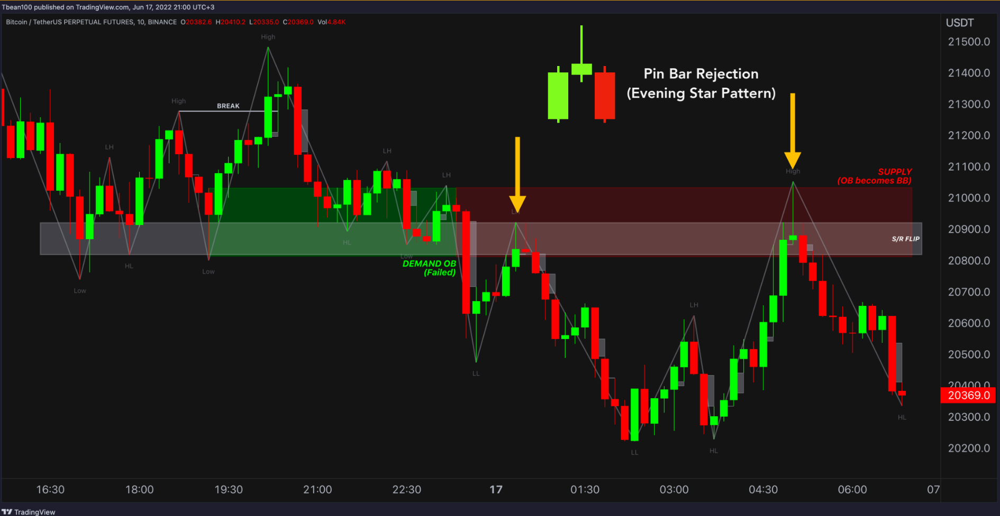
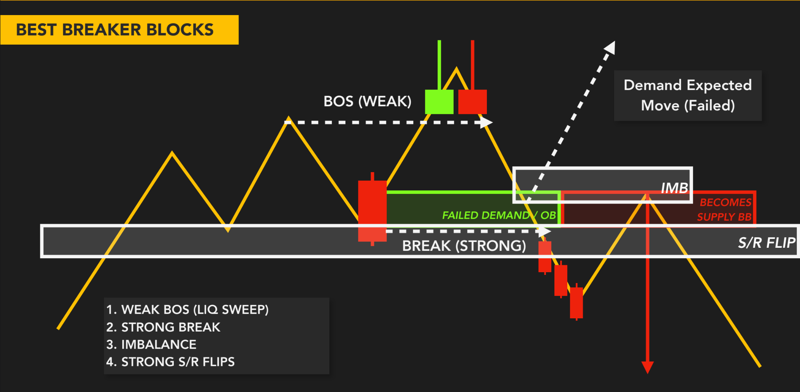
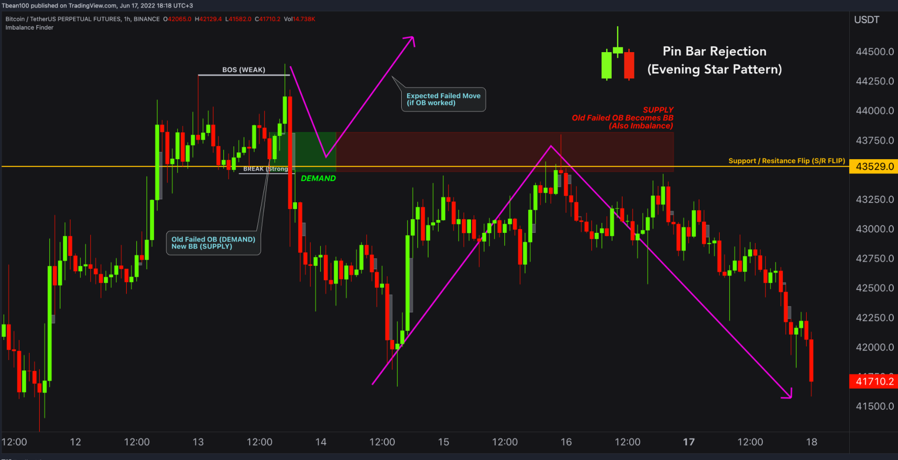

## 🧠 Tư duy gốc rễ: Tại sao lại có Breaker Block?

Breaker Block (BB) xuất hiện khi một vùng **Order Block** ban đầu **không phát huy tác dụng như kỳ vọng**.  
Nói đơn giản: Tay to đặt lệnh ở một vùng – nhưng sau đó **giá phá luôn vùng đó** → Biến vùng OB cũ thành vùng "phản kháng".

> BB là cách tay to **giăng bẫy và đổi vai trò** vùng giá:  
> Từ *"hỗ trợ"* thành *"kháng cự"*, hoặc ngược lại.

---

## 🔍 Bản chất hình thành Breaker Block

- Ban đầu có một **Demand OB** – kỳ vọng giá bật lên → tạo BOS mới  
- Nhưng thay vì bật → **giá phá vỡ vùng này**  
- Điều đó có nghĩa:  
  ✖️ Vùng OB đó **thất bại**  
  ✔️ Vùng đó giờ trở thành **vùng cản** cho chiều ngược lại

> BB = **Order Block thất bại** + **Bị phá vỡ** + **Tái sử dụng chiều ngược**

---

## 📊 Ví dụ minh họa

### ▶️ Bearish Breaker Block (BB – Kháng cự mới)

- Có **Demand OB** kỳ vọng bật lên  
- Nhưng giá giảm thủng luôn OB  
- Khi giá hồi lên → vùng OB cũ **trở thành kháng cự** → BB xuất hiện  
→ **Entry SELL từ BB này rất mạnh**

---

### ▶️ Bullish Breaker Block (BB – Hỗ trợ mới)

- Có một **Supply OB** kỳ vọng giá giảm  
- Nhưng tay to phá ngược lên trên  
- Khi giá hồi lại → vùng OB cũ **trở thành vùng Demand mới**  
→ BB được dùng làm **vùng entry BUY**

---

## 🔁 Breaker Block = S/R Flip thông minh

BB chính là hình mẫu “hỗ trợ trở thành kháng cự” hoặc ngược lại, nhưng **tinh chỉnh hơn nhiều**:

- BB **có gốc rễ từ Order Block** – tức là có tay to tham gia  
- Có **BOS thất bại** – tín hiệu trap trước đó  
- Có **break mạnh** xác nhận lực thực  
→ Entry tại BB là điểm mà Smart Money thường sử dụng để "trap" trader nhỏ

---

## ✅ Điều kiện để BB trở nên mạnh

1. Phải có **OB rõ ràng** ban đầu  
2. Có BOS → rồi **thất bại (FAILED BOS)**  
3. Có cú **Break mạnh xác nhận BB**  
4. Có **Imbalance đi kèm** càng tốt  
5. Có **flip vai trò rõ ràng** (support → resistance hoặc ngược lại)

---

## 🧠 Tổng kết

| Breaker Block | Ý nghĩa |
|---------------|---------|
| Là OB thất bại → chuyển vai trò | Dấu hiệu trap cực mạnh của tay to |
| Tái sử dụng vùng cũ với tâm lý ngược | Tạo điểm entry lý tưởng |
| Có thể là Target, hoặc Entry | Nếu test lại → thường là phản ứng rất mạnh |

---
