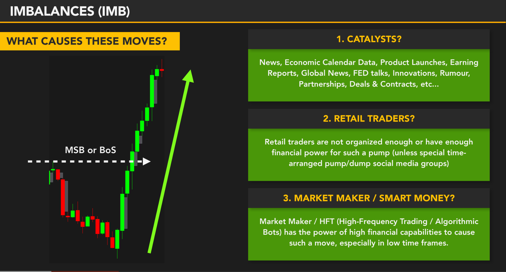
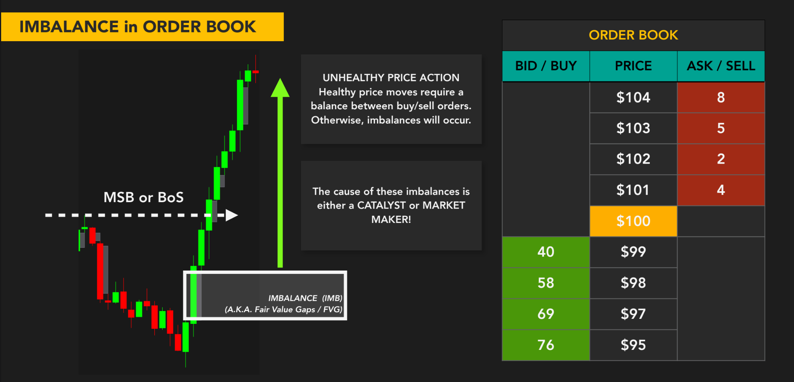
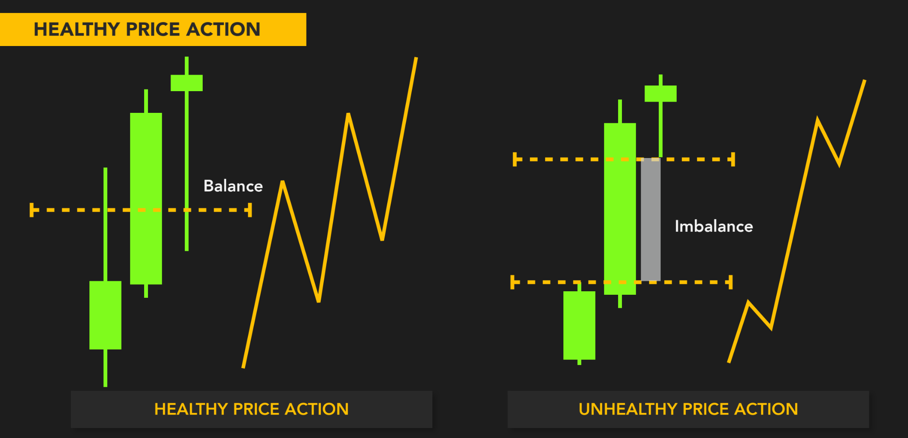
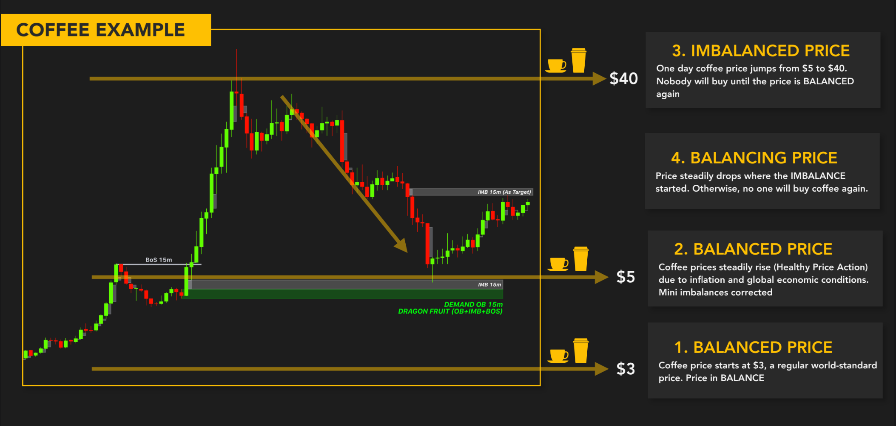
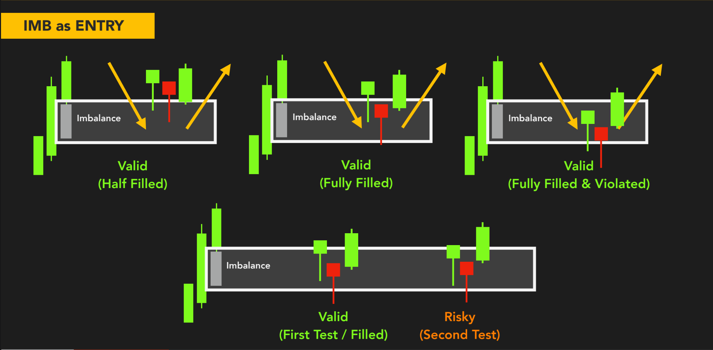
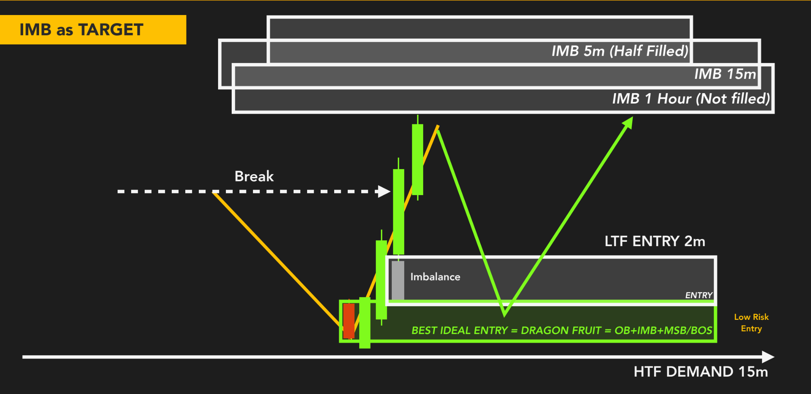
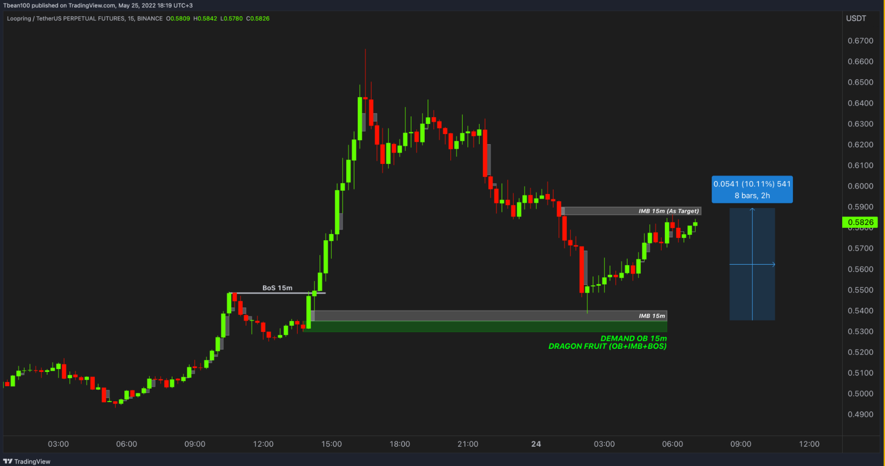
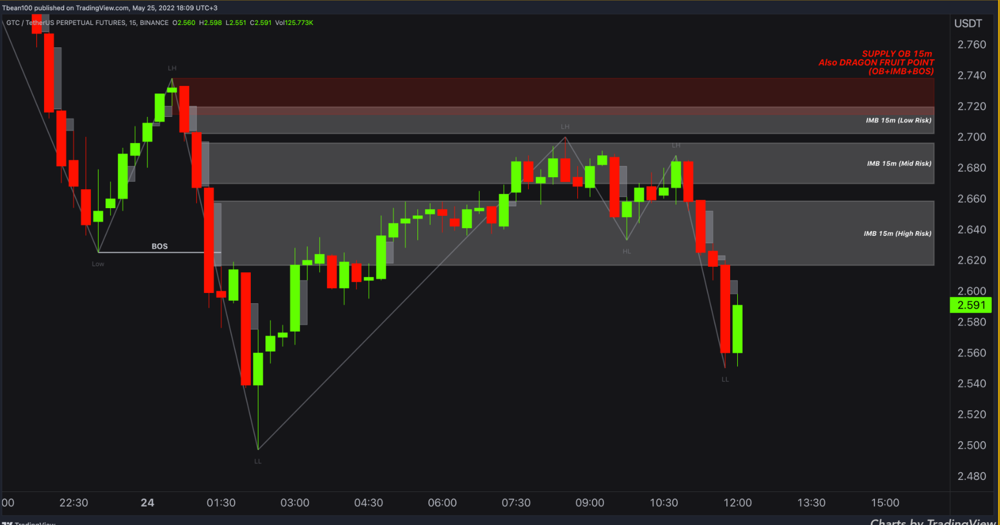
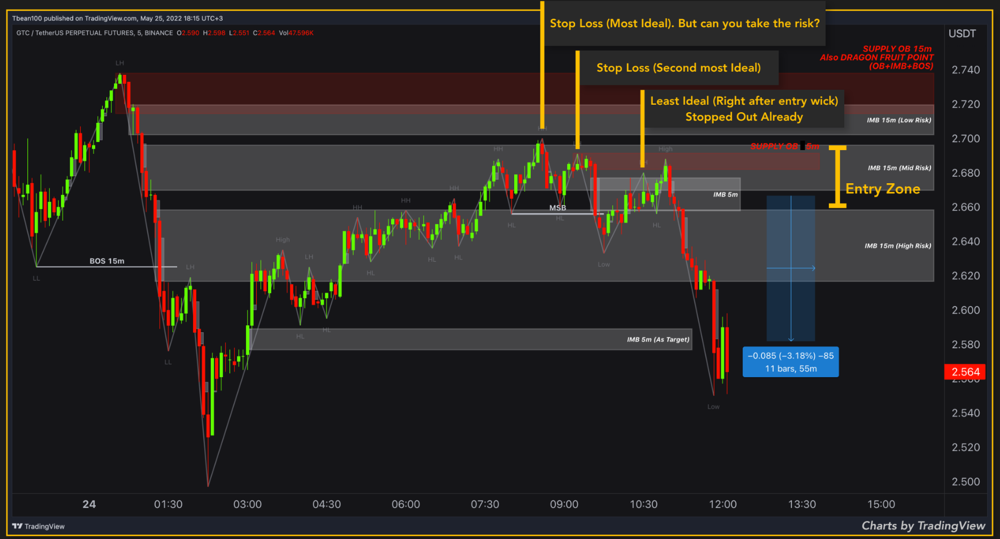

## ⚡ **Imbalance (IMB) – Ai thật sự tạo ra những cú giá tăng phi mã?**

### 🧠 **Imbalance là gì?**

> **Imbalance** là vùng giá thể hiện sự mất cân bằng nghiêm trọng giữa lực mua và lực bán, khiến giá **di chuyển cực nhanh một chiều**, thường sau một cú phá vỡ cấu trúc (MSB/BOS).

📌 Trên biểu đồ:

- Liên tiếp 2–3 nến thân lớn cùng màu  
- Không có bóng đối ứng  
- Gần như không có nhịp pullback  
→ Đó là **“vết trượt” dòng tiền mạnh**.

### 🤔 **Vậy ai đứng sau những cú move mạnh đó?**

---

#### ✅ **1. Là do tin tức (Catalyst)?**

> Có thể.

- Lịch kinh tế, báo cáo lợi nhuận, FED, hợp tác mới, v.v.  
→ **Tin tức là cái cớ để giải thích hành vi giá.**

❗ Nhưng:
> **Tin chỉ là “truyền thông” cho những gì đã được chuẩn bị từ trước.**  
Smart Money đã vào vị thế và **dùng tin để đẩy giá** đúng lúc.

---

#### ❌ **2. Retail trader có gây ra được không?**

> Không thể.

- Retail thiếu vốn – thiếu tốc độ – thiếu tổ chức  
- Không thể tạo cú pump mạnh trong thời gian ngắn  
- Trừ khi có "group pump & dump" cực lớn → **rất hiếm**

📌 Retail chỉ là **người bị cuốn theo**, không phải “người lái”.

---

#### 🧠 **3. Market Maker / Smart Money? → Chính xác.**

> Chỉ có **Smart Money / Market Maker / HFT bots** mới có khả năng:

- Thao túng thanh khoản
- Đánh dấu điểm vào trước
- Kích hoạt lệnh algorithm đúng thời điểm
- Tạo ra cú pump nhanh để:
  - **Phá vỡ cấu trúc (BOS)**  
  - **Dọn đường về FVG / OB**  
  - **Trap retail & đảo chiều**

📌 **Imbalance = dấu chân của tay to.**

---

### 🎯 **Tóm gọn lại:**

| Nguồn gốc | Góp phần | Thực sự gây ra |
|-----------|----------|----------------|
| Tin tức | ✅ Có | Nhưng là chất xúc tác |
| Retail | ❌ Không | Chỉ bị cuốn theo |
| Smart Money | ✅ 100% | Gây ra → điều khiển thị trường |

---

### 📈 **Vậy khi thấy Imbalance thì làm gì?**

- Đánh dấu vùng **FVG** (imbalance zone)  
- Tìm xem có **BOS kèm theo** không  
- Nếu có → Xác nhận dòng tiền lớn đang tham chiến  
- Đợi giá pullback → entry từ OB/FVG → theo hướng vừa phá

---

> 📌 **Khi giá chạy quá nhanh – đừng nghĩ đó là “hên xui”**  
> Hãy hiểu rằng: **ai đó vừa hành động cực kỳ có chủ đích.**

---

## ⚖️ **Imbalance trong Order Book – Dấu hiệu giá chạy không lành mạnh**

### 🧠 **1. Bản chất: Imbalance không phải là “khoảng trống ngẫu nhiên”**

> Trên biểu đồ nến, **Imbalance (IMB)** là vùng giá mà:

- Nến chạy một chiều cực mạnh
- Không có wick ở phía ngược lại
- Thường tạo ra **Fair Value Gap (FVG)**

❗ Nhưng trên thực tế:  
📌 **IMB là hậu quả trực tiếp của việc **mất cân bằng giữa lượng BUY và SELL trong Order Book**.

---

### 📈 **2. Hành vi thực tế trong Order Book là gì?**

Quan sát bảng Order Book bên phải hình:

| Giá | BID (Buy) | ASK (Sell) |
|-----|-----------|------------|
| 100 | (Giá thị trường) |
| 101 | — | 4 |
| 102 | — | 2 |
| 103 | — | 5 |
| 104 | — | 8 |

👉 **Không có đủ lệnh SELL để hấp thụ lực BUY lớn**  
→ Giá nhảy vọt từ 100 lên 104 mà gần như **không bị cản**

🟢 Trong khi đó:  

- Phía dưới có **rất nhiều lệnh BID (Buy)** → 40, 58, 69, 76  
→ Smart Money **đã đặt lệnh mua từ trước** → gom xong rồi đẩy

📌 Vậy khi lực mua “nuốt sạch” hết các mức giá mà không gặp kháng cự →  
👉 Tạo ra **khoảng trống thanh khoản = IMBALANCE**

---

### 🚨 **3. Đây là một hành vi giá không lành mạnh (Unhealthy Price Action)**

> Một cú tăng giá khỏe mạnh sẽ có:

- Lực mua tăng dần
- Có lực bán đối ứng → tạo ra hồi, wick, pullback

Nhưng nếu:

- Giá chạy liên tục không hồi  
- Không có giao tranh  
→ Đó là hành vi mất cân bằng → **giá sẽ có xu hướng quay lại test lại sau đó**

---

### 🎯 **4. Ai tạo ra IMB trong Order Book?**

| Nguyên nhân | Ý nghĩa |
|-------------|---------|
| **Tin tức (Catalyst)** | Là cái cớ để dòng tiền lớn kích hoạt lệnh |
| **Retail** | Không đủ tiền, không đủ tốc độ → không tạo nổi IMB |
| ✅ **Market Maker / Smart Money** | Họ chủ động “nuốt” Order Book → dọn đường đẩy giá |

📌 **Smart Money dùng IMB để:**

- Đẩy giá phá BOS  
- Tạo trap cho retail  
- Chuẩn bị pullback về OB / FVG  
- Kích hoạt động lượng & tâm lý đu bám

---

## ⚖️ **Healthy vs. Unhealthy Price Action – Cách dòng tiền lớn tạo dấu vết**

### 🧠 **1. Bản chất của một “chuyển động giá lành mạnh”**

> Trong một thị trường bình thường, giá di chuyển theo cách có đối ứng:

- Có buyer → có seller  
- Có bên mua vào → có bên chốt lời  
- Có pump → có pullback  
→ Tạo nên vùng **cân bằng** (balance)

📌 Ta gọi đây là: **Healthy Price Action**

#### ✅ Biểu hiện

- Nến có bóng ở hai phía (wick trên và dưới)  
- Nến tiếp theo thường “lấp” phần chưa khớp của nến trước  
- Giá có **wave**: pump – hồi – tiếp diễn  
- Giao dịch 2 chiều giữa cung & cầu được duy trì đều đặn

---

### 🚨 **2. Khi mất cân bằng: Imbalance xuất hiện**

> Nhưng khi một bên **mua hoặc bán quá mạnh**, bên còn lại **không kịp phản ứng** hoặc **không dám vào lệnh đối ứng** → dẫn đến:

📌 **Imbalance = vùng giá bị “xé gãy” thanh khoản**  
→ Không có lực khớp đối ứng  
→ Giá chạy liên tục, tạo khoảng trống gọi là **Fair Value Gap (FVG)**

---

### 📊 **3. Phân tích biểu đồ hình trên:**

| Mặt trái – Healthy | Mặt phải – Unhealthy |
|---------------------|------------------------|
| Ba nến có đối ứng rõ | Một nến chạy dài liên tục |
| Có bóng trên/dưới | Không có wick ở phía ngược |
| Có hồi giữa các bước tăng | Không có pullback |
| Tạo cân bằng giá rõ | Tạo FVG → lệch thanh khoản |

📌 **Giá chạy kiểu Unhealthy = dấu hiệu của dòng tiền lớn đang vội hoặc đang “ép thị trường”**

---

### 🎯 **4. Vậy Unhealthy Price Action có xấu không?**

> ❌ Không hề.

- Đó là **dấu chân rõ ràng của Smart Money**  
- Cho ta thấy: **dòng tiền đang muốn di chuyển nhanh – không quan tâm điều chỉnh**

📌 Việc của trader không phải né, mà là:

- Đánh dấu vùng FVG vừa tạo  
- Đợi giá quay lại fill (có/không)  
- Entry tại vùng OB / FVG có xác nhận

---

### 🔍 **5. Cách xác định Imbalance (FVG) trên biểu đồ:**

- Cần 3 cây nến liên tiếp  
- Nếu **low của nến sau > high của nến trước** → vùng giữa là FVG  
- Đây là “khoảng trống chưa được giao dịch đối ứng”  
→ Xác suất cao giá sẽ quay lại test

---

### ✅ **Tóm tắt tư duy:**

| Loại giá | Đặc điểm | Ý nghĩa chiến lược |
|----------|----------|--------------------|
| Healthy Price Action | Có hồi, có wick, có đối ứng | Giá ổn định – khó trap – vào lệnh khó hơn  
| Unhealthy Price Action | Imbalance, chạy mạnh một chiều | Dấu vết tay to – vùng entry tiềm năng sau pullback  

---

> 🧠 **Nếu bạn thấy giá chạy như “bị kéo căng dây thun” – đó là lúc bạn nên quan sát kỹ.  
Smart Money vừa vung tay, và có thể sẽ quay lại nơi họ bắt đầu.**

---

## ☕️ **Ví dụ giá cà phê – Hiểu về Imbalance và Cân bằng giá (Balanced vs. Imbalanced Price)**

---

### 🧠 **1. Khái niệm cốt lõi:**

> Giá không phải lúc nào cũng di chuyển “hợp lý”.  
> Có lúc **giá nhảy vọt**, vượt xa giá trị thực tế trong thời gian ngắn → tạo ra **Imbalance (mất cân bằng)**

📌 Khi đó, thị trường **có xu hướng quay lại vùng đã bị bỏ qua**  
→ Để **“cân bằng lại”** cung và cầu  
→ Đây chính là nền tảng của **Fair Value Gap (FVG)** trong ICT

---

### ☕ **2. Ví dụ minh họa: Hành trình giá cà phê**

#### 🟩 **Giai đoạn 1: $3 – Giá cân bằng (Balanced Price)**

> Giá cà phê dao động ổn định quanh $3  

- Đây là mức giá hợp lý theo thị trường toàn cầu  
- Cung – cầu cân bằng  
→ Không có lý do để điều chỉnh mạnh

---

#### 🟨 **Giai đoạn 2: $5 – Tăng giá lành mạnh (Balanced Price)**  

> Do lạm phát, chi phí tăng → giá cà phê từ từ tăng lên $5  

- Giá đi theo kiểu **Healthy Price Action**  
- Có hồi, có điều chỉnh  
- Mini imbalance được “fill” liên tục  
📌 Thị trường chấp nhận mức giá mới

---

#### 🟥 **Giai đoạn 3: $40 – Giá nhảy vọt (Imbalanced Price)**

> Một ngày đẹp trời, giá cà phê **nhảy vọt từ $5 → $40** 

- Không ai hiểu chuyện gì đang xảy ra  
- Đây là cú pump quá mạnh  
- Không có giao dịch đối ứng  
→ **Tạo ra vùng Imbalance rõ ràng**

📌 Lúc này không ai muốn mua nữa.  
→ Giá đang **mất cân bằng nghiêm trọng**

---

#### 🟧 **Giai đoạn 4: Giá quay đầu – Balancing Price**

> Thị trường cần "làm mát lại" 
 
- Giá bắt đầu giảm từ từ  
- **Quay về vùng bắt đầu Imbalance**  
- Mục đích: **tìm lại vùng giá mà buyer và seller đồng thuận**

📌 Đây là quá trình quay về vùng **Demand OB + FVG** để kiểm tra lực mua thật sự  
→ Chính là vùng **entry tiềm năng** theo ICT

---

### 🎯 **Ý nghĩa chiến lược cho trader:**

| Giai đoạn | Hành động thực chiến |
|-----------|------------------------|
| Giá chạy quá nhanh (IMB) | Đánh dấu vùng FVG/Fair Value |
| Sau BOS → có vùng OB ngay trước IMB | Vùng này là **"Dragon Fruit Zone"** = OB + IMB + BOS |
| Giá bắt đầu điều chỉnh | Quan sát phản ứng ở vùng OB/FVG  |
| Lần test đầu tiên về OB | Entry cực mạnh nếu có CHoCH hoặc Rejection rõ |

| Khái niệm | Diễn giải |
|-----------|-----------|
| Balanced Price | Giá di chuyển lành mạnh – buyer & seller đồng thuận |
| Imbalanced Price | Giá di chuyển lệch – buyer/seller mất kết nối → tạo FVG |
| Balancing Process | Giá quay lại vùng FVG/OB để test fair value |
| Dragon Fruit Zone | Vùng OB + IMB + BOS → vùng vào lệnh chất lượng cao nhất |

---

> 🧠 **Khi bạn thấy giá chạy quá nhanh – hãy nghĩ tới cà phê nhảy từ $5 lên $40.**  
> Sớm muộn gì thị trường cũng phải quay lại kiểm tra xem:  
> “Có ai còn muốn mua cà phê ở $40 không?”

---

Tuyệt vời – hình này trình bày rất rõ 6 tình huống thực chiến khi giá **quay lại vùng Imbalance (FVG)**, và **liệu entry tại đó còn hợp lệ hay không**.

Sau đây là bài viết gộp lại toàn bộ hình, phân tích từng trường hợp, và kết luận thành chiến lược thực chiến theo ICT/Smart Money:

---

## 🎯 **IMB (FVG) làm điểm Entry – Khi nào hợp lệ, khi nào rủi ro?**

---

### 🧠 **Bối cảnh chung:**

> Khi giá tạo **Imbalance** (vùng FVG) → trader ICT sẽ đánh dấu lại  
→ Đợi giá quay lại vùng đó để entry  
→ Nhưng **không phải lần quay lại nào cũng entry được**

✅ Có entry “chất lượng cao”  
⚠️ Có entry “hợp lệ nhưng yếu”  
❌ Có entry “rất rủi ro”

---

### 🔍 **6 Trường hợp thực chiến – Phân tích từng entry**

#### ✅ 1. **Valid – Half Filled**

- Giá chỉ chạm một phần IMB  
- Không fill toàn bộ  
→ Nhưng vẫn phản ứng mạnh → entry **có xác suất cao**  
→ Thường là **entry sớm nhất**, RR tốt

🧠 **Ưu điểm:** Stoploss nhỏ, phản ứng nhanh  
📌 **Nhược điểm:** Nếu không đi mạnh → dễ quay lại fill tiếp

---

#### ✅ 2. **Valid – Fully Filled**

- Giá quay về fill toàn bộ vùng IMB  
- Sau đó phản ứng và đảo chiều

🧠 **Classic setup theo ICT**  
→ Vẫn là entry chuẩn nếu là **lần test đầu tiên**

---

#### ✅ 3. **Valid – Fully Filled & Violated**

- Giá **fill toàn bộ IMB** rồi **đâm nhẹ xuống dưới (wick)**  
- Nhưng sau đó vẫn **reclaim và bật lên mạnh**

🧠 **Cần quan sát price action cẩn thận**  
→ Nếu có CHoCH / engulfing / pinbar → vẫn là **entry đẹp**

📌 **Stoploss cần linh hoạt hơn**

---

#### ✅ 4. **Valid – First Test (Filled)**

- Đây là trường hợp đáng tin nhất  
- Lần đầu tiên giá quay lại vùng IMB và fill xong  
→ **Entry chất lượng cao**  
→ RR tốt nhất, phản ứng rõ nhất

📌 **Nguyên tắc ICT:**  
> “Lần test đầu tiên luôn có lực phản ứng tốt nhất. Các lần sau yếu dần.”

---

#### ⚠️ 5. **Risky – Second Test**

- Giá đã test vùng IMB một lần trước  
- Lần quay lại thứ hai → phản ứng yếu hơn, có thể xuyên thủng

🧠 **Cực kỳ rủi ro nếu không có xác nhận (CHoCH, volume spike, v.v.)**  
→ Thường là lúc Smart Money “trap” người vào muộn

---

### ✅ **Tóm tắt chiến lược entry theo IMB:**

| Trường hợp | Entry | Độ mạnh | Lưu ý |
|------------|-------|----------|--------|
| Half-filled (1) | ✅ Có thể | Khá mạnh | SL ngắn, cần phản ứng rõ |
| Fully-filled (2) | ✅ Chuẩn | Mạnh | Setup lý tưởng |
| Filled & Violate (3) | ✅ Nếu có PA | Trung bình | Cần xác nhận |
| First Test (4) | ✅ Mạnh nhất | Rất mạnh | Ưu tiên entry |
| Second Test (5) | ⚠️ Rủi ro | Yếu | Tránh nếu không có confluence |

---

### 📌 Kinh nghiệm ICT thực chiến

> 🔁 **“Giá sẽ test vùng IMB ít nhất một lần – nhưng hiếm khi cho entry ngon ở lần thứ hai.”**
> 🧠 **Bạn không cần đoán, chỉ cần quan sát phản ứng giá tại FVG và ưu tiên lần test đầu.**

---

## 🎯 **IMB là TARGET – Hiểu đúng bản chất và chiến lược tối ưu hóa entry**

### 🧠 **1. Không phải lúc nào cũng entry từ IMB – Có lúc IMB là đích đến**

#### 🔁 Hai vai trò của Imbalance (FVG)

| Imbalance (FVG) | Vai trò |
|------------------|----------|
| Là vùng giá bị bỏ quên (bởi sự mất cân bằng mua – bán) | → Có thể quay về test (entry)  
| Là **mục tiêu giá sẽ quay lại “lấp”** để hoàn tất cân bằng thanh khoản | → Target cực mạnh sau khi có BOS  

📌 Khi Smart Money tạo IMB nhưng chưa fill → ta kỳ vọng giá sẽ quay lại để:

1. **Lấp gap**
2. **Thu hút thanh khoản**
3. **Dọn đường trước khi chạy xa**

---

### 🔍 **2. Logic: Entry từ OB – Target là IMB chưa fill**

Biểu đồ đầu tiên thể hiện rõ:

- Có cú **Break BOS**  
- Giá tạo ra **Demand OB + IMB** → hợp nhất thành **Dragon Fruit Zone**  
- Sau đó bật lên → Entry trên LTF (2m)  
- Target là: **IMB chưa fill trên H1, H15, H5** (xếp chồng lên nhau)

📌 **IMB càng to – càng chưa fill – càng ở HTF → xác suất quay lại càng cao**

---

### 🧱 **3. DRAGON FRUIT ENTRY – OB + IMB + BOS**

> Dragon Fruit Zone = nơi hội tụ:  
✅ OB (order block)  
✅ IMB (Fair Value Gap)  
✅ BOS (structure break)

Đây là **entry chất lượng cao nhất trong ICT** vì:

- Có dấu chân tay to (OB)  
- Có mất cân bằng (IMB)  
- Có xác nhận dòng tiền (BOS)

📌 Entry ở đây có **low risk – high reward** → SL sát đáy OB, TP đến IMB

---

### 📊 **4. Case thực tế: Cả chiều BUY & SELL**

#### 🟩 Lệnh BUY

- Demand OB 15m = Dragon Fruit  
- Giá fill vùng OB + IMB  
- Entry M5 hoặc M2  
- Target = IMB 15m chưa lấp phía trên  
→ Giá bật đúng từ OB, đi lên, **10.1% chỉ trong 2h**

---

#### 🟥 Lệnh SELL (ảnh 3–4)

- BOS rõ ràng → Supply OB xuất hiện  
- IMB phân tầng: Low Risk / Mid Risk / High Risk  
- Entry tại OB hoặc giữa IMB  
- TP = FVG đã tạo (vùng chưa fill)

> Trong ảnh cuối:

- Entry zone nằm ngay dưới OB 15m  
- Có 3 lựa chọn SL: (ideal → mid → risky)  
- Sau entry, giá đi 3.18% trong chưa đầy 1h

---

### ✅ **Tóm tắt chiến lược: IMB là TARGET khi...**

| Điều kiện | Chiến lược |
|-----------|------------|
| Đã có BOS rõ ràng | Target IMB gần nhất (chưa fill) |
| Có OB/Dragon Fruit bên dưới | Entry từ OB, TP về IMB |
| IMB chưa fill – càng xa – càng mạnh | Dùng làm TP logic thay vì “đoán đỉnh” |
| Có nhiều IMB chồng tầng (multi-TF) | Chốt lời từng phần theo cấp |

---

### 📌 Checklist khi dùng IMB làm TARGET

- [ ] Có BOS trước đó?  
- [ ] IMB chưa fill hay chỉ mới half-fill?  
- [ ] Vị trí IMB nằm ở đâu trong HTF?  
- [ ] Có OB hợp lưu bên dưới làm điểm entry?  
- [ ] Có hỗ trợ LTF (entry M1–M5)?  
- [ ] Có xác nhận CHoCH/PA tại vùng OB không?

---

> 🧠 **Imbalance không chỉ là nơi bạn chờ đợi entry.**  
> Nó còn là nơi tay to hướng giá về.  
> Entry từ Dragon Fruit – Target đến FVG – đó là một cú trade hoàn hảo theo ICT.

---
