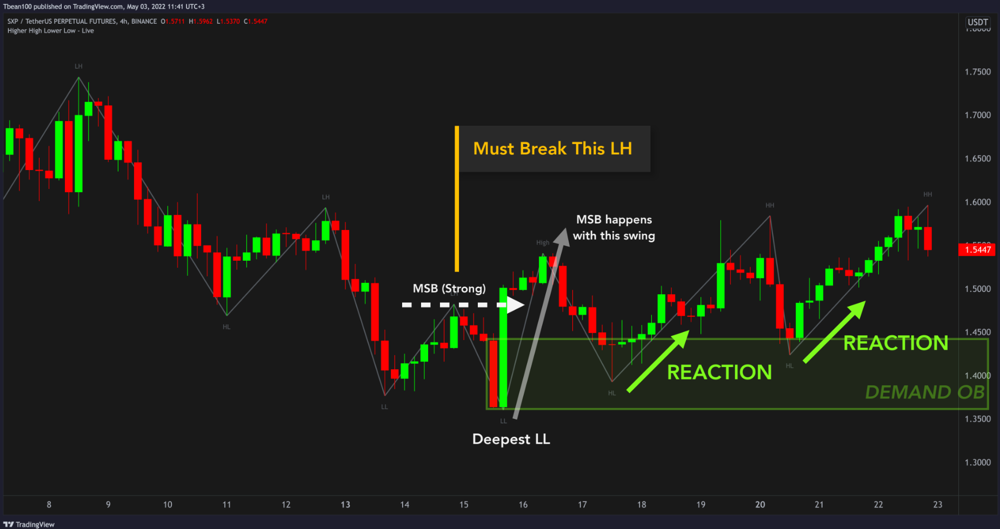
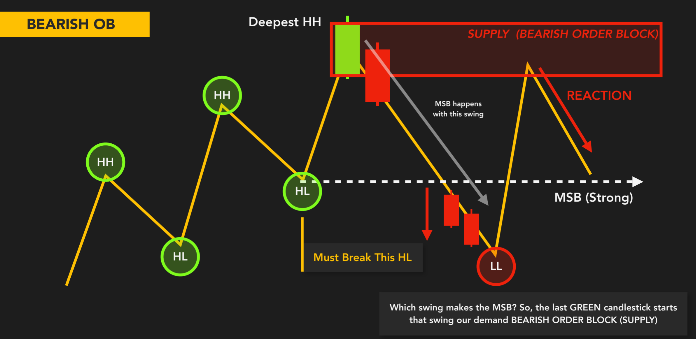
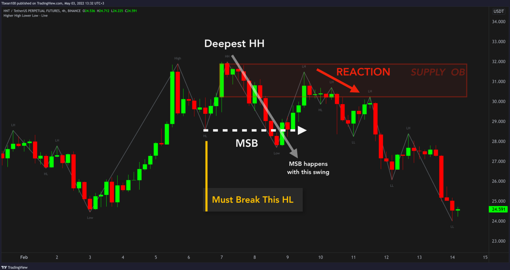
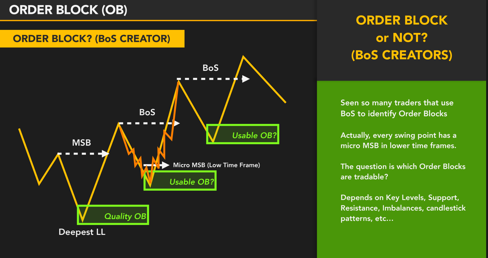

## 🧠 **Vấn đề của tay to:**

Hãy tưởng tượng bạn là một tổ chức lớn – bạn muốn mua 10 triệu đô BTC.

Bạn không thể:

- 🧨 Mua một lần → vì giá sẽ vọt lên do mất cân bằng cung–cầu  
- 👀 Mua công khai → vì đám đông sẽ nhìn thấy bạn và fomo vào theo

👉 Giải pháp:  
Bạn **chia nhỏ lệnh**, **ẩn mình trong các vùng giá nhất định**, và **tạo ra một hành vi giả để lừa thị trường**  
→ Đây là lúc **Order Block hình thành.**

---

## 🔍 **Vậy Order Block là gì về bản chất?**

> **Order Block là vùng giá mà Smart Money đã thực hiện khối lượng lệnh lớn một cách có chủ đích**, để:

- Kích hoạt xu hướng  
- Tạo sự mất cân bằng thanh khoản  
- Đánh dấu sự thay đổi kiểm soát giữa cung & cầu

Nó không phải là:

- Một cây nến “đặc biệt”  
- Một mô hình kỹ thuật  
- Một dấu hiệu dành cho mọi người thấy

📌 **Nó là hậu quả của hành vi dòng tiền thông minh.**

---

## ⚙️ **Cơ chế hình thành Order Block:**

1. **Tay to hấp thụ lệnh ở vùng giá yên tĩnh**
   - Nến có vẻ "bình thường"
   - Giá chưa di chuyển nhiều  
   → Nhưng thật ra: bên trong là quá trình **gom hàng hoặc xả hàng âm thầm**

2. **Khi đủ thanh khoản → họ đẩy giá**
   - Xuất hiện BOS hoặc cú nổ giá  
   - Giá thoát ra khỏi vùng đó

3. **Vùng giá nơi lệnh được hấp thụ trước khi breakout**  
   → Chính là **Order Block**

---

## 🧠 **Điều đặc biệt ở Order Block:**

| Đặc điểm | Giải thích bản chất |
|----------|---------------------|
| Không dễ nhận ra ngay lúc nó xảy ra | Vì hành vi tay to là **ẩn mình** – chỉ sau khi giá di chuyển mạnh, ta mới biết vùng đó là OB |
| OB có thể không đẹp về mặt hình dạng | Vì nó không phải “tín hiệu” – nó là “hành vi” dòng tiền |
| OB thể hiện **ý định thật sự** | Không giống mô hình nến – OB gắn liền với **quyết định chiến lược của tay to** |
| OB gắn liền với mất cân bằng | Nó luôn đi cùng sự **hấp thụ cung/cầu để chuẩn bị tạo lệch** và dẫn giá đi |

---

## 🎯 **Vì sao giá phản ứng lại Order Block?**

> Vì OB là nơi tay to đã vào lệnh → họ **bảo vệ vùng đó**  
> → Khi giá quay lại, nếu Smart Money **vẫn giữ ý định ban đầu**, họ sẽ tiếp tục bảo vệ vị thế

Giống như bạn mua sỉ ở một vùng giá tốt – nếu giá quay lại đó, bạn sẽ tiếp tục mua thêm.  
👉 Tay to cũng vậy.

📌 OB không phải là “hỗ trợ” kiểu cổ điển – nó là **vùng hành vi chiến lược.**

---

## 🧩 Bản chất OB và mối quan hệ với “thanh khoản”

> OB không đứng một mình. Nó thường:

- Xuất hiện **ngay sau khi thanh khoản bị quét** (quét đáy/đỉnh nhỏ lẻ)  
- Đi kèm với **Fair Value Gap** → dấu hiệu tay to đẩy giá quá nhanh  
- Là nơi **giá phản ứng mạnh nhưng không ngẫu nhiên**

Nói cách khác:
> OB là **“nút bấm” chuyển pha** – nơi phe thắng bắt đầu điều khiển thị trường.

---

## ✅ Tổng kết bản chất

| Yếu tố | Bản chất thật sự |
|--------|------------------|
| OB là gì? | Là vùng giá mà tay to đã ra quyết định lớn |
| Vì sao nó hình thành? | Để gom/xả một cách hiệu quả, ẩn danh |
| Điều gì làm nó khác vùng thường? | Nó có ý định, có hấp thụ thanh khoản, có liên kết hành vi |
| Tại sao quan trọng? | Nó tiết lộ dấu chân dòng tiền lớn – nơi bạn có thể đi cùng họ |

> 🧠 OB không phải “vùng đẹp” hay “mô hình kỹ thuật” – mà là **dòng tiền chiến lược hóa thành hành vi giá.**

---

## Nhận dạng Bulish OB

### 🧠 **1. Bối cảnh trước khi xuất hiện Order Block**

- Thị trường đang trong xu hướng giảm:  
  LL → LH → LL → LH  
  → Cấu trúc Lower High – Lower Low vẫn đang tiếp diễn

📌 **Smart Money chưa can thiệp đủ mạnh để phá cấu trúc**

---

### 💥 **2. Cú Break of Structure (BOS)**

- **Điểm quan trọng**: “Must Break This LH” → đó là **Lower High gần nhất**  
- Khi giá vượt qua LH này → tạo **Higher High (HH)**  
→ Điều này đánh dấu một **Market Structure Break (MSB)** hay BOS theo hướng tăng

📌 Từ đây, ta có thể kết luận rằng:  
👉 **Có sự can thiệp của dòng tiền lớn để thay đổi xu hướng**

---

### 🧱 **3. Tại sao OB chỉ xác định sau BOS?**

- Quan sát hình:  
  **Nến đỏ cuối cùng** trước cú bật mạnh tạo BOS → chính là nơi dòng tiền lớn **bắt đầu đẩy giá**  
- Nhưng ta **chỉ biết nó là OB thật** **sau khi BOS xảy ra**.

> ⚠️ Nếu giá bật lên từ vùng đó nhưng không phá LH → đó chỉ là pullback.

📌 **Vì vậy: OB = nguyên nhân → BOS = xác nhận**

---

### ✅ **4. Vùng Order Block xác thực là:**

- **Thân + bóng nến đỏ cuối cùng trước khi giá tạo BOS**  
- Đây là nơi:
  - Dòng tiền lớn hấp thụ toàn bộ lệnh bán còn sót  
  - Khởi phát cho một swing tăng mạnh → **phá LH**  
- Vùng được đóng khung màu xanh:  
  👉 **“Demand (Bullish Order Block)”**

---

### 🔁 **5. Hành vi sau khi BOS – Pullback về OB**

- Sau khi tạo HH → giá pullback về lại OB  
- OB lúc này đóng vai trò:
  - **Vùng demand** được xác nhận  
  - **Entry zone** lý tưởng theo ICT  
  - Vùng có thể chứa cả **FVG + OB** để tăng độ tin cậy

---

### 🔑 **6. Tổng kết logic theo thứ tự:**

1. Cấu trúc giảm → vẫn chưa rõ ai đang kiểm soát
2. Giá bật từ một vùng → KHÔNG vội gọi đó là OB
3. Giá phá LH → tạo BOS  
   👉 Xác nhận swing đó là **Smart Money đẩy thật**
4. Nhìn lại: nến đỏ cuối cùng trước cú phá đó → chính là **OB thật**
5. Giá quay về test OB → phản ứng → xác nhận lại vùng demand

> 📌 **Không phải cứ vùng nào bật giá là OB – chỉ vùng nào tạo ra BOS mới là OB đáng tin cậy.**

---

## Nhận dạng Bearish OB

### 🧠 **1. Bối cảnh ban đầu: Xu hướng tăng**

Trước khi mọi thứ thay đổi, thị trường đang theo cấu trúc:

- **HH → HL → HH**  
→ Giá vẫn đang tạo **Higher High – Higher Low**

📌 **Chưa có lý do gì để nghi ngờ xu hướng tăng.**

---

### 💥 **2. Xác định điểm cấu trúc quan trọng cần phá**

- Có một vùng được đánh dấu là **“Must Break This HL”**  
→ Đây là **Higher Low gần nhất** – điểm tựa của xu hướng tăng

📌 Nếu giá **phá vùng này** → cấu trúc thị trường chính thức **chuyển từ bullish sang bearish**  
👉 Đây chính là **Break of Structure (BOS)** hay **Market Structure Break (MSB)**

---

### 🔴 **3. Điều gì gây ra BOS đó? → Đó chính là swing giảm mạnh màu xám**

- BOS xảy ra khi giá tạo một **Lower Low (LL)** mới → phá vỡ HL trước đó  
- Ta nhìn ngược lại: cú swing giảm mạnh đó bắt đầu từ đâu?

📌 Nó bắt đầu từ **nến xanh cuối cùng** trước chuỗi nến đỏ →  
✅ **Đó chính là Bearish Order Block (OB)**

> **“OB là cây nến cuối cùng trước cú BOS.”**

---

### ✅ **4. Tại sao OB này được xác nhận là Supply Zone đáng tin cậy?**

| Điều kiện | Có đáp ứng? |
|-----------|-------------|
| Bắt nguồn từ cú swing tạo BOS? | ✅ Có |
| Tạo ra cú đảo chiều cấu trúc? | ✅ Có  |
| Có phản ứng khi giá quay lại test? | ✅ Có (vùng reaction được đánh dấu đỏ) |
| Có phải là nến **mà Smart Money bán ra đầu tiên**? | ✅ Rõ ràng |

📌 Vì vậy, ta gọi đây là **BEARISH OB = SUPPLY ZONE**

---

### 🔁 **5. Giá sau BOS → quay lại test OB → phản ứng**

- Sau khi BOS hình thành → giá pullback lên lại vùng OB  
- Đây là nơi:
  - Smart Money có thể vào thêm lệnh  
  - Giá thường **retrace về OB rồi tiếp tục giảm**
- Trong hình, **vùng OB có phản ứng rõ ràng → xác nhận vùng Supply mạnh**

---

### 🧱 **6. Tổng kết cấu trúc chuẩn ICT:**

| Bước | Diễn giải |
|------|-----------|
| 1️⃣ | Cấu trúc tăng (HH → HL) |
| 2️⃣ | Nến xanh cuối cùng → OB tiềm năng |
| 3️⃣ | Từ OB → xuất hiện cú dump mạnh → phá HL → BOS |
| 4️⃣ | Quay lại test OB → phản ứng → tiếp tục giảm |

---

## 🧱 **OB tạo BOS: Không phải OB nào cũng đáng trade – Cách chọn OB “có giá trị”**

### 🧠 **Tư duy gốc rễ:**

> Không phải cứ vùng nào tạo Break of Structure (BOS) thì đều là Order Block (OB) có thể giao dịch.

- Mỗi swing khi zoom xuống timeframe nhỏ đều có **micro BOS**  
- Điều đó dẫn đến việc **lạm dụng BOS để xác định OB**  
→ Vẽ quá nhiều OB → bị SL liên tục

📌 **Điều trader cần hỏi không phải là: “Đây có phải OB không?”,  
mà là: “Đây có phải OB **có thể giao dịch** không?”**

---

### 🎯 **Vậy OB như thế nào mới “usable”?**

Một OB đáng trade thường có các yếu tố sau:

| ✅ Tiêu chí | 🧠 Ý nghĩa |
|------------|------------|
| **Tạo BOS thật trên khung chính** | BOS phải là sự thay đổi cấu trúc lớn – không phải micro swing |  
| **Nằm tại đáy sâu nhất hoặc đỉnh cao nhất** | Thể hiện dòng tiền lớn can thiệp đảo xu hướng |  
| **Có FVG đi kèm** | Cho thấy cú đẩy có động lượng – không phải hồi kỹ thuật |
| **Gần Liquidity Pool / Equal Highs/Lows / Key Levels** | Nơi Smart Money thích hành động  |
| **Có phản ứng rõ khi test lại** | Xuất hiện rejection, CHoCH, hoặc không phá sâu OB |
| **Nằm tại cuối Phase C trong tích lũy/phân phối** | Là OB mang tính quyết định – “OB gốc” của cả cấu trúc |

---

### 🧩 **Kết luận:**

> ❝ OB = nguyên nhân, BOS = kết quả. Nhưng không phải BOS nào cũng do tay to tạo ra. ❞  
> OB “tradable” là OB tạo ra **BOS thật**, nằm ở **điểm chuyển giao xu hướng lớn**, có **volume, confluence, và hành vi giá xác nhận**.
> ✅ **Không phải mọi Order Block tạo BOS đều là “Order Block để giao dịch”.**  
> 👉 **Chỉ Order Block có context + xác nhận + dòng tiền lớn thật sự mới đáng đặt cược.**

---
