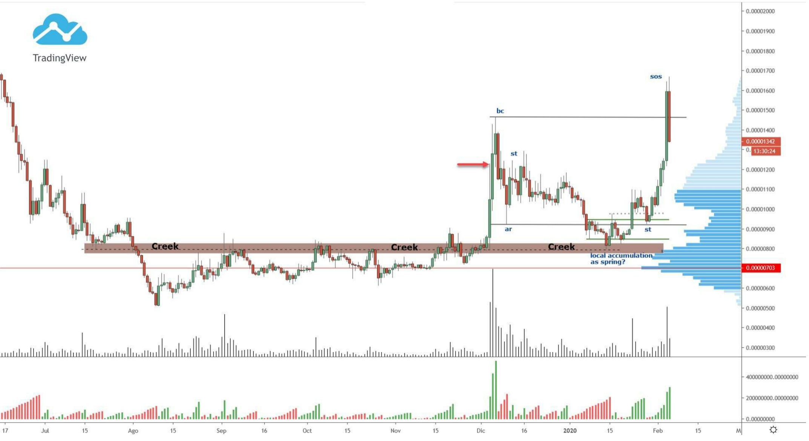
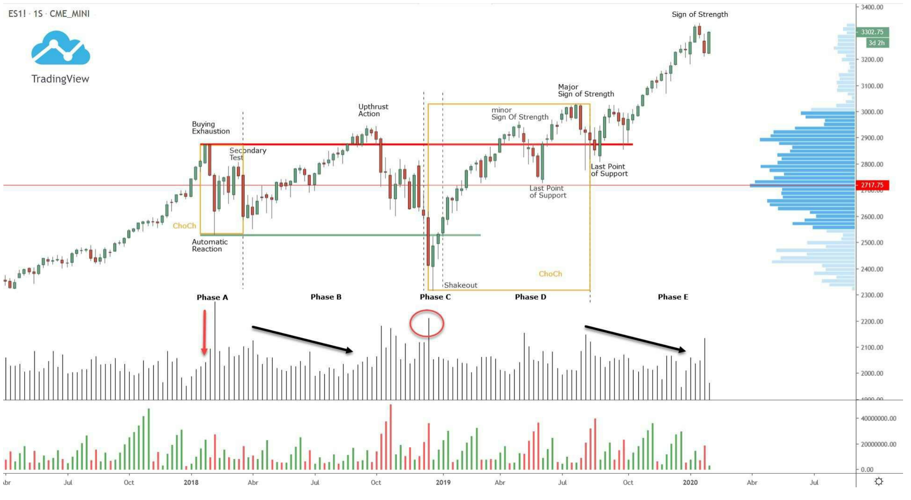
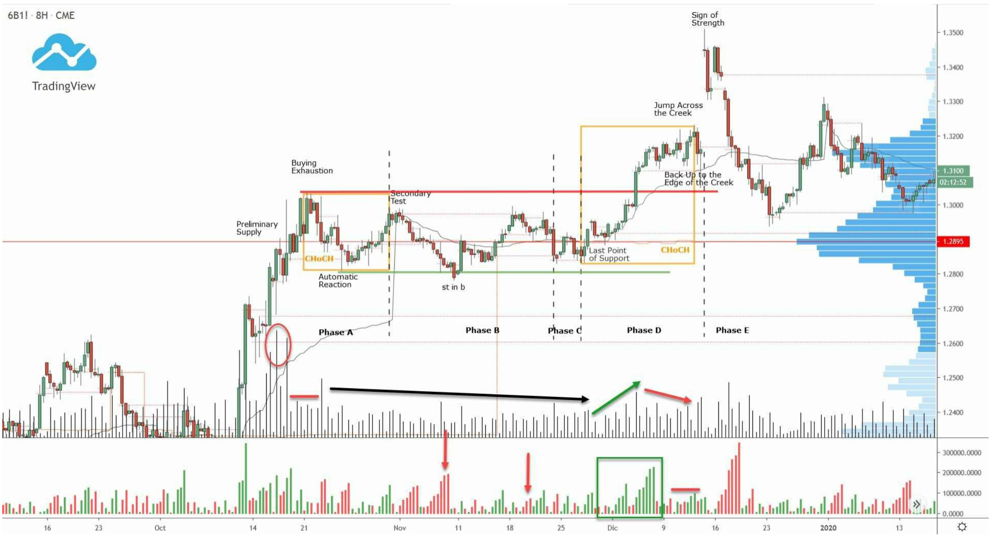
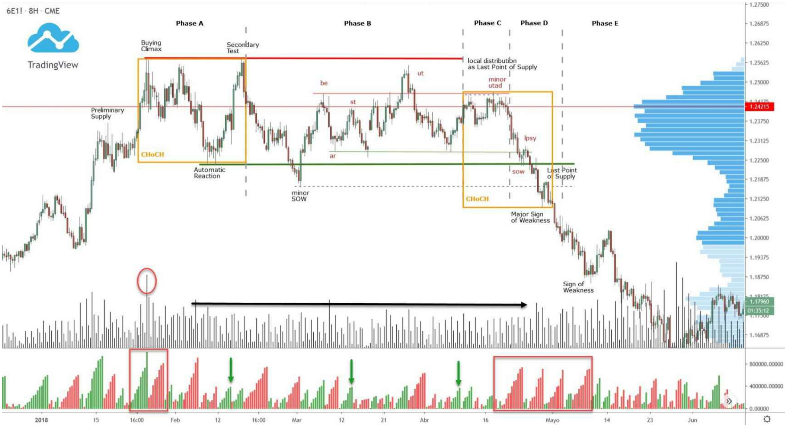
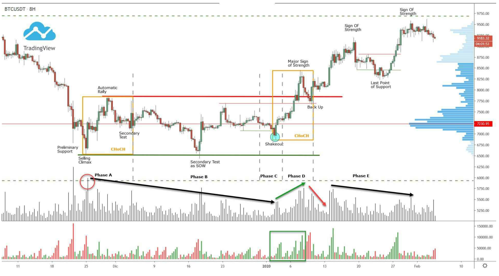
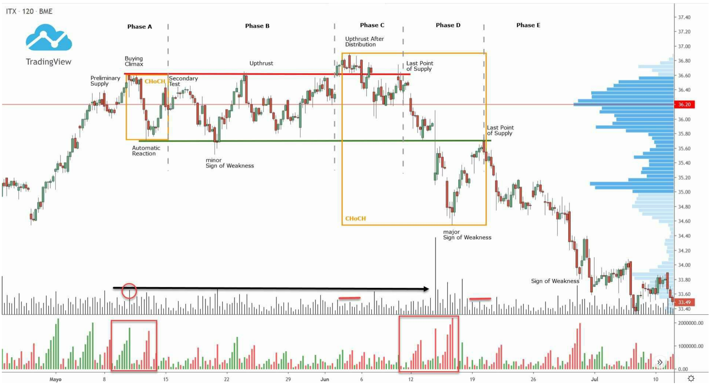
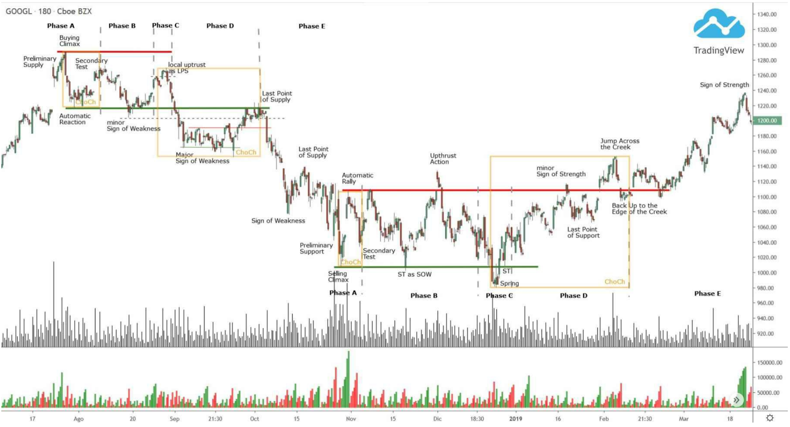
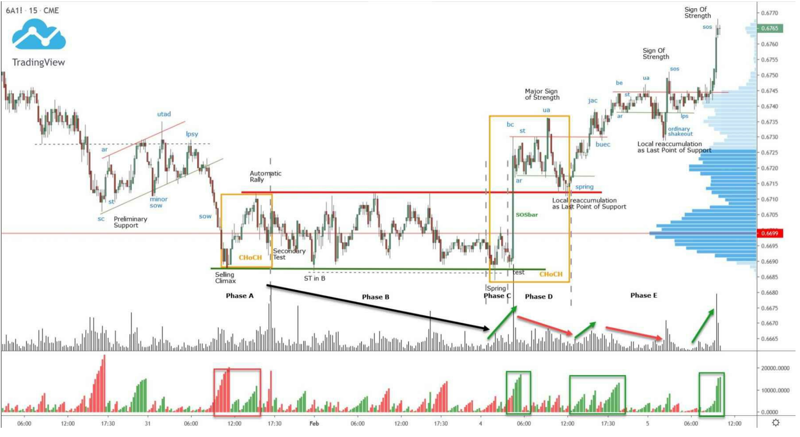

Khi đã trình bày xong phần lý thuyết của phương pháp, chúng ta sẽ tiếp tục **phân tích một số ví dụ thực tế**.

Các **cấu trúc cơ bản** đã học có vai trò như một **tài liệu tham khảo**, giúp chúng ta biết **xấp xỉ những gì có thể kỳ vọng từ diễn biến giá**; tuy nhiên, thị trường với bản chất riêng của nó **luôn cần di chuyển với một mức độ tự do nhất định**. Đây chính là một trong những điểm mạnh của phương pháp Wyckoff so với các phương pháp khác: nó **kết hợp sự cứng nhắc của các events và phases với tính linh hoạt mà tương tác liên tục giữa cung và cầu đòi hỏi.**

Điểm cần nhấn mạnh là: **mặc dù trên thị trường thực tế chúng ta sẽ thấy nhiều cấu trúc gần như giống hệt với các ví dụ lý thuyết**, nhưng **sự tương tác giữa bên mua và bên bán** sẽ khiến **mỗi cấu trúc là độc nhất vô nhị**. Gần như không thể có hai cấu trúc giống hệt nhau được hình thành, vì điều này sẽ đòi hỏi **cùng một nhóm trader tham gia cả hai cấu trúc và hành động giống hệt nhau** – điều đó là **nhiệm vụ bất khả thi.**

Trong trường hợp vẫn còn nghi ngờ, cần khẳng định rằng **phương pháp Wyckoff không chỉ đơn thuần là nhận diện đúng các events**.

📌 Việc nghiên cứu toàn bộ phần lý thuyết là **điều kiện tiên quyết không thể thiếu** để củng cố nền tảng, từ đó **phát triển các phân tích thận trọng và xây dựng kịch bản hợp lý**; nhưng cách tiếp cận của phương pháp **còn tiến xa hơn rất nhiều.**

Khi đi vào thực tế giao dịch, chúng ta sẽ gặp phải **các ví dụ cấu trúc hoặc chuyển động bất thường** mà **chúng ta phải biết cách diễn giải đúng đắn**. Và khi bạn tiến bộ dần, bạn sẽ **ngày càng ít cần phải gắn nhãn từng hành động một**, vì **quá trình nhận diện đã trở nên gần như tức thời.**

📌 Ví dụ, nếu bạn thấy một biểu đồ như hình sau, nơi có vẻ khó gắn nhãn chính xác cấu trúc, **thì điều đó không còn quá quan trọng**; cái quan trọng là **nếu bạn mở được biểu đồ tại đúng điểm tôi chỉ ra**, bạn **có đủ khả năng để diễn giải dao động đó như một cấu trúc accumulation**, và **biết cách tìm kiếm cơ hội vào lệnh Long**.

✅ **Đó chính là nơi lợi thế thật sự của phương pháp Wyckoff nằm ở – nó dạy bạn một cách đọc thị trường càng khách quan càng tốt.** Do đó, **vấn đề không phải là nhận diện cấu trúc, events và phases một cách chính xác tuyệt đối như robot**.

---

Dưới đây chúng ta sẽ xem **các ví dụ trên nhiều tài sản và khung thời gian khác nhau**.  
Điều quan trọng cần lưu ý: **khi phân tích các tài sản, chúng ta nên thực hiện trên một thị trường tập trung (centralized market)** để **dữ liệu khối lượng càng chính xác càng tốt**.

Trong các phân tích này, tôi đã sử dụng **nền tảng TradingView**.

---

## **S&P500 INDEX ($ES)**

Trên biểu đồ **weekly**, chúng ta thấy một **cấu trúc reaccumulation cổ điển có kèm theo một cú shock**.

Đây là **một ví dụ rất tốt để thấy hình ảnh trực quan của hiện tượng Buying Exhaustion (kiệt sức mua)**. Ta thấy rằng **chuyển động tăng giá đi đến hồi kết mà không có đỉnh volume** nào đủ để xác định sự kiện mang tính cực điểm (climactic event). Với sự xuất hiện của **Automatic Reaction** và **Secondary Test**, **Phase A (giai đoạn dừng xu hướng)** đã được hoàn thành.

---

Trong **Phase B**, ta đã thấy **một mức độ sức mạnh nền tảng** nhất định được thể hiện qua việc phát triển **các cú test ở vùng đỉnh** (Upthrust Action).  
Chính hành động này dẫn đến **sự kiện test trong Phase C**, tức là một cú **Shakeout** với **volume tương đối cao**.

Ở phần đầu tiên của **Phase B**, ta có thể thấy **volume nói chung đang giảm dần**, điều này là dấu hiệu cho thấy **sự hấp thụ hàng (absorption)** từ phía người mua.

---

**Phản ứng giá đi lên là rõ ràng**, và để lại **một cú test tại vùng đỉnh** nữa nhưng **không thể phá vỡ cấu trúc một cách hiệu quả** (minor Sign of Strength – dấu hiệu sức mạnh nhỏ).

Một chuyển động giảm nhẹ là cần thiết (Last Point of Support – LPS) trước khi tiến tới **một nỗ lực phá vỡ mới** theo hướng tăng.  
Vào lần thứ hai này, họ đã **thành công trong việc đẩy giá phá vỡ lên trên** (Major Sign of Strength – dấu hiệu sức mạnh lớn), và cú test sau đó (Last Point of Support) **xác nhận rằng chúng ta thực sự đang đối mặt với một cấu trúc reaccumulation.**

---

🔍 Rất thú vị là cách mà **giá bắt đầu di chuyển theo xu hướng ra khỏi biên độ trong Phase E** với **volume giảm dần**. Điều này có thể gợi ý về một **bất thường hoặc phân kỳ nào đó**, nhưng lý luận theo **cung – cầu** lại rất rõ ràng:

➡️ **Do thiếu hụt supply (ít trader sẵn sàng bán)** → **chỉ cần một lượng cầu rất nhỏ**, người mua cũng có thể đẩy giá đi lên.

---

## **POUND/DOLLAR CROSS ($6B)**

Trên biểu đồ **8 giờ**, một tín hiệu **bullish cross khác đã hình thành trên Slow Stochastic**, điều này **không cho thấy dấu hiệu của một chuyển động tăng lớn**. Như đã đề cập trước đó, **những tình huống như thế này rất khó giao dịch**, vì **gần như luôn có một cú rung lắc nhỏ (minor jolt)** xảy ra bên trong cấu trúc.

---

Chúng ta lại thấy **một ví dụ khác về Buying Exhaustion** sau khi xuất hiện **volume mạnh tại Preliminary Supply (PSY)**. Đây là một trong những lý do khiến hiện tượng exhaustion xuất hiện; bởi vì nếu trước đó các vị thế **đã bị thanh lý một cách mạnh mẽ**, thì **chỉ với một volume nhỏ**, giá cũng **có thể quay đầu ở vùng đỉnh**.

Từ **đỉnh volume của PSY**, chúng ta thấy **volume giảm dần** cho đến khi bắt đầu **chuyển động xu hướng trong vùng range sau LPS**, điều này gợi ý rằng đã xảy ra **sự hấp thụ (absorption)**.

Cũng rất dễ thấy là **volume trong các sóng giảm đang yếu dần**, thể hiện **sự mất động lượng từ phía người bán**.

---

Đến **Phase D**, chúng ta thấy **volume bắt đầu tăng trở lại**, và **các sóng Weis tăng dần** trở nên rất rõ ràng, chỉ ra rằng đang có **mất cân bằng nghiêng về phía người mua**.

Trước đó sóng giảm chiếm ưu thế, nay xuất hiện **các sóng tăng mạnh mẽ hơn**.

---

Một chi tiết quan trọng là sự **kết hợp của Volume Profile trong cấu trúc** (volume ngang được neo ở phía bên phải biểu đồ) và cách mà **VPOC của cấu trúc (mức volume được giao dịch nhiều nhất)** đã **đóng vai trò như một vùng hỗ trợ**, tạo điều kiện để hình thành **LPS**.

---

Sau sự kiện **Jump Across the Creek**, giá đã hình thành một **cấu trúc reaccumulation nhỏ** dựa trên sự xác nhận qua **Back Up to the Edge of the Creek (BUEC)** với **volume giảm rõ rệt**, gợi ý rằng **bên bán không còn quan tâm nhiều** đến việc tiếp tục bán.

---

📌 Trên biểu đồ này, chúng ta còn thấy một yếu tố rất thú vị: **những nhà giao dịch lớn (big traders)** – những người đã **mua trong suốt quá trình phát triển cấu trúc này** – đã **tận dụng một sự kiện cơ bản (trong trường hợp này là tiến trình đàm phán BREXIT)** để tạo ra **một cú gap tăng rất lớn**, là **kết quả của toàn bộ nguyên nhân (cause) trước đó.

✅ Đây không phải là trùng hợp. Và bạn sẽ **thấy hiện tượng này xảy ra nhiều lần trong tương lai**.

---

## **EURO/DOLLAR CROSS ($6E)**

Một **cấu trúc phân phối cơ bản** (basic distribution structure) **không có cú rung lắc (shaking)**. Ở đây chúng ta thấy một ví dụ rõ ràng về **tầm quan trọng của context**, trong đó **các cấu trúc nhỏ được lồng ghép vào các cấu trúc lớn hơn.**

---

Sau **Phase A**, nơi **chấm dứt xu hướng tăng trước đó**, giá bắt đầu bước vào **Phase B**, trong đó **một cấu trúc nhỏ hơn được hình thành bên trong** cấu trúc lớn.

✅ Các **events đặc trưng của một cấu trúc phân phối (distribution)** được nhận diện rõ ràng, và **cách mà một UTAD nhỏ (Upthrust After Distribution)** – tức **cú rung lắc lên vùng đỉnh tương đối bên trong range** – đã dẫn đến **chuyển động giảm giá có xu hướng** của **cả cấu trúc nhỏ lẫn cấu trúc lớn**.

---

Ta có thể thấy **VPOC của cấu trúc** (mức volume giao dịch nhiều nhất trong Volume Profile) **đóng vai trò như một kháng cự** trong quá trình phát triển của cú **UTAD nhỏ**, **chặn đứng đà tăng tiếp theo của giá.**

---

Sau sự kiện **Major Sign of Weakness**, có một **cú đảo chiều nhỏ hướng lên (Last Point of Supply – LPSY)**, đóng vai trò như một **bài test xác nhận cấu trúc phân phối**, và dẫn đến **Phase E**, nơi giá **nhanh chóng phát triển xu hướng giảm và thoát khỏi biên độ**.

---

Trong suốt quá trình hình thành cấu trúc, **volume tổng thể vẫn duy trì ở mức tương đối cao**, dấu vết của **quá trình phân phối trong range**.

📉 Thêm vào đó, **sóng Weis (Weis waves)** cho thấy:

- **Mất động lượng** trong các sóng tăng
- **Gia tăng động lượng** trong các sóng giảm

➡️ Điều này trở nên **rất rõ ràng trong các giai đoạn cuối của cấu trúc**.

---

📌 Đây là một ví dụ điển hình về **distribution không có shake** nhưng vẫn **phân phối hiệu quả**, nhờ kết hợp các yếu tố:

- Context lớn/nhỏ lồng ghép
- UTAD nhỏ
- Kháng cự từ VPOC
- Sign of Weakness
- LPSY xác nhận
- Volume + Weis waves hỗ trợ

---

## **BITCOIN ($BTCUSDT)**

Như bạn đã biết, **cách đọc biểu đồ theo phương pháp Wyckoff là mang tính phổ quát**, và ở đây ta thấy một ví dụ rõ ràng trên biểu đồ của **Bitcoin**.

Một lần nữa, chúng ta thấy một **cấu trúc accumulation cổ điển**, lần này có thêm một **rung lắc nhỏ** được xem như **sự kiện test trong Phase C**.

---

Sau **bốn sự kiện dừng xu hướng**, trong quá trình phát triển cấu trúc, ta thấy **volume tổng thể giảm dần**.  
👉 Đây là **tín hiệu hấp thụ đầu tiên** và cũng là dấu hiệu có thể cho thấy **người mua đang dần kiểm soát.**

Mặc dù tôi đã gắn nhãn **cú test tại đáy trong Phase B** là **một test đơn giản theo nghĩa là ST như SOW (Secondary Test as Sign of Weakness)**, nhưng nó **cũng có thể được xem là Spring trong Phase C**.

📌 Lý do khiến tôi chọn cách gắn nhãn như vậy là vì:  
**Spring đích thực thường đi kèm ngay lập tức với chuyển động phá vỡ**, còn trong ví dụ này, **sau "Spring" tiềm năng đó, giá lại đi ngang ở giữa cấu trúc**, phát triển **một cấu trúc nhỏ**.

Tuy nhiên, như tôi nói, **đây chỉ là cách nhìn nhận mang tính chi tiết nhỏ**.  
✅ **Điều cốt lõi vẫn luôn là xác định đúng nơi mà sự mất cân bằng cuối cùng diễn ra.**

---

Như tôi đã đề cập, **sau cú test trong Phase B**, giá bắt đầu hình thành một **cấu trúc nhỏ ngay giữa vùng range**, liên tục **tương tác với VPOC**.

📌 Chính trong **cấu trúc nhỏ đó**, tôi cho rằng **Phase C đang diễn ra**, với một cú **Shakeout** quét qua đáy nhỏ (low nhỏ trong cấu trúc).  
Đây là một **ví dụ khác minh họa rõ tầm quan trọng của context**:  
Một **cấu trúc reaccumulation nhỏ** hoạt động như một **Last Point of Support của cấu trúc lớn hơn**.

---

Ta có thể thấy rằng **cú Shakeout này ngay lập tức dẫn tới chuyển động phá vỡ**, với sự xuất hiện của **Major Sign of Strength**.

Sau đó, **Back Up to the broken Creek** xác nhận **cấu trúc accumulation** thông qua sự xuất hiện của **một SOSbar tốt**, và bắt đầu **Phase E**.

---

📈 Nếu chúng ta phân tích thuần túy về **price và volume**, có thể thấy có sự **hài hòa**:

- Trong **chuyển động phá vỡ**: giá tăng kèm theo volume tăng.
- Trong **chuyển động hồi**: giá và volume đều giảm.

---

Đến **Phase E**, ta đánh giá xu hướng và thấy có **một số mất động lượng**, thể hiện qua việc:

- Giá có cú đẩy mới
- Nhưng volume lại thấp hơn lần trước

📌 Điều này **không có nghĩa là giá sẽ quay đầu ngay lập tức**; mà chỉ là **dấu vết cho thấy số lượng người mua sẵn sàng tiếp tục mua đang ít đi.**

Do đó, **chúng ta có thể kỳ vọng một cú đảo chiều sâu hơn**, nhưng cần nhớ rằng:

➡️ **Bối cảnh tổng thể vẫn là accumulation từ dưới lên**, và **cho đến khi giá phát triển một cấu trúc distribution tương tự**, chúng ta nên **tiếp tục ưu tiên các lệnh mua (buy bias).**

---

## **INDITEX ($ITX)**

Inditex là một **công ty dệt may Tây Ban Nha**. Trong ví dụ này, chúng ta thấy một **cấu trúc phân phối cổ điển** (classic distribution structure) có kèm theo **một cú rung lắc (jolt)** trên **biểu đồ 2 giờ**.

---

Sau sự xuất hiện của **volume cực đại tại Buying Climax (BC)**, giá phát triển một **Automatic Reaction**, điều này được quan sát rất rõ thông qua **chỉ báo Weis Wave**, thể hiện **một sự thay đổi đặc trưng rõ ràng (Change of Character – CHoCH).**

---

Mặc dù đúng là có những thời điểm mà **volume tổng thể thấp**, nhưng trong suốt quá trình phát triển cấu trúc, **các đỉnh volume vẫn được quan sát**, chủ yếu là trong:

- **Minor Sign of Weakness**, và
- **Sau sự kiện Upthrust After Distribution (UTAD)**

---

Đáng lưu ý là cách mà **chuyển động tăng (UTAD)** được thực hiện với **volume tương đối thấp**, cho thấy **sự thiếu quan tâm từ người mua tại mức giá cao này**.

Giá sau đó **quay trở lại mạnh mẽ vào bên trong range**, nhưng bị **chặn lại ở vùng VPOC** của cấu trúc trong Volume Profile.

---

Một nỗ lực tăng giá mới tiếp tục bị **người bán chặn đứng ngay tại vùng đỉnh**, chính là nơi đã **thiết lập đỉnh của Buying Climax**. Đây là sự kiện được gọi là **Last Point of Supply (LPSY)**.

Ngay sau đó, một **khoảng gap giảm giá** xuất hiện, cho thấy **sự quyết liệt của phe bán**.

➡️ **Mất cân bằng nghiêng về phía người bán đã được xác lập**, và **sự cấp thiết để thoát hàng là rất rõ ràng.**

---

Trong chuyển động **Major Sign of Weakness**, ta có thể quan sát thấy **một sự thay đổi đặc trưng mới (Change of Character)** – nhưng lần này là để **thông báo sự mất cân bằng nghiêng về phía người bán**.

📉 Như mọi khi, **các sóng Weis** thể hiện điều này một cách **rất trực quan**.

---

Chuyển động tăng tiếp theo với **volume suy giảm** đã để lại **Last Point of Supply (LPSY cuối cùng)** – từ đó **giá bắt đầu chuyển sang xu hướng giảm ra khỏi vùng range trong Phase E.**

---

📌 Có vẻ như là ngẫu nhiên khi LPSY này **được hình thành ở phần thấp hơn của cấu trúc**, tại vùng **Ice đã bị phá**, nơi thiết lập đáy của **Automatic Reaction**.

❗ Nhưng **đây không phải là sự trùng hợp**, bởi vì **thị trường thường có các vùng giao dịch rất dễ nhận diện**, và đôi khi để lại cho ta **những cấu trúc cực kỳ chuẩn mực như trong ví dụ này.**

---

## **GOOGLE ($GOOGL)**

Với Google, chúng ta có thể nghiên cứu cách **một chu kỳ giá hoàn chỉnh** được biểu diễn – bao gồm:

- **Pha phân phối (distribution)**
- **Xu hướng giảm**
- **Pha tích lũy (accumulation)**
- Và **xu hướng tăng trở lại**

---

Đây là một biểu đồ **phức tạp hơn để phân tích**, nhưng ta có thể thấy rất rõ **cách thị trường vận động**:  

- Cách nó phát triển **cấu trúc phân phối làm nguyên nhân (cause)** dẫn đến xu hướng giảm sau đó  
- Và cách thị trường cần **thực hiện một chiến dịch tích lũy (accumulation campaign)** trước khi bắt đầu **giai đoạn xu hướng tăng**

---

📌 Trong **cấu trúc phân phối**, điểm nổi bật là:

- Một **test trong Phase B**, biểu hiện **yếu đuối** (Minor Sign of Weakness) → gợi ý rằng **mất cân bằng có thể đang nghiêng về phe bán**
- Và cách mà **sự kiện Phase C** xuất hiện như một **cú shock cục bộ** tại một **đỉnh tương đối bên trong range**

**Cách đọc đúng** là:  
➡️ **Người mua hoàn toàn vắng bóng**, đến mức **không đủ lực đẩy giá lên đến đỉnh của range**

Sau cú **phá vỡ giảm hiệu quả (Major Sign of Weakness)**, ta thấy thị trường phát triển **một cấu trúc redistributive nhỏ mới**, trong đó **cú shock sẽ test lại đúng vùng Ice của cấu trúc lớn đã bị phá vỡ**.

✅ Đây lại là **một ví dụ khác cho thấy tầm quan trọng của context**, nơi mà **các cấu trúc nhỏ nằm gọn bên trong cấu trúc lớn**.

---

Ở phần dưới của biểu đồ, chúng ta phân tích **cấu trúc tích lũy (accumulation)** – một lần nữa, **cấu trúc này trông như được lấy từ sách giáo khoa**, vì **độ chính xác trong chuyển động của nó thật sự đáng kinh ngạc**.

Sau **Spring trong Phase C**, ban đầu giá **không thể phá vỡ vùng đỉnh**, khiến chuyển động này được gắn nhãn là **Minor Sign of Strength**.

✅ Nó đòi hỏi **một đợt lùi nhẹ**, nơi mà **giá “lấy đà” để nhảy qua Creek**, gợi nhớ đến phép ẩn dụ của **Evans với cậu bé hướng đạo sinh**.

Sau cú **phá vỡ tăng hiệu quả (Jump Across the Creek)**, giá **quay trở lại vùng Creek**, và **bị từ chối re-entry tới hai lần** trước khi bắt đầu **chuyển động xu hướng ra khỏi biên độ**.

---

🎯 Đây là **một ví dụ tuyệt vời cho thấy tầm quan trọng của việc không để giá quay lại vùng range**.  
**Người mua đã xuất hiện đúng ở vùng then chốt**, giúp **giá tiếp tục được đẩy lên cao hơn**.

---

📌 Tóm tắt các điểm nổi bật:

- Chu kỳ đầy đủ: Distribution → Downtrend → Accumulation → Uptrend
- Sự kết hợp của Minor Sign of Weakness + cấu trúc redistributive nhỏ
- Spring, Jump Across the Creek, và hành vi **không quay lại range**
- Vai trò của **Ice** và **Creek** trong xác nhận cấu trúc
- Ví dụ hoàn hảo về **sự ăn khớp giữa cấu trúc nhỏ và lớn**, **giữa cause và effect**

---

## **AUSTRALIAN DOLLAR/US DOLLAR CROSS ($6A)**

Trong **ví dụ cuối cùng** này, chúng ta sẽ phân tích một biểu đồ có **khung thời gian 15 phút**.

Như đã đề cập trước đó, **loại phân tích này không phụ thuộc vào khung thời gian**.  
➡️ Đây là một **phương pháp tiếp cận mang tính phổ quát**, vì nó dựa trên **quy luật cung – cầu mang tính toàn cầu (universal law of supply and demand)**.

Đây là một **hình ảnh minh họa hoàn hảo** cho khái niệm **fractal trong thị trường (market fractality)** – nơi mà **giá hình thành cùng một kiểu cấu trúc ở mọi khung thời gian, chỉ khác nhau về cách thể hiện.**

---

Ở phía bên trái biểu đồ, ta thấy rằng **chiến dịch tích lũy (accumulation campaign)** bắt đầu từ **một cấu trúc nhỏ dạng redistribution**, đóng vai trò như một **sự dừng sơ khởi (Preliminary Support)**.

Trong trường hợp này, cấu trúc đó phát triển theo **hướng hơi dốc lên trên**.

📌 Mặc dù **các cấu trúc dạng này không dễ nhận diện**, nhưng chúng **vẫn có thể giao dịch được**, vì **các sự kiện (events)** vẫn **xuất hiện theo đúng trật tự**.

Điều duy nhất cần chú ý là:  
➡️ **Độ dốc của cấu trúc** sẽ **phản ánh mức độ mạnh hay yếu của thị trường trong nền tảng (background)**.

Trong ví dụ này, ta thấy rõ rằng **độ dốc lên của cấu trúc ban đầu đã gợi ý về một sức mạnh nền tảng nhất định.**

---

Sau khi xu hướng giảm bị chặn lại, ta thấy **volume giảm dần trong Phase B**, và xuất hiện một **Spring + Test chính hiệu trong Phase C** – đúng như mô hình accumulation kinh điển.

---

Khi giá phá vỡ vùng range, nó **duy trì được phía trên vùng đó**, và hình thành **một cấu trúc nhỏ dạng reaccumulation** có kèm một cú **shock (Shakeout)** quét về vùng bị phá vỡ, hoạt động theo vai trò **BUEC của cấu trúc lớn hơn**.

📈 Rất dễ thấy cách **volume thể hiện sự hài hòa liên tục**, thể hiện rõ:

- **Tăng trong các sóng đẩy (impulsive movements)**
- **Giảm trong các sóng điều chỉnh (corrective movements)**

---

Ở **Phase E**, thị trường **tiếp tục tạo thêm một cấu trúc reaccumulation mới**, kèm theo một cú **Shakeout khác** giúp **giá tiếp tục tăng lên**.

---

⚠️ Việc **đọc biểu đồ một cách chính xác theo thời gian thực** là **điều không dễ dàng**, nhưng chúng ta cần **dựa vào tất cả các tín hiệu như vậy** để cố gắng **xác định một cách khách quan nhất bên nào đang kiểm soát thị trường.**

✅ Ba yếu tố cốt lõi:

- **Context (bối cảnh)**
- **Structures (cấu trúc)**
- **Trading areas (vùng giao dịch)**

---

🎯 Đây là **một ví dụ súc tích nhưng rất giàu ý nghĩa**, kết thúc loạt Case Studies bằng:

- Mô hình accumulation fractal
- Vai trò của redistribution nghiêng lên
- Phá vỡ → reaccumulation → shakeout → trend tiếp diễn
- Phân tích volume theo nhịp thị trường

---
