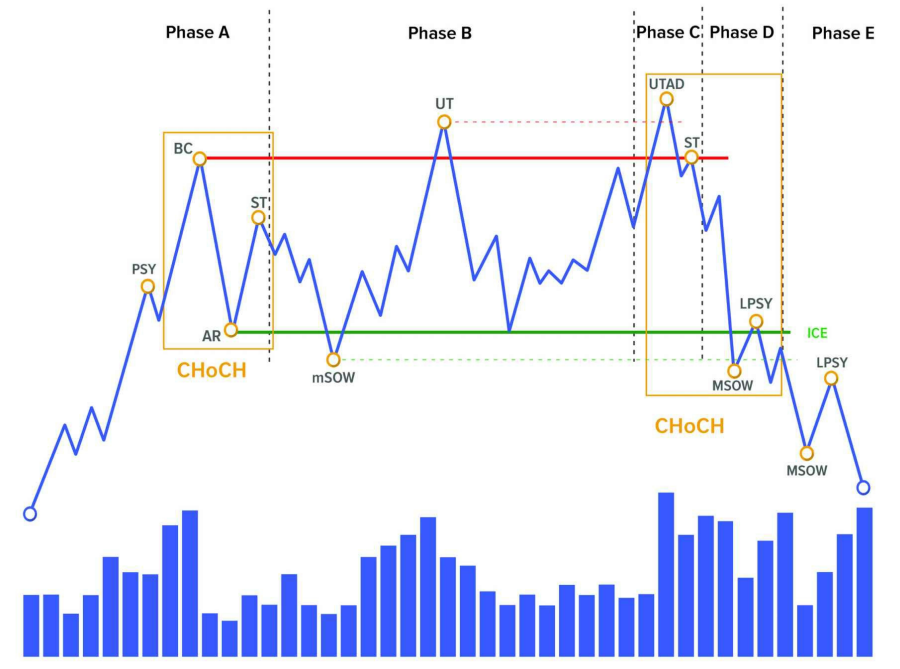

Khi cá mập âm thầm xả hàng, hãy tưởng tượng như sau:

- Giá đã tăng một thời gian → ai cũng hưng phấn, FOMO mua vào.
- Một nhóm "tay to" bắt đầu **bán ra từng chút một**, trong khi vẫn khiến thị trường tưởng rằng giá sẽ còn tăng.
- Họ **giăng bẫy bằng các cú phá đỉnh giả** (Upthrust, UTAD) → thu hút người mua lẻ.
- Khi đã xả đủ hàng → **giá bắt đầu rơi mạnh** → một xu hướng giảm mới bắt đầu.

Đó chính là **cấu trúc phân phối**.

> _Phân phối là quá trình các nhà giao dịch lớn “đẩy” lượng hàng của mình cho đám đông đang kỳ vọng tăng giá – Chuyển giao từ "tay mạnh" sang "tay yếu"._

✅ **Các khái niệm:**

- **Ice**: Vùng hỗ trợ trong phân phối hoặc tái phân phối (thường tạo bởi AR và đáy trong Phase B).
- **CHoCH** (Change of Character): Dấu hiệu thay đổi đặc tính xu hướng:
  - CHoCH 1: giá chuyển từ tăng sang phân phối.
  - CHoCH 2: giá chuyển từ phân phối sang giảm.

---

## **PHASE A**

### ❓ **Tại sao lại có Phase A trong phân phối?**

Khi một xu hướng tăng kéo dài, ai cũng nghĩ "giá sẽ còn lên nữa". Nhưng **cá mập không thể xả hàng khi mọi người chưa sẵn sàng mua**. Vì vậy, Phase A là nơi **cá mập bắt đầu thử thị trường**, kiểm tra "độ háo hức" của đám đông trước khi lên kế hoạch phân phối thực sự.

**🧠 Hãy tưởng tượng thế này:**

> Bạn muốn bán một lượng hàng rất lớn (crypto chẳng hạn), nhưng nếu bạn bán ồ ạt, thị trường sẽ rơi ngay, bạn không kịp xả. Thay vào đó, bạn cần **kéo giá lên, hạ xuống, tạo dao động để đánh lạc hướng**, khiến người khác nghĩ rằng giá vẫn ổn, vẫn còn cơ hội tăng.

Đó chính là vai trò của **Phase A**.

Để hiểu **bản chất hình thành của Phase A trong phân phối (Distribution)**, hãy quên đi biểu đồ, sự kiện hay tên gọi kỹ thuật. Hãy nghĩ đến **cách mà một người bán lớn – tay to – cần thao túng tâm lý đám đông để xả hàng một cách êm ái**.

---

### 🧠 **Bản chất hình thành Phase A là gì?**

**Phase A hình thành từ mâu thuẫn giữa nhu cầu "xả hàng lớn" của tay to và kỳ vọng "giá còn tăng" của đám đông.**

Đám đông vẫn nghĩ thị trường đang khỏe, giá còn lên. Nhưng tay to biết rằng:  
📉 **giá đã quá cao**, đà tăng sắp hết.  
📦 Và họ đang giữ một lượng hàng rất lớn cần bán.

Nếu bán ngay lập tức → giá sập → không ai mua → họ tự đạp nhau chạy.  
Nên họ **không thể xả trực diện**. Họ cần:

- **Làm thị trường "lưỡng lự"**: Không tăng nữa, nhưng cũng không giảm hẳn.
- **Gây rối tâm lý**: Để đám đông không chắc chắn, không hành động dứt khoát.
- **Kiểm tra xem còn ai muốn mua không**: Vì họ cần người mua để có thể bán ra.

---

### 📆 **Các sự kiện trong Phase A – Phân Phối**

| Sự kiện   | Tên đầy đủ         | Giải thích dễ hiểu                                                                                                                                                                   |
| --------- | ------------------ | ------------------------------------------------------------------------------------------------------------------------------------------------------------------------------------ |
| 🟥 **PSY** | Preliminary Supply | Lực bán ban đầu xuất hiện sau một xu hướng tăng mạnh. Volume bắt đầu tăng khi giá chạm vùng kháng cự → dấu hiệu đầu tiên của “tay to” muốn xả.                                       |
| 🔻 **BC**  | Buying Climax      | Đỉnh cao nhất trong chu kỳ tăng. Giá tăng mạnh kèm theo **volume cực lớn**, rồi đột ngột quay đầu. Đây là nơi **smart money bắt đầu bán ra ồ ạt**, trong khi đám đông còn đang FOMO. |
| 🔄 **AR**  | Automatic Reaction | Sau BC, giá rơi nhanh và sâu do lực mua suy yếu. Đây là phản ứng tự nhiên của thị trường sau khi dòng tiền lớn bắt đầu rút lui. Tạo nên **đáy đầu tiên của range phân phối**.        |
| 🔁 **ST**  | Secondary Test     | Giá quay lại vùng đỉnh (hoặc gần đỉnh BC) để kiểm tra xem **còn lực mua nào không**. Nếu volume thấp, giá không vượt được đỉnh cũ → xác nhận lực mua suy yếu.                        |

**Vai trò của từng sự kiện:**

| Mục tiêu                      | Được thực hiện bởi sự kiện |
| ----------------------------- | -------------------------- |
| Bắt đầu gây áp lực bán        | **PSY**                    |
| Đánh lừa đám đông mua đỉnh    | **BC**                     |
| Kiểm tra độ “nặng” thị trường | **AR**                     |
| Đo lại "xung lực" phe mua     | **ST**                     |

**🔍 Một số biểu hiện thực tế dễ thấy:**

- Sau BC, giá không còn tăng mạnh nữa dù có tin tốt.
- Các lần retest đỉnh đều yếu hơn, volume giảm.
- Biểu đồ bắt đầu xuất hiện nhiều **wick phía trên** → dấu hiệu phân phối đỉnh.

---

### ✅ **Các mấu chốt để nhận diện Phase A – Phân Phối**

---

#### 1. **Xu hướng tăng bắt đầu yếu đi rõ rệt**

- Trước đó, giá tăng mạnh và đều.
- Nhưng đến Phase A, **giá vẫn lên nhưng chậm lại**, xuất hiện **các nến đuôi dài**, **khối lượng tăng ở đỉnh**.
- Momentum (động lượng) yếu dần → dấu hiệu "hụt hơi".

---

#### 2. **Xuất hiện Buying Climax (BC)**  

- Một cây nến tăng mạnh đi kèm **volume đột biến** → nhưng ngay sau đó là nến rút chân, đảo chiều hoặc giảm nhanh.
- Đây là nơi đám đông FOMO mua mạnh nhất → trong khi "tay to" bắt đầu xả ra.

---

#### 3. **Có cú sụt đầu tiên – Automatic Reaction (AR)**  

- Sau BC, giá giảm sâu và nhanh.
- Đây là phản ứng tự nhiên sau khi **dòng tiền lớn ngưng đẩy giá**.

---

#### 4. **Giá bắt đầu sideway – dao động trong range hẹp**

- Không còn hình ảnh của “uptrend rõ ràng”.
- Giá dao động lên xuống trong biên độ giữa **BC (đỉnh)** và **AR (đáy)**.
- Đây là lúc thị trường chuyển từ trending → balancing.

---

#### 5. **Có cú retest đỉnh yếu hơn – Secondary Test (ST)**

- Giá quay lại vùng gần đỉnh BC nhưng:
  - Volume thấp.
  - Không tạo đỉnh cao hơn.
  - Có thể xuất hiện nến doji, pin bar, hoặc engulfing giảm.

---

#### 6. **Volume bắt đầu thay đổi hành vi**

- Trước đó: giá tăng = volume tăng.
- Phase A: **giá tăng mà volume giảm**, hoặc **volume tăng khi giá giảm**.
- Cấu trúc volume “lệch pha” → báo hiệu phân phối đang hình thành.

---

#### 7. **Cảm giác thị trường “nghĩ ngợi”**

- Không còn "phấn khích" như giai đoạn tăng mạnh.
- Trader bắt đầu tranh luận: “Lên tiếp hay không?”, “Phân phối hay điều chỉnh?”
- Sự lưỡng lự này là **đặc trưng tâm lý của Phase A**.

---

> **🧠 Tổng kết nhanh:**

| Mấu chốt          | Dấu hiệu                                   |
| ----------------- | ------------------------------------------ |
| Tăng yếu dần      | Momentum giảm, volume phân kỳ              |
| Đỉnh cao đột biến | Buying Climax (BC)                         |
| Rơi mạnh đầu tiên | Automatic Reaction (AR)                    |
| Dao động sideway  | Hình thành range phân phối                 |
| Retest yếu        | Secondary Test (ST) không vượt BC          |
| Volume rối loạn   | Giá tăng nhưng volume giảm, hoặc ngược lại |

---

### 🔄 **Một số biến thể thường gặp của Phase A – Phân Phối**

---

#### 🔸 1. **Phase A kéo dài (Extended Phase A)**  

- **Giá dao động trong biên độ rộng**, không rõ ràng.
- Nhiều lần test lại vùng đỉnh → tạo cảm giác như thị trường vẫn mạnh.
- Trader dễ bị lừa rằng đó là **"Accumulation với biên trên"** chứ không phải phân phối.
- Dễ nhầm lẫn vì xuất hiện nhiều “mini-uptrend” bên trong range.

📌 **Gợi ý**: So sánh volume → nếu các cú tăng không đi kèm volume tăng, rất có thể là phân phối.

---

#### 🔸 2. **Phase A không rõ BC – không có cú bật đỉnh lớn**  

- Không có Buying Climax rõ ràng.
- Thay vào đó là **loạt nến tăng nhỏ**, rồi rơi xuống từ từ.
- Đây là kiểu phân phối “êm ái” – phù hợp với thị trường ít FOMO hoặc bị điều tiết (các cặp crypto có thanh khoản thấp).

📌 **Gợi ý**: Dù không có BC, vẫn sẽ có cú AR rõ và một cú retest yếu sau đó.

---

#### 🔸 3. **Phase A hình thành ngay sau tin tức tích cực**

- Tin tức cực tốt ra → giá spike lên → nhiều người mua vào → volume tăng đột biến.
- Ngay sau đó giá giảm → tạo BC & AR gọn gàng.
- Đây là loại phân phối kiểu “news trap”.

📌 **Gợi ý**: Xem xét hành vi volume và cú pullback sau tin → thường là điểm vào short đẹp.

---

#### 🔸 4. **Phase A bị rút ngắn do sụp nhanh**

- Sau cú BC, giá sụp luôn → AR = Phase B luôn.
- Cấu trúc bị “rút gọn” do thị trường phản ứng quá mạnh (thường gặp ở crypto).
- Có thể bỏ qua ST – hoặc ST đến quá nhanh, khó nhận ra.

📌 **Gợi ý**: Dùng timeframe lớn hơn để phân định ranh giới Phase A rõ ràng hơn.

---

> **🧠 Tổng kết**

| Biến thể       | Đặc điểm chính                          | Cần chú ý                                     |
| -------------- | --------------------------------------- | --------------------------------------------- |
| Kéo dài        | Range sideway lâu, dễ nhầm với tích lũy | Volume và cấu trúc giá                        |
| Thiếu BC rõ    | Không có cú spike đỉnh                  | Dựa vào volume và momentum để đánh giá        |
| Bị "news trap" | Tin tốt kích hoạt BC                    | Volume tăng bất thường + cú đảo chiều sau tin |
| Sụp luôn       | AR quá mạnh, Phase B đến sớm            | Dễ bị nhầm là panic sell                      |

---

### 🧠 **Lưu ý khi nhận diện Phase A – Phân Phối**

---

#### 1. **Không phải cứ sideway là Phase A**

- Thị trường đi ngang không có nghĩa là đang phân phối.
- Có thể là tích lũy, tái tích lũy, hoặc đơn giản là nghỉ trước khi tiếp tục tăng.
- 👉 **Cần có tín hiệu lực mua suy yếu**: giá tăng chậm, volume lệch pha, retest đỉnh thất bại.

---

#### 2. **Đừng short sớm trong Phase A**

- Phase A là giai đoạn chuẩn bị – **tay to chưa xả mạnh**, chỉ đang "làm rối" thị trường.
- Nếu bạn short quá sớm, rất dễ bị dính vào cú “Upthrust” trong Phase B.
- 👉 Hãy quan sát, kiên nhẫn chờ thêm xác nhận trong Phase B hoặc C.

---

#### 3. **Không phải lúc nào cũng có Buying Climax (BC) rõ ràng**

- Một số market sẽ phân phối theo kiểu “rỉ rả” → không có cú pump rõ ràng.
- 👉 Đừng đợi phải thấy “một cú nến siêu spike” mới tin là BC – thay vào đó, chú ý **volume lớn + phản ứng đảo chiều bất ngờ**.

---

#### 4. **Volume không đồng pha là dấu hiệu đầu tiên**

- Trong uptrend: giá tăng → volume cũng tăng (logic).
- Trong Phase A: **giá tăng → nhưng volume bắt đầu giảm**.
- Đây là “lỗi nhịp” – dấu hiệu đầu tiên rằng tay to đang giảm lực đẩy.

---

#### 5. **Secondary Test (ST) có thể bị bỏ sót nếu timeframe quá nhỏ**

- Nếu bạn chỉ xem M5/M15, có thể không thấy ST rõ ràng.
- 👉 Dùng H1/H4 để định hình cấu trúc tổng thể → sau đó mới xuống khung nhỏ để entry.

---

#### 6. **Dễ nhầm với tích lũy nếu không để ý hướng đi trước đó**

- Phase A của phân phối chỉ đúng nếu **trước đó là một xu hướng tăng rõ ràng**.
- Nếu giá đi ngang sau xu hướng giảm → rất có thể là **accumulation chứ không phải distribution**.

---

**✅ Checklist nhanh:**

| Kiểm tra                               | Có / Không |
| -------------------------------------- | ---------- |
| Trước đó có xu hướng tăng mạnh?        | ✅          |
| Xuất hiện volume tăng đột biến ở đỉnh? | ✅          |
| Giá bắt đầu dao động trong range?      | ✅          |
| Retest đỉnh thất bại / volume yếu?     | ✅          |
| Đã có cú giảm đầu tiên (AR)?           | ✅          |

---

> **Tóm gọn**: Phase A là giai đoạn “thử vai diễn mới” của thị trường. Đừng hành động vội – hãy quan sát hành vi giá và dòng tiền để chắc chắn rằng sân khấu đang thực sự đổi cảnh.

---

### 🧩 **Ý nghĩa chiến lược của Phase A – Phân phối**

---

#### 🧠 1. **Báo hiệu khả năng kết thúc xu hướng tăng**

Phase A đánh dấu **sự chuyển mình đầu tiên** từ xu hướng tăng → sang giai đoạn phân phối.  
Nó **không xác nhận đảo chiều**, nhưng cho bạn biết:  
> “Có điều gì đó không ổn… tay to đã bắt đầu thay đổi ý định.”

**Chiến lược:**  

- Bỏ mindset “mua mọi cú điều chỉnh”.  
- Ngưng DCA.  
- Bắt đầu quan sát kỹ các đỉnh và khối lượng.

---

#### ⏳ 2. **Giai đoạn quan sát – không hành động vội**

Nhiều trader short sớm trong Phase A và bị quét ở Phase B (Upthrust, UTAD).  
Phase A **không dành để giao dịch**, mà là giai đoạn để:

- Đánh dấu Range.
- Theo dõi phản ứng volume.
- Ghi nhận các vùng key levels (BC, AR).

**Chiến lược:**  

- Khoanh vùng Range (BC → AR).  
- Theo dõi Secondary Test (ST) → đánh giá cung/cầu.  
- Lập nhật ký: ai đang kiểm soát thị trường?

---

#### 📊 3. **Xây dựng cấu trúc giao dịch cho các Phase sau**

Những gì xảy ra trong Phase A sẽ là **nền móng cho kế hoạch giao dịch ở Phase B, C, D**:

- Xác định biên độ range.
- Phát hiện dấu hiệu yếu đi của lực mua.
- Nhận diện sự thay đổi vai trò giữa buyer và seller.

**Chiến lược:**  

- Đánh dấu đỉnh (BC) và đáy (AR) làm kháng cự/hỗ trợ chính.  
- Xác định breakout giả sau này (Upthrust, UTAD) dựa trên đỉnh của Phase A.  
- Theo dõi sự "thay máu" volume giữa các lần test.

---

#### 🎯 4. **Tâm lý chiến lược: Đặt lại kỳ vọng**

Phase A là giai đoạn **phân vân, nghi ngờ, mơ hồ**, vì thế chiến lược không phải là thắng lớn, mà là:

- **Không bị trap.**
- **Nhận diện sớm xu hướng đổi chiều.**
- **Chuẩn bị kỹ để hành động dứt khoát ở Phase B/C.**

---

**✅ Tóm gọn chiến lược Phase A:**

| Hành động            | Vì sao?                         |
| -------------------- | ------------------------------- |
| Không vào lệnh vội   | Phase A chưa xác nhận đảo chiều |
| Theo dõi volume      | Dấu hiệu tay to đổi ý           |
| Vẽ rõ BC – AR        | Xác định khung Range chính      |
| Chuẩn bị cho Phase B | Entry hiệu quả bắt đầu từ đây   |

---

> **“Ai kiên nhẫn trong Phase A, sẽ là người chủ động ở Phase B.”**

---

## **PHASE B**

---

### 🧠 **Tại sao lại có Phase B trong phân phối?**

**Vì tay to không thể xả hết hàng trong Phase A.**  
Phase A chỉ là khúc dạo đầu – nơi thị trường bắt đầu chững lại, nhưng chưa đủ điều kiện để bán ra toàn bộ lượng hàng mà smart money đang nắm giữ.

---

**💡 Hãy tưởng tượng thế này.**

Bạn là người giữ hàng triệu đô giá trị BTC.  
Bạn không thể đạp một phát xuống – vì như vậy bạn sẽ:  

- Tự khiến giá sập → bán được rất ít.  
- Làm lộ ý đồ → thị trường bỏ chạy → không ai mua hàng của bạn.

Thay vào đó, bạn cần:

- **Tạo cảm giác giá vẫn còn ổn, thậm chí sắp breakout.**
- **Làm đám đông tiếp tục tin tưởng, tiếp tục mua vào.**
- **Tạo dao động, volatility, tin tức tốt, phân tích kỹ thuật bullish,...**

→ Tất cả những điều đó đều **cần thời gian** → và đó chính là lý do Phase B tồn tại.

---

**🔁 Vậy Phase B là gì?**

Phase B là **thời gian để tay to phân phối dần dần**, từng phần một,  
→ Mỗi lần kéo giá lên là để **tạo “cơ hội” cho buyer**, nhưng thật ra là **đẩy hàng vào tay họ**.  
→ Mỗi lần giảm là để **dò phản ứng**, test xem thị trường đã "chín" chưa.

---

> **Phase B tồn tại vì sự phân phối cần diễn ra có chiến lược.**  
> Nó là giai đoạn **tay to “đóng gói hàng hóa” thành từng cú tăng ảo**, từng breakout giả, từng giấc mơ tiếp diễn – để xả hàng mà không bị phát hiện.

---

### 🔍 **Bản chất hình thành Phase B – Phân phối**

**Phase B hình thành từ sự mâu thuẫn giữa hai dòng cảm xúc ngược chiều:**

- Đám đông vẫn còn **lạc quan, kỳ vọng tăng giá**.
- Tay to thì đã **muốn thoát hàng, nhưng không thể lộ liễu**.

→ Để xả được lượng lớn tài sản với giá cao, họ cần **tạo ra một vở kịch đủ hấp dẫn** để người khác… sẵn sàng mua lại.

---

#### 🎭 **Vở kịch ấy bao gồm:**

1. **Sự biến động có chủ đích**:  
   Giá tăng → thu hút buyer mới.  
   Giá giảm nhẹ → tạo cơ hội mua “giá tốt”.  
   Rồi lại tăng – nhưng không vượt quá cao → tạo kỳ vọng breakout.

2. **Các cú phá đỉnh giả (Upthrust)**:  
   Giúp kích hoạt lệnh long từ trader nhỏ lẻ.  
   Đồng thời là cơ hội để tay to… **xả vào lực mua đó**.

3. **Vòng lặp tâm lý**:  
   - Mỗi lần giá tăng nhẹ → trader lại nghĩ “Đây là lần break thật!”  
   - Mỗi lần giá giảm nhẹ → họ lại nghĩ “Chỉ là pullback thôi!”  
   - Và họ tiếp tục giữ hoặc mua thêm…

---

#### 🧠 Bản chất sâu xa hơn

- **Smart Money không đẩy giá xuống ngay**, vì họ cần:
  - **Người mua đủ nhiều** để hấp thụ khối lượng họ bán.
  - **Không khiến đám đông hoảng loạn** và rút vốn sớm.

- Vì vậy, họ tạo nên một giai đoạn giá **dao động có chủ đích**, để:
  - **Duy trì ảo giác “thị trường vẫn khỏe”**.
  - **Tối ưu vị thế bán ra mà không làm sập thị trường**.

---

> **Phase B là chuỗi thao túng có tổ chức** – một sân khấu nơi “tay to” diễn vai **người nâng giá**, nhưng thật ra đang **lặng lẽ thoát khỏi ván cờ**.

---

Dưới đây là các **sự kiện quan trọng trong Phase B** của mô hình **Phân Phối (Distribution)** theo Wyckoff – đây là nơi tay to **bắt đầu hành động thật sự**, từng bước xả hàng bằng cách **dựng kịch bản đánh lừa thị trường**.

---

### 📊 **Các sự kiện trong Phase B – Phân Phối**

| Sự kiện                               | Mô tả dễ hiểu                                                                                                                                                                           |
| ------------------------------------- | --------------------------------------------------------------------------------------------------------------------------------------------------------------------------------------- |
| 🔼 **UT**                              | Cú phá vỡ giả lên trên đỉnh vùng BC (Buying Climax). Là một “cú lừa” kinh điển: giá vượt đỉnh cũ → thu hút lệnh mua → rồi nhanh chóng rơi xuống, tạo cú trap.                           |
| 📉 **ST as SOW**                       | Giá quay lại đáy AR để test xem lực mua còn không. Nhưng khác với Phase A, lần này test **yếu hơn**, volume cao hơn, **có thể xuyên qua đáy AR** → cho thấy bên bán đã mạnh lên rõ rệt. |
| 🔄 **Test Upthrust / Rejected Retest** | Các lần quay lại vùng đỉnh BC hoặc UT sau đó nhưng **không vượt nổi**, hoặc bị từ chối nhanh. Đây là **xác nhận vùng phân phối đang hoạt động**.                                        |
| 📉 **Mini SOW**                        | Các cú sụt nhỏ trong range – thường nằm giữa đáy AR và vùng giữa range. Cho thấy **giá bắt đầu có xu hướng yếu dần theo chiều giảm**.                                                   |
| 🧨 **Break Fake + Rejection**          | Những cú breakout giả khác trong range – có thể là phá nhẹ đáy AR rồi bật lại → **dò phản ứng của thị trường**, hoặc gài bẫy long-short liên tục.                                       |

---

**🎯 Ý nghĩa từng sự kiện.**

| Sự kiện        | Ý nghĩa chiến lược                                                                                                         |
| -------------- | -------------------------------------------------------------------------------------------------------------------------- |
| **UT**         | Là cú bait để tay to xả mạnh. Ai FOMO mua breakout sẽ nhanh chóng bị kẹp.                                                  |
| **ST as SOW**  | Là tín hiệu sớm rằng thị trường đang yếu đi rõ rệt. Nếu xuyên thủng đáy AR → phân phối đang bước vào giai đoạn nghiêm túc. |
| **Test UT**    | Là điểm short tiềm năng, vì tay to thường test lại vùng trap trước khi đẩy giá rơi.                                        |
| **Mini SOW**   | Cho thấy bên bán đang nắm ưu thế, giá khó quay lại vùng cao hơn.                                                           |
| **Break Fake** | Những cú fake-out (lên hoặc xuống) dùng để làm rối thị trường – giai đoạn này rất nhiều người “mất phương hướng”.          |

---

**💡 Mẹo nhận biết.**

- Sự kiện trong Phase B **không đi theo thứ tự cố định**, nhưng hầu hết đều có UT và ít nhất 1 lần test lại đáy AR.
- UT thường là **điểm vào short sớm nhất** nếu có xác nhận.
- ST as SOW là **bằng chứng hành vi** cho thấy tay to đã kiểm soát được bên bán.

---

### ✅ **Các mấu chốt để nhận diện Phase B – Phân Phối**

---

#### 1. **Giá vẫn dao động trong range, nhưng không tạo được đỉnh cao mới bền vững**

- Thị trường liên tục **phá đỉnh giả** (Upthrust) rồi nhanh chóng rơi trở lại.
- Các đỉnh sau thường **không vượt quá xa đỉnh BC**, hoặc nếu vượt → lập tức bị từ chối.
- Cấu trúc chuyển dần từ **Higher Highs → Equal Highs → Lower Highs**.

---

#### 2. **Volume "nhiễu" và lệch pha**

- Volume thường **tăng khi giá giảm**, và **giảm khi giá tăng** → dấu hiệu tay to xả hàng.
- Các cú pump có volume nhỏ → không có dòng tiền thật.
- Các cú rơi có volume lớn → lực bán chiếm ưu thế dần.

---

#### 3. **Xuất hiện Upthrust (UT) rõ ràng**

- Đây là điểm “đánh hơi” sớm nhất cho một Phase B đang hoạt động.
- UT thường:
  - Vượt đỉnh BC.
  - Có volume cao.
  - Sau đó giảm mạnh → không giữ được giá cao.

---

#### 4. **Có Secondary Test as Sign of Weakness (ST as SOW)**

- Giá retest vùng đáy AR, có thể phá thủng nhẹ rồi bật lên.
- Đây là sự kiện đặc trưng cho Phase B, cho thấy **lực mua yếu rõ rệt**.
- Nếu ST này sâu hơn đáy AR trước đó → khả năng phân phối đang dần bước sang Phase C.

---

#### 5. **Cảm giác thị trường "khó đoán"**

- Giao dịch trong range trở nên rất “khó chịu”:
  - Breakout giả liên tục.
  - Nến lên xuống mạnh, khó tìm điểm vào.
  - Tâm lý trader bị “xoay như chong chóng” → đây chính là điều tay to muốn.

---

#### 6. **Không còn hành vi đẩy giá kiểu uptrend**

- Mỗi cú tăng đều bị từ chối nhanh chóng.
- Không còn "higher high - higher low" như trước.
- Lúc này, **phe mua đã đuối**, phe bán **dần kiểm soát**, nhưng **chưa đẩy giá sập ngay**.

---

**🧠 Tổng kết nhận diện:**

| Mấu chốt           | Dấu hiệu                             |
| ------------------ | ------------------------------------ |
| Đỉnh không vững    | UT, rồi rơi mạnh                     |
| Volume lệch pha    | Tăng khi giá giảm, giảm khi giá tăng |
| Breakout giả       | Trap FOMO liên tục                   |
| Retest đáy yếu     | ST as SOW không bật mạnh             |
| Biểu đồ "rối loạn" | Đúng như một cái bẫy tâm lý          |

---

### 🔄 **Một số biến thể thường gặp của Phase B – Phân Phối**

---

#### 🔸 1. **Không có Upthrust (UT) rõ ràng**

- Đây là biến thể "âm thầm": không có cú phá đỉnh lớn → **tay to xả hàng trong im lặng**.
- Giá chỉ sideway, tạo đỉnh bằng hoặc thấp hơn BC.
- Rất dễ bị nhầm với tích lũy nếu không xem kỹ volume và hành vi giá.

📌 **Chiến lược:**  
Quan sát kỹ volume → nếu giá tăng mà volume yếu, giá giảm mà volume mạnh → rất có thể là phân phối lặng lẽ.

---

#### 🔸 2. **UTAD xuất hiện sớm ngay trong Phase B**

- Thông thường UTAD là sự kiện thuộc Phase C.  
- Nhưng đôi khi, **tay to “đẩy lần cuối” ngay trong Phase B**, tạo một cú UTAD sớm rồi xả mạnh.
- Sau UTAD, giá giảm sâu về gần đáy AR → khiến nhiều người tưởng là Phase C đã qua.

📌 **Chiến lược:**  
Theo dõi phản ứng sau cú phá đỉnh → nếu giá không hồi phục lại, mà sập ngay → có thể Phase C đã bị rút gọn, hoặc Phase B đang ở biến thể nhanh.

---

#### 🔸 3. **Shakeout đáy AR rồi bật lên (giả Spring trong phân phối)**

- Một cú xuyên nhẹ qua đáy AR rồi bật ngược lên → trông giống tích lũy.
- Nhưng sau đó không hình thành cấu trúc tăng → mà tiếp tục thất bại khi quay lại vùng trên.

📌 **Chiến lược:**  
Đừng vội long nếu không thấy hành vi giữ giá rõ ràng. Cần volume xác nhận và BOS trước khi vào lệnh.

---

#### 🔸 4. **Range kéo dài bất thường**

- Phase B kéo dài nhiều tuần hoặc nhiều ngày, dao động trong biên độ hẹp.
- Tạo cảm giác “tích lũy trước khi tăng” → nhưng thực chất là **xả từ từ trong im lặng**.
- Thường gặp khi market có thanh khoản thấp hoặc thiếu catalyst.

📌 **Chiến lược:**  
Kiểm tra **sự yếu đi rõ rệt của mỗi cú hồi** → nếu càng hồi càng yếu, rất có thể là phân phối.

---

#### 🔸 5. **Phase B “dấu hiệu sớm”, rồi bật lên test lại đỉnh**

- Xuất hiện SOW và mini LPSY sớm → rồi giá tăng ngược trở lại test vùng đỉnh lần cuối (gọi là “upthrust muộn”).
- Dễ khiến trader short quá sớm bị quét → rồi mới thật sự breakdown.

📌 **Chiến lược:**  
Kiên nhẫn chờ phản ứng tại vùng đỉnh → nếu có từ chối rõ ràng, xác nhận volume, mới là entry an toàn.

---

**🧠 Tổng kết:**

| Biến thể              | Nhận diện nhanh                         |
| --------------------- | --------------------------------------- |
| Không có UT           | Giá sideway, volume lệch pha            |
| UTAD sớm              | Phá đỉnh mạnh, rơi nhanh                |
| Shakeout đáy AR       | Phá nhẹ đáy → bật lại rồi fail          |
| Range kéo dài         | Nhiều tuần sideway, không phá rõ        |
| Test lại đỉnh sau SOW | Trap short sớm trước khi breakdown thật |

---

### 🧠 **Lưu ý khi nhận diện Phase B – Phân phối**

---

#### 1. **Không nhầm với tích lũy nếu chỉ nhìn vào sideway**

- Cả tích lũy và phân phối đều có vùng giá đi ngang (range).
- Nhưng:
  - **Tích lũy**: đáy chắc, đỉnh yếu.
  - **Phân phối**: đỉnh cố định hoặc đỉnh giả → **nhưng đáy yếu dần**.
- **Giá giảm = volume lớn**, **giá tăng = volume nhỏ** → dấu hiệu tay to đang xả.

📌 **Gợi ý**: so sánh độ mạnh – yếu của các cú hồi trong range để nhận ra xu hướng ngầm.

---

#### 2. **Không nên short sớm chỉ vì thấy Upthrust (UT)**

- UT có thể là “Upthrust trong Phase B” hoặc là UTAD trong Phase C.
- Nếu short ngay khi thấy UT mà chưa có SOW, rất dễ bị quét bởi cú bật lại kiểm tra trap.
- Phase B là **giai đoạn xả hàng**, nhưng **chưa phải lúc vào lệnh nếu chưa có cấu trúc xác nhận**.

📌 **Chiến lược**: chờ thêm dấu hiệu **SOW + failure retest** mới mở vị thế.

---

#### 3. **Volume và hành vi giá cần được theo dõi liên tục**

- Volume không ổn định trong Phase B – **đó là bình thường**.
- Nhưng cần chú ý các đặc điểm:
  - Giá tăng nhưng volume thấp → **upthrust yếu**.
  - Giá giảm mà volume tăng → **bên bán chiếm ưu thế**.
  - Mỗi lần hồi phục yếu hơn → cấu trúc giảm đang hình thành.

📌 **Không nên chỉ nhìn giá – hãy nhìn phản ứng giá + khối lượng.**

---

#### 4. **Biến thể rất đa dạng – không đòi hỏi mô hình textbook**

- Có Phase B không có UT.
- Có Phase B xuất hiện SOW ngay đầu → rồi giá còn test đỉnh một lần nữa.
- Có Phase B diễn ra nhanh gọn trong vài cây nến (đặc biệt ở crypto).

📌 **Cần linh hoạt, không rập khuôn – quan trọng nhất là xác định đúng ý đồ tay to.**

---

#### 5. **Hãy coi Phase B như sân khấu đang dựng**

- Nếu Phase A là bước "chuẩn bị tinh thần",
- Thì Phase B là lúc "tay to dựng sân khấu để diễn trò".

Mọi breakout, mọi trap, mọi dao động… **đều có mục đích**:
→ **Kiểm tra tâm lý**  
→ **Dò phản ứng trader nhỏ lẻ**  
→ **Tạo thanh khoản cho quá trình phân phối**

📌 **Không hành động nếu chưa hiểu rõ tay to đang diễn vai gì.**

---

**✅ Checklist nhanh để tránh sai lầm.**

| Câu hỏi                                                               | Trả lời mong muốn |
| --------------------------------------------------------------------- | ----------------- |
| Giá có UT nhưng có hồi yếu và rơi lại?                                | ✅                 |
| Có volume tăng khi giá giảm, giảm khi giá tăng?                       | ✅                 |
| Có xuất hiện SOW hoặc ST gần đáy?                                     | ✅                 |
| Có cảm giác "giá bị thao túng"?                                       | ✅                 |
| Nếu thiếu những yếu tố này → bạn đang ở Phase A hoặc chưa đủ dữ kiện? | ⚠️                 |

---

### 🧩 **Ý nghĩa chiến lược của Phase B – Phân phối**

---

#### 🎯 1. **Đây là sân khấu chính của “tay to”**

- Nếu Phase A là lúc tay to “thử thị trường”, thì **Phase B là nơi họ chính thức hành động**.
- Họ dựng bẫy, tạo trap, làm nhiễu giá, tạo “ảo giác breakout” → để phân phối hàng cho đám đông.
- Do đó, Phase B là nơi:
  - **Quan sát tâm lý thị trường rõ nhất.**
  - **Hiểu được ý đồ dòng tiền lớn thông qua hành vi giá.**

**Chiến lược:**  
→ Không vội giao dịch. Tập trung *xem* nhiều hơn là *làm*.  
→ Ghi chép lại vùng trap (UT), vùng yếu (SOW), hành vi volume.

---

#### 🔍 2. **Thiết lập biên độ chiến lược (range)**

- Phase B giúp bạn xác định:
  - **Trần Range**: vùng đỉnh BC/UT → nơi cấm mua.
  - **Đáy Range**: vùng AR/SOW → nơi theo dõi để short.
- Các vùng này là nền tảng cho:
  - Entry ở Phase C hoặc D.
  - Stoploss an toàn vì đã có trap rõ ràng.

**Chiến lược:**  
→ Đánh dấu các vùng này để làm mốc cho entry khi có confirmation.  
→ Không trade breakout – chỉ trade **failure breakout**.

---

#### 🧠 3. **Cơ hội kiểm tra phản ứng thị trường với trap**

- Các cú UT, retest, SOW… đều là **dấu hiệu phản ứng tâm lý của phe yếu (retail)**.
- Nếu:
  - Giá vượt đỉnh → quay đầu nhanh → **có trap**.
  - Giá test đáy → bật yếu → **phe mua suy yếu**.
- Những phản ứng đó giúp bạn:
  - **Phân tích được cấu trúc tâm lý.**
  - **Hiểu khi nào tay to “test xong” và chuẩn bị breakdown.**

**Chiến lược:**  
→ Tìm entry khi thị trường **fail** ở một điểm trap (không vượt lại được UT, không giữ đáy sau SOW).

---

#### 🛡️ 4. **Là giai đoạn lọc nhiễu – tránh entry cảm tính**

- Nhiều trader FOMO ở Phase B:
  - Mua breakout đỉnh → dính UT.
  - Short quá sớm → dính squeeze khi tay to chưa xả hết.
- Do đó, Phase B **không phải để kiếm tiền, mà để tránh mất tiền**.

**Chiến lược:**  
→ Chấp nhận đứng ngoài – không giao dịch nếu chưa có setup rõ ràng.  
→ Nếu buộc phải vào lệnh: nhỏ khối lượng, chờ xác nhận lại.

---

**✅ Tóm tắt chiến lược theo hành vi:**

| Hành vi thị trường   | Hành động                                 |
| -------------------- | ----------------------------------------- |
| UT xuất hiện         | Đánh dấu vùng đỉnh – theo dõi trap        |
| ST as SOW xuất hiện  | Ghi nhận đáy yếu – chuẩn bị cho breakdown |
| Volume tăng khi giảm | Bên bán mạnh – bias nghiêng về short      |
| Giá hồi yếu          | Canh retest để vào vị thế nhỏ, SL rõ ràng |
| Sideway kéo dài      | Kiên nhẫn – setup đang được tạo ra        |

---

> **Phase B là nơi tay to dựng bẫy – bạn không cần lao vào ngay. Hãy đứng ngoài rạp, nhìn vở kịch, và đợi đến lúc họ để lộ vai phản diện.**

---

## **PHASE C**

---

### 🧠 **Tại sao lại có Phase C trong phân phối?**

---

#### 🎭 **Vì vẫn còn người tin giá sẽ tăng.**

Sau khi tay to đã **xả được một phần hàng trong Phase B**, vẫn còn **một nhóm trader chưa bị lừa** – họ chưa fomo mua, hoặc họ còn tin rằng:  
> “Thị trường chỉ đang nghỉ ngơi. Giá sẽ sớm breakout thật.”

→ Những người này **vẫn còn nắm giữ vốn – và niềm tin**.

---

#### 💣 **Và đó là điều tay to không thể chấp nhận.**

Vì:

- Nếu còn người sẵn sàng mua → việc xả hàng chưa hoàn tất.
- Nếu còn trader giữ lệnh long → khi giá giảm, họ sẽ bán tháo → đè giá.
- Nếu chưa "làm gọn thanh khoản" → smart money **không thể đẩy thị trường rơi mượt được**.

---

#### 💡 Vậy Phase C ra đời để làm gì?

Phase C tồn tại để:

1. **Tạo ra một cái bẫy cuối cùng** – phá vỡ giả vùng đỉnh (UTAD).
2. **Kéo nốt người mua cuối cùng vào lệnh** – khiến họ mua ngay trước cú sập.
3. **Quét sạch những trader đang nghi ngờ** – ép họ vào trap bằng breakout giả.
4. **Tạo đủ thanh khoản để vào vị thế short lớn mà không gây biến động mạnh.**

---

**🔍 Tư duy ngắn gọn:**

> **Phase B**: dựng sân khấu →  
> **Phase C**: tung cú lừa →  
> **Phase D/E**: đẩy giá sập thật.

---

**🎯 Nếu không có Phase C?**

- Tay to không gom đủ thanh khoản.
- Giá sẽ không sập được vì còn nhiều người mua đỡ bên dưới.
- Trader nhỏ lẻ vẫn còn hy vọng – và sẽ không sợ để thoát lệnh.

---

**✅ Tóm gọn:**

> **Phase C là “chiêu cuối” của tay to để dứt điểm đám đông.**  
> Không còn ai mua nữa → thị trường rơi tự do → sang Phase D/E.

---

### 🧠 **Bản chất hình thành Phase C – Phân phối**

---

#### 📌 **Giai đoạn “quét sạch hy vọng cuối cùng”**

Sau Phase B, tay to đã xả được một phần lớn hàng, nhưng **thị trường vẫn chưa hoàn toàn tin rằng xu hướng tăng đã kết thúc**.

Vì thế, họ cần một cú “đòn chốt hạ”:  
→ **Một cú đánh vào tâm lý.**  
→ **Một sự kiện bẻ gãy kỳ vọng.**  
→ **Một cái bẫy hoàn hảo.**

---

#### 🎭 **Phase C là bẫy cuối – được thiết kế để:**

1. **Thu hút lượng thanh khoản còn sót lại.**  
   - Lôi kéo những người vẫn còn nghĩ “giá còn lên nữa”.
   - Kích hoạt lệnh buy stop (breakout trader) ở vùng đỉnh range (trên BC/UT).

2. **Làm nốt những người đang lưỡng lự phải hành động.**  
   - Những ai còn giữ lệnh long → được “an ủi” rằng giá đang breakout.
   - Những ai đứng ngoài → bị “dụ vào” vì nghĩ mình sẽ bỏ lỡ cơ hội (FOMO).

3. **Tạo vùng phản ứng để vào vị thế lớn.**  
   - Cú phá đỉnh sẽ kéo theo nhiều buyer → tay to cần buyer để xả nốt.
   - UTAD tạo ra lượng thanh khoản đủ để vào short lớn **mà không bị trượt giá.**

---

#### 🌀 **Về mặt cấu trúc: Phase C là sự đảo chiều tinh vi**

- **Giá phá đỉnh** nhưng không giữ được – **Upthrust After Distribution (UTAD)**.
- Hoặc **giá không phá đỉnh mà retest thất bại** (SOW mạnh).
- Volume thường rất lớn tại đỉnh → **ngụy trang là sự ủng hộ breakout**.

👉 Nhưng sau đó là:

- **Rejection mạnh** → giá quay đầu cực nhanh.
- **No follow-through** → người mua bị kẹt, không thể thoát ra kịp.

---

#### 🔬 **Về mặt tâm lý: Phase C là đỉnh cao của thao túng**

> Tay to không cần giá lên cao hơn – họ chỉ cần **nhiều người mua vào.**  
> Và không gì khiến người ta mua mạnh hơn… **một cú phá đỉnh rõ ràng.**

---

**✅ Tóm lại:**

- **Phase A**: thị trường bắt đầu nghi ngờ.  
- **Phase B**: tay to âm thầm xả, tạo biến động.  
- **Phase C**: **“hạ màn”** bằng cú trap cuối cùng → dọn đường cho breakdown thực sự.

---

### 📊 **Các sự kiện trong Phase C – Phân phối**

---

#### 🔼 **1. UTAD – Upthrust After Distribution**

> **Sự kiện trung tâm** của Phase C (nếu có).

- Giá phá vỡ đỉnh của BC hoặc UT (từ Phase A/B).  
- Breakout trông rất “thật”: volume lớn, momentum mạnh, thậm chí có tin tốt hỗ trợ.  
- Ngay sau đó: **giá quay đầu giảm mạnh**, không giữ được vùng đỉnh.  
- Những người mua breakout bị “kẹp đỉnh”.

📌 **Ý nghĩa:**  
→ Tay to tận dụng đỉnh mới để **xả lượng hàng còn lại** vào lực mua từ trader FOMO.

---

#### 🔽 **2. SOW mạnh – Sign of Weakness (nếu không có UTAD)**

> Trong một số biến thể, Phase C **không có UTAD**, mà chuyển thẳng sang **Sign of Weakness rõ rệt**.

- Giá **không thể quay lại đỉnh cũ**.  
- Thay vào đó: retest vùng giữa range → rơi sâu qua đáy AR với volume lớn.  
- Cấu trúc **Lower High – Lower Low** bắt đầu hình thành.

📌 **Ý nghĩa:**  
→ Bên mua đã hoàn toàn kiệt sức, tay to không cần “diễn trap” nữa → chuyển sang đẩy giá xuống luôn.

---

#### ↩️ **3. Failed Test (retest thất bại)**

- Giá quay lại vùng gần UT hoặc UTAD nhưng:
  - Không có lực.
  - Không vượt lại được đỉnh.
  - Thường kèm volume yếu hoặc nến từ chối mạnh (pinbar / engulfing giảm).

📌 **Ý nghĩa:**  
→ Đó là điểm short tuyệt vời. Thị trường đang xác nhận cú trap và bước vào breakdown.

---

#### 📉 **4. Breakdown khỏi đáy range hoặc vùng AR**

- Giá phá vỡ đáy AR hoặc vùng thấp nhất trong Phase B.  
- Volume thường lớn.  
- Sau cú breakdown là **hồi nhẹ rồi tiếp tục giảm** → sang Phase D.

📌 **Ý nghĩa:**  
→ Xác nhận kết thúc Phase C – quá trình phân phối hoàn tất → sang giai đoạn markdown.

---

**🎯 Tóm tắt:**

| Sự kiện             | Vai trò chính                                     |
| ------------------- | ------------------------------------------------- |
| **UTAD**            | Cú trap đỉnh – xả hàng nốt – quét thanh khoản     |
| **SOW mạnh**        | Nếu không có UTAD → vẫn xác nhận giá sẵn sàng rơi |
| **Retest thất bại** | Xác nhận cú trap → entry short an toàn            |
| **Breakdown**       | Tín hiệu kết thúc Phase C → bắt đầu Phase D       |

---

**🧠 Mẹo:**

- Nếu có UTAD: short sau khi retest thất bại.  
- Nếu không có UTAD: chờ SOW mạnh và breakdown → vào theo cấu trúc Lower High.  
- **Không long breakout trong Phase C**, dù nhìn rất “đẹp” – đó chính là cái bẫy!

---

### ✅ **Các mấu chốt để nhận diện Phase C – Phân phối**

---

#### 🔼 1. **Giá phá vỡ đỉnh range → nhưng không giữ được**

- Đặc trưng của **UTAD**:  
  - Giá breakout qua vùng đỉnh BC hoặc UT.  
  - Thường kèm theo **volume lớn**, momentum mạnh.  
  - Nhưng sau đó **giá quay đầu cực nhanh**, để lại nến từ chối mạnh (ví dụ: pinbar, engulfing giảm).

📌 **Dấu hiệu quan trọng**:  
→ Phá đỉnh nhưng không có follow-through → trap đã kích hoạt.

---

#### 📉 2. **Sau cú phá đỉnh, giá rơi xuống vùng giữa range hoặc đáy AR**

- Sự sụt giảm sau UTAD là mạnh, dứt khoát, **xóa sạch thành quả của cú breakout**.  
- Cú hồi lên sau đó **yếu dần, không vượt lại đỉnh**.

📌 **Mấu chốt xác nhận**:  
→ Cấu trúc chuyển từ **Higher High → Lower High** = báo động đỏ cho phe long.

---

#### 📛 3. **Retest vùng đỉnh thất bại (Failed test)**

- Sau cú rơi, giá có thể hồi lên để kiểm tra lại vùng UTAD/BC.  
- Nếu:
  - Giá không vượt nổi.  
  - Volume giảm.  
  - Xuất hiện nến từ chối rõ (wick dài, nến đỏ lớn)…  
→ Đó là **điểm short xác suất cao**.

---

#### 📉 4. **Xuất hiện SOW mạnh nếu không có UTAD**

- Trong biến thể không có UTAD:  
  - Giá không breakout đỉnh.  
  - Thay vào đó là **rơi xuyên đáy AR với volume lớn**.  
  - Đây là **Sign of Weakness rõ ràng** → xác nhận giá đã sẵn sàng rơi thật.

📌 **Chiến lược**:  
→ Quan sát đáy cũ (AR). Nếu bị phá kèm momentum mạnh → khả năng cao bạn đang ở Phase C.

---

#### 🧠 5. **Tâm lý thị trường trở nên cực kỳ nhiễu loạn**

- Trader bắt đầu FOMO mạnh khi thấy breakout.
- Sau đó là hoang mang vì giá quay đầu → nhiều người bị “kẹt hàng”.
- Phe mua yếu dần, phe bán bắt đầu rõ thế chủ động.

📌 **Nhận diện cảm xúc**:  
→ Nếu bạn hoặc số đông đang cảm thấy “có gì đó không đúng” sau breakout → rất có thể bạn đang trong Phase C.

---

**📊 Tổng hợp dấu hiệu kỹ thuật:**

| Dấu hiệu                       | Ý nghĩa                          |
| ------------------------------ | -------------------------------- |
| ✅ Phá đỉnh rồi quay đầu        | UTAD rõ ràng                     |
| ✅ Giá quay lại giữa range / AR | Mất momentum, trap đã thành công |
| ✅ Hồi lên không vượt nổi đỉnh  | Failed test – điểm short đẹp     |
| ✅ Volume lệch pha              | Lên yếu – xuống mạnh             |
| ✅ Cảm giác thị trường “lừa”    | Tâm lý Phase C rất đặc trưng     |

---

> **Tóm lại:** Phase C là nơi “lời nói dối đẹp nhất được vẽ ra” – nếu bạn đủ tỉnh táo để không tin vào nó, bạn sẽ thấy điểm short đáng giá nhất toàn chu kỳ.

---

### 🔄 **Một số biến thể thường gặp của Phase C – Phân phối**

---

#### 🔸 1. **Không có UTAD – Phase C “im lặng”**

> Đây là biến thể thường thấy ở thị trường ít thanh khoản hoặc không cần “quét đỉnh”.

- Không có cú phá đỉnh rõ ràng nào.  
- Giá không vượt qua vùng BC hoặc UT trước đó.  
- Tay to **không cần lừa thêm**, vì họ đã xả gần hết hàng trong Phase B.  
- Phase C diễn ra dưới dạng **SOW mạnh** – giá rơi xuyên đáy AR và không hồi lại được.

📌 **Chiến lược:**  
→ Nếu không thấy UTAD, hãy để ý cú breakdown với volume lớn – đó có thể là Phase C đang "rơi thẳng".

---

#### 🔸 2. **UTAD rất sâu và thuyết phục**

> Cú phá đỉnh quá “đẹp” khiến hầu hết trader tin rằng giá đã breakout thật.

- Giá vượt BC/UT khá xa.  
- Có thể hình thành trên **tin tức cực tốt**, hoặc squeeze mạnh.  
- Volume cực lớn → đám đông FOMO mạnh.  
- Nhưng: **giá rơi rất nhanh sau đó** → không giữ được vùng cao.

📌 **Chiến lược:**  
→ Quan sát cú hồi sau UTAD. Nếu hồi yếu và có nến từ chối mạnh → khả năng Phase C đã xác nhận trap thành công.

---

#### 🔸 3. **Nhiều cú Upthrust nối tiếp – “Phase C lặp lại”**

> Không chỉ một cú UTAD, mà có thể 2–3 lần phá đỉnh giả → mỗi lần đều bị từ chối.

- Gây nhiễu, khiến trader mất định hướng hoàn toàn.  
- Lý do: tay to vẫn chưa xả xong → cần tạo thêm trap.  
- Thường xảy ra khi **Phase B diễn ra quá nhanh**, chưa đủ thời gian phân phối.

📌 **Chiến lược:**  
→ Vẽ vùng “đỉnh toàn bộ” bao trùm các UT. Quan sát kỹ phản ứng volume và momentum sau mỗi lần rút chân.

---

#### 🔸 4. **UTAD xuất hiện ngay sau Phase A (Phase B bị rút ngắn)**

> Đặc biệt phổ biến ở crypto, nơi market muốn “diễn nhanh – xả lẹ”.

- Thị trường vừa sideway xong → đã có cú phá đỉnh giả và sập ngay.  
- Phase B không kéo dài → UTAD xảy ra sớm.  
- Dễ khiến bạn tưởng rằng “Phase B mới bắt đầu”, nhưng thực chất **đã sang Phase C rồi**.

📌 **Chiến lược:**  
→ Soi khung thời gian lớn hơn (H4/D1) để nhận biết UTAD có thật sự là Phase C hay chưa.

---

#### 🔸 5. **SOW mạnh mà không có cú phá đỉnh (biến thể bearish)**

> Tay to không cần trap phía trên – họ chỉ cần ép giá xuống bằng volume lớn.

- Giá không tạo đỉnh mới.  
- Thay vào đó: **rơi xuyên đáy AR bằng volume mạnh**, không hồi lại.  
- Rất hay gặp khi thị trường “đã mất niềm tin” và không cần lừa nữa.

📌 **Chiến lược:**  
→ Đừng đợi UTAD. Nếu thấy SOW + breakdown + cấu trúc lower high → đó là Phase C hành động luôn.

---

**🧠 Tổng kết nhanh:**

| Biến thể             | Đặc điểm chính          | Cách phản ứng                                |
| -------------------- | ----------------------- | -------------------------------------------- |
| Không có UTAD        | SOW xuất hiện sớm       | Theo dõi volume breakdown                    |
| UTAD sâu             | Cú phá đỉnh thuyết phục | Chờ retest yếu để short                      |
| Nhiều UTAD           | Trap lặp lại liên tục   | Kẻ vùng đỉnh bao trùm – đợi tín hiệu rõ ràng |
| UTAD sớm             | Phase B rút ngắn        | Dễ bị nhầm – cần khung thời gian lớn hơn     |
| SOW mạnh, không trap | Xả trực diện            | Short theo breakdown thay vì đợi bẫy         |

---

### 🧠 **Lưu ý khi nhận diện Phase C – Phân phối**

---

#### ⚠️ 1. **Không phải lúc nào cũng có UTAD**

- Nhiều người nghĩ Phase C luôn phải có **Upthrust After Distribution (UTAD)**.
- **Sai lầm!** → Một số biến thể sẽ **không có UTAD** mà thay vào đó là **SOW mạnh** (giá xuyên thủng đáy AR mà không cần phá đỉnh).
- Nếu bạn cứ chờ UTAD, có thể bỏ lỡ cả cơ hội short sau breakdown.

📌 **Gợi ý:**  
→ Hãy chấp nhận **SOW mạnh cũng có thể là Phase C**, nếu đi kèm volume cao và breakdown rõ.

---

#### 🔄 2. **Có thể có nhiều cú UTAD – đừng tưởng cú đầu là thật**

- Có thể có **2–3 cú phá đỉnh giả**, mỗi cú lại trap thêm một lớp trader.
- Nếu bạn short ngay sau UTAD đầu tiên → **dễ bị quét stoploss nếu có UTAD muộn hơn**.

📌 **Gợi ý:**  
→ Xác nhận bằng **retail failure**: giá phá đỉnh → quay đầu → **không thể vượt lại được lần nữa** mới là tín hiệu an toàn.

---

#### 📉 3. **Sau UTAD, phải có breakdown rõ ràng**

- Nếu có UTAD nhưng giá **không rơi rõ rệt** mà cứ lình xình quanh đỉnh → có thể đó chỉ là **Upthrust trong Phase B**.
- Phase C **phải đi kèm hành động đảo chiều rõ**, thường là:
  - Giá rơi nhanh về vùng giữa range hoặc đáy AR.
  - Cấu trúc giá bắt đầu **Lower Highs – Lower Lows**.
  - Hồi lên yếu → retest thất bại.

📌 **Gợi ý:**  
→ Phase C không chỉ là cú trap → nó phải **kèm theo sự đảo chiều có tổ chức**.

---

#### 🛑 4. **Đừng short ngay khi thấy breakout đỉnh**

- Ngay cả khi bạn nghi ngờ đó là UTAD, **short liền là rất rủi ro**.
- Vì:
  - Có thể còn cú trap kế tiếp.  
  - Có thể giá retest lại đỉnh trước khi sập.  
  - Có thể bạn đang ở Phase B chứ chưa phải C.

📌 **Chiến lược:**  
→ **Chờ tín hiệu xác nhận**: nến từ chối, failed retest, breakdown + volume tăng.

---

#### 📊 5. **Xác nhận bằng hành vi volume và cấu trúc**

- Sau cú trap (UTAD hoặc SOW):
  - Volume tăng khi giá giảm.  
  - Volume giảm khi giá hồi.
- Đó là tín hiệu “phe bán đang chiếm quyền điều khiển”.

📌 **Kết hợp với cấu trúc**:  
→ Nếu bạn thấy cấu trúc từ **uptrend → range → lower highs** → đó là Phase C đã lộ diện.

---

**✅ Checklist nhận diện Phase C:**

| Dấu hiệu                                   | Có đáng tin không?        |
| ------------------------------------------ | ------------------------- |
| ✅ Giá phá đỉnh cũ → rồi rơi mạnh           | Rất mạnh (UTAD)           |
| ✅ Giá xuyên đáy AR với volume cao          | Rất mạnh (SOW = Phase C)  |
| ⚠️ Giá phá đỉnh → nhưng sideway → không rơi | Có thể vẫn còn ở Phase B  |
| ⚠️ Giá phá đỉnh → bạn short liền            | Rất rủi ro – cần xác nhận |
| ✅ Có failed retest vùng đỉnh               | Điểm short tốt            |

---

> **Tóm lại:** Phase C là “cái bẫy đẹp nhất” – nếu bạn tin nó quá sớm, bạn bị quét. Nếu bạn chờ xác nhận kỹ, bạn sẽ có điểm vào đẹp nhất cả chu kỳ.

---

### 🧩 **Ý nghĩa chiến lược của Phase C – Phân phối**

---

#### 🎯 1. **Là điểm đảo chiều cuối cùng trước khi giá rơi thật sự**

- Phase A và B là "giai đoạn chuẩn bị", nhưng **chỉ ở Phase C thị trường mới thực sự thể hiện rõ ý đồ** của tay to.
- Cú **UTAD (Upthrust After Distribution)** hoặc **SOW mạnh (Sign of Weakness)** là **tín hiệu xác nhận phe bán kiểm soát toàn bộ cuộc chơi**.

📌 **Ý nghĩa chiến lược**:  
→ Đây là **cơ hội rõ ràng nhất để định vị vị thế short**.

---

#### ⚠️ 2. **Là nơi bẫy được dựng đẹp nhất – không cẩn thận là bị “ăn cú cuối”**

- Nhiều trader bị trap ở Phase C vì:
  - Thấy breakout → vào long → bị sập.
  - Short sớm → bị quét stoploss bởi cú UTAD muộn.
- Vì vậy, Phase C đòi hỏi:
  - **Tỉnh táo trước cám dỗ breakout.**
  - **Kiên nhẫn chờ xác nhận failure (rejection mạnh, failed retest).**

📌 **Chiến lược thực tế**:  
→ Không hành động **khi giá phá đỉnh**, mà hành động **sau khi thị trường từ chối giữ được vùng đỉnh đó**.

---

#### 🧠 3. **Cho bạn tín hiệu entry với RRR (Risk-Reward-Ratio) cực tốt**

- UTAD và SOW thường tạo điểm vào:
  - Gần đỉnh cấu trúc → SL ngắn.
  - Trước cú rơi mạnh → TP sâu.
- Nếu quản lý vốn tốt, Phase C là nơi **ít rủi ro – tiềm năng lợi nhuận cao nhất** trong toàn bộ chu kỳ phân phối.

📌 **Chiến lược**:  
→ Đặt SL phía trên UTAD (hoặc failed retest), TP ở đáy range/đáy gần nhất/structure target.

---

#### 📊 4. **Thiết lập rõ ràng bias thị trường – từ kỳ vọng tăng → xác nhận giảm**

- Trước Phase C: trader vẫn còn nghi ngờ, chưa chắc là phân phối.
- Sau Phase C:
  - Thị trường mất đỉnh.  
  - Giá không giữ được breakout.  
  - Hành vi đảo chiều rõ ràng.

📌 **Chiến lược hành vi**:  
→ Từ bỏ bias tăng → xoay sang “sell on pullback”.

---

#### 📌 5. **Là nơi kết thúc kỳ vọng – và bắt đầu hành động**

> Phase A và B là giai đoạn quan sát, chờ đợi.  
> Phase C là **“đèn xanh” để hành động**.

- Nếu bạn nhận diện được Phase C sớm và đúng:
  - Bạn vào vị thế ở đỉnh.
  - Bạn tránh được trap cuối.
  - Bạn đi cùng tay to – không chống lại họ.

---

**✅ Tóm gọn chiến lược Phase C:**

| Mục tiêu                        | Hành động chiến lược                    |
| ------------------------------- | --------------------------------------- |
| Xác nhận kết thúc xu hướng tăng | Chờ UTAD hoặc SOW mạnh                  |
| Entry xác suất cao              | Short sau failed retest / break mạnh    |
| SL ngắn, TP dài                 | Quản trị vốn tốt, vào sát vùng cấu trúc |
| Tránh trap                      | Không long breakout, không short sớm    |
| Chuẩn bị cho Phase D            | Định vị cấu trúc giảm → follow trend    |

---

> **Phase C là cây cầu từ "nghi ngờ" sang "xác nhận", từ "kịch bản" sang "hành động".**  
> Đây là nơi tay to rút màn sân khấu – và nếu bạn vào đúng lúc, bạn đi cùng họ trong toàn bộ cú sập phía sau.

---

## **PHASE D**

### 🧠 **Tại sao lại có Phase D trong phân phối?**

---

#### 🎯 **Vì tay to đã xong nhiệm vụ – giờ là lúc "thả trôi" thị trường rơi.**

- Trong Phase A, họ thử phản ứng thị trường.  
- Phase B, họ xả từ từ.  
- Phase C, họ bẫy cú cuối cùng – **xả hết hàng**.

⏩ Giờ họ đã rút khỏi thị trường.  
→ Không còn nhu cầu giữ giá nữa.  
→ Không còn lý do để đánh lừa ai cả.  
→ Không cần thanh khoản thêm để thoát lệnh.

👉 Giá giờ **rơi thật sự**, một cách rõ ràng, có tổ chức – đó là Phase D.

---

#### 💡 Nếu Phase C là “kết thúc kỳ vọng tăng”  

→ Thì **Phase D là khởi đầu cho xu hướng giảm.**

---

### 📉 **Phase D ra đời để làm gì?**

1. ✅ **Thể hiện rõ rằng xu hướng đã đổi chiều**  
   → Trader bắt đầu thấy: “Ồ, có vẻ thị trường không còn tăng nữa”.

2. ✅ **Tạo “lower highs – lower lows” đầu tiên**  
   → Cấu trúc giảm bắt đầu hình thành rõ ràng.  
   → Hành vi giá chuyển từ “trap” sang “trượt”.

3. ✅ **Cung > cầu hoàn toàn**  
   → Không cần tạo đỉnh giả nữa – chỉ cần retest nhẹ và tiếp tục giảm.

4. ✅ **Đây là nơi thị trường cho phép bạn “theo xu hướng” một cách an toàn**  
   → Không cần đoán nữa – bạn chỉ cần **đợi hồi, rồi short theo trend**.

---

**🧠 Tư duy cốt lõi:**

> **Phase D không còn là nơi của "đoán", mà là nơi để “hành động có xác suất cao”.**  
> Tay to không còn giữ giá → thị trường rơi tự do → Trader theo dòng tiền mới là người chiến thắng.

---

**✅ Tóm lại:**

- **Phase A**: thị trường mệt.  
- **Phase B**: tay to lừa.  
- **Phase C**: cú trap cuối cùng.  
- **Phase D**: giá bắt đầu rơi thật – không còn che giấu.

---

### 🔍 **Bản chất hình thành Phase D – Phân phối**

---

#### 🎯 **Tay to đã hoàn tất nhiệm vụ – giờ họ “buông tay”**

Sau Phase C:

- **Lượng hàng đã được phân phối thành công**.
- **Thanh khoản đã được tận dụng tối đa** qua các cú phá vỡ giả.
- **Đám đông đã mắc bẫy**, nhiều người đang giữ lệnh long.

👉 **Không còn lý do gì để duy trì giá cao nữa.**  
Tay to **ngừng hỗ trợ giá**, không cần “kéo lên – dụ nữa” → giá bắt đầu **giảm thật**.

---

#### 💣 **Thị trường giờ là "hệ thống không có người kiểm soát giá"**

- Cung đã vượt cầu một cách rõ rệt.  
- Lực cầu từ retail trader **đã bị hút cạn** trong Phase C.  
- Các vị thế long giờ trở thành… **thanh khoản cho cú sập**.

> Đây là lúc **giá rơi không phải vì tay to bán thêm**, mà vì:
>
> - **Không còn ai mua**,  
> - **Và người giữ lệnh long đang bị ép bán cắt lỗ.**

---

#### 🔄 **Giá giảm – hồi nhẹ – rồi tiếp tục giảm**

- Trong Phase D:
  - Mỗi cú hồi là một cơ hội để short.
  - Mỗi cú tăng nhẹ đều **bị đè xuống nhanh chóng**.
- Cấu trúc giá rất rõ ràng: **Lower Highs – Lower Lows**.

> Không còn sự lừa dối, chỉ còn xu hướng.

---

#### 🔊 **Volume và tâm lý thay đổi hoàn toàn**

- Volume bắt đầu **giảm dần khi giá tăng**, tăng mạnh khi giá giảm.  
- Trader nhỏ lẻ:
  - Bắt đầu nhận ra "có gì đó sai sai".
  - Một số còn hy vọng.
  - Một số bắt đầu panic sell.

→ Đó là tâm lý **thoát lệnh trong sợ hãi** – điển hình của Phase D.

---

**🧠 Tư duy cốt lõi:**

> **Phase D hình thành vì thị trường không còn động lực duy trì mức giá cao – và cũng không còn ai muốn giữ nó.**

---

**✅ Tóm lại:**

- Tay to đã rút.  
- Không còn trap.  
- Không cần diễn.  
→ Thị trường bước vào xu hướng giảm thật – có tổ chức, có cấu trúc.

---

### 📊 **Các sự kiện trong Phase D – Phân phối**

---

#### 🧱 1. **LPSY – Last Point of Supply**

> Là những cú hồi yếu sau khi giá bắt đầu giảm rõ ràng.  
> Chúng là **những cơ hội cuối cùng để tay to hoặc trader thông minh thêm vị thế short**.

- LPSY có thể xuất hiện 1 hoặc nhiều lần.  
- Mỗi lần hồi → yếu hơn, nông hơn, và bị bán xuống nhanh chóng.  
- Volume thường thấp khi hồi, và tăng mạnh khi giá tiếp tục rơi.

📌 **Chiến lược:**  
→ Đây là **điểm short đẹp nhất trong Phase D** vì rủi ro thấp, đi theo xu hướng.

---

#### 📉 2. **Breakdown khỏi vùng hỗ trợ (AR / ST / đáy range)**

> Sau Phase C, thị trường **rơi xuyên đáy của vùng tích lũy trước đó**.

- Cú breakdown thường đi kèm volume lớn.  
- Có thể có một cú **“retest thất bại”** vùng đáy bị phá trước khi tiếp tục giảm.  
- Đây là dấu hiệu **phe mua đã buông xuôi hoàn toàn**.

📌 **Chiến lược:**  
→ Nếu lỡ Phase C, có thể đợi cú pullback về vùng breakdown để short an toàn.

---

#### 🧨 3. **SOW – Sign of Weakness (phiên bản mở rộng)**

> Trong Phase D, các SOW mới **xác nhận rõ thị trường đang rất yếu**.

- Mỗi lần rơi đều phá đáy trước đó.  
- Mỗi lần hồi chỉ là LPSY nhỏ hơn trước.  
- Cấu trúc giá: **Lower Highs – Lower Lows** rõ ràng, ổn định.

📌 **Chiến lược:**  
→ Đây là lúc trader trend-following có thể nhảy vào theo cấu trúc chặt chẽ.

---

#### 🧭 4. **Bearish Break of Structure (BOS)**

> Mỗi khi giá phá đáy cũ → cấu trúc giảm tiếp diễn.

- BOS trong Phase D là **xác nhận cuối cùng rằng xu hướng tăng trước đó đã chết**.  
- Những người còn ôm hy vọng long sẽ buộc phải thoát → tạo thêm áp lực bán.

📌 **Chiến lược:**  
→ Sử dụng BOS làm **trigger cho entry theo khung nhỏ**, kết hợp LPSY hoặc FVG.

---

**🧠 Tổng kết các sự kiện:**

| Sự kiện         | Mô tả                      | Vai trò                        |
| --------------- | -------------------------- | ------------------------------ |
| **LPSY**        | Hồi yếu → short theo trend | Entry đẹp nhất                 |
| **Breakdown**   | Phá đáy range              | Xác nhận phân phối đã kết thúc |
| **SOW mở rộng** | Các nhịp giảm rõ ràng      | Cho thấy thị trường rất yếu    |
| **BOS**         | Cấu trúc giảm hình thành   | Cơ hội giao dịch theo xu hướng |

---

**🔑 Ghi nhớ:**

- Không còn trap → chỉ còn follow trend.  
- Không còn nghi ngờ → chỉ còn hành động.  
- Volume + cấu trúc giá + điểm hồi yếu → tạo setup rõ ràng.

---

### ✅ **Các mấu chốt để nhận diện Phase D – Phân phối**

---

#### 🔻 1. **Giá bắt đầu hình thành xu hướng giảm rõ ràng**

- Xuất hiện các **Lower Highs – Lower Lows** đều đặn.  
- Không còn sideway – giá **trượt xuống liên tục**.  
- Cú breakdown sau Phase C đã **xác nhận xu hướng giảm**.

📌 **Mấu chốt:**  
→ Không còn vùng dao động như Phase B/C, mà là **cấu trúc xu hướng có tổ chức**.

---

#### 📉 2. **Các cú hồi rất yếu → LPSY**

- Giá hồi lên nhưng:
  - Không vượt nổi đỉnh cũ.  
  - Volume thấp.  
  - Hồi nhanh chóng bị từ chối.  
- Đây là các **LPSY (Last Point of Supply)** → điểm short rất đẹp.

📌 **Mấu chốt:**  
→ Mỗi nhịp hồi = cơ hội bán → cấu trúc càng hồi càng yếu = Phase D đang rõ rệt.

---

#### 💥 3. **Volume tăng khi giảm, giảm khi hồi**

- Dấu hiệu tay to **không còn hỗ trợ giá**, không còn “kéo lên”.
- Áp lực bán mạnh → volume đột biến khi giá rơi.  
- Ngược lại: khi giá hồi, volume lại nhỏ → phe mua yếu ớt.

📌 **Mấu chốt:**  
→ Volume và price action **cùng hướng về xu hướng giảm** → khác hoàn toàn với Phase A–B.

---

#### 🔎 4. **Không còn phá đỉnh giả – không còn trap**

- Phase D **không có Upthrust, không có UTAD, không có bẫy đỉnh nữa**.
- Giá đã xác nhận giảm → tay to **không cần lừa ai nữa** → họ đã xả xong.

📌 **Mấu chốt:**  
→ Nếu bạn thấy price action trở nên “logic” hơn → khả năng bạn đã bước vào Phase D.

---

#### 📊 5. **Hành vi thị trường rõ ràng – có thể dự đoán**

- Những cú retest về vùng cũ thường bị từ chối chính xác.  
- Hành vi giá phản ứng chuẩn textbook tại LPSY, SOW, BOS.  
- Giao dịch trở nên **“dễ thở” hơn** sau giai đoạn nhiễu loạn.

📌 **Mấu chốt:**  
→ Nếu bạn thấy thị trường "dễ hiểu" hơn trước → đó là dấu hiệu của Phase D: **rõ ràng – có tổ chức – thuận trend**.

---

**🧠 Tóm tắt mấu chốt nhận diện:**

| Dấu hiệu                   | Ý nghĩa                           |
| -------------------------- | --------------------------------- |
| ✅ Lower Highs – Lower Lows | Xu hướng giảm bắt đầu             |
| ✅ LPSY xuất hiện           | Cú hồi yếu → entry đẹp            |
| ✅ Volume đồng pha với giá  | Áp lực bán thật sự                |
| ✅ Không còn trap           | Giao dịch logic hơn               |
| ✅ Breakdown đã xác nhận    | Không còn nghi ngờ gì về cấu trúc |

---

> **Phase D là phần “rơi thật” của thị trường.** Nếu Phase A–B–C là để lừa, thì Phase D là lúc bạn hành động theo xu hướng một cách tự tin nhất.

---

### 🔄 **Một số biến thể thường gặp của Phase D – Phân phối**

---

#### 🔸 1. **Phase D "rút gọn" – Breakdown cực nhanh**

> Giá **không cần tạo LPSY rõ ràng**, mà rơi ngay sau Phase C.

- Thường xảy ra khi cú **UTAD hoặc SOW trong Phase C quá mạnh**.  
- Tay to xả hết hàng rồi → không cần giữ giá lâu.  
- Giá **break đáy AR và lao dốc luôn**, không có pullback.

📌 **Chiến lược:**  
→ Nếu thấy Phase C rất rõ (UTAD mạnh, rơi nhanh) → đừng đợi LPSY đẹp, có thể short theo breakout + volume lớn.

---

#### 🔸 2. **Phase D "lặp lại LPSY" nhiều lần**

> Xuất hiện **nhiều cú hồi yếu** → giống nhiều LPSY liên tiếp.

- Mỗi lần hồi lại về vùng cản → đều bị từ chối.  
- Cấu trúc giống stair-step (bậc thang đi xuống).  
- Đây là dạng “phân phối lặp” → tay to có thể vào thêm vị thế short.

📌 **Chiến lược:**  
→ Có thể giao dịch mỗi LPSY như 1 setup riêng → short theo từng nhịp hồi.

---

#### 🔸 3. **LPSY biến thành Range nhỏ – "mini distribution"**

> Thay vì hồi 1 lần rồi rơi tiếp, giá **sideway ngắn** ngay sau breakdown.

- Mini-range này chính là **LPSY mở rộng**.  
- Trader nghĩ thị trường tích lũy để lên → nhưng thật ra vẫn là phân phối tiếp.  
- Sau đó giá **break mini-range và tiếp tục giảm**.

📌 **Chiến lược:**  
→ Quan sát: nếu giá không phá lên rõ ràng, volume yếu → đó không phải tích lũy, mà là **“rest before dump”**.

---

#### 🔸 4. **Phase D có cú retest đáy cũ (AR/ST) rồi mới rơi**

> Sau khi breakdown, giá **quay lại test vùng đáy cũ** – tạo cảm giác sẽ hồi phục.

- Nhưng test đó **bị từ chối mạnh**, volume yếu khi lên, mạnh khi rơi lại.  
- Đây là biến thể mà cú pullback giống như một **cái bẫy hồi phục**.

📌 **Chiến lược:**  
→ Short khi giá retest vùng đáy cũ (hoặc vùng AR) mà không thể giữ vững → xác nhận thị trường đã bị từ chối.

---

#### 🔸 5. **Phase D không rơi mạnh ngay – mà “chảy từ từ”**

> Giá giảm kiểu **rỉ rả**, từng bước nhỏ → không có volume cực mạnh, không panic sell.

- Thường xảy ra khi market có thanh khoản thấp hoặc vắng tin tức.  
- Cấu trúc vẫn là Lower High – Lower Low, nhưng không “rõ nét” như textbook.

📌 **Chiến lược:**  
→ Theo sát trendline hoặc cấu trúc khung nhỏ → short nhẹ nhiều nhịp, quản lý lệnh tốt.

---

**🧠 Tổng kết các biến thể:**

| Biến thể        | Đặc điểm chính                  | Chiến lược                      |
| --------------- | ------------------------------- | ------------------------------- |
| Breakdown nhanh | Không có LPSY, giá lao dốc ngay | Short theo cú rơi đầu tiên      |
| LPSY nhiều lần  | Hồi liên tục nhưng đều yếu      | Short từng cú retest            |
| Mini-range      | Sideway nhỏ, tiếp tục dump      | Đừng nhầm là tích lũy           |
| Retest đáy cũ   | Test vùng hỗ trợ cũ, rồi rơi    | Short sau rejection             |
| Rơi chậm        | Không panic sell, rỉ rả xuống   | Theo trend bằng entry linh hoạt |

---

> **Phase D không cố gắng "đánh lừa" – nhưng nó có nhiều cách “thể hiện” khác nhau.**  
> Nắm được các biến thể giúp bạn không bỏ lỡ cơ hội – hoặc dính bẫy hồi phục giả.

---

### 🧠 **Lưu ý khi nhận diện Phase D – Phân phối**

---

#### ⚠️ 1. **Đừng nhầm Phase D với một cú sụt giả trong Phase B/C**

- Nếu bạn thấy giá giảm mạnh nhưng **vẫn còn dao động trong range** của Phase B → **chưa chắc là Phase D**.
- Phase D **chỉ xảy ra sau khi Phase C hoàn tất** (thường là sau UTAD hoặc SOW rõ ràng).

📌 **Gợi ý:**

→ Chỉ coi là Phase D khi:

- Giá **đã phá vỡ đáy AR / vùng hỗ trợ chính**.  
- Cấu trúc bắt đầu hình thành **Lower Highs – Lower Lows**.  
- Hành vi hồi rất yếu (LPSY).

---

#### 🔄 2. **Không còn trap, chỉ còn cấu trúc xu hướng**

- Phase D là giai đoạn thị trường **hành động thật – không còn “diễn”.**
- Nếu bạn thấy vẫn có các cú phá đỉnh giả, thất bại, quay đầu mạnh → đó **vẫn là Phase B hoặc C**.

📌 **Gợi ý:**  
→ Trong Phase D:

- **Không có Upthrust / UTAD**.  
- Giá không “giật lên mạnh rồi sập” nữa – mà **giảm có tổ chức, ổn định**.

---

#### 📉 3. **Volume phải xác nhận xu hướng**

- Volume giảm khi giá hồi → cho thấy **bên mua yếu**.  
- Volume tăng khi giá tiếp tục giảm → cho thấy **phe bán kiểm soát**.

📌 **Gợi ý:**  
→ Nếu volume không đồng pha với xu hướng → có thể bạn đang ở cuối Phase C hoặc sideway tiếp tục.

---

#### 🧱 4. **Phải có ít nhất một LPSY rõ ràng**

- Một trong những tín hiệu xác nhận Phase D là **giá hồi lên tạo LPSY** rồi tiếp tục giảm.  
- Nếu bạn chưa thấy LPSY (Last Point of Supply), hãy cẩn trọng – thị trường có thể đang retest cuối của Phase C.

📌 **Gợi ý:**  
→ Chờ LPSY hình thành trước khi vào short → điểm vào an toàn, SL gần, RRR cao.

---

#### ⏳ 5. **Phase D có thể diễn ra rất nhanh – hoặc kéo dài**

- Có Phase D chỉ kéo dài 1–2 ngày trong crypto.  
- Có Phase D lặp lại nhiều LPSY → kéo dài cả tuần (đặc biệt trên timeframe lớn).

📌 **Gợi ý:**  
→ **Đừng vội FOMO nếu thấy giá rơi nhanh** → thị trường có thể hồi lại (LPSY muộn).  
→ Cũng đừng bỏ qua cơ hội chỉ vì Phase D “quá yên tĩnh” – sự giảm ổn định là dấu hiệu của phân phối thành công.

---

**✅ Checklist nhận diện Phase D:**

| Câu hỏi                                   | Đáp án cần có |
| ----------------------------------------- | ------------- |
| Giá đã phá đáy AR hoặc hỗ trợ rõ?         | ✅             |
| Cấu trúc có Lower High – Lower Low không? | ✅             |
| Có LPSY – hồi yếu, rồi tiếp tục rơi?      | ✅             |
| Volume ủng hộ xu hướng giảm?              | ✅             |
| Còn trap phá đỉnh/sideway khó chịu?       | ❌             |

---

> **Tóm lại:** Phase D là giai đoạn không còn giấu giếm. Nếu bạn thấy thị trường đang giảm theo cách "rõ ràng, có tổ chức, và không còn bẫy" → đó là lúc bạn có thể hành động cùng xu hướng.

---

### 🧩 **Ý nghĩa chiến lược của Phase D – Phân phối**

---

#### 🎯 1. **Đây là giai đoạn thị trường hành động rõ ràng nhất**

- Không còn trap, không còn fake breakout.  
- Không còn nghi ngờ, không còn FOMO breakout lên đỉnh.  
- Thị trường rơi có tổ chức, có cấu trúc, có logic.

📌 **Chiến lược:**  
→ Đây là lúc **tốt nhất để trade theo trend**, đặc biệt là short.  
→ Không cần đoán nữa, chỉ cần **follow cấu trúc Lower High – Lower Low**.

---

#### ✅ 2. **Là vùng giao dịch an toàn nhất sau khi cấu trúc phân phối đã xác nhận**

- Phase A → C là thời gian nhiễu, dễ bị trap.  
- Phase D là lúc:
  - Xu hướng giảm đã được xác nhận.  
  - Tay to đã rút lui → không còn "diễn".  
  - Trader có thể hành động **dựa trên tín hiệu rõ ràng**.

📌 **Chiến lược:**  
→ Dùng các điểm hồi (LPSY) để vào lệnh.  
→ Dùng các vùng đáy cũ làm mục tiêu (TP).  
→ Quản lý lệnh dễ hơn vì thị trường có cấu trúc đều đặn.

---

#### 📉 3. **Tạo điều kiện cho trader trung hạn – dài hạn vào vị thế**

- Khác với Phase C (cần phản ứng nhanh), Phase D **cho phép bạn vào vị thế theo kế hoạch**.
- Có thể scale-in dần theo mỗi LPSY.
- Có thể trailing stop theo các nhịp phá đáy → tối ưu lợi nhuận.

📌 **Chiến lược:**  
→ Đặt lệnh chờ ở vùng supply / LPSY.  
→ SL trên đỉnh LPSY gần nhất.  
→ TP theo các vùng hỗ trợ tiếp theo hoặc FVG / OB trên khung lớn.

---

#### 🧠 4. **Là nơi bạn "kiếm tiền", không còn là nơi bạn "phán đoán"**

- Phase A/B/C là quan sát – Phase D là hành động.
- Nếu bạn kiên nhẫn chờ tới Phase D → **bạn sẽ có giao dịch ít rủi ro nhất và nhiều reward nhất**.

📌 **Chiến lược:**  
→ Không long bắt đáy, không short sớm → chỉ follow xu hướng.  
→ Có thể dùng chiến lược **Sell the Rally** ở mỗi nhịp hồi.

---

**✅ Tóm tắt chiến lược Phase D:**

| Mục tiêu             | Hành động chiến lược                |
| -------------------- | ----------------------------------- |
| Theo xu hướng        | Short sau LPSY hoặc retest          |
| Quản trị vốn tốt     | SL gần đỉnh LPSY, TP theo structure |
| An toàn hơn Phase C  | Không cần đoán trap – chỉ follow    |
| Tối ưu entry         | Dùng cấu trúc: BOS – CHoCH – FVG    |
| Tối đa hóa lợi nhuận | Trailing stop theo Lower Highs      |

---

> **Phase D là lúc bạn thôi đoán – và bắt đầu kiếm.**  
> Khi thị trường không còn diễn nữa, bạn không cần thông minh hơn – bạn chỉ cần đi theo nó.

---

## **PHASE E**

### 🧠 **Tại sao lại có Phase E trong phân phối (Distribution)?**

---

#### 🎯 **Vì trò chơi đã kết thúc – giờ là lúc hậu quả xảy ra.**

- **Tay to đã bán xong hàng.**  
- **Trader nhỏ lẻ đang kẹt lệnh long.**  
- **Thị trường không còn động lực giữ giá.**

👉 **Phase E là lúc thị trường rơi theo quán tính và hoảng loạn.**

---

#### 📉 **Phase E = Kết quả tất yếu sau tất cả những gì đã được “sắp đặt” từ trước**

Hãy hình dung:

| Giai đoạn   | Điều gì xảy ra                                 |
| ----------- | ---------------------------------------------- |
| Phase A     | Giá chậm lại – tín hiệu đầu tiên               |
| Phase B     | Tay to bắt đầu xả – dựng kịch bản              |
| Phase C     | Cú trap cuối – bán nốt phần còn lại            |
| Phase D     | Cấu trúc giảm hình thành – xu hướng lộ diện    |
| **Phase E** | **Không còn ai đỡ giá – thị trường rơi tự do** |

---

#### 💡 Về mặt bản chất

> Phase E không cần lý do để giảm nữa – **nó giảm vì không ai muốn giữ tài sản**.

- Trader bị kẹp → buộc phải cắt lỗ.  
- Những người mới vào short → tạo áp lực bán tiếp.  
- Đà giảm tự gia tốc → giống **một quả cầu tuyết lăn dần và lớn lên.**

---

#### 🧠 Vì sao lại có Phase E?

1. ✅ **Không còn tay to giữ giá**  
   → Họ đã rút lui, không hỗ trợ thị trường nữa.

2. ✅ **Không còn người tin vào uptrend**  
   → Đỉnh đã xác lập, đáy liên tục bị phá → ai còn giữ lệnh long đều bị “mắc kẹt”.

3. ✅ **Market phản ứng bằng cảm xúc – hoảng loạn**  
   → Giao dịch không còn mang tính kỹ thuật → chỉ là **cut loss – margin call – panic sell**.

4. ✅ **Nó là hệ quả logic – không cần “manipulation” nữa**  
   → Giá tự rơi, không cần dàn dựng thêm bẫy.

---

**📌 So sánh:**

| Phase D              | Phase E                  |
| -------------------- | ------------------------ |
| Có hồi nhẹ → LPSY    | Không hồi – chỉ dump     |
| Giao dịch logic      | Giao dịch hỗn loạn       |
| Có setup để vào lệnh | Đã vào rồi thì… gồng lãi |
| Theo trend           | Theo quán tính           |

---

**✅ Tóm gọn:**

> **Phase E tồn tại vì mọi thứ đã xong – giờ là lúc kết quả diễn ra.**  
> Thị trường không cần diễn nữa → giá chỉ còn một việc: **rơi cho đến khi có ai đó chịu mua lại.**

---

### 🔍 **Bản chất hình thành Phase E – Phân phối**

---

#### 📉 **Phase E là “hiện thực hóa hậu quả” của cả quá trình phân phối.**

Nó không phải là một cú trap, không còn ai thao túng hay dựng bẫy.  
Phase E **là thị trường rơi theo đúng lực cung–cầu thực sự**, và chủ yếu là từ **nỗi sợ, hoảng loạn, và mất niềm tin**.

---

#### 🧠 Hãy tưởng tượng thế này

Bạn có một sân khấu đã dựng trong nhiều hồi (Phase A → D), và khán giả cuối cùng đã **rơi vào cái bẫy đẹp nhất ở Phase C**.  
Sau khi tất cả diễn viên (tay to) **thoát khỏi sân khấu**, đèn tắt, và **khán giả mới nhận ra: mình là người bị bỏ lại**.

→ Phase E chính là **lúc khán giả hoảng loạn thoát ra, giẫm đạp nhau, tháo chạy**.

---

#### 💣 Vì sao giá rơi mạnh trong Phase E?

✅ **Tay to đã thoát hàng hoàn toàn**  
   → Không còn ai mua nữa.  
   → Không có lực đỡ.  
   → Không có nhu cầu “giữ giá để xả”.

✅ **Trader nhỏ lẻ bắt đầu nhận ra mình bị trap**  
   → Tâm lý chuyển từ hy vọng → hoảng loạn.  
   → Cắt lỗ hàng loạt.  
   → Dẫn đến một **làn sóng bán tháo dây chuyền**.

✅ **Đà giảm tự gia tốc theo cơ chế "panic loop"**
  → Giá giảm → trader lo sợ → bán ra.  
  → Bán ra → giá giảm mạnh hơn → người khác tiếp tục cắt lỗ.  
  → Gây ra một **vòng lặp sợ hãi – tự khuếch đại đà giảm**.

> **Đây không còn là thị trường do phân tích kỹ thuật điều khiển, mà là do cảm xúc.**

---

1. ✅ **Không còn hồi – không còn thời gian để "vào vị thế"**

- Phase D có LPSY – bạn có thể chờ pullback để short.  
- Phase E: **giá giảm thẳng đứng**, hồi rất ít hoặc không hồi.  
- **Không cho bạn cơ hội vào → chỉ cho ai đã ở trong lệnh được "hái quả".**

---

**🧱 Bản chất cấu trúc:**

| Yếu tố       | Phase D                | Phase E                      |
| ------------ | ---------------------- | ---------------------------- |
| Tay to       | Còn “quản lý” giá      | Không còn hiện diện          |
| Cấu trúc     | Có hồi → LPSY          | Hầu như chỉ là lower low     |
| Hành vi giá  | Có logic, dễ giao dịch | Rối loạn, mạnh và nhanh      |
| Volume       | Tăng nhẹ rồi ổn định   | Volume đột biến theo panic   |
| Cơ hội entry | Có setup rõ            | Rất ít – chủ yếu là trailing |

---

**✅ Tóm gọn:**

> **Phase E hình thành không phải vì ai “ép giá”, mà vì tất cả đều… tháo chạy cùng lúc.**  
> Đây là hậu quả tất yếu của một quá trình phân phối được dàn dựng kỹ lưỡng.  
> Không có cung tươi mới – chỉ còn bên bán cũ… đua nhau thoát hàng.

---

### 📊 **Các sự kiện trong Phase E – Phân phối**

---

#### 💥 1. **Breakdown mạnh mẽ và dứt khoát**

> Cú phá đáy cuối cùng của Phase D (thường là đáy AR hoặc SOW) → đánh dấu mở đầu cho Phase E.

- Giá rơi với volume lớn.  
- Không có cú hồi đáng kể sau breakout → thị trường **trượt xuống như vỡ đá**.  
- Trader nhỏ lẻ bắt đầu cắt lỗ hàng loạt.

📌 **Chiến lược:**  
→ Nếu chưa vào lệnh trước đó, **đừng fomo tại đây** – đây là vùng “late entry” rất rủi ro.

---

#### ⛔ 2. **Không còn LPSY – không có cú hồi rõ ràng**

> Đây là điều đặc trưng nhất của Phase E: **giá không hồi đủ để bạn entry đẹp.**

- Không còn vùng pullback rõ ràng như trong Phase D.  
- Nếu có hồi, chỉ là **những cây nến nhỏ, volume thấp, bị từ chối ngay**.  
- Hồi chưa kịp chạm kháng cự thì giá đã dump tiếp.

📌 **Chiến lược:**  
→ Gồng lãi với trailing stop – **đừng đợi cú hồi để vào mới**.

---

#### 📉 3. **Dump theo từng “làn sóng panic”**

> Giá giảm theo các nhịp vỡ đáy – hồi nhẹ – rồi tiếp tục rơi.

- Mỗi lần phá đáy → panic sell mới xuất hiện.  
- Volume bùng nổ → thường là do **liquidation**, margin call, stoploss hàng loạt.  
- Các vùng hỗ trợ “truyền thống” bị xuyên thủng như không tồn tại.

📌 **Chiến lược:**  
→ Có thể dùng các **mốc Fibonacci mở rộng / FVG sâu / OB chưa chạm** để dự đoán vùng chốt lời từng phần.

---

#### 🧨 4. **Capitulation – đỉnh điểm của nỗi sợ**

> Sự kiện “sập mạnh cuối cùng” – nơi **ai còn giữ long cũng đầu hàng**.

- Một hoặc nhiều cây nến cực dài, đỏ, volume lớn bất thường.  
- Có thể do:
  - Tin tức xấu.
  - Liquidation hàng loạt.
  - Stoploss cuối cùng bị quét.

📌 **Chiến lược:**  
→ Nếu thấy volume đạt đỉnh + price bắt đầu chậm lại → **cân nhắc take profit dần**.

---

#### 🧪 5. **Bắt đầu xuất hiện lực mua rải rác (nhưng chưa đủ mạnh)**

> Cuối Phase E, đôi khi có phản ứng bắt đáy **nhẹ, yếu ớt**, chưa tạo đáy vững.

- Các nến doji, rút chân, pinbar ở đáy → chưa có trend tăng.  
- **Không phải Phase A ngay** – chỉ là “cảnh báo sớm” rằng cú dump đang chậm lại.

📌 **Chiến lược:**  
→ Không long bắt đáy! → nhưng có thể **thoát 70–90% vị thế short**, giữ phần còn lại với trailing stop.

---

**✅ Tổng kết các sự kiện Phase E:**

| Sự kiện        | Mô tả                      | Chiến lược                              |
| -------------- | -------------------------- | --------------------------------------- |
| Breakdown mạnh | Rơi khỏi đáy cuối          | Không vào mới – theo dõi                |
| Không có hồi   | Không LPSY, không pullback | Gồng lãi bằng trailing                  |
| Panic dump     | Liquidation dây chuyền     | TP dần khi volume spike                 |
| Capitulation   | Sự hoảng loạn tột cùng     | Bắt đầu thoát vị thế                    |
| Tín hiệu chững | Doji, pinbar tại đáy       | Không vào long – chỉ bảo toàn lợi nhuận |

---

> **Phase E không dành cho việc tìm điểm vào – nó là nơi để “thoát” một cách thông minh.**  
> Nếu bạn đến đây mà vẫn đang “tìm entry”, bạn đến muộn. Nếu bạn đang “gồng lãi”, đây là lúc bạn nên bắt đầu **thu hoạch**.

---

### ✅ **Các mấu chốt để nhận diện Phase E – Phân phối**

---

#### 🔻 1. **Breakdown khỏi đáy cuối cùng của Phase D mà không hồi**

- Không có retest vùng hỗ trợ cũ (AR, SOW, LPSY).  
- Không có pullback sâu → chỉ có những nhịp giảm nối tiếp nhau.  
- Volume bắt đầu **bùng nổ** theo hướng giảm.

📌 **Mấu chốt:**  
→ Không hồi = không còn “tay to” giữ giá. → Đang rơi thật.

---

#### 📉 2. **Không còn LPSY – cấu trúc hồi biến mất**

- Trong Phase D, bạn còn thấy LPSY rõ (pullback đẹp để short).  
- Trong Phase E, **không còn hồi đáng kể**:
  - Nếu có thì rất nhỏ, không lên nổi vùng supply gần nhất.  
  - Mỗi cú hồi là 1–2 nến yếu, rồi rơi tiếp.

📌 **Mấu chốt:**  
→ Nếu bạn đang chờ pullback để vào mới → rất có thể **bạn đã đến Phase E muộn**.

---

#### 📊 3. **Volume tăng khi giá giảm – panic rõ rệt**

- Mỗi cú phá đáy → volume spike.  
- Giá rơi mạnh theo từng “cú giật” – không mượt mà như Phase D.  
- Dấu hiệu **hoảng loạn thị trường**: margin call, stoploss bị kích hoạt.

📌 **Mấu chốt:**  
→ Volume và price action “đồng pha” theo hướng rơi → không còn nghi ngờ gì nữa.

---

#### ⚠️ 4. **Không còn tín hiệu trap hay breakout giả**

- Không còn UT, không còn đỉnh giả.  
- Không còn “hành vi nghi ngờ” – thị trường giờ chỉ hành xử **như bị rơi tự do**.

📌 **Mấu chốt:**  
→ Không có trap = không có diễn = **giá đang phản ánh sự thật**.

---

#### 📉 5. **Cấu trúc giá mở rộng – mất cân bằng cung cầu rõ rệt**

- Các cú rơi càng lúc càng mạnh, càng sâu, **phá luôn các vùng hỗ trợ kỹ thuật**.  
- Fibonacci extension hoặc FVG trên khung lớn **bắt đầu được chạm nhanh**.

📌 **Mấu chốt:**  
→ Không phải điều chỉnh – đây là markdown thật.

---

#### ⏳ 6. **Xuất hiện tín hiệu “mệt mỏi” ở đáy – nhưng chưa rõ ràng**

- Có thể có pinbar, doji, volume lớn ở đáy → nhưng **không nên vào long vội**.  
- Đây là dấu hiệu sớm cho thấy **đà rơi đang chậm lại**, có thể chuẩn bị cho Phase A của tích lũy.

📌 **Mấu chốt:**  
→ Nhận biết đáy có thể gần → **thoát dần short, không mở lệnh mới**.

---

**📌 Checklist nhận diện nhanh Phase E:**

| Câu hỏi                          | Trả lời đúng là…              |
| -------------------------------- | ----------------------------- |
| Giá đã phá đáy cuối của Phase D? | ✅                             |
| Có hồi mạnh không?               | ❌                             |
| Volume tăng theo hướng giảm?     | ✅                             |
| Có dấu hiệu panic rõ rệt?        | ✅                             |
| Có LPSY không?                   | ❌                             |
| Xuất hiện doji/pinbar ở đáy?     | ⚠️ (thận trọng – chốt lời dần) |

---

> **Phase E là giai đoạn hậu quả. Không còn ai giữ giá. Không còn gì để đoán. Không còn gì để “giao dịch thông minh”.**  
> Đây là lúc bạn **quản lý lợi nhuận, trailing stop, take profit từng phần – và để thị trường làm phần việc còn lại.**

---

### 🔄 **Một số biến thể thường gặp của Phase E – Phân phối**

---

#### 🔸 1. **Phase E rơi “đột ngột” – không có dấu hiệu báo trước**

> Đây là biến thể “tàn nhẫn” nhất: sau Phase C hoặc D → thị trường **rơi thẳng không hồi**.

- Không có LPSY.  
- Không có pullback.  
- Volume tăng đột biến → do tin xấu, liquidation, hoặc panic toàn thị trường.

📌 **Chiến lược:**  
→ Nếu bạn đã vào lệnh từ Phase C/D → **đừng thoát vội**, hãy giữ bằng trailing stop.  
→ Nếu chưa vào → **đừng FOMO vào lệnh mới**, rủi ro rất cao.

---

#### 🔸 2. **Phase E rơi “từng bậc” – kiểu cầu thang lùi**

> Giá rơi theo dạng **Lower High → Lower Low rõ ràng**, có hồi nhưng yếu.

- Sau mỗi nhịp giảm → có hồi nhẹ.  
- Hồi không lên nổi vùng kháng cự gần nhất.  
- Rồi tiếp tục phá đáy → lặp lại.

📌 **Chiến lược:**  
→ Giao dịch theo **Sell the Rally** ở mỗi bậc.  
→ Tốt cho trader muốn scale-in hoặc bắt kịp Phase E giữa chừng.

---

#### 🔸 3. **Phase E bị "gián đoạn" – cú hồi sâu bất ngờ**

> Giá đang rơi → bất ngờ bật mạnh trở lại vùng LPSY hoặc supply gần.

- Là cú **pullback sâu nhưng không đảo chiều**.  
- Dễ khiến bạn tưởng thị trường đang tích lũy hoặc phục hồi.  
- Sau hồi → giá tiếp tục giảm thậm chí còn mạnh hơn.

📌 **Chiến lược:**  
→ Không bị đánh lừa → xem đây là cơ hội short đẹp.  
→ Xác nhận qua candle rejection, FVG hoặc breaker.

---

#### 🔸 4. **Phase E kéo dài → markdown kiểu "rỉ rả"**

> Không panic sell – mà giá giảm **âm thầm, kiên trì và đều đặn.**

- Không có volume lớn.  
- Không có candle dump.  
- Nhưng qua thời gian → đáy vẫn cứ thấp dần.

📌 **Chiến lược:**  
→ Theo trend bằng timeframe lớn.  
→ Giao dịch bám cấu trúc → SL gần swing high, TP theo FVG hoặc OB sâu.

---

#### 🔸 5. **Phase E kết thúc bằng cú “capitulation cực lớn”**

> Cây nến đỏ cuối cùng siêu to → volume cực cao → **rơi 1 lần rồi chạm đáy luôn**.

- Đây là cú “quét sạch hy vọng” cuối cùng.  
- Sau đó thị trường tạo đáy vĩ mô.  
- Có thể kèm pinbar, doji, volume spike → tiền thông minh bắt đáy.

📌 **Chiến lược:**  
→ Nếu đang short → nên **thoát phần lớn vị thế** tại đây.  
→ **Không long bắt đáy ngay** – chờ Phase A tích lũy xác nhận sau đó.

---

**🧠 Tổng kết các biến thể Phase E:**

| Biến thể         | Mô tả chính                   | Hành động chiến lược          |
| ---------------- | ----------------------------- | ----------------------------- |
| Rơi đột ngột     | Không hồi – rơi thẳng         | Trailing stop – không vào mới |
| Rơi từng bậc     | Có hồi nhẹ – phá đáy liên tục | Short theo từng nhịp pullback |
| Hồi sâu rồi dump | Retest supply rồi rơi mạnh    | Short khi bị từ chối          |
| Rỉ rả kéo dài    | Giảm đều, không dump          | Theo trend khung lớn          |
| Capitulation lớn | Dump cực mạnh cuối cùng       | Take profit phần lớn          |

---

> **Phase E có thể mang nhiều bộ mặt**, nhưng đều có một điểm chung: **không còn ai đỡ giá – thị trường tự sụp**.  
> Hiểu các biến thể này giúp bạn:  
✅ Không bị nhầm Phase E với pullback hoặc tích lũy.  
✅ Không short quá muộn.  
✅ Và đặc biệt, biết **khi nào nên chốt lời dứt khoát.**

---

### 🧠 **Lưu ý khi nhận diện Phase E – Phân phối**

---

#### ⚠️ 1. **Không còn setup để vào lệnh mới – chỉ còn quản lý vị thế**

- Nếu bạn chưa vào lệnh từ Phase C hoặc D, **thì Phase E thường là… quá muộn để entry**.
- Rủi ro khi vào mới:
  - Không có SL hợp lý (quá xa).
  - Có thể vào đúng đáy (capitulation).

📌 **Lưu ý:**  
→ Phase E không phải để **bắt đầu**, mà là để **kết thúc vị thế đúng cách**.

---

#### 📉 2. **Không còn hồi – nếu có thì rất yếu và ngắn**

- Đặc điểm rõ ràng của Phase E là **giá giảm liên tục**, **không có LPSY**.  
- Nếu có hồi, thì:
  - Volume nhỏ.  
  - Bị từ chối nhanh.  
  - Không quay lại vùng kháng cự gần.

📌 **Lưu ý:**  
→ Đừng chờ pullback để short – bạn có thể sẽ… chờ mãi và bỏ lỡ take profit.

---

#### 📊 3. **Volume tăng mạnh khi giá rơi – dấu hiệu panic**

- Volume đột biến là dấu hiệu “retail trader” bị cắt lỗ, margin call.  
- Cú dump lớn = tâm lý sợ hãi cực độ đã bùng nổ.

📌 **Lưu ý:**  
→ Khi volume đạt đỉnh, có thể thị trường **sắp tạo đáy vĩ mô** – hãy **chốt lời dần**, đừng “tham”.

---

#### 💣 4. **Có thể có cú "capitulation cuối" trước khi kết thúc**

- Phase E thường kết thúc bằng 1–2 cây nến **siêu dump**, volume cực cao.  
- Đây là cú “sụp đổ hoàn toàn” → sau đó giá có thể tạo đáy.

📌 **Lưu ý:**  
→ Nếu đang gồng lãi → **thoát 70–90% vị thế**, giữ phần còn lại bằng trailing stop.  
→ Đừng mở long bắt đáy quá sớm!

---

#### 🔍 5. **Dễ bị nhầm với pullback hoặc “accumulation sớm”**

- Sau một cú rơi dài, giá bắt đầu sideway nhẹ, volume giảm → trông giống tích lũy.  
- Nhưng nếu chưa thấy **dấu hiệu giữ giá thực sự** (PS, SC, AR…) → **đó vẫn là Phase E**.

📌 **Lưu ý:**  
→ Đừng nhầm đáy giả với Phase A tích lũy → hãy quan sát volume và phản ứng giá cẩn thận.

---

#### ✅ 6. **Nếu bạn đang short: đừng để lãi thành hòa**

- Trader hay mắc lỗi:  
  - Gồng quá sâu → kỳ vọng giá về “âm vô cùng”.  
  - Bỏ qua tín hiệu tạo đáy rõ ràng.  
  - Không trailing stop → để thị trường hồi lại… mất lãi.

📌 **Lưu ý:**  
→ Phase E là để **thu hoạch** – không phải để "đánh bạc với đáy".  
→ Có chiến lược **take profit theo cấu trúc, FVG, hoặc trailing candle**.

---

**✅ Checklist nhận diện Phase E:**

| Câu hỏi                      | Câu trả lời đúng       |
| ---------------------------- | ---------------------- |
| Giá rơi liên tục, không hồi? | ✅                      |
| Không còn LPSY rõ?           | ✅                      |
| Volume tăng mạnh khi rơi?    | ✅                      |
| Có nến dump cực lớn?         | ✅                      |
| Có hồi mạnh, giữ giá được?   | ❌ (chưa phải tích lũy) |
| Có thể vào short mới không?  | ❌ (rất rủi ro)         |

---

> **Phase E là phần cuối của vở kịch – nơi khán giả tháo chạy.**  
> Nếu bạn còn ngồi lại để tìm chỗ… bạn sẽ bị kẹt.  
> Nhưng nếu bạn **đã ở trong từ Act II (Phase C)** → thì đây là lúc **đứng dậy và vỗ tay rút lui.**

---

### 🧩 **Ý nghĩa chiến lược của Phase E – Phân phối**

---

#### 🎯 1. **Đây là giai đoạn thu hoạch – không phải mở rộng vị thế**

- Nếu bạn đã vào lệnh từ Phase C (UTAD, SOW) hay Phase D (LPSY),  
→ **Phase E là lúc gồng lãi và chốt lời có kế hoạch.**

📌 **Chiến lược:**

- **Trailing stop theo Lower High** hoặc MA.  
- **TP theo FVG / OB / Fibonacci extension**.  
- **Không mở lệnh mới** – rủi ro lớn, reward không còn hấp dẫn.

---

#### 📉 2. **Không còn logic – chỉ còn cảm xúc**

- Trong Phase E, thị trường hành xử bằng **nỗi sợ, cắt lỗ, và margin call**.  
- Bạn không thể đoán đáy, cũng không nên đoán.  
- Hành vi giá:  
  - Dump bất ngờ.  
  - Không hồi.  
  - Rơi theo bậc hoặc rơi tự do.

📌 **Chiến lược:**  
→ **Đừng cố phân tích kỹ thuật quá sâu ở Phase E.**  
→ Hãy bám theo trend và đọc volume + hành vi nến để **thoát đúng lúc**.

---

#### 🧠 3. **Không còn là nơi kiếm tiền mới – mà là nơi giữ tiền đã kiếm**

- Nhiều trader "bắt đầu short" ở Phase E → entry muộn → SL xa → dễ bị đá.  
- Hoặc tệ hơn: **đang có lãi lớn nhưng không take profit** → để giá hồi, lãi thành hòa.

📌 **Chiến lược:**  
→ Đặt mục tiêu take profit rõ ràng **ngay từ khi vào lệnh ở Phase C/D**.  
→ Áp dụng kỹ thuật chốt lời từng phần:  

- TP1 ở đáy range cũ.  
- TP2 ở OB / FVG dưới.  
- TP3 trailing đến khi có tín hiệu đáy.

---

#### 🔄 4. **Là bước chuyển tiếp sang tích lũy mới (Accumulation)**

- Sau một cú markdown dữ dội, giá sẽ chững lại → dẫn đến **Phase A tích lũy**.
- Trader tinh ý sẽ nhận ra khi:
  - Volume đỉnh đạt cực cao.  
  - Giá không còn rơi sâu nữa.  
  - Xuất hiện nến rút chân / pinbar / sideways nhỏ kéo dài.

📌 **Chiến lược:**  
→ **Đừng mở long bắt đáy trong Phase E.**  
→ Nhưng hãy **quan sát để chuẩn bị chuyển từ mindset “gồng lãi” sang “chờ gom lại”.**

---

**✅ Tóm gọn chiến lược Phase E:**

| Mục tiêu           | Hành động cụ thể                          |
| ------------------ | ----------------------------------------- |
| Bảo toàn lợi nhuận | TP từng phần – trailing stop              |
| Tránh FOMO         | Không short mới – quản lý vị thế cũ       |
| Nhận diện đáy      | Quan sát volume spike + hành vi chững     |
| Không đoán đáy     | Đợi Phase A xác nhận rõ mới vào lại       |
| Theo cấu trúc      | TP theo FVG, OB, fib ext., không cảm tính |

---

> **Phase E là đoạn kết của một vở kịch do tay to dàn dựng.**  
> Nếu bạn ngồi đúng ghế, đến đúng lúc, và rời đúng thời điểm – bạn sẽ là người “ăn trọn suất diễn”.

---
