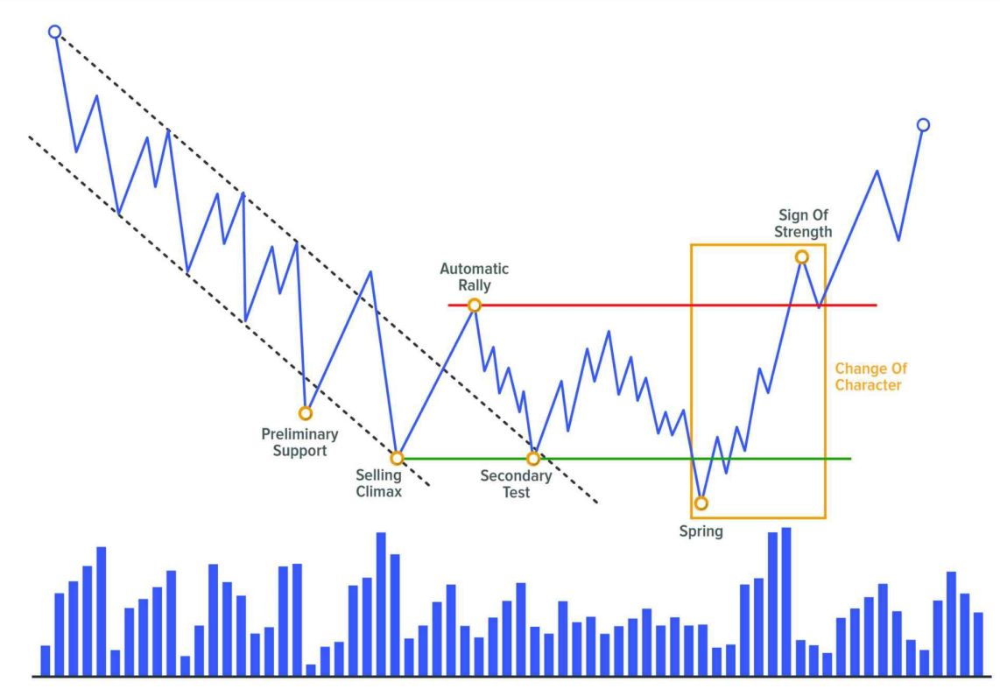
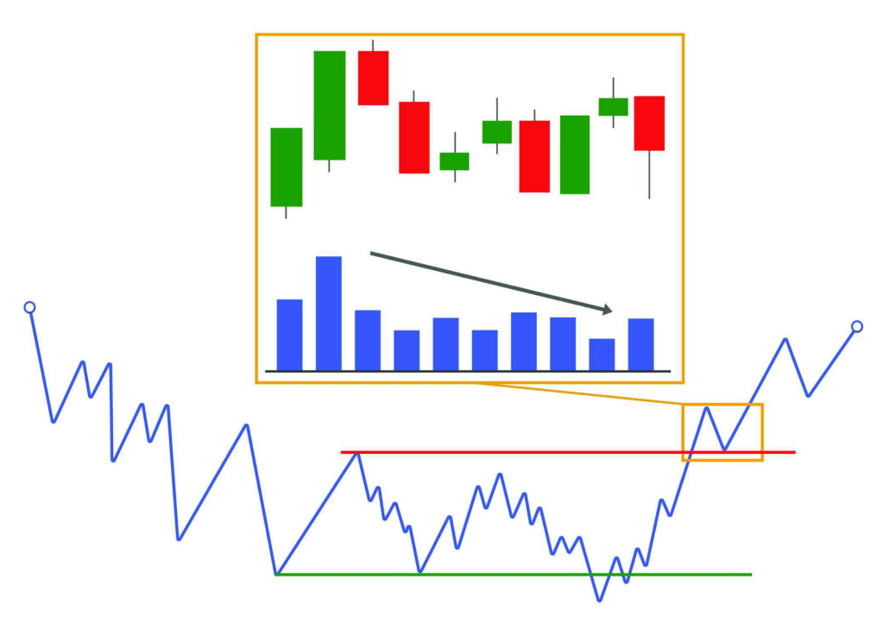
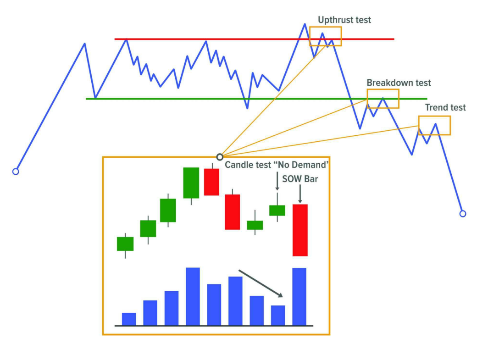

## **EVENT #6: BREAKOUT**

Sau sự kiện kiểm tra Phase C (shock hoặc LPS), giá sẽ phát triển một chuyển động xu hướng theo hướng ít kháng cự nhất.

Các nhà giao dịch chuyên nghiệp lớn đã hấp thụ toàn bộ lượng stock họ cần cho vị thế của mình và đã xác minh (thông qua Shake và bài kiểm tra) rằng họ sẽ không gặp nhiều kháng cự trong việc đẩy giá theo hướng có lợi cho họ.

Thị trường đang ở trạng thái mất cân bằng, điều này dẫn đến một chuyển động mạnh mẽ phá vỡ cấu trúc, bắt đầu sự phát triển của nguyên nhân đã được xây dựng trước đó.

---

### **BREAKOUT KHÔNG PHẢI LÀ CƠ HỘI GIAO DỊCH**

Chuyển động breakout này không phải là một cơ hội giao dịch; nó chỉ cảnh báo chúng ta về một cơ hội có thể xảy ra trong tương lai gần. Cơ hội này nằm ở hành động ngay sau đó, trong bài kiểm tra xác nhận (confirmation test).

---

### **CHANGE OF CHARACTER (ChoCh)**

Đây là **Change of Character (ChoCh)** thứ hai trong cấu trúc. Chúng ta nhớ rằng lần đầu tiên xảy ra với **Reaction Event #2**, khi thị trường chuyển từ trạng thái xu hướng sang bối cảnh range.

Lần này, ChoCh mới này thay đổi bối cảnh của thị trường, kết thúc sự đi ngang của giá và bắt đầu một Phase xu hướng mới.

#### Đặc điểm của ChoCh

- **ChoCh không chỉ là một chuyển động mạnh mẽ**; nó bao gồm hai sự kiện: một chuyển động mạnh và một sự thoái lui nhẹ. Tập hợp này tạo thành ChoCh.
- Change of Character được xác định từ điểm bắt đầu của Phase C cho đến khi kết thúc Phase D.

---

### **CÁCH BREAKOUT XUẤT HIỆN TRÊN BIỂU ĐỒ**

Chúng ta đang ở trong một môi trường có tốc độ cao, điều này khiến chuyển động phát triển thông qua các cây nến mà ở đó có sự gia tăng tương đối về biên độ giá cũng như sự gia tăng về volume.

#### Đặc điểm của breakout

- Chuyển động này sẽ phá vỡ các mức thanh khoản trước đó một cách trôi chảy, thể hiện đà mạnh mẽ.
- Đây là biểu hiện của sự mất cân bằng thị trường và sự quyết liệt được thể hiện bởi các trader.

---

### **BREAKOUT KHÔNG CÓ VOLUME**

Thông thường, các cú phá vỡ (rupture) nên xảy ra với sự gia tăng volume. Tuy nhiên, đôi khi chúng ta có thể thấy các cú phá vỡ mà không có sự gia tăng volume đặc biệt cao. Điều này cho thấy lượng stock còn lại sẵn có là rất thấp, và do đó các trader kiểm soát thị trường sẽ không cần nỗ lực đặc biệt để dễ dàng đẩy giá.

#### Ví dụ về breakout tăng giá

- Nếu chúng ta thấy rằng breakout xảy ra với các cây nến có biên độ hẹp và volume ở mức trung bình, ban đầu chúng ta nên thận trọng với ý định của nó.
- Tuy nhiên, điều có thể xảy ra là lượng cung nổi (floating supply) rất ít, tức là có rất ít trader sẵn sàng bán. Vì vậy, sự vắng mặt của người bán kết hợp với sự quyết liệt vừa phải từ phía người mua có thể dẫn đến một cú phá vỡ tăng giá mà không cần volume tương đối cao.

---

### **CÁC YẾU TỐ CHÌA KHÓA TRONG SỰ KIỆN BREAKOUT**

Đây là một thời điểm quan trọng vì chúng ta có thể đang đối mặt với một sự kiện shaking tiềm năng. Do đó, điều cần thiết là phải đánh giá cẩn thận hành động giá và volume sau cú phá vỡ. Để làm điều này, chúng ta có thể dựa vào một số gợi ý:

#### 1. KHÔNG TÁI NHẬP NGAY VÀO VÙNG RANGE

- Đây là dấu hiệu đáng tin cậy nhất về ý định của cú phá vỡ.  
- Chúng ta sẽ tìm kiếm một cú phá vỡ hiệu quả có thể giữ được bên ngoài vùng range và không thất bại trong việc cố gắng quay lại vùng cân bằng.

Ngoài việc quan sát rằng chuyển động đi kèm với sự gia tăng biên độ giá và volume, và rằng nó phá vỡ các vùng kiểm soát trước đó (các đỉnh và đáy trước đó, hoặc minor Creek), dấu hiệu mạnh mẽ nhất để đánh giá breakout là thật sự là giá giữ được bên ngoài vùng range.

Điều này cho thấy không còn sự quan tâm ở mức giá thấp hơn và xác nhận rằng chuyển động đang được hỗ trợ bởi các big traders.

#### 2. BIỂU HIỆN CỦA LACK OF INTEREST

- Một dấu hiệu khác củng cố cú phá vỡ hiệu quả là quan sát các cây nến không có ý định rõ ràng sau đó: biên độ hẹp, đan xen và có volume nhỏ hơn so với chuyển động phá vỡ.

#### 3. KHOẢNG CÁCH CỦA CÚ PHÁ VỠ

- Khoảng cách mà giá di chuyển cũng có thể là một dấu hiệu cần xem xét.  
- Mặc dù không có khoảng cách được xác định trước, nhưng khoảng cách nên rõ ràng. Nói cách khác, cú phá vỡ mà di chuyển được một khoảng cách đáng kể khỏi cấu trúc sẽ mang lại sự tự tin lớn hơn.

---

### **BREAKOUT KHÔNG ĐẠI DIỆN CHO CƠ HỘI GIAO DỊCH**

Về mặt hoạt động, hành động này không đại diện cho một cơ hội giao dịch. Điều này chủ yếu là vì nó nằm trong một khu vực nhạy cảm, nơi một lượng lớn lệnh giao dịch chéo sẽ diễn ra và có thể thay đổi quyền kiểm soát thị trường.

Những gì ban đầu có vẻ là một cú phá vỡ hiệu quả có thể biến thành một cú Shake. Và đây là lý do tại sao việc chờ đợi bài kiểm tra tiếp theo để xác nhận hành động là hợp lý hơn.

---

### **SIGN OF STRENGTH (SOS)**

**Sign of Strength (SOS)** là một chuyển động tăng giá bắt nguồn từ đáy của Phase C (Spring hoặc LPS) và dẫn đến việc phá vỡ phần trên của range (Creek).

#### Đặc điểm của SOS

- Chuyển động này tạo ra **Change of Character (ChoCh)** trước khi bắt đầu xu hướng tăng bên ngoài range.
- Sau đó, giá sẽ thoái lui về Creek đã bị phá vỡ để tạo ra hành động **BackUp to the Edge of the Creek (BUEC)**.  
  ➤ Nếu giá không giữ được trên khu vực này và quay trở lại range, sự kiện sẽ được coi là **Upthrust (UT)**.

#### Ý nghĩa của SOS

- Một dấu hiệu sức mạnh lớn cho thấy sự **khẩn cấp của các tổ chức** trong việc tham gia thị trường.  
- Họ rất lạc quan (bullish) và mua vào một cách quyết liệt.

#### Cách nhận biết SOS

- Chúng ta muốn thấy chuyển động tăng giá có sự **dễ dàng di chuyển** (ease of movement) và đạt đến điểm giữa của range.  
- Ngoài ra, bất kỳ sự thoái lui nào cũng nên giữ trên đáy của Spring để thể hiện sức mạnh.

---

### **MINOR SOS**

Trong trường hợp chuyển động tăng giá không phá vỡ được cấu trúc, chuyển động này sẽ được gán nhãn là **Minor Sign of Strength (mSOS)**.

#### Khi nào mSOS xuất hiện?

- Nếu trong Phase B, chúng ta quan sát thấy một chuyển động có các đặc điểm của SOS, sự kiện này cũng có thể được gán nhãn là **mSOS**.

---

### **SIGN OF STRENGTH BAR**

**Sign of Strength Bar** là một cây nến tăng giá với:

- Biên độ rộng,
- Đóng cửa ở mức cao,
- Và volume tăng.  

Ngoài ra, nó cũng có thể được nhận diện qua một **bullish gap**.

#### Ý nghĩa của SOS Bar

- Nó cho thấy sự hiện diện của **cầu mạnh mẽ và chất lượng**. Đây là điểm mua của các tổ chức lớn.

#### Cách sử dụng SOS Bar

- Nó có thể được sử dụng như một **tín hiệu kích hoạt vào lệnh**.  
- Nếu trong khu vực giao dịch (sau một cú Shake, sau một cú Breakout hoặc trong xu hướng), chúng ta quan sát thấy một **Strength Bar**, đây là dấu hiệu rõ ràng rằng các nhà giao dịch lớn đang hỗ trợ chuyển động tăng giá và cung cấp cho chúng ta một cơ hội tốt để tham gia lệnh mua (long).

---

### **SIGN OF WEAKNESS (SOW)**

**Major Sign of Weakness (MSOW)** là một chuyển động giảm giá mạnh bắt nguồn từ đỉnh của Phase C (UTAD hoặc LPSY) và dẫn đến việc phá vỡ phần dưới của range (ICE), bắt đầu một xu hướng giảm mới.

#### Đặc điểm của MSOW

- Đây có thể là lần thử thứ hai, thứ ba hoặc thứ tư để phá vỡ ICE, và đây là lần thành công nhất.

#### Cách nhận biết MSOW

- Chúng ta muốn thấy chuyển động giảm giá có sự **dễ dàng di chuyển**, bao phủ một khoảng cách tương đối dài và ít nhất đạt đến điểm giữa của cấu trúc.  
- Ngoài ra, bất kỳ sự thoái lui nào cũng không nên đạt đến đỉnh được thiết lập bởi UTAD.

---

### **MINOR SOW**

Nếu sau sự kiện kiểm tra trong Phase C, chuyển động yếu này không thể phá vỡ cấu trúc, chúng ta sẽ gán nhãn nó là **Minor Sign of Weakness (mSOW)**.

#### Khi nào mSOW xuất hiện?

- Đây là một dấu hiệu yếu kém nhỏ.  
- Chúng ta cũng có thể gán nhãn như vậy cho bất kỳ chuyển động nào trong Phase B đáp ứng các đặc điểm về giá và volume.

---

### **SIGN OF WEAKNESS BAR**

**Sign of Weakness Bar** là một cây nến giảm giá với:

- Sự gia tăng tương đối về biên độ giá và volume,
- Và đóng cửa ở mức thấp trong phạm vi cây nến.  

Ngoài ra, nó cũng có thể được nhận diện qua một **bearish gap**.

#### Ý nghĩa của SOW Bar

- Nó báo hiệu sự quyết liệt của bên bán và do đó là một **điểm bán chuyên nghiệp**.

#### Cách sử dụng SOW Bar

- SOW Bar có thể được sử dụng như một **tín hiệu kích hoạt vào lệnh bán**.  
- Nếu trong khu vực giao dịch (sau một cú Shake, sau một cú Breakout hoặc trong xu hướng), chúng ta quan sát thấy một **Weakness Bar**, đây là dấu hiệu rõ ràng rằng các nhà giao dịch lớn đang hỗ trợ chuyển động giảm giá và cung cấp cho chúng ta một cơ hội tốt để bán khống (short).
