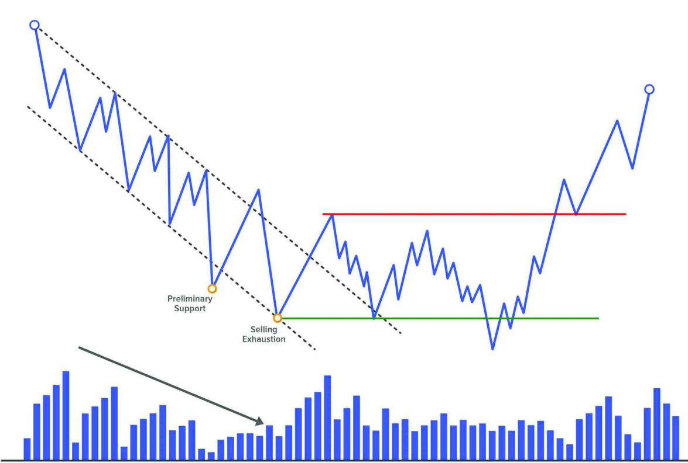
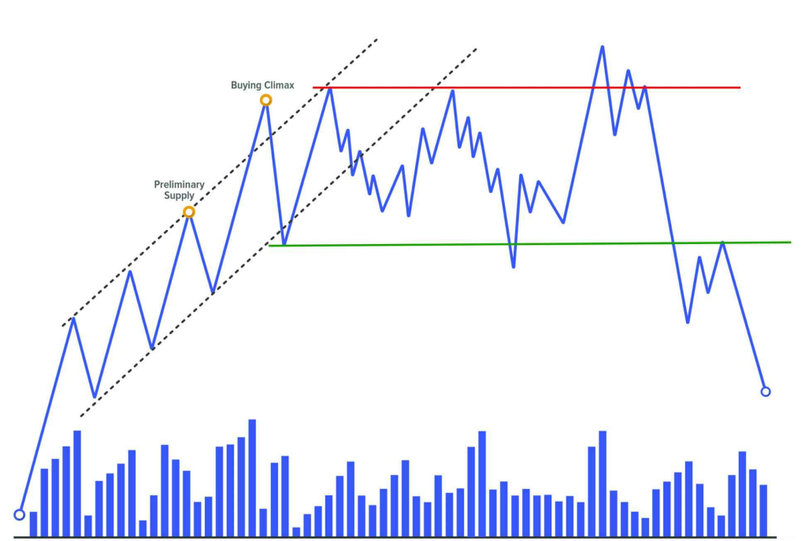
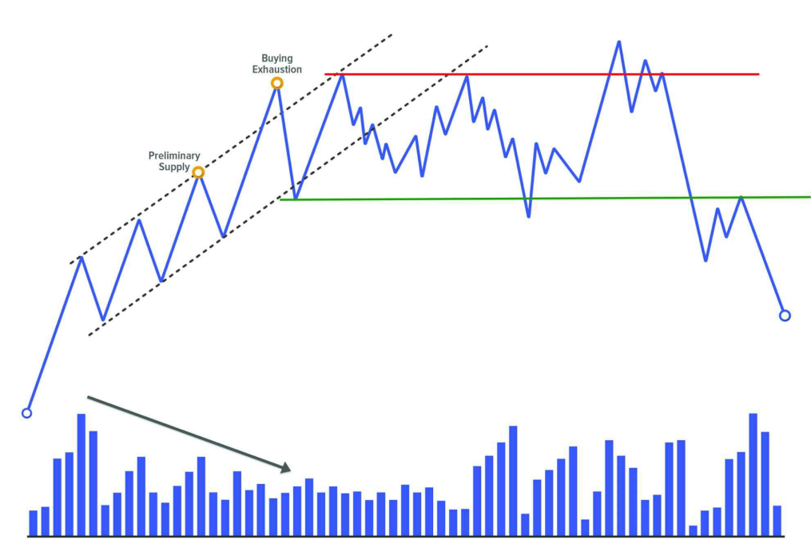

# EVENT #2: CLIMAX

Đây là sự kiện thứ hai trong phương pháp Wyckoff, xuất hiện **sau nỗ lực dừng xu hướng của sự kiện Preliminary Support hoặc Preliminary Supply**.

Trong các mô hình Accumulation, sự kiện này được gọi là **Selling Climax (SC)**, còn trong các mô hình Distribution, nó được gọi là **Buying Climax (BC)**.

Sau khi xuất hiện volume lớn trong một xu hướng kéo dài (dấu hiệu tiềm năng của sự dừng lại), chúng ta bắt đầu chú ý đến khả năng xác định sự kiện Climax này. Đây là một trong những điểm mạnh nhất của phương pháp Wyckoff: nó cung cấp cho ta một **ngữ cảnh thị trường rõ ràng** – ta biết mình đang tìm kiếm điều gì.

Tuy nhiên, cần lưu ý rằng **không phải lúc nào sự kiện Preliminary Support hoặc Preliminary Supply cũng xuất hiện trong chuỗi sự kiện**, và đôi khi chức năng đó có thể được thực hiện ngay bởi chính sự kiện Climax. Do đó, ta cần tiếp cận thị trường với tính linh hoạt cao – **có khung lý thuyết, nhưng không nên cưỡng ép thị trường phải tuân theo hoàn toàn bản đồ của ta**. Chìa khóa để xác định đây có thực sự là Climax hay không, **nằm ở hành động giá sau đó**: chúng ta cần quan sát **Automatic Rally/Reaction (Event #3)** và **Secondary Test (Event #4)** để xác nhận Phase A đã hoàn tất và xu hướng đã dừng lại.

---

## ĐẶC ĐIỂM CỦA CLIMAX

Sau sự kiện Climax, có thể xảy ra hai kịch bản:

1. Xuất hiện phản ứng rõ ràng (Automatic Rally/Reaction), sau đó là Secondary Test.
2. Hoặc, giá chuyển sang trạng thái đi ngang – thường là dấu hiệu xu hướng tiếp tục.

Điều quan trọng cần nhớ là: **Climax cần được kiểm tra lại (Test) để xác nhận** – thông qua Secondary Test. Khi volume ở lần kiểm tra thấp hơn nhiều so với Climax ban đầu, điều đó cho thấy áp lực bán/mua đã giảm – gọi là **No Supply** hoặc **No Demand** trong cách tiếp cận Volume Spread Analysis (VSA).

Cũng cần nhấn mạnh rằng: **Climax không nhất thiết là điểm cực đại cuối cùng của cấu trúc**. Trong suốt quá trình phát triển của cấu trúc, chúng ta có thể quan sát thấy nhiều lần kiểm tra (failed attempts) trong Phase B, cũng như một Test quan trọng ở Phase C (Spring/UTAD) – những cú Shake cuối cùng trước khi bắt đầu xu hướng chính.

---

## CÁCH CLIMAX XUẤT HIỆN TRÊN BIỂU ĐỒ

Dù về mặt nguyên tắc thì không thay đổi, Climax có thể **hiện diện dưới nhiều hình thức** về hành động giá và volume:

- Một cây nến lớn với biên độ rộng và volume đột biến.
- Một chuỗi nến nhỏ với volume cao và đều.
- Một cây nến có volume lớn với bóng dài (wick) phía dưới hoặc phía trên.

Tất cả đều nói lên cùng một điều: **sự xuất hiện rõ ràng của lực mua hoặc bán từ các professional trader**.

Cho dù Climax có hình thức nào, khi chúng ta thấy phản ứng rõ rệt (Automatic Rally/Reaction) và Secondary Test, thì **chúng ta có thể xác định chắc chắn rằng chuyển động trước đó chính là Climax**.

---

## TÂM LÝ PHÍA SAU CLIMAX

Bản chất của thị trường là: để có người bán, phải có người mua (và ngược lại). Vậy ai đang làm vai trò đối tác trong Climax?

Câu trả lời hợp lý là: **chính professional trader đang là người hấp thụ toàn bộ lực bán/mua**.

Tại thời điểm đó, họ đánh giá rằng thị trường đã bị kéo dài quá mức (overextended) và bắt đầu một chiến dịch hấp thụ cổ phiếu (stock accumulation) hoặc phân phối (distribution).

Vậy điều gì khiến các trader thiếu thông tin (weak hands) cung cấp thanh khoản?

Hãy quay lại ba nhóm đối tượng đã được đề cập trong Preliminary Stop:

| Nhóm | Hành vi |
|------|---------|
| **The greedy** | Thấy Climax mạnh → vào lệnh vì sợ bỏ lỡ “cơ hội”. |
| **The fearful** | Giữ lệnh thua lỗ quá lâu, đến giới hạn tâm lý → đóng lệnh để tránh lỗ thêm. |
| **The smart ones** | Cố gắng đoán đỉnh/đáy, vào lệnh sớm → bị đá stop-loss. |

---

## TÁC DỤNG CỦA VIỆC XÁC ĐỊNH CLIMAX

Việc xác định đúng sự kiện Climax cực kỳ quan trọng vì:

- Nó cho biết **sự tham gia của tay to** – tức là một hành động được hỗ trợ bởi lực thực sự.
- Nó **báo hiệu kết thúc chuyển động theo xu hướng trước đó**.

Từ đó, chúng ta rút ra được hai ý chính:

1. **Ngừng giao dịch theo xu hướng trước**. Chỉ tiếp tục nếu cấu trúc cho thấy dấu hiệu tiếp diễn (continuation).
2. **Đây là cơ hội chốt lời cuối cùng nếu bạn còn đang nắm giữ vị thế**.

❗ Không nên mở vị thế mới tại đây, vì rủi ro quá cao. Tuy nhiên, một số trader Wyckoff có kinh nghiệm có thể tận dụng Climax để thực hiện các lệnh ngắn hạn trong cú bật phản ứng đến Event #3 (AR).

---

## SELLING CLIMAX

**Selling Climax** rất giống với Preliminary Support về mặt tâm lý và hình thức thể hiện. Nhưng SC là sự kiện quyết định, xuất hiện sau PS, và đánh dấu phần đáy của cấu trúc tích lũy.

Sau một xu hướng giảm dài, được hỗ trợ bởi tin tức tiêu cực, thị trường rơi mạnh → giá trở nên hấp dẫn với smart money → professional trader bắt đầu mua tích lũy ở các mức thấp.

SC thường đi kèm với:

- Volume cực lớn
- Biên độ giá giãn mạnh
- Tin tức rất xấu

SC là sự kiện thứ hai trong Phase A của xu hướng giảm, xuất hiện sau Preliminary Support.

---

## THE SELLING CLIMAX OF EXHAUSTION

Không phải xu hướng giảm nào cũng kết thúc bằng volume đỉnh điểm. Đôi khi, xu hướng kết thúc **do lực bán tự nhiên cạn kiệt** – gọi là **Selling Exhaustion**.

### Dấu hiệu

- Volume trung bình hoặc thấp
- Nến nhỏ, biên độ hẹp
- Không có biểu hiện Climax rõ ràng

### Tâm lý

- Người bán bắt đầu **mất hứng thú với việc đẩy giá xuống thấp hơn**
- Một số chốt lời từ các lệnh short → hỗ trợ giá

Selling Exhaustion thể hiện rõ nhất khi:

- Có nhiều Preliminary Support xuất hiện liên tiếp, ngày càng thấp
- Volume tổng thể giảm dần theo thời gian

⛔ Mặc dù không có Climax rõ ràng, Wyckoff vẫn gán nhãn điểm đó là SC vì chức năng của nó tương đương.  
Tuy nhiên, một số tác giả đề xuất nên **tạo sự kiện mới tên là “Selling Exhaustion”** để phân biệt với SC truyền thống.

---

## BUYING CLIMAX

**Buying Climax** là tín hiệu mạnh cho thấy thị trường đang mất lực tăng.

Sau một xu hướng tăng dài, được hỗ trợ bởi tin tức tích cực và tâm lý hưng phấn của trader thiếu kinh nghiệm, giá bật mạnh lần cuối → professional trader tranh thủ **bán ra toàn bộ vị thế và bắt đầu bán khống**.

Buying Climax là sự kiện thứ hai trong Phase A của xu hướng tăng, xuất hiện sau Preliminary Supply.

Tâm lý lúc này:

- Trader thiếu kinh nghiệm thấy giá tăng mạnh → đua mua
- Trader chuyên nghiệp thấy thị trường quá nóng → bán ra, thậm chí vào short

Về biểu hiện, Buying Climax có thể giống hệt Preliminary Supply. Sự khác biệt là: **Preliminary Supply không dừng được xu hướng, còn BC thì có**.

---

## THE BUYING CLIMAX OF EXHAUSTION

Tương tự như bên SC, không phải mọi xu hướng tăng đều kết thúc bằng một Buying Climax volume lớn.

Trong nhiều trường hợp, giá kết thúc xu hướng tăng do lực mua **cạn dần theo thời gian** – gọi là **Buying Exhaustion**.

### Dấu hiệu

- Volume giảm
- Nến nhỏ, biên độ hẹp
- Giá tăng chậm, không còn mạnh như trước

### Tâm lý

- Người mua dần chốt lời
- Không còn nhu cầu mua mới → giá dần yếu

Buying Exhaustion dễ nhận biết qua:

- Nhiều Preliminary Supply xuất hiện
- Volume tổng thể giảm trong khi giá vẫn tăng nhẹ.

---
