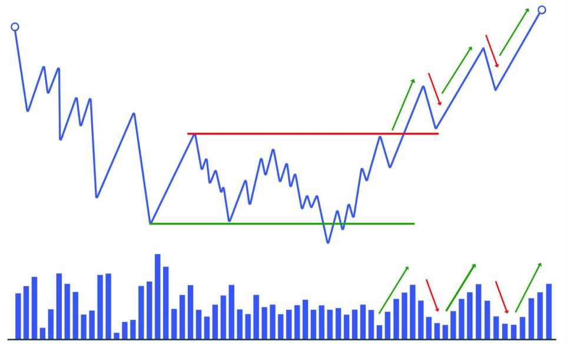
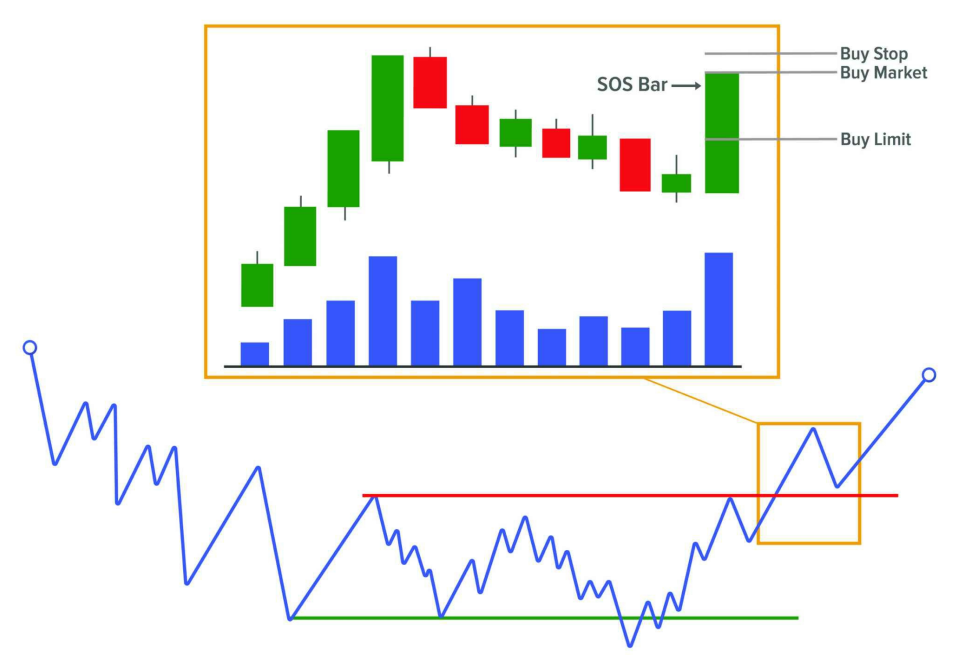
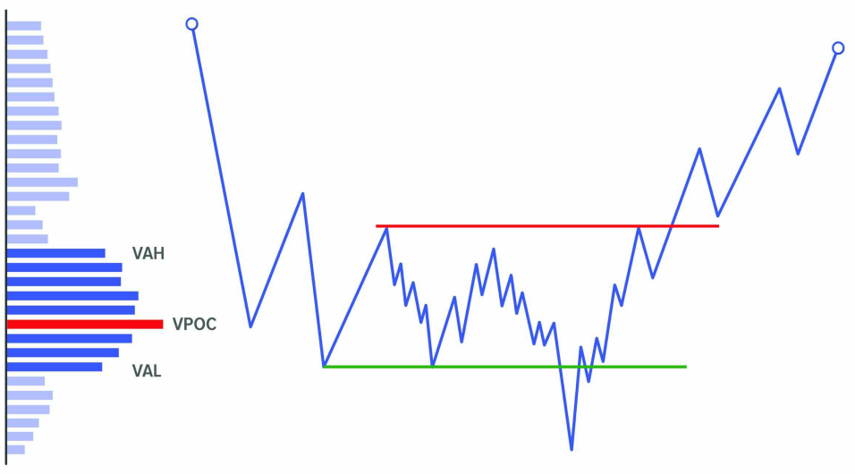
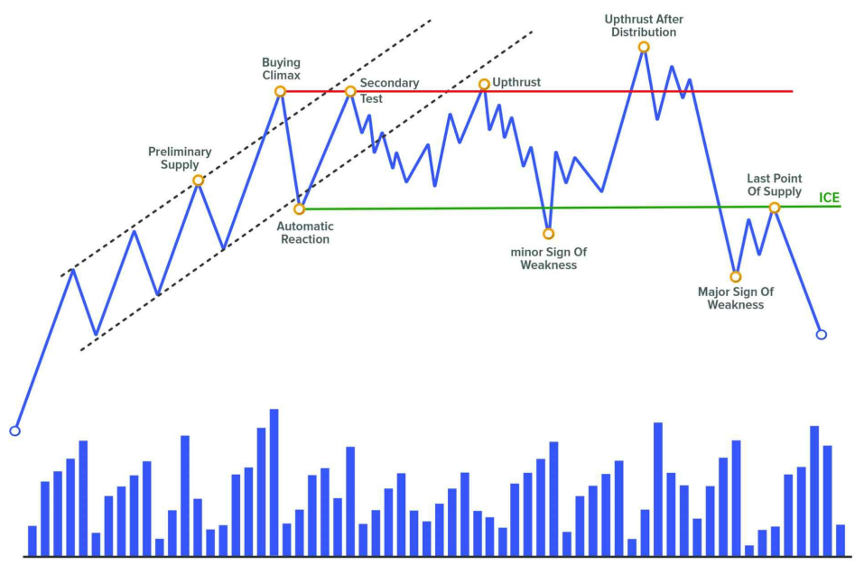

## EVENT #7: CONFIRMATION

Khi sự kiện breakout xảy ra, đó mới chỉ là một **breakout tiềm năng**, vì sự **xác nhận (confirmation)** sẽ đến từ chính **test** của nó. Cũng giống như các sự kiện Shake, những **Sign of Strength (SOS)** hoặc **Sign Of Weakness (SOW)** đều cần phải được kiểm chứng.

Nếu chúng ta có một **test thành công**, khi đó chúng ta có thể gán nhãn chuyển động trước đó với độ tin cậy cao hơn và chuyển động test sau đó sẽ được gọi là **sự kiện xác nhận (confirmation event)**. Nói cách khác, chính test này sẽ xác nhận liệu chúng ta đang thực sự đối mặt với một chuyển động có chủ đích hay không.

Trong phương pháp luận, nếu chuyển động breakout tăng được gán nhãn là **Sign of Strength (SOS)** hoặc **Jump Across the Creek (JAC)**, thì chuyển động hồi lại xác nhận breakout đó được gọi là **Last Point of Support (LPS)** hoặc **Back Up to the Edge of the Creek (BUEC)**.

Trong ví dụ bearish, chuyển động breakout gây ra một **Sign of Weakness (SOW)** và chuyển động hồi lại để xác nhận nó sẽ được gán nhãn là **Last Point of Supply (LPSY)** hoặc **Fall Through the Ice (FTI)** – mặc dù thuật ngữ này ít phổ biến hơn. Chúng ta nhớ rằng **Ice** là vùng hỗ trợ trong cấu trúc, và thuật ngữ này lấy từ phép ẩn dụ tương tự như **Creek**.

### Làm sao biết khi nào có thể chờ confirmation?

Rõ ràng, chúng ta không thể biết chắc chắn. Việc này là để cộng thêm các **manh mối (clues)** giúp tăng xác suất rằng một kịch bản cụ thể sẽ xảy ra thay vì kịch bản ngược lại. Trong trường hợp này, để chờ confirmation, trước tiên ta muốn thấy:

- Giá tạo một chuyển động đẩy mạnh (**impulsive move**), được minh chứng bởi sự **mở rộng trong biên độ giá** và **gia tăng khối lượng giao dịch (volume)**.
- Ở thời điểm đó, kịch bản chính nên là: chờ một chuyển động hồi lại (**pullback**) để tìm cơ hội vào lệnh.

---

### CONFIRMATION xuất hiện thế nào trên biểu đồ?

Như đã đề cập, đây là thời điểm nhạy cảm nhất vì ta đang xét xem đó có phải là **breakout thật** hay chỉ là một **Shakeout**.

Chúng ta nên xem lại chương trước – nơi đề cập đến các **điểm then chốt của breakout** – vì ở confirmation, ta cũng muốn thấy chính xác các điều đó xảy ra:

- Giá di chuyển một khoảng đáng kể trong chuyển động breakout.
- Chuyển động test được thực hiện bởi các nến **hẹp biên độ**, **gối đầu** nhau, và có **khối lượng thấp**.
- Giá **không quay lại trong range**.

Đây là hành vi tự nhiên của mọi chuyển động theo xu hướng: chuyển động **impulse** thể hiện chủ đích, và chuyển động **correction** cho thấy sự thiếu quan tâm.

---

### Tín hiệu cảnh báo sau breakout

Nếu có **khối lượng cao bất thường** trong quá trình test xác nhận, tốt nhất là bạn nên thận trọng vì điều đó cho thấy **vẫn còn lực cản tiềm tàng** ở phía đối diện.

Và như ta đã biết, trader lớn sẽ không khởi động một cú move lớn cho đến khi chắc chắn rằng con đường đã **sạch bóng lực cản**. Do đó, nếu volume test cao, hãy chờ thêm các test kế tiếp quanh vùng đó.

Nếu chuyển động hồi lại có biên độ rộng và volume cao, khả năng lớn là cú breakout đầu tiên chỉ là một **Shakeout**, và giá sẽ quay trở lại trong range.

---

### Cơ hội giao dịch

Sự kiện confirmation thường xuất hiện tại **vị trí lý tưởng** để vào lệnh hoặc **thêm lệnh vào vị thế mở**.

Ban đầu, đây chính là vị trí yêu thích của Richard Wyckoff để vào thị trường, vì khi đó ta đã có đầy đủ “price action bên trái” để thấy được **nỗ lực của các nhà chuyên nghiệp** thực hiện chiến dịch **accumulation hoặc distribution** – cung cấp một entry có **rủi ro tương đối thấp**.

**Để mua:**

- Chờ xuất hiện **nến mạnh (SOSbar)** rồi:
  - Vào lệnh trực tiếp theo giá thị trường, hoặc
  - Đặt lệnh stop tại đỉnh của nến đó, hoặc
  - Đặt limit order tại một mức giá chờ hồi lại.
- Stop Loss nên được đặt hoặc dời về dưới vùng **Last Point of Support** và đường **Creek** đã bị phá vỡ.

**Để bán:**

- Chờ xuất hiện **nến yếu (SOWbar)** và sử dụng kiểu lệnh phù hợp với cá tính giao dịch của bạn.
- Stop Loss nên đặt trên vùng **Last Point of Supply** và đường **Ice** đã bị phá vỡ.

---

### Định lượng trigger vào lệnh

Điểm yếu lớn nhất của các phương pháp thiên về **discretionary** là tính **chủ quan**. Điều này đặc biệt đúng với phương pháp Wyckoff – dù có logic rất rõ ràng – nhưng dễ trở thành vô dụng nếu rơi vào tay người không thể kiểm soát được cảm xúc.

Một giải pháp là cố gắng **định lượng hóa các trigger vào lệnh** – một hành động đơn giản giúp tăng **tính khách quan** trong chiến lược.

Ví dụ:

- Nếu bạn chỉ sử dụng **price action**, bạn có thể định lượng một mô hình đơn giản như: nến giảm + nến tăng kế tiếp.
- Sau đó nâng cao: ví dụ thêm điều kiện MA nằm dưới, nến tăng phải lớn hơn bao nhiêu pip, chỉ vào khi nến tăng phá đỉnh nến giảm v.v.

Nếu bạn dùng thêm công cụ volume như **POC, VAH, VAL, VWAP** hoặc **Delta**, bạn có thể bổ sung thêm điều kiện như: chỉ vào khi giá nằm trên VWAP và nến tăng có Delta lớn v.v.

Điều này yêu cầu nhiều công sức – nếu bạn không biết lập trình – vì phải kiểm tra thủ công hoặc backtest bằng tay. Nhưng đây là cách duy nhất để tăng tính khách quan.

---

### LAST POINT OF SUPPORT (LPS)

**LPS** là hành động ngay trước một cú **Sign of Strength (SOS)**. Đây là nỗ lực của bên bán đẩy giá xuống nhưng thất bại khi người mua vào mạnh mẽ, tạo ra một **impulse tăng mới**.

Các loại LPS:

- **LPS sau Shake**: nếu giá vừa trải qua Spring hoặc Shakeout, LPS chính là **test** của các sự kiện đó.
- **LPS trong range**: sau một cú SOS, LPS sẽ xuất hiện ở pha hồi giá.
- **LPS ngoài range**: bao gồm **BUEC** (test sau breakout) và các pha hồi trong xu hướng tăng ngoài range.

LPS là điểm chặn rơi cuối cùng của lực cầu trước khi giá tạo một **higher low** và tiếp tục tăng. Những trader thiếu kinh nghiệm thường mua vào trong lúc giá đang tạo SOS – điều này không tối ưu. **LPS là điểm vào hợp lý hơn nhiều.**

---

### LAST POINT OF SUPPLY (LPSY)

**LPSY** là hành động ngay trước một cú **Sign of Weakness (SOW)**. Đây là một nỗ lực đẩy giá lên nhưng bị ngăn cản bởi các nhà bán lớn – họ đã mở short từ trước và nay tiếp tục bảo vệ vị thế.

Các loại LPSY:

- **LPSY sau Shake**: nếu giá vừa trải qua Upthrust After Distribution, LPSY là test của sự kiện đó.
- **LPSY trong range**: sau một cú SOW, LPSY sẽ nằm trong đợt hồi tăng.
- **LPSY ngoài range**: bao gồm **FTI** (test sau breakout) và các đợt hồi giá trong xu hướng giảm ngoài range.

Sau khi phá vỡ Ice với một cú SOW, ta muốn thấy một cú hồi **hẹp biên độ**, volume thấp, giá khó tăng tiếp – điều này tăng xác suất là LPSY.

Tuy nhiên, nếu volume test cao, hãy cẩn trọng vì đó có thể là lực short thêm. LPSY là **điểm rất tốt để bắt đầu hoặc thêm vị thế bán**.

Đôi khi LPSY sẽ xuất hiện ở vùng giá từng có Preliminary Supply – nơi quá trình phân phối đã bắt đầu.

---