# 📘 **EVENTS**

---

## 🎯 **Mục tiêu của Wyckoff trong việc nhận diện event**

Phương pháp Wyckoff cố gắng **xác định các mẫu logic về sự đảo chiều của giá**, thời điểm mà **quyền kiểm soát thị trường được thiết lập**.

Trong phần này, chúng ta sẽ đi qua **trình tự các event mà giá thường trải qua trong các cấu trúc tích lũy và phân phối**. Dù có nhiều trader áp dụng khác nhau, theo quan điểm tác giả, **nên tiếp cận các event này một cách linh hoạt**, thực tiễn thay vì quá cứng nhắc.

---

## 🔄 **Event giống nhau cho cả tích lũy và phân phối**

Các event mà Wyckoff liệt kê **áp dụng cho cả hai chiều: tăng (accumulation) và giảm (distribution)**.  
Điểm khác biệt đôi khi chỉ là tên gọi, **nhưng bản chất logic phía sau thì hoàn toàn giống nhau**.

Dưới đây là **danh sách các event chính**, sau đó mỗi event sẽ được mô tả chi tiết hơn với ví dụ cho cả xu hướng tăng và xu hướng giảm.

---

## **EVENT #1: PRELIMINARY STOP**

Đây là sự kiện đầu tiên trong phương pháp Wyckoff, xuất hiện để bắt đầu Phase A – giai đoạn dừng lại của xu hướng trước đó.

Trong các mô hình Accumulation, sự kiện này được gọi là **Preliminary Support (PS)**, kết hợp với **Selling Climax (SC)**, **Automatic Rally (AR)** và **Secondary Test (ST)** tạo ra một sự thay đổi đặc tính (Change of Character), khiến giá chuyển từ môi trường xu hướng giảm sang môi trường đi ngang.

Trong các mô hình Distribution, sự kiện này được gọi là **Preliminary Supply (PSY)**, và kết hợp với **Buying Climax (BC)**, **AR**, và **ST**, đánh dấu kết thúc Phase A, chấm dứt xu hướng tăng trước đó và khởi đầu Phase B – quá trình xây dựng "cause".

Như ta đã biết, quá trình Accumulation và Distribution cần thời gian, và chỉ trong một số ít trường hợp giá sẽ phát triển theo dạng hypodermic tạo thành mô hình đảo chiều hình chữ V. Quá trình Accumulation thường bắt đầu với sự kiện đầu tiên này: **Preliminary Support**, và tương tự, quá trình Distribution bắt đầu với **Preliminary Supply**.

Trước khi sự kiện này diễn ra, thị trường thường đang trong một xu hướng rõ ràng. Đến một thời điểm nhất định, giá sẽ đạt đến một vùng đủ hấp dẫn để các trader lớn bắt đầu tham gia thị trường một cách chủ động hơn.

---

### CÁCH PRELIMINARY STOP XUẤT HIỆN TRÊN BIỂU ĐỒ

|  |  |
|-------|-------|
|  |  |

Việc quan sát sự kiện này trên biểu đồ thường bị hiểu sai, vì nó **không nhất thiết phải xuất hiện dưới dạng một cây nến có volume tăng mạnh và biên độ giãn rộng**.

Nó cũng có thể thể hiện qua:

- Một chuỗi nến với biên độ hẹp nhưng volume cao và đều,
- Hoặc một cây nến có volume cao và bóng dài.

Tất cả các biểu hiện này đều mang một ý nghĩa: **sự tham gia đáng kể đầu tiên của các trader lớn**.

Hãy nhớ lại một câu nói nổi tiếng từ Tom Williams trong cuốn *Master the Markets*, rằng: *"Thị trường không thích những cây nến có xu hướng mạnh đi kèm với volume tăng đột biến sau một chuyển động kéo dài, vì điều đó thường báo hiệu tâm lý ngược chiều."*

Việc thấy một cây nến giảm mạnh, volume cao, đóng cửa gần đáy sau một đợt giảm dài là một chỉ báo rõ ràng về hoạt động mua từ các professional trader.

Có thể lúc đó giá đã rơi vào tình trạng quá bán trong kênh giá giảm hiện tại.

---

### TÂM LÝ PHÍA SAU PRELIMINARY STOP

Chúng ta hãy cùng phân tích cơ chế khớp lệnh diễn ra trong thời điểm này. Nhớ rằng: để có người mua thì phải có người bán.

Hãy tự hỏi: cả những **trader thiếu thông tin (weak hands)** và **trader chuyên nghiệp (strong hands)** đang làm gì tại thời điểm đó?

Như đã nói, khi thị trường đạt đến vùng giá được xem là "value area" để bắt đầu chiến dịch tích lũy hoặc phân phối, chính các **professional trader** sẽ là người hấp thụ toàn bộ lượng cổ phiếu đang được bán ra. Và đối tác của họ, cung cấp thanh khoản, lại là các **weak hands**.

Chúng ta có thể phân loại các weak hands như sau:

- **The greedy**: những người thấy giá di chuyển đột ngột và nhảy vào vì sợ bỏ lỡ cơ hội.
- **The fearful**: những người đã giữ vị thế thua lỗ trong thời gian dài, sắp hết kiên nhẫn. Khi giá tiếp tục chống lại họ, họ sợ hãi và thoát lệnh.
- **The smart ones**: những người dự đoán đúng xu hướng đảo chiều và đã vào lệnh, nhưng timing không chuẩn nên bị đá stop loss.

---

### Ý NGHĨA VÀ ỨNG DỤNG CỦA PRELIMINARY STOP

Việc xác định đúng sự kiện đầu tiên này mang lại hai lợi ích rõ rệt:

1. **Ngừng ngay việc tiếp tục giao dịch theo xu hướng trước đó**, ít nhất là cho đến khi cấu trúc hiện tại được xác nhận là continuation hay reversal.
2. **Đây là điểm chốt lời lý tưởng** nếu bạn vẫn còn đang giữ vị thế theo xu hướng cũ.

---

### PRELIMINARY SUPPORT

Vì một xu hướng giảm không dừng lại ngay lập tức, nên chúng ta thường thấy **nhiều nỗ lực dừng xu hướng** trước khi thực sự chạm đáy.

Giống như một chiếc xe đang chạy tốc độ cao: ngay cả khi bạn ngừng tăng tốc, xe vẫn tiếp tục trôi do quán tính.

Tất cả các nỗ lực dừng đó được gọi là **Preliminary Support**. Số lần xuất hiện càng nhiều thì khả năng đáy cuối cùng diễn ra **mà không cần volume cực lớn** càng cao.

Việc thấy nhiều Preliminary Support liên tiếp là dấu hiệu cho thấy **professional trader đã dần loại bỏ supply khỏi thị trường**, và khi giá chạm đáy cuối cùng, rất ít người sẵn sàng bán – giá dừng lại do exhaustion thay vì climax.

Chúng ta sẽ phân tích kỹ hơn khi bàn về sự kiện **Selling Climax**.

Trên thực tế, những điểm hỗ trợ như vậy là **Preliminary Support theo chức năng**, vì theo Wyckoff, **Preliminary Support chính thức** là lần dừng kế cuối của xu hướng giảm, còn lần cuối sẽ là **Selling Climax (SC)**.

→ Do đó, nên gán nhãn các điểm này là **Potential Preliminary Support**.

Việc xác nhận PS thực sự sẽ đến khi giá hình thành đủ 4 sự kiện trong Phase A (PS, SC, AR, ST).

Cũng cần lưu ý: sự tham gia của professional trader tại thời điểm này **không có nghĩa giá sẽ đảo chiều ngay**. Như đã đề cập, trong một số điều kiện thị trường, giá có thể phát triển dạng chữ V – tức là tích lũy toàn bộ trong khi vẫn đang giảm mạnh (hypodermic accumulation). Dù ít gặp, nhưng **cần luôn cảnh giác với mô hình này**.

---

### PRELIMINARY SUPPLY

Tương tự PS, **trước khi có Preliminary Supply thực sự**, chúng ta thường thấy một loạt các nỗ lực đẩy giá lên thất bại.

Những nỗ lực đó nên được xem là **Potential Preliminary Supply**.

Việc thấy nhiều Preliminary Supply liên tiếp cho thấy **professional trader đang loại bỏ demand ra khỏi thị trường**, và khi giá chạm đỉnh cuối cùng, **rất ít người còn sẵn sàng mua vào**.

→ Điều này có thể khiến đỉnh cuối cùng xảy ra mà **không cần volume đột biến**.

---

## EVENT #2: CLIMAX

Đây là sự kiện thứ hai trong phương pháp Wyckoff, xuất hiện **sau nỗ lực dừng xu hướng của sự kiện Preliminary Support hoặc Preliminary Supply**.

Trong các mô hình Accumulation, sự kiện này được gọi là **Selling Climax (SC)**, còn trong các mô hình Distribution, nó được gọi là **Buying Climax (BC)**.

Sau khi xuất hiện volume lớn trong một xu hướng kéo dài (dấu hiệu tiềm năng của sự dừng lại), chúng ta bắt đầu chú ý đến khả năng xác định sự kiện Climax này. Đây là một trong những điểm mạnh nhất của phương pháp Wyckoff: nó cung cấp cho ta một **ngữ cảnh thị trường rõ ràng** – ta biết mình đang tìm kiếm điều gì.

Tuy nhiên, cần lưu ý rằng **không phải lúc nào sự kiện Preliminary Support hoặc Preliminary Supply cũng xuất hiện trong chuỗi sự kiện**, và đôi khi chức năng đó có thể được thực hiện ngay bởi chính sự kiện Climax. Do đó, ta cần tiếp cận thị trường với tính linh hoạt cao – **có khung lý thuyết, nhưng không nên cưỡng ép thị trường phải tuân theo hoàn toàn bản đồ của ta**. Chìa khóa để xác định đây có thực sự là Climax hay không, **nằm ở hành động giá sau đó**: chúng ta cần quan sát **Automatic Rally/Reaction (Event #3)** và **Secondary Test (Event #4)** để xác nhận Phase A đã hoàn tất và xu hướng đã dừng lại.

---

### ĐẶC ĐIỂM CỦA CLIMAX

Sau sự kiện Climax, có thể xảy ra hai kịch bản:

1. Xuất hiện phản ứng rõ ràng (Automatic Rally/Reaction), sau đó là Secondary Test.
2. Hoặc, giá chuyển sang trạng thái đi ngang – thường là dấu hiệu xu hướng tiếp tục.

Điều quan trọng cần nhớ là: **Climax cần được kiểm tra lại (Test) để xác nhận** – thông qua Secondary Test. Khi volume ở lần kiểm tra thấp hơn nhiều so với Climax ban đầu, điều đó cho thấy áp lực bán/mua đã giảm – gọi là **No Supply** hoặc **No Demand** trong cách tiếp cận Volume Spread Analysis (VSA).

Cũng cần nhấn mạnh rằng: **Climax không nhất thiết là điểm cực đại cuối cùng của cấu trúc**. Trong suốt quá trình phát triển của cấu trúc, chúng ta có thể quan sát thấy nhiều lần kiểm tra (failed attempts) trong Phase B, cũng như một Test quan trọng ở Phase C (Spring/UTAD) – những cú Shake cuối cùng trước khi bắt đầu xu hướng chính.

---

### CÁCH CLIMAX XUẤT HIỆN TRÊN BIỂU ĐỒ

Dù về mặt nguyên tắc thì không thay đổi, Climax có thể **hiện diện dưới nhiều hình thức** về hành động giá và volume:

- Một cây nến lớn với biên độ rộng và volume đột biến.
- Một chuỗi nến nhỏ với volume cao và đều.
- Một cây nến có volume lớn với bóng dài (wick) phía dưới hoặc phía trên.

Tất cả đều nói lên cùng một điều: **sự xuất hiện rõ ràng của lực mua hoặc bán từ các professional trader**.

Cho dù Climax có hình thức nào, khi chúng ta thấy phản ứng rõ rệt (Automatic Rally/Reaction) và Secondary Test, thì **chúng ta có thể xác định chắc chắn rằng chuyển động trước đó chính là Climax**.

---

### TÂM LÝ PHÍA SAU CLIMAX

Bản chất của thị trường là: để có người bán, phải có người mua (và ngược lại). Vậy ai đang làm vai trò đối tác trong Climax?

Câu trả lời hợp lý là: **chính professional trader đang là người hấp thụ toàn bộ lực bán/mua**.

Tại thời điểm đó, họ đánh giá rằng thị trường đã bị kéo dài quá mức (overextended) và bắt đầu một chiến dịch hấp thụ cổ phiếu (stock accumulation) hoặc phân phối (distribution).

Vậy điều gì khiến các trader thiếu thông tin (weak hands) cung cấp thanh khoản?

Hãy quay lại ba nhóm đối tượng đã được đề cập trong Preliminary Stop:

| Nhóm | Hành vi |
|------|---------|
| **The greedy** | Thấy Climax mạnh → vào lệnh vì sợ bỏ lỡ “cơ hội”. |
| **The fearful** | Giữ lệnh thua lỗ quá lâu, đến giới hạn tâm lý → đóng lệnh để tránh lỗ thêm. |
| **The smart ones** | Cố gắng đoán đỉnh/đáy, vào lệnh sớm → bị đá stop-loss. |

---

### TÁC DỤNG CỦA VIỆC XÁC ĐỊNH CLIMAX

Việc xác định đúng sự kiện Climax cực kỳ quan trọng vì:

- Nó cho biết **sự tham gia của tay to** – tức là một hành động được hỗ trợ bởi lực thực sự.
- Nó **báo hiệu kết thúc chuyển động theo xu hướng trước đó**.

Từ đó, chúng ta rút ra được hai ý chính:

1. **Ngừng giao dịch theo xu hướng trước**. Chỉ tiếp tục nếu cấu trúc cho thấy dấu hiệu tiếp diễn (continuation).
2. **Đây là cơ hội chốt lời cuối cùng nếu bạn còn đang nắm giữ vị thế**.

❗ Không nên mở vị thế mới tại đây, vì rủi ro quá cao. Tuy nhiên, một số trader Wyckoff có kinh nghiệm có thể tận dụng Climax để thực hiện các lệnh ngắn hạn trong cú bật phản ứng đến Event #3 (AR).

---

### SELLING CLIMAX

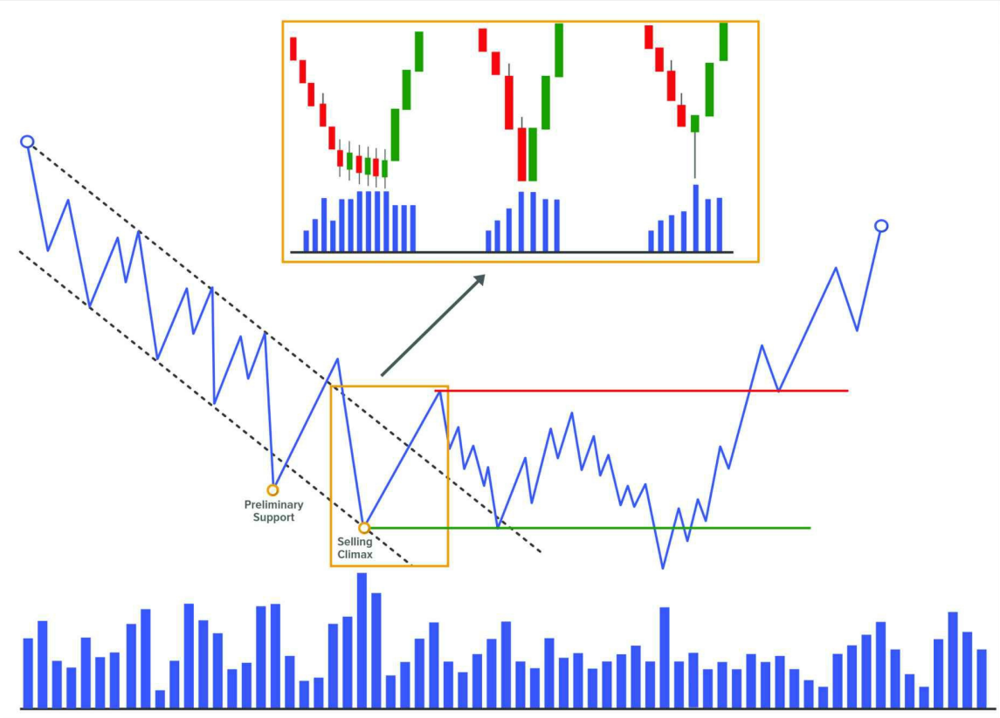

**Selling Climax** rất giống với Preliminary Support về mặt tâm lý và hình thức thể hiện. Nhưng SC là sự kiện quyết định, xuất hiện sau PS, và đánh dấu phần đáy của cấu trúc tích lũy.

Sau một xu hướng giảm dài, được hỗ trợ bởi tin tức tiêu cực, thị trường rơi mạnh → giá trở nên hấp dẫn với smart money → professional trader bắt đầu mua tích lũy ở các mức thấp.

SC thường đi kèm với:

- Volume cực lớn
- Biên độ giá giãn mạnh
- Tin tức rất xấu

SC là sự kiện thứ hai trong Phase A của xu hướng giảm, xuất hiện sau Preliminary Support.

---

### THE SELLING CLIMAX OF EXHAUSTION

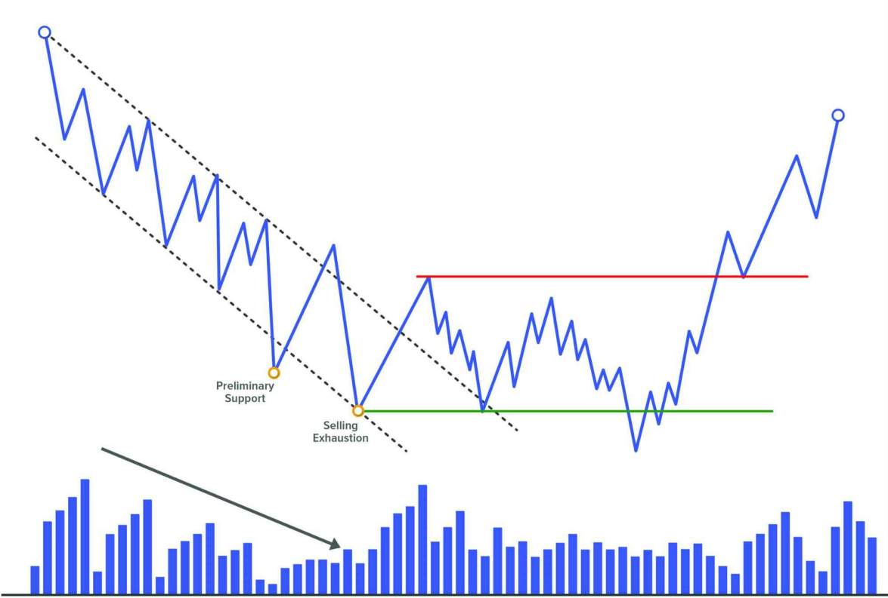

Không phải xu hướng giảm nào cũng kết thúc bằng volume đỉnh điểm. Đôi khi, xu hướng kết thúc **do lực bán tự nhiên cạn kiệt** – gọi là **Selling Exhaustion**.

#### Dấu hiệu

- Volume trung bình hoặc thấp
- Nến nhỏ, biên độ hẹp
- Không có biểu hiện Climax rõ ràng

#### Tâm lý

- Người bán bắt đầu **mất hứng thú với việc đẩy giá xuống thấp hơn**
- Một số chốt lời từ các lệnh short → hỗ trợ giá

Selling Exhaustion thể hiện rõ nhất khi:

- Có nhiều Preliminary Support xuất hiện liên tiếp, ngày càng thấp
- Volume tổng thể giảm dần theo thời gian

⛔ Mặc dù không có Climax rõ ràng, Wyckoff vẫn gán nhãn điểm đó là SC vì chức năng của nó tương đương.  
Tuy nhiên, một số tác giả đề xuất nên **tạo sự kiện mới tên là “Selling Exhaustion”** để phân biệt với SC truyền thống.

---

### BUYING CLIMAX

**Buying Climax** là tín hiệu mạnh cho thấy thị trường đang mất lực tăng.

Sau một xu hướng tăng dài, được hỗ trợ bởi tin tức tích cực và tâm lý hưng phấn của trader thiếu kinh nghiệm, giá bật mạnh lần cuối → professional trader tranh thủ **bán ra toàn bộ vị thế và bắt đầu bán khống**.

Buying Climax là sự kiện thứ hai trong Phase A của xu hướng tăng, xuất hiện sau Preliminary Supply.

Tâm lý lúc này:

- Trader thiếu kinh nghiệm thấy giá tăng mạnh → đua mua
- Trader chuyên nghiệp thấy thị trường quá nóng → bán ra, thậm chí vào short

Về biểu hiện, Buying Climax có thể giống hệt Preliminary Supply. Sự khác biệt là: **Preliminary Supply không dừng được xu hướng, còn BC thì có**.

---

### THE BUYING CLIMAX OF EXHAUSTION

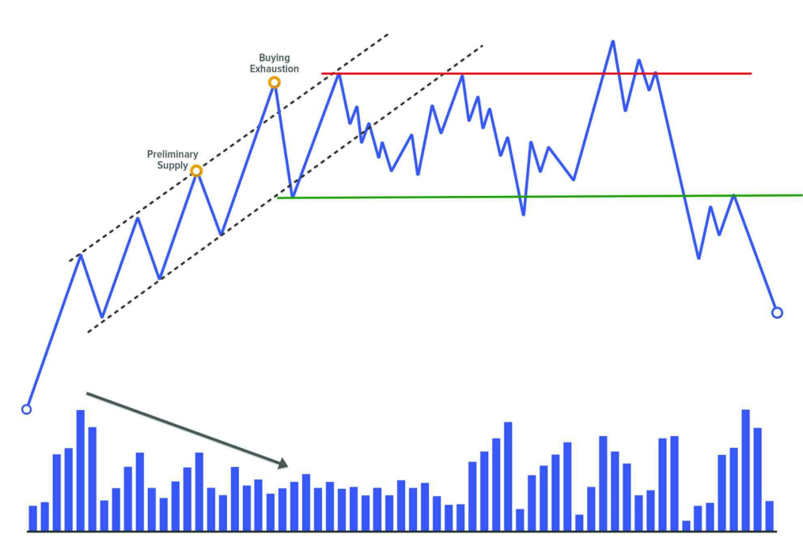

Tương tự như bên SC, không phải mọi xu hướng tăng đều kết thúc bằng một Buying Climax volume lớn.

Trong nhiều trường hợp, giá kết thúc xu hướng tăng do lực mua **cạn dần theo thời gian** – gọi là **Buying Exhaustion**.

#### Dấu hiệu

- Volume giảm
- Nến nhỏ, biên độ hẹp
- Giá tăng chậm, không còn mạnh như trước

#### Tâm lý

- Người mua dần chốt lời
- Không còn nhu cầu mua mới → giá dần yếu

Buying Exhaustion dễ nhận biết qua:

- Nhiều Preliminary Supply xuất hiện
- Volume tổng thể giảm trong khi giá vẫn tăng nhẹ.

---

## **EVENT #3: REACTION**

Sau khi sự kiện Climax tiềm năng xuất hiện, sẽ xảy ra một **Automatic Rally hoặc Automatic Reaction** – tức một chuyển động tự động ngược chiều mạnh mẽ – xác nhận cho hành động Climax vừa diễn ra.

Đây sẽ là chuyển động quan trọng nhất kể từ khi thị trường bắt đầu Phase xu hướng trước đó. Nó cho thấy sự tham gia mạnh mẽ từ các trader theo hướng ngược lại, và đồng thời cũng là **dấu hiệu của sự thay đổi đặc tính (Change of Character – ChoCh)**.

Sự thay đổi đặc tính này có ý nghĩa rất lớn vì nó cho thấy một **sự chuyển đổi trong bối cảnh thị trường**: từ một xu hướng (lên hoặc xuống) sang một **trạng thái đi ngang/lateral**.

Sự thay đổi hành vi này sẽ được **xác nhận bởi sự kiện cuối cùng trong Phase A**: **Secondary Test**. Khi điều đó xuất hiện, ta có thể xác nhận môi trường mới mà thị trường sẽ di chuyển kể từ thời điểm đó.

---

### Ý NGHĨA CỦA REACTION

Khoảng cách di chuyển trong sự kiện Reaction là yếu tố quan trọng, vì nó sẽ được phân tích sau này để hiểu điều gì đang thực sự xảy ra – **các professional trader đang làm gì**.

Ví dụ, nếu trong một xu hướng tăng trước đó, các bước sóng tăng có biên độ trung bình là 50 điểm, và đột nhiên bạn thấy một **Automatic Rally dài 100 điểm**, điều này gợi ý rằng đáy đã được xác lập vững chắc.

Ngược lại, nếu một đợt Reaction chỉ là những chuyển động giằng co, không đi được bao xa, volume không đáng kể – điều này **cho thấy thiếu ý định mạnh mẽ để đẩy giá**, và cũng hàm ý thị trường **vẫn chưa đạt trạng thái cân bằng**. Trong những trường hợp như vậy, **Secondary Test sẽ thường xảy ra rất sớm** và có thể vượt ra ngoài biên của cấu trúc ban đầu, phản ánh sự mất cân bằng hiện tại.

Nếu bạn thấy điều này trong một mô hình Accumulation tiềm năng, bạn phải **nghi ngờ rằng có thực sự là đang tích lũy để đẩy giá lên hay không**. Với những biểu hiện yếu như vậy, có khả năng cao đây là một mô hình **Redistribution** và giá sẽ tiếp tục giảm.

Tương tự, nếu bạn đang phân tích một cấu trúc có khả năng là Distribution, nhưng đợt **Automatic Reaction** lại yếu, không xa, volume nhỏ, và Secondary Test kết thúc ở trên đỉnh của Buying Climax – thì rất có thể đây **không phải là phân phối**, mà là **Reaccumulation**.

---

### CẤU TRÚC CỦA REACTION

Thông thường, ở **đầu của chuyển động Reaction**, volume sẽ rất lớn – vì chúng ta đang ở cuối một sự kiện Climax – và điều này là bình thường.

Trong suốt quá trình di chuyển, volume sẽ giảm dần cho đến khi trở nên khá thấp. Sự khô cạn volume này **cho thấy thiếu động lực tiếp tục** và do đó, chuyển động sẽ dừng lại – đánh dấu kết thúc của **Automatic Rally hoặc Automatic Reaction**.

Tương tự với biên độ giá: đầu chuyển động sẽ là các nến mạnh, biên độ lớn, sau đó sẽ **thu hẹp dần** về cuối.

→ Qua việc luyện tập liên tục, bạn sẽ dần phát triển **trực giác thị trường** để nhận ra thời điểm biên độ và volume đã thu hẹp đến mức nào là "đủ" để giá dừng lại. Không có công thức cụ thể – đây là một **kỹ năng cần luyện cảm nhận**.

---

### CÔNG DỤNG CỦA REACTION

#### 1. XÁC ĐỊNH BIÊN GIỚI CẤU TRÚC

Trong các cấu trúc theo phương pháp Wyckoff, Reaction là yếu tố rất quan trọng để xác định phạm vi Range:

- **Automatic Rally** xác định **ranh giới trên**, là vùng kháng cự rõ ràng mà sau này giá sẽ phản ứng.
- **Automatic Reaction** xác định **ranh giới dưới**, là vùng hỗ trợ nơi các lực mua có thể xuất hiện lại sau này.

---

#### 2. XÁC NHẬN SỰ KIỆN CLIMAX

Trong nhiều trường hợp, **chúng ta không thể chắc chắn đâu là Climax thực sự**, cho đến khi chứng kiến phản ứng rõ rệt từ phía thị trường – tức là Automatic Rally hoặc Automatic Reaction.

- Automatic Rally sẽ **xác nhận Selling Climax** là hợp lệ.
- Automatic Reaction sẽ **xác nhận Buying Climax** là hợp lệ.

---

#### 3. CUNG CẤP NGỮ CẢNH THỊ TRƯỜNG

Sau khi quan sát Event #2 (Climax) và Event #3 (Reaction), ta nhận ra **Change of Character (ChoCh)** – một thay đổi cực kỳ quan trọng cho thấy thị trường đã đổi trạng thái.

→ Ta có một **market map** mới, và biết rằng thị trường sẽ sớm kiểm tra lại điểm Climax để tạo **Secondary Test**.

**Cơ hội hành động:**

- Nếu bạn xác định chính xác được Selling Climax và Automatic Rally → bạn có thể chuyển sang khung thời gian nhỏ hơn để tìm kiếm một mô hình **minor distribution** tại đỉnh của AR – từ đó canh giá đảo chiều tạo Secondary Test.
- Nếu bạn xác định được Buying Climax và Automatic Reaction → có thể tìm kiếm một **minor accumulation** ở đáy của AR để đón cú bật lên tạo thành Secondary Test.

---

#### 4. CƠ HỘI CHỐT LỜI

Nếu bạn liều lĩnh vào lệnh ngay tại Climax (như bắt đáy bắt đỉnh), thì **không nên giữ lệnh quá lâu xuyên suốt quá trình hình thành Range**, bởi vì bạn chưa thể chắc chắn liệu đây là cấu trúc xoay chiều hay tiếp diễn.

→ Hành động hợp lý là: **chốt lời tại Automatic Rally hoặc Automatic Reaction** → Scalp thành công.

---

### AUTOMATIC RALLY

**Automatic Rally** là cú bật giá mạnh mẽ xuất hiện **sau Selling Climax**, và là **dấu hiệu đầu tiên của lực cầu**.

Nó thuộc Phase A – giai đoạn dừng xu hướng trước, xảy ra sau Preliminary Support và SC.

#### TẠI SAO AUTOMATIC RALLY XẢY RA?

Sau một xu hướng giảm kéo dài, có thể thị trường đã rơi vào trạng thái **quá bán**. Khi Selling Climax diễn ra, ta sẽ thấy những hành động sau:

- **Exhaustion of supply**: người bán không còn mặn mà bán nữa.
- **Short covering**: các vị thế bán trước đó bắt đầu chốt lời.
- **Demand appears**: người mua mới bắt đầu tham gia sau khi thấy Climax.

→ Giá đã ở vùng không còn hấp dẫn để tiếp tục bán nữa → thiếu cung → giá dễ tăng trở lại.

Tuy nhiên, **phần lớn các lệnh mua tại SC thường là scalp**, không giữ lâu, nên họ sẽ **bán ra tại AR**, kết thúc chuyển động tăng này.

---

### AUTOMATIC REACTION

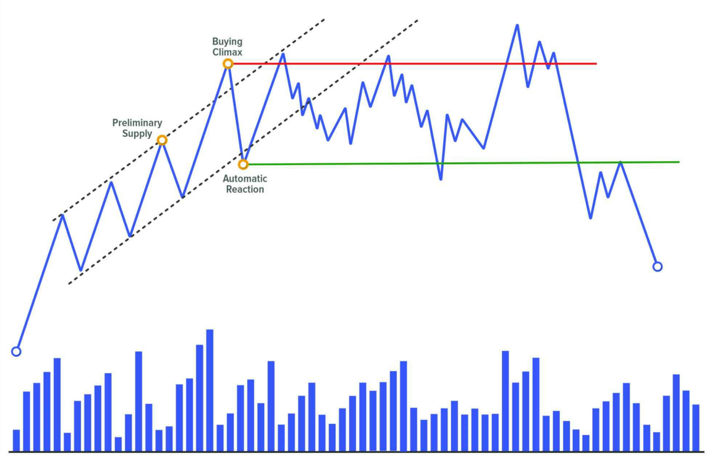

**Automatic Reaction** là cú rơi mạnh đầu tiên sau Buying Climax – là **dấu hiệu đầu tiên của lực cung**.

Nó thuộc Phase A, sau Preliminary Supply và BC.

#### TẠI SAO AUTOMATIC REACTION XẢY RA?

Giá đã tăng dài, khiến thị trường trở nên **quá mua**. Khi BC xảy ra, các hành động sau xuất hiện:

- **Exhaustion of demand**: người mua không còn hứng thú mua giá cao.
- **Long covering**: người mua trước đó bắt đầu chốt lời.
- **Supply appears**: lực bán mới tham gia sau khi thấy Climax.

→ Thiếu cầu + có thêm cung → giá dễ bị kéo xuống.

Các trader vào lệnh bán tại BC cũng thường kỳ vọng giảm ngắn hạn → sẽ chốt lời trong quá trình AR, kết thúc đợt giảm này.

---

## **EVENT #4: TEST**

Test là hành động giá quay lại kiểm tra một vùng kháng cự/hỗ trợ quan trọng đã hình thành trước đó (thường là sau Climax, Spring, Upthrust…)
Mục tiêu là để xác định xem lực cung/cầu còn tồn tại hay không.

### SECONDARY TEST

**Secondary Test** là sự kiện thứ tư trong các mô hình Accumulation theo phương pháp Wyckoff. Đây là sự kiện đánh dấu kết thúc **Phase A**, chấm dứt xu hướng trước đó và mở đầu cho **Phase B** – giai đoạn xây dựng nguyên nhân.

---

### CHỨC NĂNG CỦA SECONDARY TEST

Giống như mọi sự kiện khác trong chuỗi Wyckoff, một điểm quan trọng khi xác định được Secondary Test là **nó cung cấp cho chúng ta bối cảnh thị trường** – một tín hiệu cho thấy từ giờ trở đi thị trường sẽ chuyển sang giai đoạn đi ngang.

Điều này rất quan trọng, vì trong Phase B, hành vi giá sẽ dao động lên xuống giữa hai biên của range.

Với bối cảnh này, chiến lược giao dịch hợp lý sẽ là **canh giá tại hai đầu biên** của range để bắt các điểm đảo chiều. Có thể thực hiện điều này bằng cách sử dụng mô hình nến, hoặc chuyển sang khung thời gian nhỏ hơn để tìm cấu trúc xoay chiều (nếu giá đang ở vùng trên – tìm mô hình phân phối nhỏ; nếu đang ở vùng dưới – tìm mô hình tích lũy nhỏ).

Về mặt chức năng, **Secondary Test là sự xác nhận rằng lực bán chủ động trước đó đã rút lui**, thị trường tiến tới trạng thái cân bằng – nơi lực mua và lực bán chấp nhận giao dịch với nhau (xây dựng nguyên nhân cho chuyển động tiếp theo).

---

### ĐẶC ĐIỂM CỦA SECONDARY TEST

Để Secondary Test được xem là thành công, chuyển động giảm phải đi kèm:

- **Giảm dần biên độ nến**.
- **Khối lượng giao dịch thấp hơn so với Selling Climax**.

Mặc dù một số tác giả cho rằng **Secondary Test phải nằm trên đáy của Selling Climax**, nhưng nên nhớ thị trường không cứng nhắc – cần linh hoạt trong đánh giá hành động giá.

Một cách hữu ích để nhìn Secondary Test là: nếu nó diễn ra ở **nửa trên của range**, có thể là dấu hiệu lực mua đang kiểm soát; nếu nó **rơi thấp hơn đáy SC**, thì có thể lực bán vẫn còn chiếm ưu thế.

Những đặc điểm này, cùng các yếu tố khác, sẽ giúp xác định **đây là mô hình tích lũy hay phân phối** – càng nhiều dấu hiệu về một phía, xác suất phân tích càng cao.

👉 Điều quan trọng nhất: **giảm volume và thu hẹp biên độ**. Volume phản ánh hoạt động thị trường, nên sau một sự kiện Climax, nếu volume giảm → thiếu quan tâm từ phía đó.

---

### SECONDARY TEST TRONG PHASE B

Mặc dù Secondary Test "chính thức" nằm trong Phase A, nhưng hành vi tương tự sẽ tiếp tục xuất hiện trong các Phase sau.

Khi vào Phase B, ta sẽ chờ các **bài test tại hai đầu biên của range** để đánh giá sức mạnh/yếu của lực mua và lực bán. Có thể sẽ có test ở cả phía trên và phía dưới.

#### SECONDARY TEST Ở VÙNG TRÊN

Giá vượt qua đỉnh cũ (từ hành động dừng trước đó), nhưng nhanh chóng quay lại bên trong range → tạo một cú Shake nhẹ.

- Ban đầu, điều này cho thấy **sức mạnh tiềm ẩn**, vì giá vượt kháng cự là dấu hiệu có lực mua mạnh.
- Cần theo dõi kỹ để xác định liệu đó có phải là lực mua thực sự (tích lũy) hay lực bán đang tận dụng để phân phối.

Nếu là mô hình Accumulation/Reaccumulation → gọi là **Upthrust Action (UA)**.

Nếu là mô hình Distribution/Redistribution → gọi là **Upthrust (UT)**.

→ Khác nhau duy nhất giữa UA và UT là **niềm tin vào bối cảnh tích lũy hay phân phối** tại thời điểm đó.

Nếu UA xảy ra và giá giữ trên kháng cự trong thời gian dài trước khi rơi lại → có thể gọi là **minor Sign of Strength (mSOS)** – dấu hiệu lực mua đáng tin cậy hơn.

---

#### SECONDARY TEST Ở VÙNG DƯỚI

Đây là bài test tạo đáy mới. Có thể đến từ:

- Sự chủ động mạnh của lực bán.
- Hoặc sự thiếu vắng quan tâm từ phía người mua.

→ Báo hiệu **yếu cơ bản**, do người bán muốn thoát càng nhanh càng tốt.

Từ đáy mới này, ta có thể vẽ một **ngưỡng hỗ trợ mới**, nơi có thể xảy ra break giảm thật sự, hoặc cú Shake cuối cùng trước khi tăng.

Nếu là mô hình tích lũy, ta gọi sự kiện này là:

- **Secondary Test as Sign of Weakness (ST as SOW)** – thường xảy ra khi Secondary Test Phase A đã phá đáy SC → thị trường cực kỳ yếu.

Nếu là mô hình phân phối, gọi là:

- **minor Sign of Weakness (mSOW)** – thường xuất hiện khi ST Phase A có cú phản ứng rất yếu.

📌 Ta chỉ biết được nhãn gọi nào đúng sau khi giá phá range theo hướng nào. Vì vậy, **để đơn giản**, có thể dùng nhãn chung: **ST in B (Secondary Test in Phase B)**.

---

### GENERIC TEST

Về định nghĩa, Test là **hành động đánh giá xem bên nào đang kiểm soát thị trường**.

- Nếu giá chạm vùng có volume cao trong quá khứ:
  - Mà giờ volume thấp → thiếu quan tâm → thị trường sẵn sàng đi theo hướng ít kháng cự → test hợp lệ.
  - Mà giờ volume vẫn cao → còn lực cản → test chưa hợp lệ.

→ **Test là thời điểm tốt để vào lệnh**, vì nếu hợp lệ, ta đang đi cùng phe mạnh hơn.

---

### NHỮNG VỊ TRÍ TEST NÊN THEO DÕI

#### TEST SAU SHAKE (SPRING/UPTHRUST TEST)

Diễn ra trong **Phase C**, ngay trước khi breakout. Đây là thời điểm có **tỷ lệ risk/reward tốt nhất**, vì:

- Stop Loss đặt sát đáy/đỉnh (gần Shake).
- Mục tiêu lợi nhuận có thể là Creek hoặc xa hơn.

---

#### TEST SAU BREAKOUT

Xảy ra trong **Phase D**, khi giá vừa bắt đầu breakout. Mục tiêu là đánh giá xem **break này là thật hay là Shake**.

- R:R không tốt bằng test sau Shake.
- Nhưng nếu phân tích đúng, giá sẽ phát triển xu hướng theo toàn bộ nguyên nhân tích lũy trước đó.

→ Có thể đặt Stop Loss tại vùng giữa range. Take Profit có thể dựa trên:

- Fibonacci.
- Đo chiều cao range.
- Hoặc các vùng thanh khoản.

---

#### TEST TRONG XU HƯỚNG (PHASE E)

Khi giá đã vào **Phase E**, đôi khi vì đà quá mạnh, thị trường không kịp tạo cấu trúc mới.

→ Lúc này, **test trong trend** có thể là cơ hội duy nhất để nhảy vào.

- Nếu target kỹ thuật đã đạt, nên tránh vào lệnh vội.
- Stop Loss nên đặt sau cú Shake + test tiếp theo.
- TP nên là vùng có thanh khoản đang chờ.

---

### CÁCH TEST HIỆN TRÊN BIỂU ĐỒ

Trong Volume Spread Analysis (VSA), các mẫu nến test còn gọi là:

- **No Demand** (nến tăng nhỏ, volume thấp).
- **No Supply** (nến giảm nhỏ, volume thấp).

Điều kiện test hợp lệ:

- Volume thấp hơn hai nến trước.
- Nếu đang ở vùng có **strength background** → test là **No Supply** (nến giảm nhỏ).
- Nếu đang ở vùng có **weakness background** → test là **No Demand** (nến tăng nhỏ).

---

### SỰ KHÁC BIỆT GIỮA SECONDARY TEST VÀ GENERIC TEST

Về bản chất, cả hai đều là **hành động kiểm tra lực lượng tham gia thị trường**. Điều kiện hợp lệ: giảm volume + giảm biên độ.

- **Secondary Test** là sự kiện đặc thù của Wyckoff, nằm trong cấu trúc, mang ý nghĩa chiến lược.
- **Generic Test** là khái niệm trong VSA, tập trung vào hành vi giá và khối lượng, không quan tâm vị trí cấu trúc.

---

## **EVENT #5: SHAKING**

**Shaking** là sự kiện then chốt mà tất cả các nhà giao dịch theo phương pháp Wyckoff đều mong đợi. Không có sự kiện nào khác mang lại sức mạnh phân tích lớn hơn, và điều này khiến nó, theo quan điểm của tôi, trở thành sự kiện quan trọng nhất có thể xảy ra trong thị trường tài chính.

Sau một giai đoạn mà các nhà giao dịch lớn (big traders) đã xây dựng phần lớn vị thế mong muốn, họ sử dụng hành vi này như một điểm xoay chuyển (turning point) để tạo ra chuyển động xu hướng đưa giá thoát khỏi vùng range.

Để chúng ta có thể chờ đợi khả năng xuất hiện một shake tiềm năng, hai hành động cần phải xảy ra trước:

- Sự dừng lại của chuyển động xu hướng trước đó, có thể có hoặc không có volume đỉnh điểm (climatic volume).
- Sự hình thành một nguyên nhân đáng kể – tức là sự phát triển của Phase B, trong đó chúng ta suy luận rằng các nhà giao dịch chuyên nghiệp đã hấp thụ stock.

---

### ZERO-SUM GAME

Như chúng ta đã biết, do cơ chế hoạt động của thị trường tài chính dựa trên luật cung và cầu, để một lệnh được khớp, nó phải đối ứng với một lệnh có ý định ngược lại. Điều này có nghĩa là để khớp một giao dịch bán (bid), cần có một giao dịch mua (ask) đối ứng, và ngược lại.

Điều này rất quan trọng bởi vì trong sự kiện mà chúng ta đang đề cập, cũng như trong hai sự kiện "lừa gạt" khác (Preliminary Stop và Climax), tất cả các lệnh có nguồn gốc từ những nhà giao dịch kém hiểu biết – “weak hands” – đều đang bị hấp thụ bởi các nhà giao dịch chuyên nghiệp – “strong hands”.

Yếu tố then chốt khi phân tích sự kiện này là xác định mức độ *aggressiveness* mà vùng giá quan trọng bị phá vỡ và thị trường phản ứng như thế nào ngay sau hành động đó.

---

### HÀNH VI CỦA SHAKING

Hành động này rất đơn giản: đó là một chuyển động phá vỡ vùng thanh khoản trước đó – những khu vực chứa số lượng lớn lệnh chờ khớp – thoạt nhìn thì dường như có ý định thật sự đi theo hướng breakout, nhưng trên thực tế lại là một cú lừa (false break).

Điều xảy ra là: một cú breakout giả (false break) mà ở đó các big traders hấp thụ toàn bộ các lệnh chờ để bắt đầu chuyển động xu hướng mà họ mong muốn.

Đây là cách thị trường tài chính vận hành – thông qua việc tìm kiếm thanh khoản (liquidity). Nếu các nhà giao dịch lớn không thể tìm được bên đối ứng cần thiết để khớp lệnh, thì thị trường không thể di chuyển. Vì vậy, họ cần tạo ra cảm giác rằng đây là một cú break thật sự để thu hút thêm trader vào và hấp thụ toàn bộ lệnh của họ.

Nếu bạn lấy bất kỳ biểu đồ nào, bất kể thị trường hay khung thời gian, bạn sẽ thấy rằng trước bất kỳ chuyển động xu hướng lớn nào đều có một shake phát triển trước đó. Điều này là cần thiết. Việc khớp lệnh đó chính là “nhiên liệu” mà thị trường cần để bứt phá.

Hiểu được điều này sẽ nâng cấp kỹ năng giao dịch của bạn lên một vài tầm bởi vì bạn sẽ bắt đầu nhận thức rõ hơn về khả năng xảy ra hiện tượng này và theo thời gian bạn sẽ học được cách kiếm lợi nhuận từ hành vi của nó.

---

### CÁCH SPRING XUẤT HIỆN TRÊN BIỂU ĐỒ

Thông thường, shaking có thể xuất hiện dưới các dạng khác nhau:

#### TRÊN 1 NẾN

Đây là mô hình được biết đến như là nến hammer. Nó là một cây nến xuyên thủng vùng thanh khoản và sau đó hồi lại gần như toàn bộ chuyển động trong cùng cây nến đó, để lại một đuôi nến dài ở đáy.

Đuôi nến này thể hiện sự từ chối giá – tức là thị trường đã gặp phải lực đối ứng mạnh mẽ từ các trader ở phía đối diện, và họ tạm thời giành quyền kiểm soát thị trường.

#### MÔ HÌNH NHIỀU NẾN

Bản chất hành vi vẫn giống như trên, chỉ khác là chuyển động diễn ra trong một khoảng thời gian dài hơn. Nếu giá mất nhiều thời gian hơn để đảo chiều và quay trở lại vùng trước khi breakout, đó là dấu hiệu độ mạnh của shake yếu hơn.

#### CẤU TRÚC NHỎ (MINOR STRUCTURE)

Trong trường hợp này, giá giữ nguyên ở vị trí tiềm năng shake trong thời gian dài. Quyền kiểm soát thị trường không rõ ràng, do đó cần một cấu trúc nhỏ hơn đóng vai trò như một cú shake phụ cho cấu trúc lớn hơn.

Ví dụ:

- Trong vị trí tiềm năng Spring, chúng ta tìm kiếm cấu trúc tích lũy nhỏ để tạo đà đảo chiều tăng.
- Trong vị trí tiềm năng Upthrust After Distribution, ta tìm kiếm cấu trúc phân phối nhỏ để tạo đà đảo chiều giảm.

---

### CÁC CHỨC NĂNG CỦA SHAKING

Chuyển động do big traders khởi xướng này có nhiều chức năng:

#### LOẠI BỎ CÁC TRADER BREAKOUT

Trước đó, chúng ta gọi họ là greedy – những người thấy giá tạo đỉnh/đáy mới và nghĩ rằng đây là một breakout thật, nên vào lệnh, từ đó làm gia tăng áp lực lên giá.

Không chỉ trader thủ công mà các chiến lược giao dịch tự động (robot/algorithm) cũng sẽ kích hoạt lệnh tại các vùng này. Chúng còn có thể kích hoạt thêm các chiến lược dựa trên đà (momentum), tạo ra khối lượng lớn lệnh giao dịch.

#### LOẠI BỎ NHỮNG NGƯỜI SỢ HÃI

Những trader đang giữ lệnh lỗ lâu ngày và gần như kiệt sức, thấy giá tiếp tục đi ngược liền cắt lỗ để tránh lỗ sâu hơn.

#### LOẠI BỎ “NHỮNG NGƯỜI KHÔN NGOAN”

Họ đã đọc thị trường đúng và vào lệnh sớm (ví dụ: bán ở Climax, hoặc vào lệnh từ một Spring nhỏ). Nhưng cú shake cuối cùng khiến họ bị đá ra vì giá vượt stop loss.

#### TẠO LỢI NHUẬN CHO CHUYÊN GIA

Big traders tận dụng sự dịch chuyển giá do các lệnh breakout gây ra để đóng vị thế của mình và kiếm lợi nhuận.

---

### DẤU HIỆU ĐỂ NHẬN BIẾT SHAKEOUT TIỀM NĂNG

Hai yếu tố chính cần quan sát:

#### LOẠI ST XUẤT HIỆN Ở PHASE B

- Nếu là Upthrust Action (UA): thể hiện sức mạnh từ bên mua → khi giá về vùng đáy, có khả năng Spring sẽ xảy ra hơn là break giảm thật.
- Nếu là Sign of Weakness (mSOW): thể hiện sức mạnh bên bán → khi giá về đỉnh, có khả năng Upthrust sẽ xảy ra hơn là break tăng thật.

#### HÀNH VI GIÁ SAU KHI BREAKOUT

- Nếu sau khi giá break xuống, nhưng không giữ được bên dưới và quay lại range → khả năng cao là Spring.
- Nếu giá break lên nhưng không giữ được bên trên và quay lại → khả năng cao là Upthrust.

### TRÁNH NHỮNG LỖI GÁN NHÃN

Điều quan trọng cần làm rõ là **Shake** chỉ có thể được gán nhãn là **Spring** hoặc **Upthrust After Distribution (UTAD)** khi nó khởi nguồn cho chuyển động phá vỡ cấu trúc.

- **Spring** phải nhất thiết dẫn đến việc phá vỡ range theo hướng tăng. Bất kỳ điều gì khác không nên được gán nhãn là Spring. Nó chỉ đơn giản là một bài kiểm tra (test).
- Tương tự, **UTAD** phải là sự kiện shake tại đỉnh của cấu trúc và cũng phải dẫn đến phá vỡ giảm và bắt đầu xu hướng giảm ra khỏi range.

Tôi nhắc lại, để trung thành với phương pháp Wyckoff, bất kỳ điều gì khác ngoài những điều trên sẽ bị gán nhãn sai.

---

### SPRING/SHAKEOUT

Thuật ngữ **Spring** là viết tắt của từ "Springboard".  
Khái niệm này được giới thiệu bởi **Robert G. Evans**, một học trò xuất sắc của **Richard D. Wyckoff**, và là sự tinh chỉnh của khái niệm gốc được phát triển bởi Wyckoff, được gọi là **Terminal Shakeout**.

Wyckoff sử dụng thuật ngữ này để chỉ một vị trí xuất hiện trong quá trình phát triển của vùng tích lũy (accumulation range), nơi giá ở vị trí sẵn sàng thoát ra để bắt đầu một chuyển động tăng giá.

Chúng ta nhớ rằng **vùng tích lũy** là một giai đoạn trong chu kỳ thị trường (bao gồm các giai đoạn tích lũy, xu hướng tăng, phân phối và xu hướng giảm), nơi các nhà giao dịch lớn nhận thấy giá trị của thị trường (họ thấy giá bị định giá thấp) và thực hiện quá trình mua vào với ý định bán ra ở mức giá cao hơn để kiếm lợi nhuận từ chênh lệch.

---

### CÁC LOẠI SPRING

Khi giá phá vỡ hỗ trợ, chúng ta cần theo dõi sát sao hành vi giá và volume. Nếu bạn đã có vị thế mua, tùy thuộc vào cách giá giảm, bạn sẽ quyết định giữ lệnh hay thoát ngay lập tức. Nếu bạn thấy giá bật mạnh từ mức hỗ trợ với sự gia tăng nhẹ về volume, điều đó cho thấy giá đang phát triển sức mạnh kỹ thuật.

Dựa trên mức độ cung (supply) quan sát được tại thời điểm phá vỡ, có thể phân loại Spring thành ba loại:

#### SPRING #1 HOẶC TERMINAL SHAKEOUT

- **Cung xuất hiện mạnh mẽ** (sự quan tâm lớn từ người bán). Điều này được thể hiện qua sự gia tăng đột ngột về volume và sự mở rộng của biên độ giá, dẫn đến sự xuyên thủng lớn qua đường hỗ trợ.
- Trong trường hợp này, cung đang kiểm soát tình hình. Giá cực kỳ yếu và giảm mạnh.  
  ➤ Để loại Spring này thành công, cần có dòng cầu mạnh mẽ đẩy giá quay trở lại với biên độ giá rộng và volume tương đối cao.

Một dấu hiệu đầu tiên cho thấy cầu có thể đang tham gia là nếu sau khi xuyên thủng, volume vẫn cao nhưng biên độ giá bắt đầu thu hẹp.

Nếu cầu không xuất hiện, giá sẽ tiếp tục giảm và cần phải xây dựng một vùng tích lũy mới trước khi có thể xảy ra một chuyển động tăng đáng kể.

#### SPRING #2

- Quan sát thấy sự xuyên thủng vừa phải khi giá phá vỡ với sự gia tăng cả về volume và biên độ giá.
- Có một lượng cung nổi (floating supply – những trader sẵn sàng bán), nhưng không quá áp đảo như ở Spring #1.  
  ➤ Lượng cung này sẽ cần được hấp thụ bởi các nhà giao dịch chuyên nghiệp nếu họ muốn đẩy giá lên, do đó khả năng cao chúng ta sẽ thấy các bài kiểm tra liên tiếp tại khu vực này.

#### SPRING #3

- **Cung cạn kiệt** (thiếu người bán mạnh mẽ). Điều này được thể hiện qua sự xuyên thủng nhẹ, với sự giảm volume và thu hẹp biên độ giá, cho thấy sự thiếu quan tâm hoàn toàn đến việc giảm giá.

Đây là một loại Spring rất mạnh mẽ, nơi bạn có thể trực tiếp mở vị thế mua.

Ngoài ra, có một biến thể cuối cùng trong đó sự kiện xảy ra bên trong giới hạn của range. Sự kiện này thể hiện sức mạnh nền tảng lớn hơn, mặc dù các nhà giao dịch chuyên nghiệp thường thích Shake xảy ra ngoài range vì nó làm sạch tốt hơn lượng cung còn lại từ các "weak hands".

---

### SPRING TEST

Ngoại trừ Spring #3, ở các biến thể khác, cần phải có một bài kiểm tra (test) vì lượng cung hiện tại đã được quan sát và kết quả tích cực không được đảm bảo.

Hãy rất cẩn thận nếu quá trình kiểm tra chưa diễn ra vì nó có thể xảy ra vào một thời điểm sau đó. Để bài kiểm tra thành công, nó cần được phát triển với:

- Sự thu hẹp của biên độ giá,
- Sự giảm volume,
- Và giá cần được giữ trên mức của Spring/Shakeout.

Tất cả những điều này sẽ chỉ ra sự cạn kiệt của cung và gợi ý rằng giá đã sẵn sàng để bắt đầu chuyển động tăng với tương đối ít trở ngại, đại diện cho một tín hiệu mua tốt.

Nếu bài kiểm tra không đáp ứng các đặc điểm này, nó được coi là một bài kiểm tra chất lượng kém và gợi ý rằng cần có thêm các bài kiểm tra trong tương lai, vì một Spring với volume đáng kể cần được kiểm tra thành công trước khi chuyển động tăng có thể bắt đầu.

Dưới đây là phần tiếp tục dịch:

---

### THE ORDINARY SHAKEOUT

**Spring** và **Terminal Shakeout** là hai sự kiện tương tự xảy ra trong quá trình phát triển của vùng tích lũy (accumulation range). Tuy nhiên, có một biến thể khác được gọi là **Ordinary Shakeout**, được định nghĩa là một cú đẩy giảm mạnh mà không có sự chuẩn bị kỹ lưỡng trước đó, xảy ra trong quá trình phát triển của một xu hướng tăng (reaccumulation).

Điểm khác biệt chính: **vị trí xuất hiện**.  

- **Ordinary Shakeout** xảy ra trong xu hướng tăng, không phải trong vùng tích lũy.

Đặc điểm của **Ordinary Shakeout**:

- Biên độ giá rộng.
- Sự gia tăng volume.  
Tuy nhiên, volume có thể cao, trung bình hoặc thấp.

---

### THE SPRING TEST

Ngoại trừ **Spring #3**, các biến thể khác của Spring cần phải trải qua một bài kiểm tra (test) để xác nhận rằng lượng cung đã được hấp thụ và kết quả tích cực được đảm bảo.

#### Đặc điểm của một bài kiểm tra thành công

- Biên độ giá thu hẹp.
- Volume giảm.
- Giá được giữ trên mức của Spring/Shakeout.

Những yếu tố này cho thấy cung đã cạn kiệt và giá sẵn sàng bắt đầu một chuyển động tăng với ít trở ngại, tạo ra một tín hiệu mua tốt.

#### Nếu bài kiểm tra không thành công

- Nếu bài kiểm tra không đáp ứng các đặc điểm trên, nó được coi là một bài kiểm tra chất lượng kém.
- Điều này gợi ý rằng cần có thêm các bài kiểm tra trong tương lai, vì một Spring với volume đáng kể cần được kiểm tra thành công trước khi chuyển động tăng có thể bắt đầu.

---

### UPTHRUST AFTER DISTRIBUTION (UTAD)

**Upthrust After Distribution (UTAD)** là một cú đẩy tăng xảy ra như một sự kiện kiểm tra (test) trong Phase C của vùng phân phối (distribution) hoặc tái phân phối (redistribution).

#### Đặc điểm của UTAD

- Đây là một chuyển động tăng nhằm kiểm tra khả năng của bên mua trong việc đẩy giá lên cao hơn, thường đến một khu vực quan trọng như phá vỡ các đỉnh trước đó.
- Về lý thuyết, nó là một **Upthrust (UT)**, nhưng khi xảy ra trong Phase C, nó được gọi là **UTAD**, bất kể có các Upthrust trước đó trong Phase B hay không.

#### Volume trong UTAD

- Volume quan sát được thường ở mức trung bình hoặc cao, thể hiện số lượng lớn lệnh giao dịch tại khu vực quan trọng này.

---

### THE MINOR UPTHRUST AFTER DISTRIBUTION

Tương tự như **Minor Spring**, **Minor UTAD** là một cú đẩy tăng nhỏ xảy ra trong cấu trúc.

#### Đặc điểm của Minor UTAD

- Cú đẩy này đạt đến một số đỉnh trước đó.  
- Mặc dù lý tưởng là chờ bẫy xảy ra tại giới hạn trên của cấu trúc, nhưng thực tế loại bẫy nhỏ này cho thấy sự kiểm soát mạnh mẽ từ bên bán, vì họ không cho phép giá tăng cao hơn và đã xuất hiện lực bán mạnh tại các đỉnh trước đó.

#### Gán nhãn Minor UTAD

- Mặc dù UTAD chỉ là sự kiện shake tại đỉnh của cấu trúc, nhưng nếu chuyển động không đạt đến các đỉnh cao nhất, nó vẫn có thể được coi là một **Minor UTAD**.  
- Tuy nhiên, theo phương pháp Wyckoff, sự kiện này có thể chỉ được coi là **Last Point of Supply (LPSY)**.

---

### THE UPTHRUST AFTER DISTRIBUTION TEST

#### Có cần bài kiểm tra sau UTAD không?

- Một bài kiểm tra thứ cấp (Secondary Test) không phải lúc nào cũng xuất hiện sau UTAD.  
- Điều này là do lượng cung lớn đã tham gia thị trường, gây ra chuyển động giảm ngay lập tức dưới dạng **Sign of Weakness (SOW)**.

#### Lợi ích của bài kiểm tra

- Mặc dù bài kiểm tra không phải lúc nào cũng xảy ra, nhưng việc chờ đợi nó sẽ giúp bạn tránh được việc vào lệnh bán sai lầm trong trường hợp chuyển động thực sự là một cú phá vỡ tăng (JAC/MSOS).

#### Đặc điểm của bài kiểm tra thành công

- Biên độ giá và volume giảm.
- Giá dừng lại dưới mức UTAD, cho thấy sự cạn kiệt của bên mua và xác nhận kịch bản phân phối.

#### Nếu bài kiểm tra không thành công

- Nếu giá không giảm dưới mức UTAD hoặc volume tăng cao, bạn nên nghi ngờ về cú shake này, ngay cả khi giá đang tạo các đỉnh thấp hơn.  
- Trong trường hợp này, tốt nhất là chờ thêm tín hiệu bổ sung trước khi vào lệnh bán (ví dụ: các cú shake mới hoặc các bài kiểm tra thành công liên tiếp).

---

### TERMINAL UPTHRUST

**Terminal Upthrust** tương tự như **Terminal Shakeout**. Nó có các đặc điểm giống với một **Upthrust** thông thường, nhưng phạm vi hành động thường nghiêm trọng hơn.

#### Đặc điểm của Terminal Upthrust

- Volume có thể cực kỳ cao.
- Sự xuyên thủng có thể rất lớn.  
Tuy nhiên, kết quả vẫn giống nhau: trong một khoảng thời gian ngắn, giá quay trở lại vùng range, cho thấy áp lực giảm mạnh.

---

### ORDINARY UPTHRUST

Tương tự như **Ordinary Shakeout**, **Ordinary Upthrust** là một cú đẩy tăng xảy ra mà không có sự chuẩn bị kỹ lưỡng trong quá trình phát triển của xu hướng giảm.
Đây là một cơ hội rất thú vị để vào lệnh bán, vì bạn sẽ giao dịch theo xu hướng phân phối gần đây nhất.

---

## **EVENT #6: BREAKOUT**

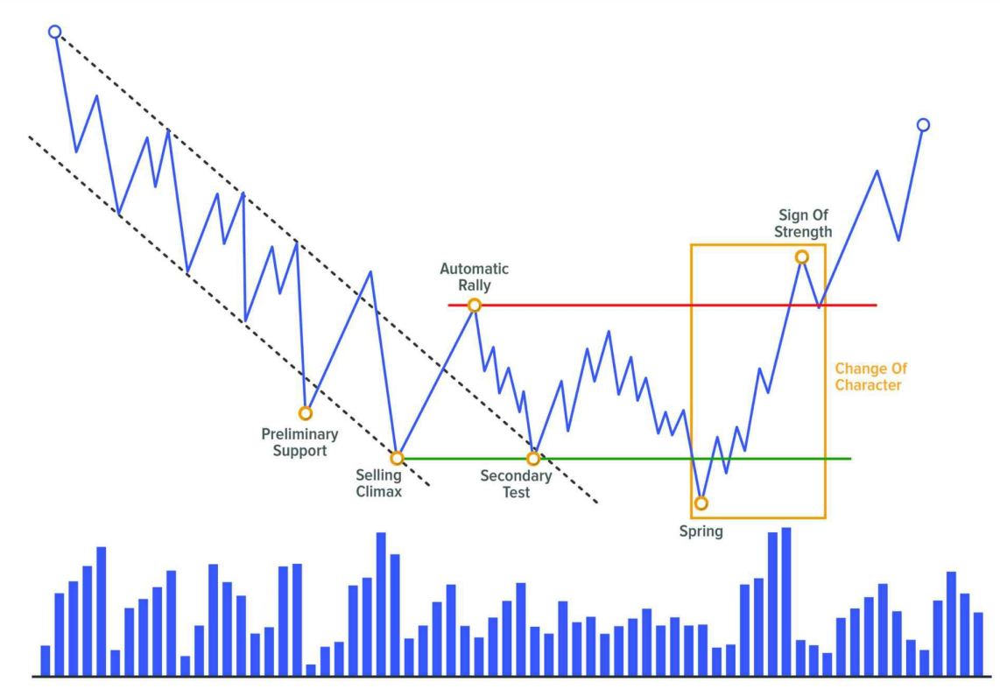

Sau sự kiện kiểm tra Phase C (shock hoặc LPS), giá sẽ phát triển một chuyển động xu hướng theo hướng ít kháng cự nhất.

Các nhà giao dịch chuyên nghiệp lớn đã hấp thụ toàn bộ lượng stock họ cần cho vị thế của mình và đã xác minh (thông qua Shake và bài kiểm tra) rằng họ sẽ không gặp nhiều kháng cự trong việc đẩy giá theo hướng có lợi cho họ.

Thị trường đang ở trạng thái mất cân bằng, điều này dẫn đến một chuyển động mạnh mẽ phá vỡ cấu trúc, bắt đầu sự phát triển của nguyên nhân đã được xây dựng trước đó.

---

### **BREAKOUT KHÔNG PHẢI LÀ CƠ HỘI GIAO DỊCH**

Chuyển động breakout này không phải là một cơ hội giao dịch; nó chỉ cảnh báo chúng ta về một cơ hội có thể xảy ra trong tương lai gần. Cơ hội này nằm ở hành động ngay sau đó, trong bài kiểm tra xác nhận (confirmation test).

---

### **CHANGE OF CHARACTER (ChoCh)**

Đây là **Change of Character (ChoCh)** thứ hai trong cấu trúc. Chúng ta nhớ rằng lần đầu tiên xảy ra với **Reaction Event #2**, khi thị trường chuyển từ trạng thái xu hướng sang bối cảnh range.

Lần này, ChoCh mới này thay đổi bối cảnh của thị trường, kết thúc sự đi ngang của giá và bắt đầu một Phase xu hướng mới.

#### Đặc điểm của ChoCh

- **ChoCh không chỉ là một chuyển động mạnh mẽ**; nó bao gồm hai sự kiện: một chuyển động mạnh và một sự thoái lui nhẹ. Tập hợp này tạo thành ChoCh.
- Change of Character được xác định từ điểm bắt đầu của Phase C cho đến khi kết thúc Phase D.

---

### **CÁCH BREAKOUT XUẤT HIỆN TRÊN BIỂU ĐỒ**

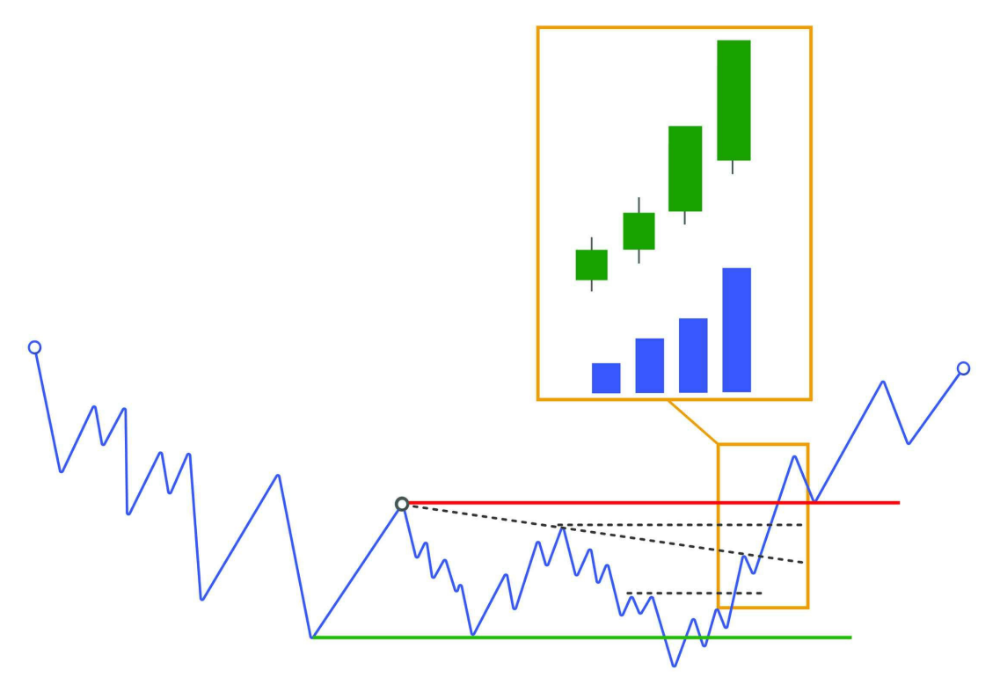

Chúng ta đang ở trong một môi trường có tốc độ cao, điều này khiến chuyển động phát triển thông qua các cây nến mà ở đó có sự gia tăng tương đối về biên độ giá cũng như sự gia tăng về volume.

#### Đặc điểm của breakout

- Chuyển động này sẽ phá vỡ các mức thanh khoản trước đó một cách trôi chảy, thể hiện đà mạnh mẽ.
- Đây là biểu hiện của sự mất cân bằng thị trường và sự quyết liệt được thể hiện bởi các trader.

---

### **BREAKOUT KHÔNG CÓ VOLUME**

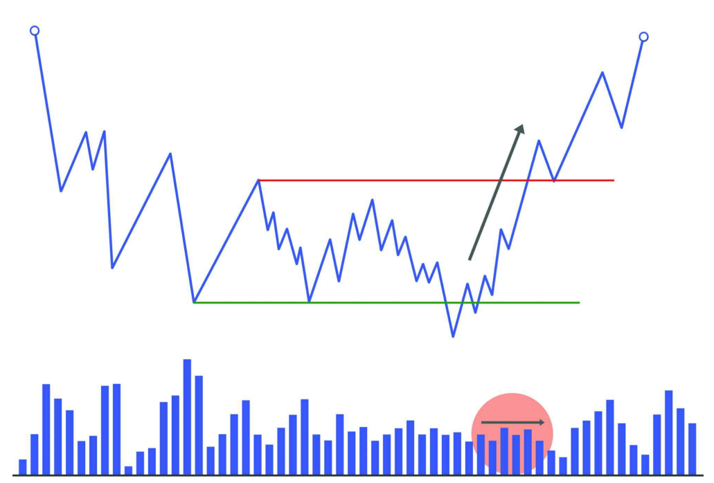

Thông thường, các cú phá vỡ (rupture) nên xảy ra với sự gia tăng volume. Tuy nhiên, đôi khi chúng ta có thể thấy các cú phá vỡ mà không có sự gia tăng volume đặc biệt cao. Điều này cho thấy lượng stock còn lại sẵn có là rất thấp, và do đó các trader kiểm soát thị trường sẽ không cần nỗ lực đặc biệt để dễ dàng đẩy giá.

#### Ví dụ về breakout tăng giá

- Nếu chúng ta thấy rằng breakout xảy ra với các cây nến có biên độ hẹp và volume ở mức trung bình, ban đầu chúng ta nên thận trọng với ý định của nó.
- Tuy nhiên, điều có thể xảy ra là lượng cung nổi (floating supply) rất ít, tức là có rất ít trader sẵn sàng bán. Vì vậy, sự vắng mặt của người bán kết hợp với sự quyết liệt vừa phải từ phía người mua có thể dẫn đến một cú phá vỡ tăng giá mà không cần volume tương đối cao.

---

### **CÁC YẾU TỐ CHÌA KHÓA TRONG SỰ KIỆN BREAKOUT**

Đây là một thời điểm quan trọng vì chúng ta có thể đang đối mặt với một sự kiện shaking tiềm năng. Do đó, điều cần thiết là phải đánh giá cẩn thận hành động giá và volume sau cú phá vỡ. Để làm điều này, chúng ta có thể dựa vào một số gợi ý:

#### 1. KHÔNG TÁI NHẬP NGAY VÀO VÙNG RANGE

- Đây là dấu hiệu đáng tin cậy nhất về ý định của cú phá vỡ.  
- Chúng ta sẽ tìm kiếm một cú phá vỡ hiệu quả có thể giữ được bên ngoài vùng range và không thất bại trong việc cố gắng quay lại vùng cân bằng.

Ngoài việc quan sát rằng chuyển động đi kèm với sự gia tăng biên độ giá và volume, và rằng nó phá vỡ các vùng kiểm soát trước đó (các đỉnh và đáy trước đó, hoặc minor Creek), dấu hiệu mạnh mẽ nhất để đánh giá breakout là thật sự là giá giữ được bên ngoài vùng range.

Điều này cho thấy không còn sự quan tâm ở mức giá thấp hơn và xác nhận rằng chuyển động đang được hỗ trợ bởi các big traders.

#### 2. BIỂU HIỆN CỦA LACK OF INTEREST

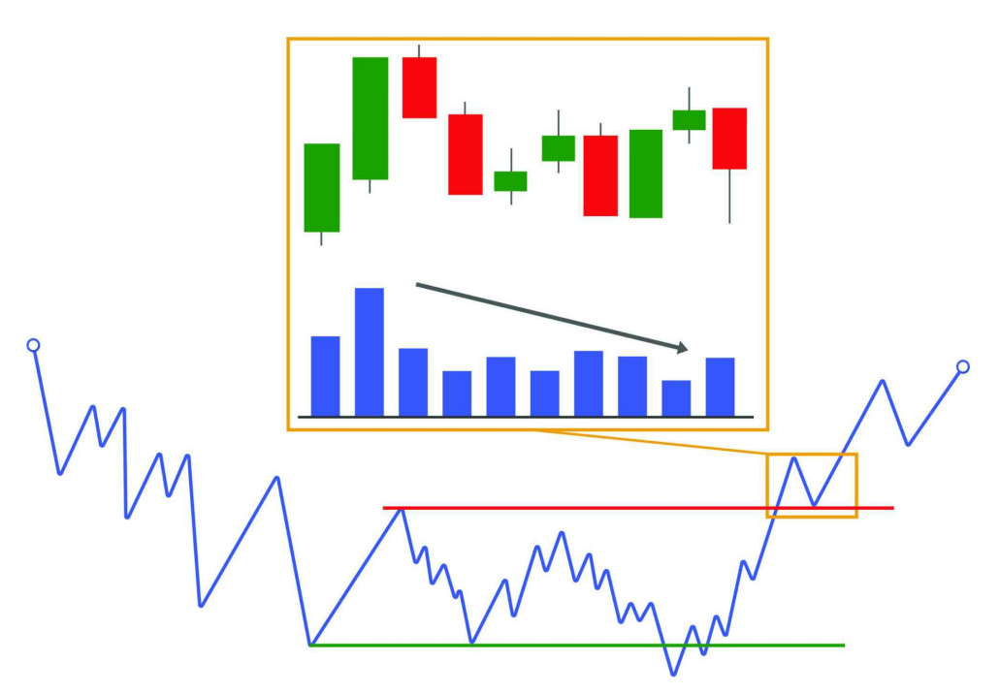

- Một dấu hiệu khác củng cố cú phá vỡ hiệu quả là quan sát các cây nến không có ý định rõ ràng sau đó: biên độ hẹp, đan xen và có volume nhỏ hơn so với chuyển động phá vỡ.

#### 3. KHOẢNG CÁCH CỦA CÚ PHÁ VỠ

- Khoảng cách mà giá di chuyển cũng có thể là một dấu hiệu cần xem xét.  
- Mặc dù không có khoảng cách được xác định trước, nhưng khoảng cách nên rõ ràng. Nói cách khác, cú phá vỡ mà di chuyển được một khoảng cách đáng kể khỏi cấu trúc sẽ mang lại sự tự tin lớn hơn.

---

### **BREAKOUT KHÔNG ĐẠI DIỆN CHO CƠ HỘI GIAO DỊCH**

Về mặt hoạt động, hành động này không đại diện cho một cơ hội giao dịch. Điều này chủ yếu là vì nó nằm trong một khu vực nhạy cảm, nơi một lượng lớn lệnh giao dịch chéo sẽ diễn ra và có thể thay đổi quyền kiểm soát thị trường.

Những gì ban đầu có vẻ là một cú phá vỡ hiệu quả có thể biến thành một cú Shake. Và đây là lý do tại sao việc chờ đợi bài kiểm tra tiếp theo để xác nhận hành động là hợp lý hơn.

---

### **SIGN OF STRENGTH (SOS)**

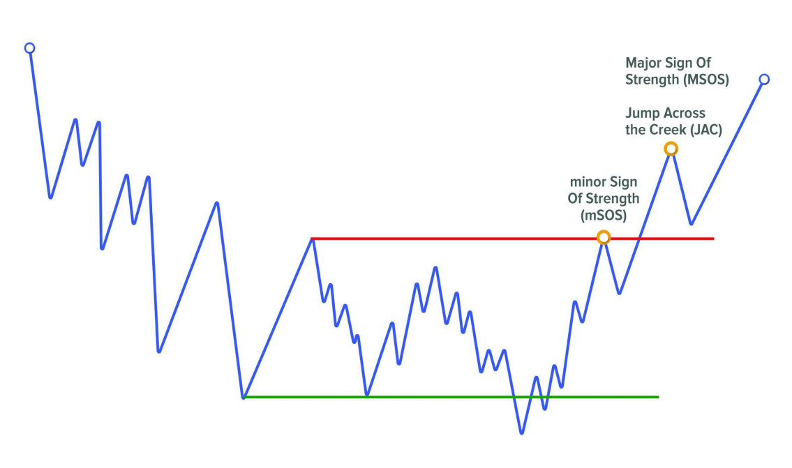

**Sign of Strength (SOS)** là một chuyển động tăng giá bắt nguồn từ đáy của Phase C (Spring hoặc LPS) và dẫn đến việc phá vỡ phần trên của range (Creek).

#### Đặc điểm của SOS

- Chuyển động này tạo ra **Change of Character (ChoCh)** trước khi bắt đầu xu hướng tăng bên ngoài range.
- Sau đó, giá sẽ thoái lui về Creek đã bị phá vỡ để tạo ra hành động **BackUp to the Edge of the Creek (BUEC)**.  
  ➤ Nếu giá không giữ được trên khu vực này và quay trở lại range, sự kiện sẽ được coi là **Upthrust (UT)**.

#### Ý nghĩa của SOS

- Một dấu hiệu sức mạnh lớn cho thấy sự **khẩn cấp của các tổ chức** trong việc tham gia thị trường.  
- Họ rất lạc quan (bullish) và mua vào một cách quyết liệt.

#### Cách nhận biết SOS

- Chúng ta muốn thấy chuyển động tăng giá có sự **dễ dàng di chuyển** (ease of movement) và đạt đến điểm giữa của range.  
- Ngoài ra, bất kỳ sự thoái lui nào cũng nên giữ trên đáy của Spring để thể hiện sức mạnh.

---

### **MINOR SOS**

Trong trường hợp chuyển động tăng giá không phá vỡ được cấu trúc, chuyển động này sẽ được gán nhãn là **Minor Sign of Strength (mSOS)**.

#### Khi nào mSOS xuất hiện?

- Nếu trong Phase B, chúng ta quan sát thấy một chuyển động có các đặc điểm của SOS, sự kiện này cũng có thể được gán nhãn là **mSOS**.

---

### **SIGN OF STRENGTH BAR**

**Sign of Strength Bar** là một cây nến tăng giá với:

- Biên độ rộng,
- Đóng cửa ở mức cao,
- Và volume tăng.  

Ngoài ra, nó cũng có thể được nhận diện qua một **bullish gap**.

#### Ý nghĩa của SOS Bar

- Nó cho thấy sự hiện diện của **cầu mạnh mẽ và chất lượng**. Đây là điểm mua của các tổ chức lớn.

#### Cách sử dụng SOS Bar

- Nó có thể được sử dụng như một **tín hiệu kích hoạt vào lệnh**.  
- Nếu trong khu vực giao dịch (sau một cú Shake, sau một cú Breakout hoặc trong xu hướng), chúng ta quan sát thấy một **Strength Bar**, đây là dấu hiệu rõ ràng rằng các nhà giao dịch lớn đang hỗ trợ chuyển động tăng giá và cung cấp cho chúng ta một cơ hội tốt để tham gia lệnh mua (long).

---

### **SIGN OF WEAKNESS (SOW)**

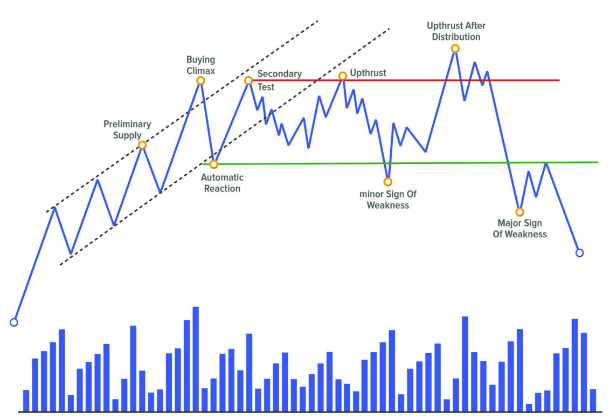

**Major Sign of Weakness (MSOW)** là một chuyển động giảm giá mạnh bắt nguồn từ đỉnh của Phase C (UTAD hoặc LPSY) và dẫn đến việc phá vỡ phần dưới của range (ICE), bắt đầu một xu hướng giảm mới.

#### Đặc điểm của MSOW

- Đây có thể là lần thử thứ hai, thứ ba hoặc thứ tư để phá vỡ ICE, và đây là lần thành công nhất.

#### Cách nhận biết MSOW

- Chúng ta muốn thấy chuyển động giảm giá có sự **dễ dàng di chuyển**, bao phủ một khoảng cách tương đối dài và ít nhất đạt đến điểm giữa của cấu trúc.  
- Ngoài ra, bất kỳ sự thoái lui nào cũng không nên đạt đến đỉnh được thiết lập bởi UTAD.

---

### **MINOR SOW**

Nếu sau sự kiện kiểm tra trong Phase C, chuyển động yếu này không thể phá vỡ cấu trúc, chúng ta sẽ gán nhãn nó là **Minor Sign of Weakness (mSOW)**.

#### Khi nào mSOW xuất hiện?

- Đây là một dấu hiệu yếu kém nhỏ.  
- Chúng ta cũng có thể gán nhãn như vậy cho bất kỳ chuyển động nào trong Phase B đáp ứng các đặc điểm về giá và volume.

---

### **SIGN OF WEAKNESS BAR**

**Sign of Weakness Bar** là một cây nến giảm giá với:

- Sự gia tăng tương đối về biên độ giá và volume,
- Và đóng cửa ở mức thấp trong phạm vi cây nến.  

Ngoài ra, nó cũng có thể được nhận diện qua một **bearish gap**.

#### Ý nghĩa của SOW Bar

- Nó báo hiệu sự quyết liệt của bên bán và do đó là một **điểm bán chuyên nghiệp**.

#### Cách sử dụng SOW Bar

- SOW Bar có thể được sử dụng như một **tín hiệu kích hoạt vào lệnh bán**.  
- Nếu trong khu vực giao dịch (sau một cú Shake, sau một cú Breakout hoặc trong xu hướng), chúng ta quan sát thấy một **Weakness Bar**, đây là dấu hiệu rõ ràng rằng các nhà giao dịch lớn đang hỗ trợ chuyển động giảm giá và cung cấp cho chúng ta một cơ hội tốt để bán khống (short).

---

## EVENT #7: CONFIRMATION

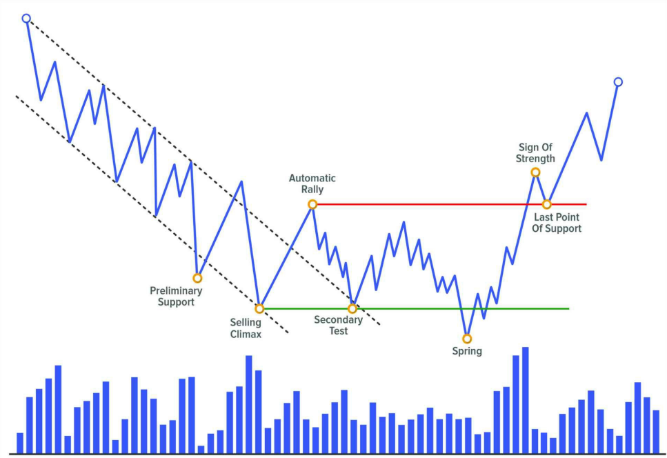

Khi sự kiện breakout xảy ra, đó mới chỉ là một **breakout tiềm năng**, vì sự **xác nhận (confirmation)** sẽ đến từ chính **test** của nó. Cũng giống như các sự kiện Shake, những **Sign of Strength (SOS)** hoặc **Sign Of Weakness (SOW)** đều cần phải được kiểm chứng.

Nếu chúng ta có một **test thành công**, khi đó chúng ta có thể gán nhãn chuyển động trước đó với độ tin cậy cao hơn và chuyển động test sau đó sẽ được gọi là **sự kiện xác nhận (confirmation event)**. Nói cách khác, chính test này sẽ xác nhận liệu chúng ta đang thực sự đối mặt với một chuyển động có chủ đích hay không.

Trong phương pháp luận, nếu chuyển động breakout tăng được gán nhãn là **Sign of Strength (SOS)** hoặc **Jump Across the Creek (JAC)**, thì chuyển động hồi lại xác nhận breakout đó được gọi là **Last Point of Support (LPS)** hoặc **Back Up to the Edge of the Creek (BUEC)**.

Trong ví dụ bearish, chuyển động breakout gây ra một **Sign of Weakness (SOW)** và chuyển động hồi lại để xác nhận nó sẽ được gán nhãn là **Last Point of Supply (LPSY)** hoặc **Fall Through the Ice (FTI)** – mặc dù thuật ngữ này ít phổ biến hơn. Chúng ta nhớ rằng **Ice** là vùng hỗ trợ trong cấu trúc, và thuật ngữ này lấy từ phép ẩn dụ tương tự như **Creek**.

### Làm sao biết khi nào có thể chờ confirmation?

Rõ ràng, chúng ta không thể biết chắc chắn. Việc này là để cộng thêm các **manh mối (clues)** giúp tăng xác suất rằng một kịch bản cụ thể sẽ xảy ra thay vì kịch bản ngược lại. Trong trường hợp này, để chờ confirmation, trước tiên ta muốn thấy:

- Giá tạo một chuyển động đẩy mạnh (**impulsive move**), được minh chứng bởi sự **mở rộng trong biên độ giá** và **gia tăng khối lượng giao dịch (volume)**.
- Ở thời điểm đó, kịch bản chính nên là: chờ một chuyển động hồi lại (**pullback**) để tìm cơ hội vào lệnh.

---

### CONFIRMATION xuất hiện thế nào trên biểu đồ?

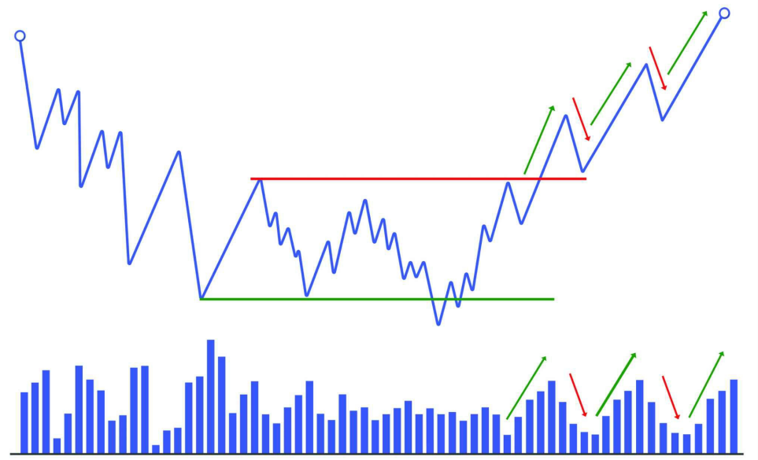

Như đã đề cập, đây là thời điểm nhạy cảm nhất vì ta đang xét xem đó có phải là **breakout thật** hay chỉ là một **Shakeout**.

Chúng ta nên xem lại chương trước – nơi đề cập đến các **điểm then chốt của breakout** – vì ở confirmation, ta cũng muốn thấy chính xác các điều đó xảy ra:

- Giá di chuyển một khoảng đáng kể trong chuyển động breakout.
- Chuyển động test được thực hiện bởi các nến **hẹp biên độ**, **gối đầu** nhau, và có **khối lượng thấp**.
- Giá **không quay lại trong range**.

Đây là hành vi tự nhiên của mọi chuyển động theo xu hướng: chuyển động **impulse** thể hiện chủ đích, và chuyển động **correction** cho thấy sự thiếu quan tâm.

---

### Tín hiệu cảnh báo sau breakout

Nếu có **khối lượng cao bất thường** trong quá trình test xác nhận, tốt nhất là bạn nên thận trọng vì điều đó cho thấy **vẫn còn lực cản tiềm tàng** ở phía đối diện.

Và như ta đã biết, trader lớn sẽ không khởi động một cú move lớn cho đến khi chắc chắn rằng con đường đã **sạch bóng lực cản**. Do đó, nếu volume test cao, hãy chờ thêm các test kế tiếp quanh vùng đó.

Nếu chuyển động hồi lại có biên độ rộng và volume cao, khả năng lớn là cú breakout đầu tiên chỉ là một **Shakeout**, và giá sẽ quay trở lại trong range.

---

### Cơ hội giao dịch

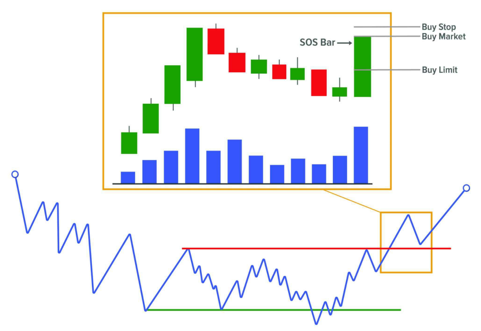

Sự kiện confirmation thường xuất hiện tại **vị trí lý tưởng** để vào lệnh hoặc **thêm lệnh vào vị thế mở**.

Ban đầu, đây chính là vị trí yêu thích của Richard Wyckoff để vào thị trường, vì khi đó ta đã có đầy đủ “price action bên trái” để thấy được **nỗ lực của các nhà chuyên nghiệp** thực hiện chiến dịch **accumulation hoặc distribution** – cung cấp một entry có **rủi ro tương đối thấp**.

**Để mua:**

- Chờ xuất hiện **nến mạnh (SOSbar)** rồi:
  - Vào lệnh trực tiếp theo giá thị trường, hoặc
  - Đặt lệnh stop tại đỉnh của nến đó, hoặc
  - Đặt limit order tại một mức giá chờ hồi lại.
- Stop Loss nên được đặt hoặc dời về dưới vùng **Last Point of Support** và đường **Creek** đã bị phá vỡ.

**Để bán:**

- Chờ xuất hiện **nến yếu (SOWbar)** và sử dụng kiểu lệnh phù hợp với cá tính giao dịch của bạn.
- Stop Loss nên đặt trên vùng **Last Point of Supply** và đường **Ice** đã bị phá vỡ.

---

### Định lượng trigger vào lệnh

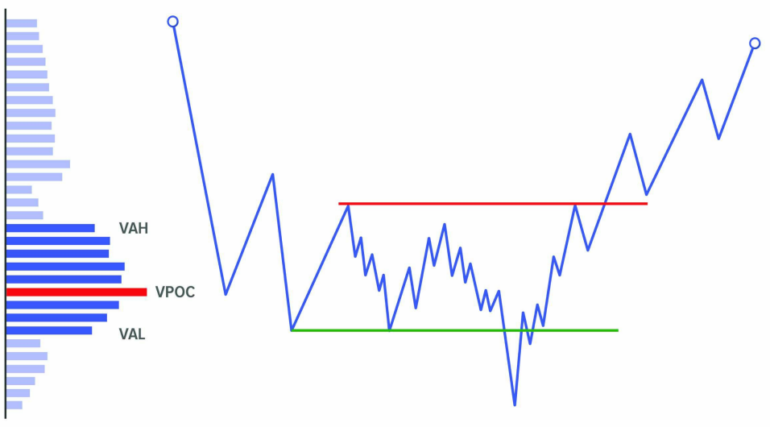

Điểm yếu lớn nhất của các phương pháp thiên về **discretionary** là tính **chủ quan**. Điều này đặc biệt đúng với phương pháp Wyckoff – dù có logic rất rõ ràng – nhưng dễ trở thành vô dụng nếu rơi vào tay người không thể kiểm soát được cảm xúc.

Một giải pháp là cố gắng **định lượng hóa các trigger vào lệnh** – một hành động đơn giản giúp tăng **tính khách quan** trong chiến lược.

Ví dụ:

- Nếu bạn chỉ sử dụng **price action**, bạn có thể định lượng một mô hình đơn giản như: nến giảm + nến tăng kế tiếp.
- Sau đó nâng cao: ví dụ thêm điều kiện MA nằm dưới, nến tăng phải lớn hơn bao nhiêu pip, chỉ vào khi nến tăng phá đỉnh nến giảm v.v.

Nếu bạn dùng thêm công cụ volume như **POC, VAH, VAL, VWAP** hoặc **Delta**, bạn có thể bổ sung thêm điều kiện như: chỉ vào khi giá nằm trên VWAP và nến tăng có Delta lớn v.v.

Điều này yêu cầu nhiều công sức – nếu bạn không biết lập trình – vì phải kiểm tra thủ công hoặc backtest bằng tay. Nhưng đây là cách duy nhất để tăng tính khách quan.

---

### LAST POINT OF SUPPORT (LPS)

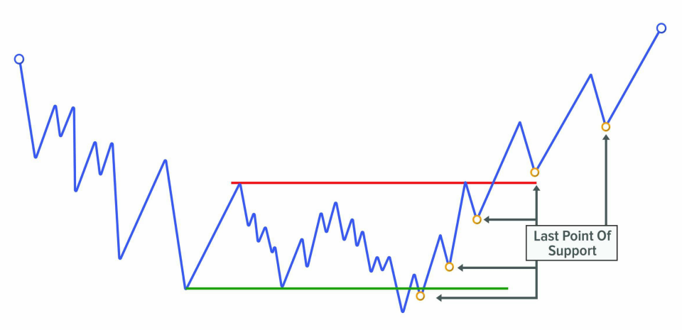

**LPS** là hành động ngay trước một cú **Sign of Strength (SOS)**. Đây là nỗ lực của bên bán đẩy giá xuống nhưng thất bại khi người mua vào mạnh mẽ, tạo ra một **impulse tăng mới**.

Các loại LPS:

- **LPS sau Shake**: nếu giá vừa trải qua Spring hoặc Shakeout, LPS chính là **test** của các sự kiện đó.
- **LPS trong range**: sau một cú SOS, LPS sẽ xuất hiện ở pha hồi giá.
- **LPS ngoài range**: bao gồm **BUEC** (test sau breakout) và các pha hồi trong xu hướng tăng ngoài range.

LPS là điểm chặn rơi cuối cùng của lực cầu trước khi giá tạo một **higher low** và tiếp tục tăng. Những trader thiếu kinh nghiệm thường mua vào trong lúc giá đang tạo SOS – điều này không tối ưu. **LPS là điểm vào hợp lý hơn nhiều.**

---

### LAST POINT OF SUPPLY (LPSY)

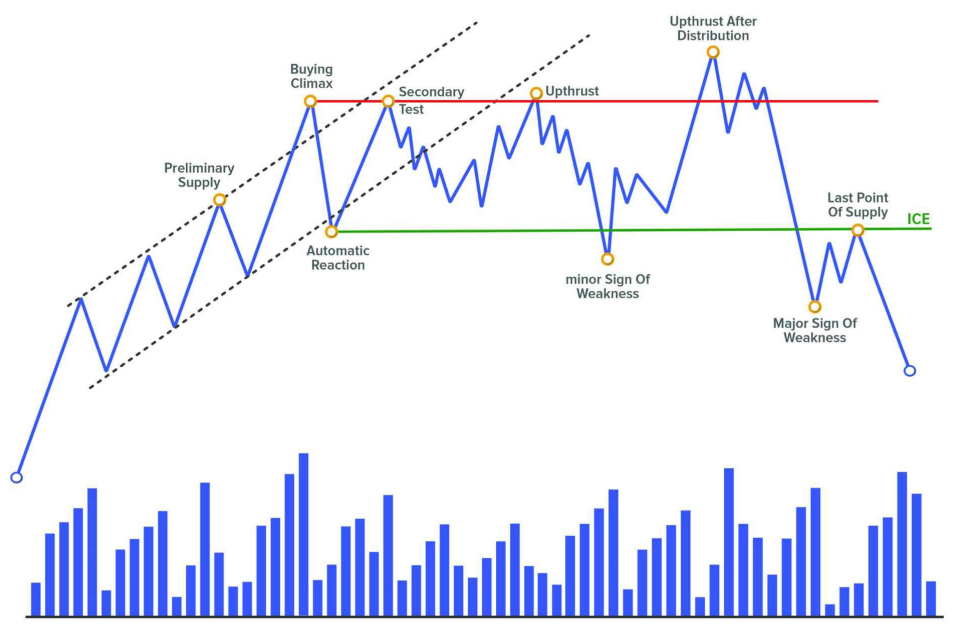

**LPSY** là hành động ngay trước một cú **Sign of Weakness (SOW)**. Đây là một nỗ lực đẩy giá lên nhưng bị ngăn cản bởi các nhà bán lớn – họ đã mở short từ trước và nay tiếp tục bảo vệ vị thế.

Các loại LPSY:

- **LPSY sau Shake**: nếu giá vừa trải qua Upthrust After Distribution, LPSY là test của sự kiện đó.
- **LPSY trong range**: sau một cú SOW, LPSY sẽ nằm trong đợt hồi tăng.
- **LPSY ngoài range**: bao gồm **FTI** (test sau breakout) và các đợt hồi giá trong xu hướng giảm ngoài range.

Sau khi phá vỡ Ice với một cú SOW, ta muốn thấy một cú hồi **hẹp biên độ**, volume thấp, giá khó tăng tiếp – điều này tăng xác suất là LPSY.

Tuy nhiên, nếu volume test cao, hãy cẩn trọng vì đó có thể là lực short thêm. LPSY là **điểm rất tốt để bắt đầu hoặc thêm vị thế bán**.

Đôi khi LPSY sẽ xuất hiện ở vùng giá từng có Preliminary Supply – nơi quá trình phân phối đã bắt đầu.

---
