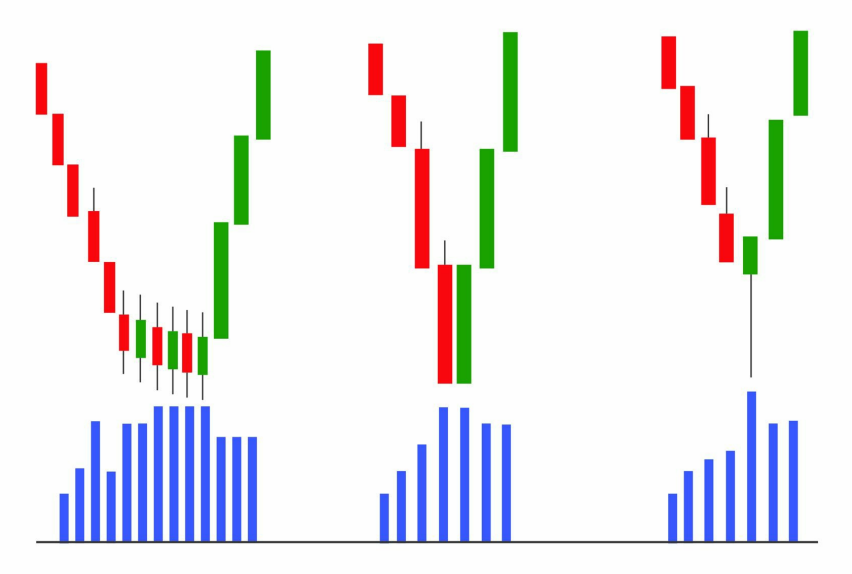
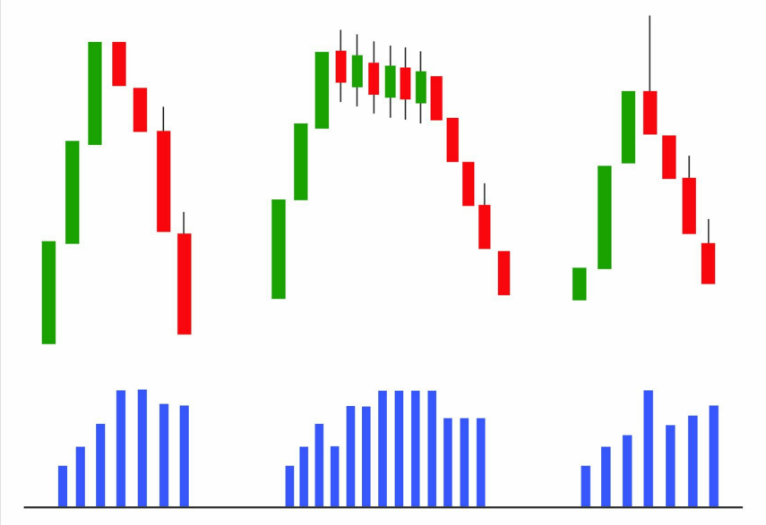
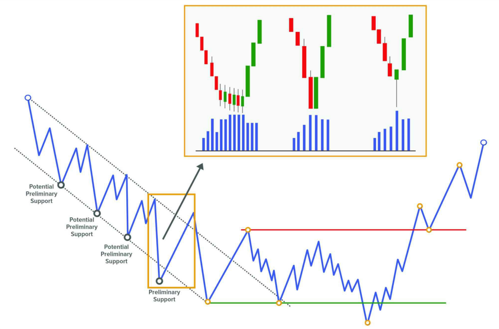
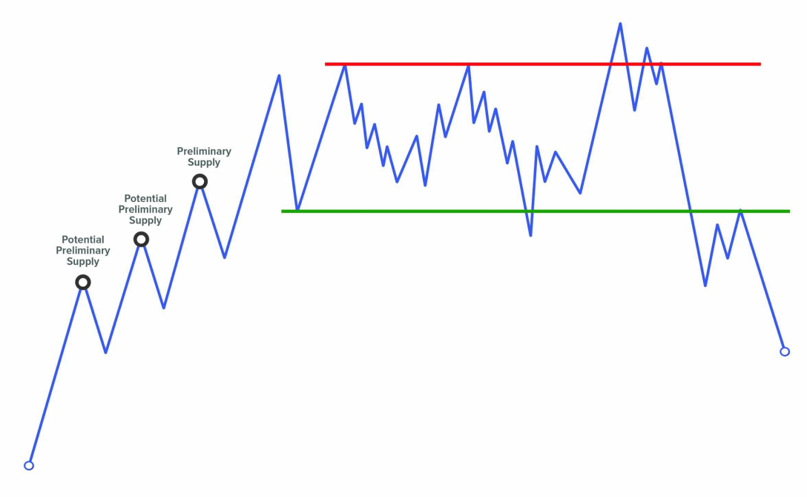

# **EVENT #1: PRELIMINARY STOP**

Đây là sự kiện đầu tiên trong phương pháp Wyckoff, xuất hiện để bắt đầu Phase A – giai đoạn dừng lại của xu hướng trước đó.

Trong các mô hình Accumulation, sự kiện này được gọi là **Preliminary Support (PS)**, kết hợp với **Selling Climax (SC)**, **Automatic Rally (AR)** và **Secondary Test (ST)** tạo ra một sự thay đổi đặc tính (Change of Character), khiến giá chuyển từ môi trường xu hướng giảm sang môi trường đi ngang.

Trong các mô hình Distribution, sự kiện này được gọi là **Preliminary Supply (PSY)**, và kết hợp với **Buying Climax (BC)**, **AR**, và **ST**, đánh dấu kết thúc Phase A, chấm dứt xu hướng tăng trước đó và khởi đầu Phase B – quá trình xây dựng "cause".

Như ta đã biết, quá trình Accumulation và Distribution cần thời gian, và chỉ trong một số ít trường hợp giá sẽ phát triển theo dạng hypodermic tạo thành mô hình đảo chiều hình chữ V. Quá trình Accumulation thường bắt đầu với sự kiện đầu tiên này: **Preliminary Support**, và tương tự, quá trình Distribution bắt đầu với **Preliminary Supply**.

Trước khi sự kiện này diễn ra, thị trường thường đang trong một xu hướng rõ ràng. Đến một thời điểm nhất định, giá sẽ đạt đến một vùng đủ hấp dẫn để các trader lớn bắt đầu tham gia thị trường một cách chủ động hơn.

---

## CÁCH PRELIMINARY STOP XUẤT HIỆN TRÊN BIỂU ĐỒ

|  |  |
|-------|-------|
|  |  |

Việc quan sát sự kiện này trên biểu đồ thường bị hiểu sai, vì nó **không nhất thiết phải xuất hiện dưới dạng một cây nến có volume tăng mạnh và biên độ giãn rộng**.

Nó cũng có thể thể hiện qua:

- Một chuỗi nến với biên độ hẹp nhưng volume cao và đều,
- Hoặc một cây nến có volume cao và bóng dài.

Tất cả các biểu hiện này đều mang một ý nghĩa: **sự tham gia đáng kể đầu tiên của các trader lớn**.

Hãy nhớ lại một câu nói nổi tiếng từ Tom Williams trong cuốn *Master the Markets*, rằng: *"Thị trường không thích những cây nến có xu hướng mạnh đi kèm với volume tăng đột biến sau một chuyển động kéo dài, vì điều đó thường báo hiệu tâm lý ngược chiều."*

Việc thấy một cây nến giảm mạnh, volume cao, đóng cửa gần đáy sau một đợt giảm dài là một chỉ báo rõ ràng về hoạt động mua từ các professional trader.

Có thể lúc đó giá đã rơi vào tình trạng quá bán trong kênh giá giảm hiện tại.

---

## TÂM LÝ PHÍA SAU PRELIMINARY STOP

Chúng ta hãy cùng phân tích cơ chế khớp lệnh diễn ra trong thời điểm này. Nhớ rằng: để có người mua thì phải có người bán.

Hãy tự hỏi: cả những **trader thiếu thông tin (weak hands)** và **trader chuyên nghiệp (strong hands)** đang làm gì tại thời điểm đó?

Như đã nói, khi thị trường đạt đến vùng giá được xem là "value area" để bắt đầu chiến dịch tích lũy hoặc phân phối, chính các **professional trader** sẽ là người hấp thụ toàn bộ lượng cổ phiếu đang được bán ra. Và đối tác của họ, cung cấp thanh khoản, lại là các **weak hands**.

Chúng ta có thể phân loại các weak hands như sau:

- **The greedy**: những người thấy giá di chuyển đột ngột và nhảy vào vì sợ bỏ lỡ cơ hội.
- **The fearful**: những người đã giữ vị thế thua lỗ trong thời gian dài, sắp hết kiên nhẫn. Khi giá tiếp tục chống lại họ, họ sợ hãi và thoát lệnh.
- **The smart ones**: những người dự đoán đúng xu hướng đảo chiều và đã vào lệnh, nhưng timing không chuẩn nên bị đá stop loss.

---

## Ý NGHĨA VÀ ỨNG DỤNG CỦA PRELIMINARY STOP

Việc xác định đúng sự kiện đầu tiên này mang lại hai lợi ích rõ rệt:

1. **Ngừng ngay việc tiếp tục giao dịch theo xu hướng trước đó**, ít nhất là cho đến khi cấu trúc hiện tại được xác nhận là continuation hay reversal.
2. **Đây là điểm chốt lời lý tưởng** nếu bạn vẫn còn đang giữ vị thế theo xu hướng cũ.

---

## PRELIMINARY SUPPORT

Vì một xu hướng giảm không dừng lại ngay lập tức, nên chúng ta thường thấy **nhiều nỗ lực dừng xu hướng** trước khi thực sự chạm đáy.

Giống như một chiếc xe đang chạy tốc độ cao: ngay cả khi bạn ngừng tăng tốc, xe vẫn tiếp tục trôi do quán tính.

Tất cả các nỗ lực dừng đó được gọi là **Preliminary Support**. Số lần xuất hiện càng nhiều thì khả năng đáy cuối cùng diễn ra **mà không cần volume cực lớn** càng cao.

Việc thấy nhiều Preliminary Support liên tiếp là dấu hiệu cho thấy **professional trader đã dần loại bỏ supply khỏi thị trường**, và khi giá chạm đáy cuối cùng, rất ít người sẵn sàng bán – giá dừng lại do exhaustion thay vì climax.

Chúng ta sẽ phân tích kỹ hơn khi bàn về sự kiện **Selling Climax**.

Trên thực tế, những điểm hỗ trợ như vậy là **Preliminary Support theo chức năng**, vì theo Wyckoff, **Preliminary Support chính thức** là lần dừng kế cuối của xu hướng giảm, còn lần cuối sẽ là **Selling Climax (SC)**.

→ Do đó, nên gán nhãn các điểm này là **Potential Preliminary Support**.

Việc xác nhận PS thực sự sẽ đến khi giá hình thành đủ 4 sự kiện trong Phase A (PS, SC, AR, ST).

Cũng cần lưu ý: sự tham gia của professional trader tại thời điểm này **không có nghĩa giá sẽ đảo chiều ngay**. Như đã đề cập, trong một số điều kiện thị trường, giá có thể phát triển dạng chữ V – tức là tích lũy toàn bộ trong khi vẫn đang giảm mạnh (hypodermic accumulation). Dù ít gặp, nhưng **cần luôn cảnh giác với mô hình này**.

---

## PRELIMINARY SUPPLY

Tương tự PS, **trước khi có Preliminary Supply thực sự**, chúng ta thường thấy một loạt các nỗ lực đẩy giá lên thất bại.

Những nỗ lực đó nên được xem là **Potential Preliminary Supply**.

Việc thấy nhiều Preliminary Supply liên tiếp cho thấy **professional trader đang loại bỏ demand ra khỏi thị trường**, và khi giá chạm đỉnh cuối cùng, **rất ít người còn sẵn sàng mua vào**.

→ Điều này có thể khiến đỉnh cuối cùng xảy ra mà **không cần volume đột biến**.

---
