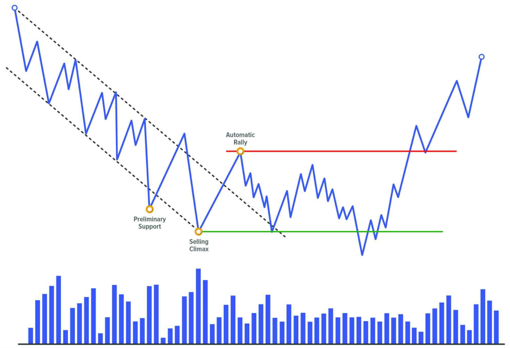

# **EVENT #3: REACTION**

Sau khi sự kiện Climax tiềm năng xuất hiện, sẽ xảy ra một **Automatic Rally hoặc Automatic Reaction** – tức một chuyển động tự động ngược chiều mạnh mẽ – xác nhận cho hành động Climax vừa diễn ra.

Đây sẽ là chuyển động quan trọng nhất kể từ khi thị trường bắt đầu Phase xu hướng trước đó. Nó cho thấy sự tham gia mạnh mẽ từ các trader theo hướng ngược lại, và đồng thời cũng là **dấu hiệu của sự thay đổi đặc tính (Change of Character – ChoCh)**.

Sự thay đổi đặc tính này có ý nghĩa rất lớn vì nó cho thấy một **sự chuyển đổi trong bối cảnh thị trường**: từ một xu hướng (lên hoặc xuống) sang một **trạng thái đi ngang/lateral**.

Sự thay đổi hành vi này sẽ được **xác nhận bởi sự kiện cuối cùng trong Phase A**: **Secondary Test**. Khi điều đó xuất hiện, ta có thể xác nhận môi trường mới mà thị trường sẽ di chuyển kể từ thời điểm đó.

---

## Ý NGHĨA CỦA REACTION

Khoảng cách di chuyển trong sự kiện Reaction là yếu tố quan trọng, vì nó sẽ được phân tích sau này để hiểu điều gì đang thực sự xảy ra – **các professional trader đang làm gì**.

Ví dụ, nếu trong một xu hướng tăng trước đó, các bước sóng tăng có biên độ trung bình là 50 điểm, và đột nhiên bạn thấy một **Automatic Rally dài 100 điểm**, điều này gợi ý rằng đáy đã được xác lập vững chắc.

Ngược lại, nếu một đợt Reaction chỉ là những chuyển động giằng co, không đi được bao xa, volume không đáng kể – điều này **cho thấy thiếu ý định mạnh mẽ để đẩy giá**, và cũng hàm ý thị trường **vẫn chưa đạt trạng thái cân bằng**. Trong những trường hợp như vậy, **Secondary Test sẽ thường xảy ra rất sớm** và có thể vượt ra ngoài biên của cấu trúc ban đầu, phản ánh sự mất cân bằng hiện tại.

Nếu bạn thấy điều này trong một mô hình Accumulation tiềm năng, bạn phải **nghi ngờ rằng có thực sự là đang tích lũy để đẩy giá lên hay không**. Với những biểu hiện yếu như vậy, có khả năng cao đây là một mô hình **Redistribution** và giá sẽ tiếp tục giảm.

Tương tự, nếu bạn đang phân tích một cấu trúc có khả năng là Distribution, nhưng đợt **Automatic Reaction** lại yếu, không xa, volume nhỏ, và Secondary Test kết thúc ở trên đỉnh của Buying Climax – thì rất có thể đây **không phải là phân phối**, mà là **Reaccumulation**.

---

## CẤU TRÚC CỦA REACTION

Thông thường, ở **đầu của chuyển động Reaction**, volume sẽ rất lớn – vì chúng ta đang ở cuối một sự kiện Climax – và điều này là bình thường.

Trong suốt quá trình di chuyển, volume sẽ giảm dần cho đến khi trở nên khá thấp. Sự khô cạn volume này **cho thấy thiếu động lực tiếp tục** và do đó, chuyển động sẽ dừng lại – đánh dấu kết thúc của **Automatic Rally hoặc Automatic Reaction**.

Tương tự với biên độ giá: đầu chuyển động sẽ là các nến mạnh, biên độ lớn, sau đó sẽ **thu hẹp dần** về cuối.

→ Qua việc luyện tập liên tục, bạn sẽ dần phát triển **trực giác thị trường** để nhận ra thời điểm biên độ và volume đã thu hẹp đến mức nào là "đủ" để giá dừng lại. Không có công thức cụ thể – đây là một **kỹ năng cần luyện cảm nhận**.

---

## CÔNG DỤNG CỦA REACTION

### 1. XÁC ĐỊNH BIÊN GIỚI CẤU TRÚC

Trong các cấu trúc theo phương pháp Wyckoff, Reaction là yếu tố rất quan trọng để xác định phạm vi Range:

- **Automatic Rally** xác định **ranh giới trên**, là vùng kháng cự rõ ràng mà sau này giá sẽ phản ứng.
- **Automatic Reaction** xác định **ranh giới dưới**, là vùng hỗ trợ nơi các lực mua có thể xuất hiện lại sau này.

---

### 2. XÁC NHẬN SỰ KIỆN CLIMAX

Trong nhiều trường hợp, **chúng ta không thể chắc chắn đâu là Climax thực sự**, cho đến khi chứng kiến phản ứng rõ rệt từ phía thị trường – tức là Automatic Rally hoặc Automatic Reaction.

- Automatic Rally sẽ **xác nhận Selling Climax** là hợp lệ.
- Automatic Reaction sẽ **xác nhận Buying Climax** là hợp lệ.

---

### 3. CUNG CẤP NGỮ CẢNH THỊ TRƯỜNG

Sau khi quan sát Event #2 (Climax) và Event #3 (Reaction), ta nhận ra **Change of Character (ChoCh)** – một thay đổi cực kỳ quan trọng cho thấy thị trường đã đổi trạng thái.

→ Ta có một **market map** mới, và biết rằng thị trường sẽ sớm kiểm tra lại điểm Climax để tạo **Secondary Test**.

**Cơ hội hành động:**

- Nếu bạn xác định chính xác được Selling Climax và Automatic Rally → bạn có thể chuyển sang khung thời gian nhỏ hơn để tìm kiếm một mô hình **minor distribution** tại đỉnh của AR – từ đó canh giá đảo chiều tạo Secondary Test.
- Nếu bạn xác định được Buying Climax và Automatic Reaction → có thể tìm kiếm một **minor accumulation** ở đáy của AR để đón cú bật lên tạo thành Secondary Test.

---

### 4. CƠ HỘI CHỐT LỜI

Nếu bạn liều lĩnh vào lệnh ngay tại Climax (như bắt đáy bắt đỉnh), thì **không nên giữ lệnh quá lâu xuyên suốt quá trình hình thành Range**, bởi vì bạn chưa thể chắc chắn liệu đây là cấu trúc xoay chiều hay tiếp diễn.

→ Hành động hợp lý là: **chốt lời tại Automatic Rally hoặc Automatic Reaction** → Scalp thành công.

---

## AUTOMATIC RALLY

**Automatic Rally** là cú bật giá mạnh mẽ xuất hiện **sau Selling Climax**, và là **dấu hiệu đầu tiên của lực cầu**.

Nó thuộc Phase A – giai đoạn dừng xu hướng trước, xảy ra sau Preliminary Support và SC.

### TẠI SAO AUTOMATIC RALLY XẢY RA?

Sau một xu hướng giảm kéo dài, có thể thị trường đã rơi vào trạng thái **quá bán**. Khi Selling Climax diễn ra, ta sẽ thấy những hành động sau:

- **Exhaustion of supply**: người bán không còn mặn mà bán nữa.
- **Short covering**: các vị thế bán trước đó bắt đầu chốt lời.
- **Demand appears**: người mua mới bắt đầu tham gia sau khi thấy Climax.

→ Giá đã ở vùng không còn hấp dẫn để tiếp tục bán nữa → thiếu cung → giá dễ tăng trở lại.

Tuy nhiên, **phần lớn các lệnh mua tại SC thường là scalp**, không giữ lâu, nên họ sẽ **bán ra tại AR**, kết thúc chuyển động tăng này.

---

## AUTOMATIC REACTION

**Automatic Reaction** là cú rơi mạnh đầu tiên sau Buying Climax – là **dấu hiệu đầu tiên của lực cung**.

Nó thuộc Phase A, sau Preliminary Supply và BC.

### TẠI SAO AUTOMATIC REACTION XẢY RA?

Giá đã tăng dài, khiến thị trường trở nên **quá mua**. Khi BC xảy ra, các hành động sau xuất hiện:

- **Exhaustion of demand**: người mua không còn hứng thú mua giá cao.
- **Long covering**: người mua trước đó bắt đầu chốt lời.
- **Supply appears**: lực bán mới tham gia sau khi thấy Climax.

→ Thiếu cầu + có thêm cung → giá dễ bị kéo xuống.

Các trader vào lệnh bán tại BC cũng thường kỳ vọng giảm ngắn hạn → sẽ chốt lời trong quá trình AR, kết thúc đợt giảm này.

---
