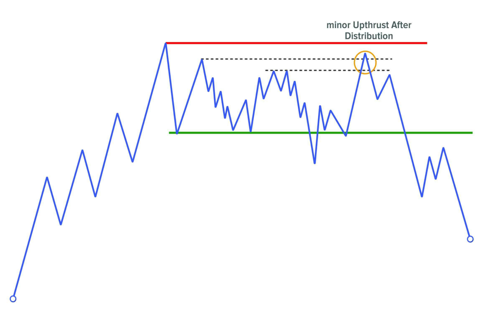

## **EVENT #5: SHAKING**

**Shaking** là sự kiện then chốt mà tất cả các nhà giao dịch theo phương pháp Wyckoff đều mong đợi. Không có sự kiện nào khác mang lại sức mạnh phân tích lớn hơn, và điều này khiến nó, theo quan điểm của tôi, trở thành sự kiện quan trọng nhất có thể xảy ra trong thị trường tài chính.

Sau một giai đoạn mà các nhà giao dịch lớn (big traders) đã xây dựng phần lớn vị thế mong muốn, họ sử dụng hành vi này như một điểm xoay chuyển (turning point) để tạo ra chuyển động xu hướng đưa giá thoát khỏi vùng range.

Để chúng ta có thể chờ đợi khả năng xuất hiện một shake tiềm năng, hai hành động cần phải xảy ra trước:

- Sự dừng lại của chuyển động xu hướng trước đó, có thể có hoặc không có volume đỉnh điểm (climatic volume).
- Sự hình thành một nguyên nhân đáng kể – tức là sự phát triển của Phase B, trong đó chúng ta suy luận rằng các nhà giao dịch chuyên nghiệp đã hấp thụ stock.

---

### ZERO-SUM GAME

Như chúng ta đã biết, do cơ chế hoạt động của thị trường tài chính dựa trên luật cung và cầu, để một lệnh được khớp, nó phải đối ứng với một lệnh có ý định ngược lại. Điều này có nghĩa là để khớp một giao dịch bán (bid), cần có một giao dịch mua (ask) đối ứng, và ngược lại.

Điều này rất quan trọng bởi vì trong sự kiện mà chúng ta đang đề cập, cũng như trong hai sự kiện "lừa gạt" khác (Preliminary Stop và Climax), tất cả các lệnh có nguồn gốc từ những nhà giao dịch kém hiểu biết – “weak hands” – đều đang bị hấp thụ bởi các nhà giao dịch chuyên nghiệp – “strong hands”.

Yếu tố then chốt khi phân tích sự kiện này là xác định mức độ *aggressiveness* mà vùng giá quan trọng bị phá vỡ và thị trường phản ứng như thế nào ngay sau hành động đó.

---

### HÀNH VI CỦA SHAKING

Hành động này rất đơn giản: đó là một chuyển động phá vỡ vùng thanh khoản trước đó – những khu vực chứa số lượng lớn lệnh chờ khớp – thoạt nhìn thì dường như có ý định thật sự đi theo hướng breakout, nhưng trên thực tế lại là một cú lừa (false break).

Điều xảy ra là: một cú breakout giả (false break) mà ở đó các big traders hấp thụ toàn bộ các lệnh chờ để bắt đầu chuyển động xu hướng mà họ mong muốn.

Đây là cách thị trường tài chính vận hành – thông qua việc tìm kiếm thanh khoản (liquidity). Nếu các nhà giao dịch lớn không thể tìm được bên đối ứng cần thiết để khớp lệnh, thì thị trường không thể di chuyển. Vì vậy, họ cần tạo ra cảm giác rằng đây là một cú break thật sự để thu hút thêm trader vào và hấp thụ toàn bộ lệnh của họ.

Nếu bạn lấy bất kỳ biểu đồ nào, bất kể thị trường hay khung thời gian, bạn sẽ thấy rằng trước bất kỳ chuyển động xu hướng lớn nào đều có một shake phát triển trước đó. Điều này là cần thiết. Việc khớp lệnh đó chính là “nhiên liệu” mà thị trường cần để bứt phá.

Hiểu được điều này sẽ nâng cấp kỹ năng giao dịch của bạn lên một vài tầm bởi vì bạn sẽ bắt đầu nhận thức rõ hơn về khả năng xảy ra hiện tượng này và theo thời gian bạn sẽ học được cách kiếm lợi nhuận từ hành vi của nó.

---

### CÁCH SPRING XUẤT HIỆN TRÊN BIỂU ĐỒ

Thông thường, shaking có thể xuất hiện dưới các dạng khác nhau:

#### TRÊN 1 NẾN

Đây là mô hình được biết đến như là nến hammer. Nó là một cây nến xuyên thủng vùng thanh khoản và sau đó hồi lại gần như toàn bộ chuyển động trong cùng cây nến đó, để lại một đuôi nến dài ở đáy.

Đuôi nến này thể hiện sự từ chối giá – tức là thị trường đã gặp phải lực đối ứng mạnh mẽ từ các trader ở phía đối diện, và họ tạm thời giành quyền kiểm soát thị trường.

#### MÔ HÌNH NHIỀU NẾN

Bản chất hành vi vẫn giống như trên, chỉ khác là chuyển động diễn ra trong một khoảng thời gian dài hơn. Nếu giá mất nhiều thời gian hơn để đảo chiều và quay trở lại vùng trước khi breakout, đó là dấu hiệu độ mạnh của shake yếu hơn.

#### CẤU TRÚC NHỎ (MINOR STRUCTURE)

Trong trường hợp này, giá giữ nguyên ở vị trí tiềm năng shake trong thời gian dài. Quyền kiểm soát thị trường không rõ ràng, do đó cần một cấu trúc nhỏ hơn đóng vai trò như một cú shake phụ cho cấu trúc lớn hơn.

Ví dụ:

- Trong vị trí tiềm năng Spring, chúng ta tìm kiếm cấu trúc tích lũy nhỏ để tạo đà đảo chiều tăng.
- Trong vị trí tiềm năng Upthrust After Distribution, ta tìm kiếm cấu trúc phân phối nhỏ để tạo đà đảo chiều giảm.

---

### CÁC CHỨC NĂNG CỦA SHAKING

Chuyển động do big traders khởi xướng này có nhiều chức năng:

#### LOẠI BỎ CÁC TRADER BREAKOUT

Trước đó, chúng ta gọi họ là greedy – những người thấy giá tạo đỉnh/đáy mới và nghĩ rằng đây là một breakout thật, nên vào lệnh, từ đó làm gia tăng áp lực lên giá.

Không chỉ trader thủ công mà các chiến lược giao dịch tự động (robot/algorithm) cũng sẽ kích hoạt lệnh tại các vùng này. Chúng còn có thể kích hoạt thêm các chiến lược dựa trên đà (momentum), tạo ra khối lượng lớn lệnh giao dịch.

#### LOẠI BỎ NHỮNG NGƯỜI SỢ HÃI

Những trader đang giữ lệnh lỗ lâu ngày và gần như kiệt sức, thấy giá tiếp tục đi ngược liền cắt lỗ để tránh lỗ sâu hơn.

#### LOẠI BỎ “NHỮNG NGƯỜI KHÔN NGOAN”

Họ đã đọc thị trường đúng và vào lệnh sớm (ví dụ: bán ở Climax, hoặc vào lệnh từ một Spring nhỏ). Nhưng cú shake cuối cùng khiến họ bị đá ra vì giá vượt stop loss.

#### TẠO LỢI NHUẬN CHO CHUYÊN GIA

Big traders tận dụng sự dịch chuyển giá do các lệnh breakout gây ra để đóng vị thế của mình và kiếm lợi nhuận.

---

### DẤU HIỆU ĐỂ NHẬN BIẾT SHAKEOUT TIỀM NĂNG

Hai yếu tố chính cần quan sát:

#### LOẠI ST XUẤT HIỆN Ở PHASE B

- Nếu là Upthrust Action (UA): thể hiện sức mạnh từ bên mua → khi giá về vùng đáy, có khả năng Spring sẽ xảy ra hơn là break giảm thật.
- Nếu là Sign of Weakness (mSOW): thể hiện sức mạnh bên bán → khi giá về đỉnh, có khả năng Upthrust sẽ xảy ra hơn là break tăng thật.

#### HÀNH VI GIÁ SAU KHI BREAKOUT

- Nếu sau khi giá break xuống, nhưng không giữ được bên dưới và quay lại range → khả năng cao là Spring.
- Nếu giá break lên nhưng không giữ được bên trên và quay lại → khả năng cao là Upthrust.

### TRÁNH NHỮNG LỖI GÁN NHÃN

Điều quan trọng cần làm rõ là **Shake** chỉ có thể được gán nhãn là **Spring** hoặc **Upthrust After Distribution (UTAD)** khi nó khởi nguồn cho chuyển động phá vỡ cấu trúc.

- **Spring** phải nhất thiết dẫn đến việc phá vỡ range theo hướng tăng. Bất kỳ điều gì khác không nên được gán nhãn là Spring. Nó chỉ đơn giản là một bài kiểm tra (test).
- Tương tự, **UTAD** phải là sự kiện shake tại đỉnh của cấu trúc và cũng phải dẫn đến phá vỡ giảm và bắt đầu xu hướng giảm ra khỏi range.

Tôi nhắc lại, để trung thành với phương pháp Wyckoff, bất kỳ điều gì khác ngoài những điều trên sẽ bị gán nhãn sai.

---

### SPRING/SHAKEOUT

Thuật ngữ **Spring** là viết tắt của từ "Springboard".  
Khái niệm này được giới thiệu bởi **Robert G. Evans**, một học trò xuất sắc của **Richard D. Wyckoff**, và là sự tinh chỉnh của khái niệm gốc được phát triển bởi Wyckoff, được gọi là **Terminal Shakeout**.

Wyckoff sử dụng thuật ngữ này để chỉ một vị trí xuất hiện trong quá trình phát triển của vùng tích lũy (accumulation range), nơi giá ở vị trí sẵn sàng thoát ra để bắt đầu một chuyển động tăng giá.

Chúng ta nhớ rằng **vùng tích lũy** là một giai đoạn trong chu kỳ thị trường (bao gồm các giai đoạn tích lũy, xu hướng tăng, phân phối và xu hướng giảm), nơi các nhà giao dịch lớn nhận thấy giá trị của thị trường (họ thấy giá bị định giá thấp) và thực hiện quá trình mua vào với ý định bán ra ở mức giá cao hơn để kiếm lợi nhuận từ chênh lệch.

---

### CÁC LOẠI SPRING

Khi giá phá vỡ hỗ trợ, chúng ta cần theo dõi sát sao hành vi giá và volume. Nếu bạn đã có vị thế mua, tùy thuộc vào cách giá giảm, bạn sẽ quyết định giữ lệnh hay thoát ngay lập tức. Nếu bạn thấy giá bật mạnh từ mức hỗ trợ với sự gia tăng nhẹ về volume, điều đó cho thấy giá đang phát triển sức mạnh kỹ thuật.

Dựa trên mức độ cung (supply) quan sát được tại thời điểm phá vỡ, có thể phân loại Spring thành ba loại:

#### SPRING #1 HOẶC TERMINAL SHAKEOUT

- **Cung xuất hiện mạnh mẽ** (sự quan tâm lớn từ người bán). Điều này được thể hiện qua sự gia tăng đột ngột về volume và sự mở rộng của biên độ giá, dẫn đến sự xuyên thủng lớn qua đường hỗ trợ.
- Trong trường hợp này, cung đang kiểm soát tình hình. Giá cực kỳ yếu và giảm mạnh.  
  ➤ Để loại Spring này thành công, cần có dòng cầu mạnh mẽ đẩy giá quay trở lại với biên độ giá rộng và volume tương đối cao.

Một dấu hiệu đầu tiên cho thấy cầu có thể đang tham gia là nếu sau khi xuyên thủng, volume vẫn cao nhưng biên độ giá bắt đầu thu hẹp.

Nếu cầu không xuất hiện, giá sẽ tiếp tục giảm và cần phải xây dựng một vùng tích lũy mới trước khi có thể xảy ra một chuyển động tăng đáng kể.

#### SPRING #2

- Quan sát thấy sự xuyên thủng vừa phải khi giá phá vỡ với sự gia tăng cả về volume và biên độ giá.
- Có một lượng cung nổi (floating supply – những trader sẵn sàng bán), nhưng không quá áp đảo như ở Spring #1.  
  ➤ Lượng cung này sẽ cần được hấp thụ bởi các nhà giao dịch chuyên nghiệp nếu họ muốn đẩy giá lên, do đó khả năng cao chúng ta sẽ thấy các bài kiểm tra liên tiếp tại khu vực này.

#### SPRING #3

- **Cung cạn kiệt** (thiếu người bán mạnh mẽ). Điều này được thể hiện qua sự xuyên thủng nhẹ, với sự giảm volume và thu hẹp biên độ giá, cho thấy sự thiếu quan tâm hoàn toàn đến việc giảm giá.

Đây là một loại Spring rất mạnh mẽ, nơi bạn có thể trực tiếp mở vị thế mua.

Ngoài ra, có một biến thể cuối cùng trong đó sự kiện xảy ra bên trong giới hạn của range. Sự kiện này thể hiện sức mạnh nền tảng lớn hơn, mặc dù các nhà giao dịch chuyên nghiệp thường thích Shake xảy ra ngoài range vì nó làm sạch tốt hơn lượng cung còn lại từ các "weak hands".

---

### SPRING TEST

Ngoại trừ Spring #3, ở các biến thể khác, cần phải có một bài kiểm tra (test) vì lượng cung hiện tại đã được quan sát và kết quả tích cực không được đảm bảo.

Hãy rất cẩn thận nếu quá trình kiểm tra chưa diễn ra vì nó có thể xảy ra vào một thời điểm sau đó. Để bài kiểm tra thành công, nó cần được phát triển với:

- Sự thu hẹp của biên độ giá,
- Sự giảm volume,
- Và giá cần được giữ trên mức của Spring/Shakeout.

Tất cả những điều này sẽ chỉ ra sự cạn kiệt của cung và gợi ý rằng giá đã sẵn sàng để bắt đầu chuyển động tăng với tương đối ít trở ngại, đại diện cho một tín hiệu mua tốt.

Nếu bài kiểm tra không đáp ứng các đặc điểm này, nó được coi là một bài kiểm tra chất lượng kém và gợi ý rằng cần có thêm các bài kiểm tra trong tương lai, vì một Spring với volume đáng kể cần được kiểm tra thành công trước khi chuyển động tăng có thể bắt đầu.

Dưới đây là phần tiếp tục dịch:

---

### THE ORDINARY SHAKEOUT

**Spring** và **Terminal Shakeout** là hai sự kiện tương tự xảy ra trong quá trình phát triển của vùng tích lũy (accumulation range). Tuy nhiên, có một biến thể khác được gọi là **Ordinary Shakeout**, được định nghĩa là một cú đẩy giảm mạnh mà không có sự chuẩn bị kỹ lưỡng trước đó, xảy ra trong quá trình phát triển của một xu hướng tăng (reaccumulation).

Điểm khác biệt chính: **vị trí xuất hiện**.  

- **Ordinary Shakeout** xảy ra trong xu hướng tăng, không phải trong vùng tích lũy.

Đặc điểm của **Ordinary Shakeout**:

- Biên độ giá rộng.
- Sự gia tăng volume.  
Tuy nhiên, volume có thể cao, trung bình hoặc thấp.

---

### THE SPRING TEST

Ngoại trừ **Spring #3**, các biến thể khác của Spring cần phải trải qua một bài kiểm tra (test) để xác nhận rằng lượng cung đã được hấp thụ và kết quả tích cực được đảm bảo.

#### Đặc điểm của một bài kiểm tra thành công

- Biên độ giá thu hẹp.
- Volume giảm.
- Giá được giữ trên mức của Spring/Shakeout.

Những yếu tố này cho thấy cung đã cạn kiệt và giá sẵn sàng bắt đầu một chuyển động tăng với ít trở ngại, tạo ra một tín hiệu mua tốt.

#### Nếu bài kiểm tra không thành công

- Nếu bài kiểm tra không đáp ứng các đặc điểm trên, nó được coi là một bài kiểm tra chất lượng kém.
- Điều này gợi ý rằng cần có thêm các bài kiểm tra trong tương lai, vì một Spring với volume đáng kể cần được kiểm tra thành công trước khi chuyển động tăng có thể bắt đầu.

---

### UPTHRUST AFTER DISTRIBUTION (UTAD)

**Upthrust After Distribution (UTAD)** là một cú đẩy tăng xảy ra như một sự kiện kiểm tra (test) trong Phase C của vùng phân phối (distribution) hoặc tái phân phối (redistribution).

#### Đặc điểm của UTAD

- Đây là một chuyển động tăng nhằm kiểm tra khả năng của bên mua trong việc đẩy giá lên cao hơn, thường đến một khu vực quan trọng như phá vỡ các đỉnh trước đó.
- Về lý thuyết, nó là một **Upthrust (UT)**, nhưng khi xảy ra trong Phase C, nó được gọi là **UTAD**, bất kể có các Upthrust trước đó trong Phase B hay không.

#### Volume trong UTAD

- Volume quan sát được thường ở mức trung bình hoặc cao, thể hiện số lượng lớn lệnh giao dịch tại khu vực quan trọng này.

---

### THE MINOR UPTHRUST AFTER DISTRIBUTION

Tương tự như **Minor Spring**, **Minor UTAD** là một cú đẩy tăng nhỏ xảy ra trong cấu trúc.

#### Đặc điểm của Minor UTAD

- Cú đẩy này đạt đến một số đỉnh trước đó.  
- Mặc dù lý tưởng là chờ bẫy xảy ra tại giới hạn trên của cấu trúc, nhưng thực tế loại bẫy nhỏ này cho thấy sự kiểm soát mạnh mẽ từ bên bán, vì họ không cho phép giá tăng cao hơn và đã xuất hiện lực bán mạnh tại các đỉnh trước đó.

#### Gán nhãn Minor UTAD

- Mặc dù UTAD chỉ là sự kiện shake tại đỉnh của cấu trúc, nhưng nếu chuyển động không đạt đến các đỉnh cao nhất, nó vẫn có thể được coi là một **Minor UTAD**.  
- Tuy nhiên, theo phương pháp Wyckoff, sự kiện này có thể chỉ được coi là **Last Point of Supply (LPSY)**.

---

### THE UPTHRUST AFTER DISTRIBUTION TEST

#### Có cần bài kiểm tra sau UTAD không?

- Một bài kiểm tra thứ cấp (Secondary Test) không phải lúc nào cũng xuất hiện sau UTAD.  
- Điều này là do lượng cung lớn đã tham gia thị trường, gây ra chuyển động giảm ngay lập tức dưới dạng **Sign of Weakness (SOW)**.

#### Lợi ích của bài kiểm tra

- Mặc dù bài kiểm tra không phải lúc nào cũng xảy ra, nhưng việc chờ đợi nó sẽ giúp bạn tránh được việc vào lệnh bán sai lầm trong trường hợp chuyển động thực sự là một cú phá vỡ tăng (JAC/MSOS).

#### Đặc điểm của bài kiểm tra thành công

- Biên độ giá và volume giảm.
- Giá dừng lại dưới mức UTAD, cho thấy sự cạn kiệt của bên mua và xác nhận kịch bản phân phối.

#### Nếu bài kiểm tra không thành công

- Nếu giá không giảm dưới mức UTAD hoặc volume tăng cao, bạn nên nghi ngờ về cú shake này, ngay cả khi giá đang tạo các đỉnh thấp hơn.  
- Trong trường hợp này, tốt nhất là chờ thêm tín hiệu bổ sung trước khi vào lệnh bán (ví dụ: các cú shake mới hoặc các bài kiểm tra thành công liên tiếp).

---

### TERMINAL UPTHRUST

**Terminal Upthrust** tương tự như **Terminal Shakeout**. Nó có các đặc điểm giống với một **Upthrust** thông thường, nhưng phạm vi hành động thường nghiêm trọng hơn.

#### Đặc điểm của Terminal Upthrust

- Volume có thể cực kỳ cao.
- Sự xuyên thủng có thể rất lớn.  
Tuy nhiên, kết quả vẫn giống nhau: trong một khoảng thời gian ngắn, giá quay trở lại vùng range, cho thấy áp lực giảm mạnh.

---

### ORDINARY UPTHRUST

Tương tự như **Ordinary Shakeout**, **Ordinary Upthrust** là một cú đẩy tăng xảy ra mà không có sự chuẩn bị kỹ lưỡng trong quá trình phát triển của xu hướng giảm.
Đây là một cơ hội rất thú vị để vào lệnh bán, vì bạn sẽ giao dịch theo xu hướng phân phối gần đây nhất.
