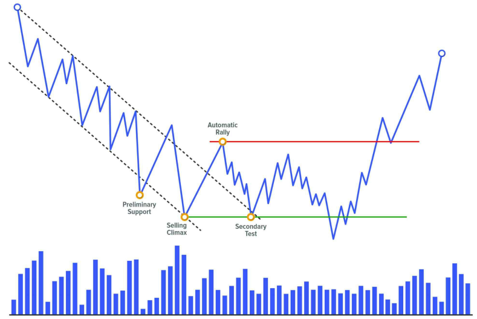
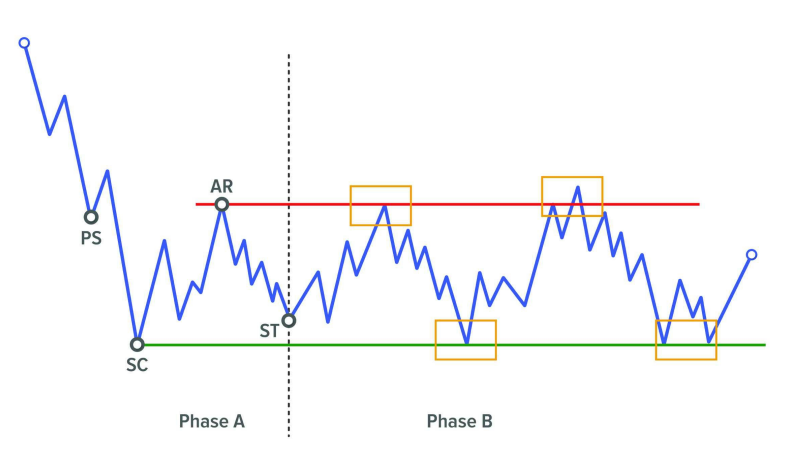
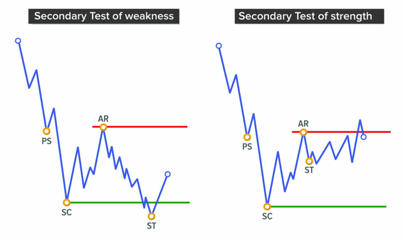
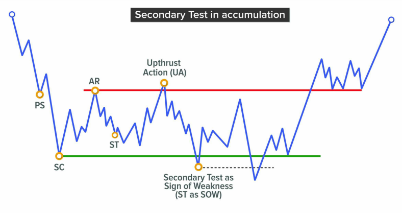
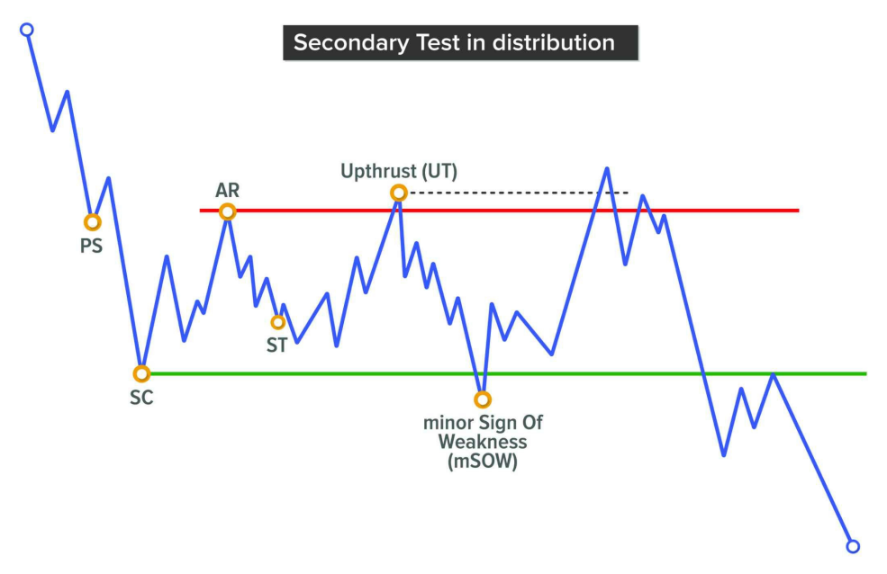
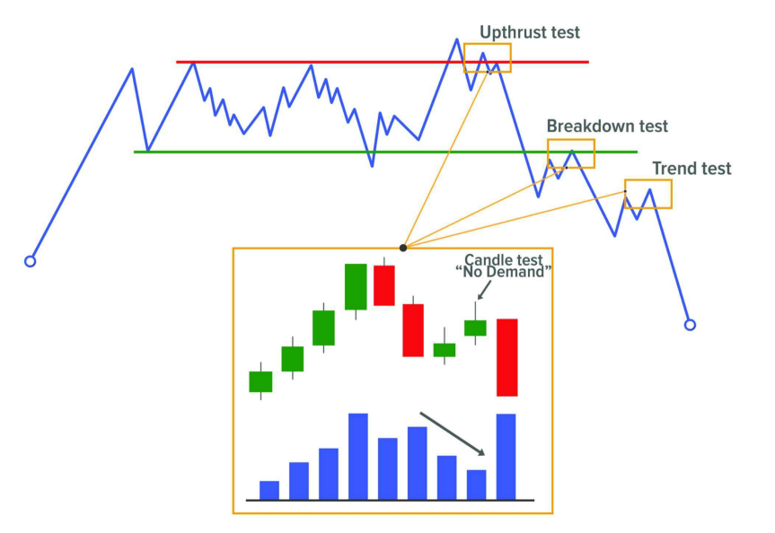
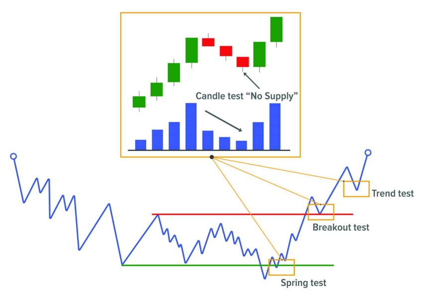

# **EVENT #4: TEST**

Test là hành động giá quay lại kiểm tra một vùng kháng cự/hỗ trợ quan trọng đã hình thành trước đó (thường là sau Climax, Spring, Upthrust…)
Mục tiêu là để xác định xem lực cung/cầu còn tồn tại hay không.

## SECONDARY TEST

**Secondary Test** là sự kiện thứ tư trong các mô hình Accumulation theo phương pháp Wyckoff. Đây là sự kiện đánh dấu kết thúc **Phase A**, chấm dứt xu hướng trước đó và mở đầu cho **Phase B** – giai đoạn xây dựng nguyên nhân.

---

## CHỨC NĂNG CỦA SECONDARY TEST

Giống như mọi sự kiện khác trong chuỗi Wyckoff, một điểm quan trọng khi xác định được Secondary Test là **nó cung cấp cho chúng ta bối cảnh thị trường** – một tín hiệu cho thấy từ giờ trở đi thị trường sẽ chuyển sang giai đoạn đi ngang.

Điều này rất quan trọng, vì trong Phase B, hành vi giá sẽ dao động lên xuống giữa hai biên của range.

Với bối cảnh này, chiến lược giao dịch hợp lý sẽ là **canh giá tại hai đầu biên** của range để bắt các điểm đảo chiều. Có thể thực hiện điều này bằng cách sử dụng mô hình nến, hoặc chuyển sang khung thời gian nhỏ hơn để tìm cấu trúc xoay chiều (nếu giá đang ở vùng trên – tìm mô hình phân phối nhỏ; nếu đang ở vùng dưới – tìm mô hình tích lũy nhỏ).

Về mặt chức năng, **Secondary Test là sự xác nhận rằng lực bán chủ động trước đó đã rút lui**, thị trường tiến tới trạng thái cân bằng – nơi lực mua và lực bán chấp nhận giao dịch với nhau (xây dựng nguyên nhân cho chuyển động tiếp theo).

---

## ĐẶC ĐIỂM CỦA SECONDARY TEST

Để Secondary Test được xem là thành công, chuyển động giảm phải đi kèm:

- **Giảm dần biên độ nến**.
- **Khối lượng giao dịch thấp hơn so với Selling Climax**.

Mặc dù một số tác giả cho rằng **Secondary Test phải nằm trên đáy của Selling Climax**, nhưng nên nhớ thị trường không cứng nhắc – cần linh hoạt trong đánh giá hành động giá.

Một cách hữu ích để nhìn Secondary Test là: nếu nó diễn ra ở **nửa trên của range**, có thể là dấu hiệu lực mua đang kiểm soát; nếu nó **rơi thấp hơn đáy SC**, thì có thể lực bán vẫn còn chiếm ưu thế.

Những đặc điểm này, cùng các yếu tố khác, sẽ giúp xác định **đây là mô hình tích lũy hay phân phối** – càng nhiều dấu hiệu về một phía, xác suất phân tích càng cao.

👉 Điều quan trọng nhất: **giảm volume và thu hẹp biên độ**. Volume phản ánh hoạt động thị trường, nên sau một sự kiện Climax, nếu volume giảm → thiếu quan tâm từ phía đó.

---

## SECONDARY TEST TRONG PHASE B

Mặc dù Secondary Test "chính thức" nằm trong Phase A, nhưng hành vi tương tự sẽ tiếp tục xuất hiện trong các Phase sau.

Khi vào Phase B, ta sẽ chờ các **bài test tại hai đầu biên của range** để đánh giá sức mạnh/yếu của lực mua và lực bán. Có thể sẽ có test ở cả phía trên và phía dưới.

### SECONDARY TEST Ở VÙNG TRÊN

Giá vượt qua đỉnh cũ (từ hành động dừng trước đó), nhưng nhanh chóng quay lại bên trong range → tạo một cú Shake nhẹ.

- Ban đầu, điều này cho thấy **sức mạnh tiềm ẩn**, vì giá vượt kháng cự là dấu hiệu có lực mua mạnh.
- Cần theo dõi kỹ để xác định liệu đó có phải là lực mua thực sự (tích lũy) hay lực bán đang tận dụng để phân phối.

Nếu là mô hình Accumulation/Reaccumulation → gọi là **Upthrust Action (UA)**.

Nếu là mô hình Distribution/Redistribution → gọi là **Upthrust (UT)**.

→ Khác nhau duy nhất giữa UA và UT là **niềm tin vào bối cảnh tích lũy hay phân phối** tại thời điểm đó.

Nếu UA xảy ra và giá giữ trên kháng cự trong thời gian dài trước khi rơi lại → có thể gọi là **minor Sign of Strength (mSOS)** – dấu hiệu lực mua đáng tin cậy hơn.

---

### SECONDARY TEST Ở VÙNG DƯỚI

Đây là bài test tạo đáy mới. Có thể đến từ:

- Sự chủ động mạnh của lực bán.
- Hoặc sự thiếu vắng quan tâm từ phía người mua.

→ Báo hiệu **yếu cơ bản**, do người bán muốn thoát càng nhanh càng tốt.

Từ đáy mới này, ta có thể vẽ một **ngưỡng hỗ trợ mới**, nơi có thể xảy ra break giảm thật sự, hoặc cú Shake cuối cùng trước khi tăng.

Nếu là mô hình tích lũy, ta gọi sự kiện này là:

- **Secondary Test as Sign of Weakness (ST as SOW)** – thường xảy ra khi Secondary Test Phase A đã phá đáy SC → thị trường cực kỳ yếu.

Nếu là mô hình phân phối, gọi là:

- **minor Sign of Weakness (mSOW)** – thường xuất hiện khi ST Phase A có cú phản ứng rất yếu.

📌 Ta chỉ biết được nhãn gọi nào đúng sau khi giá phá range theo hướng nào. Vì vậy, **để đơn giản**, có thể dùng nhãn chung: **ST in B (Secondary Test in Phase B)**.

---

## GENERIC TEST

Về định nghĩa, Test là **hành động đánh giá xem bên nào đang kiểm soát thị trường**.

- Nếu giá chạm vùng có volume cao trong quá khứ:
  - Mà giờ volume thấp → thiếu quan tâm → thị trường sẵn sàng đi theo hướng ít kháng cự → test hợp lệ.
  - Mà giờ volume vẫn cao → còn lực cản → test chưa hợp lệ.

→ **Test là thời điểm tốt để vào lệnh**, vì nếu hợp lệ, ta đang đi cùng phe mạnh hơn.

---

## NHỮNG VỊ TRÍ TEST NÊN THEO DÕI

### TEST SAU SHAKE (SPRING/UPTHRUST TEST)

Diễn ra trong **Phase C**, ngay trước khi breakout. Đây là thời điểm có **tỷ lệ risk/reward tốt nhất**, vì:

- Stop Loss đặt sát đáy/đỉnh (gần Shake).
- Mục tiêu lợi nhuận có thể là Creek hoặc xa hơn.

---

### TEST SAU BREAKOUT

Xảy ra trong **Phase D**, khi giá vừa bắt đầu breakout. Mục tiêu là đánh giá xem **break này là thật hay là Shake**.

- R:R không tốt bằng test sau Shake.
- Nhưng nếu phân tích đúng, giá sẽ phát triển xu hướng theo toàn bộ nguyên nhân tích lũy trước đó.

→ Có thể đặt Stop Loss tại vùng giữa range. Take Profit có thể dựa trên:

- Fibonacci.
- Đo chiều cao range.
- Hoặc các vùng thanh khoản.

---

### TEST TRONG XU HƯỚNG (PHASE E)

Khi giá đã vào **Phase E**, đôi khi vì đà quá mạnh, thị trường không kịp tạo cấu trúc mới.

→ Lúc này, **test trong trend** có thể là cơ hội duy nhất để nhảy vào.

- Nếu target kỹ thuật đã đạt, nên tránh vào lệnh vội.
- Stop Loss nên đặt sau cú Shake + test tiếp theo.
- TP nên là vùng có thanh khoản đang chờ.

---

## CÁCH TEST HIỆN TRÊN BIỂU ĐỒ

Trong Volume Spread Analysis (VSA), các mẫu nến test còn gọi là:

- **No Demand** (nến tăng nhỏ, volume thấp).
- **No Supply** (nến giảm nhỏ, volume thấp).

Điều kiện test hợp lệ:

- Volume thấp hơn hai nến trước.
- Nếu đang ở vùng có **strength background** → test là **No Supply** (nến giảm nhỏ).
- Nếu đang ở vùng có **weakness background** → test là **No Demand** (nến tăng nhỏ).

---

## SỰ KHÁC BIỆT GIỮA SECONDARY TEST VÀ GENERIC TEST

Về bản chất, cả hai đều là **hành động kiểm tra lực lượng tham gia thị trường**. Điều kiện hợp lệ: giảm volume + giảm biên độ.

- **Secondary Test** là sự kiện đặc thù của Wyckoff, nằm trong cấu trúc, mang ý nghĩa chiến lược.
- **Generic Test** là khái niệm trong VSA, tập trung vào hành vi giá và khối lượng, không quan tâm vị trí cấu trúc.

---
