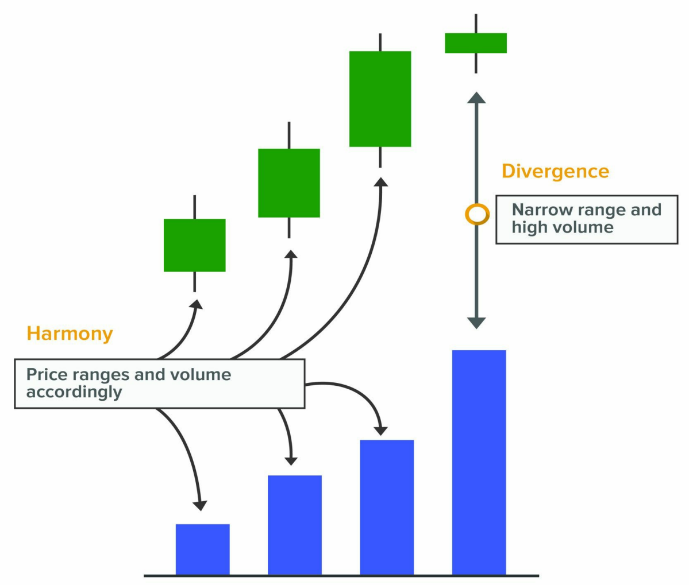
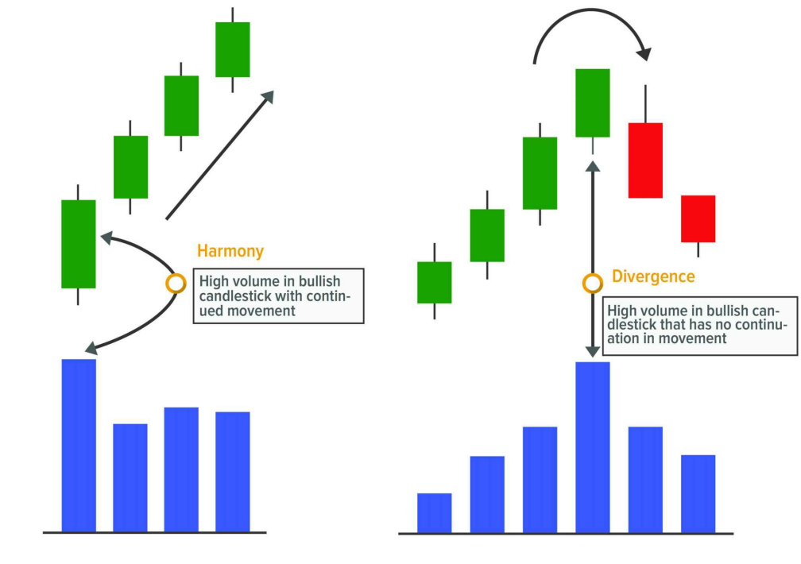
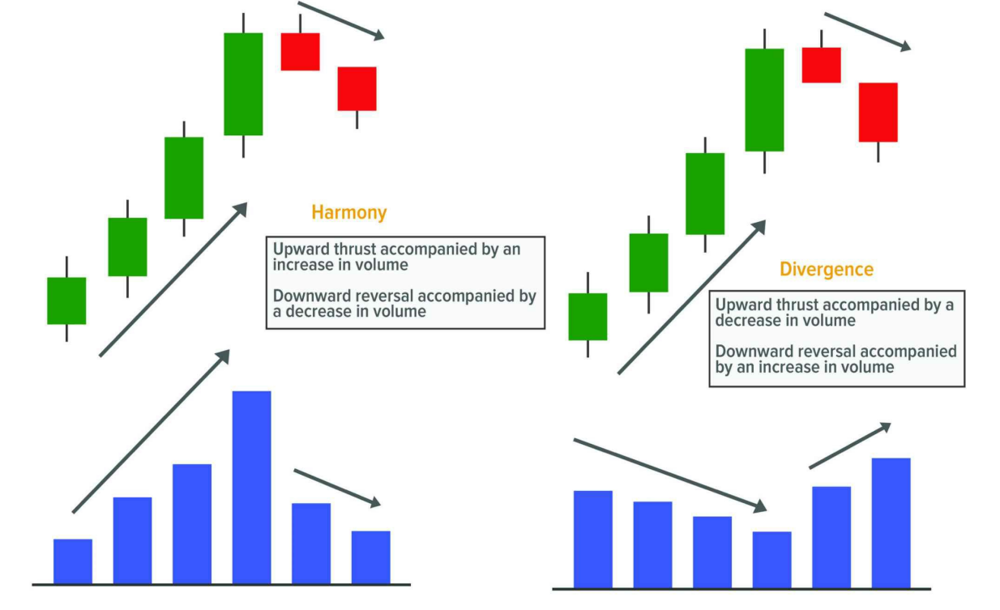
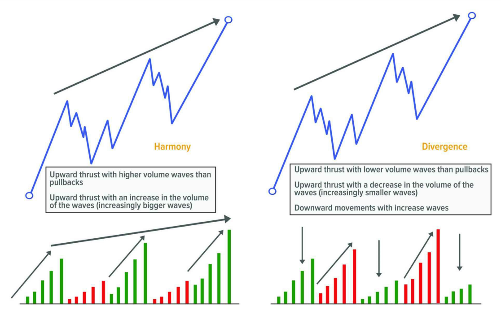
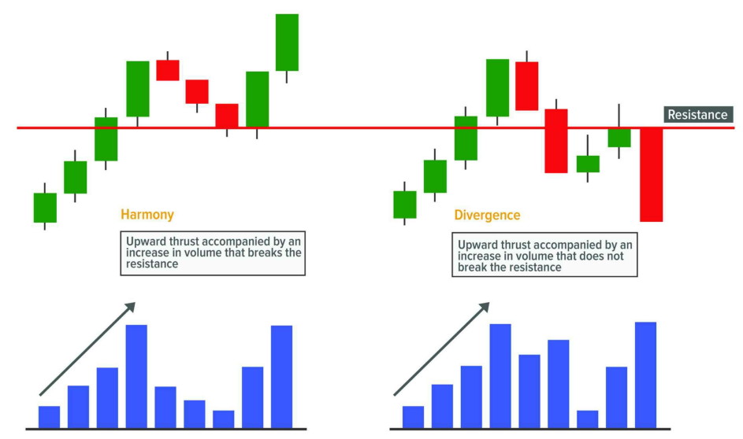

# **🎓 LUẬT CUNG VÀ CẦU**

---

## 🧠 1. Cốt lõi mọi thứ: **Cung – Cầu là nguồn gốc của giá**

Mọi giá trị trên thị trường đều đến từ **cung và cầu** – thứ đã tồn tại từ khi con người biết trao đổi.

- **Nếu có nhiều người muốn mua hơn bán**, thì người bán **nắm thế chủ động** → họ nâng giá lên → **giá tăng**.
- **Nếu có nhiều người muốn bán hơn mua**, thì người mua chiếm thế chủ động → họ ép giá xuống → **giá giảm**.
- **Nếu cung = cầu** → giá **đi ngang**.

> Đơn giản vậy thôi. Nhưng thị trường hiện đại không cho bạn thấy rõ điều đó, vì nó ẩn sau hàng triệu lệnh trong sổ lệnh (orderbook).

---

## ⚠️ 2. Hiểu sai phổ biến: “Nhiều người mua thì giá tăng”

**SAI.**

Trên thị trường, **luôn có số lượng mua = bán**.  
Vì **mỗi lệnh mua luôn phải khớp với một lệnh bán** thì giao dịch mới xảy ra.

👉 Vậy nếu “ai cũng đang mua”, thì ai là người bán cho họ?  
→ Chính là “tay to”, người đang **xả hàng cho bạn khi bạn mua hưng phấn**.

---

## 🧮 3. Làm rõ khái niệm: **Lệnh giới hạn (limit) vs. Lệnh thị trường (market)**

| Loại lệnh     | Đặc điểm                             | Vai trò thị trường              |
|---------------|--------------------------------------|----------------------------------|
| **Limit Order**  | Treo chờ – mua thấp, bán cao           | Thể hiện **ý định** – **CUNG/CẦU** |
| **Market Order** | Khớp ngay – chấp nhận giá hiện tại     | **Hành động thực sự** – **đẩy giá** |

**Cung và cầu thực sự** = lệnh limit.  
**Người làm giá di chuyển** = lệnh market.

---

## 🧗 4. Giá di chuyển như thế nào?

### 📈 Giá muốn tăng

1. Có người dùng **lệnh mua thị trường (market buy)** → hệ thống khớp lệnh với các **lệnh bán limit (ASK)** đang chờ.
2. Mua hết lệnh ASK tại mức hiện tại → tiếp tục mua cao hơn → **giá nhảy lên**.
3. Có thể kích hoạt **stoploss của người đang bán khống (short)** → họ phải **mua lại để cắt lỗ** → càng đẩy giá tăng nhanh hơn.

### 📉 Giá muốn giảm

1. Có người dùng **lệnh bán thị trường (market sell)** → khớp với các **lệnh mua limit (BID)** đang chờ.
2. Bán hết lệnh BID ở mức hiện tại → tiếp tục bán thấp hơn → **giá tụt xuống**.
3. Có thể kích hoạt **stoploss của người đang mua (long)** → họ bị bán tháo → giá giảm sâu hơn.

📌 **Chỉ lệnh thị trường mới di chuyển được giá.**  
Lệnh limit **chỉ là tường rào – không tự tạo chuyển động**.

---

## 📉 5. Khi bên kia **rút lui**, giá cũng đi mạnh

Giá không chỉ đi vì bên này mạnh, mà đôi khi **chỉ vì bên kia... biến mất**.

### 🧠 Ví dụ dễ hiểu

Bạn vào siêu thị thấy mỗi chai nước 10.000đ.  
Hôm sau, tất cả người bán rút đi → bạn **phải trả cao hơn** để mua được → giá tự tăng.

→ Trên thị trường cũng vậy:

- Nếu **người bán rút lệnh ASK khỏi sổ lệnh** → giá tăng dễ dàng dù người mua ít.
- Nếu **người mua rút lệnh BID khỏi sổ lệnh** → giá rớt mạnh dù bên bán không quá hung hãn.

📌 Đây là **thiếu thanh khoản một phía**, và cực kỳ quan trọng trong phân tích Wyckoff.

---

## 🔍 6. Volume nói cho bạn biết “cuộc chiến” đang diễn ra thế nào

Wyckoff dạy rằng: **không cần biết ai mua – bán**, bạn chỉ cần **đọc hành động giá và volume** là biết ai thắng.

### 🤔 Ví dụ

- Volume tăng vọt, mà giá **không nhúc nhích** → có lực **hấp thụ rất mạnh** từ phía ngược lại.
- Volume tăng mà giá **bật mạnh** → bên kia đã **kiệt sức**.

> **Volume = Nỗ lực.**  
> **Giá = Kết quả.**  
→ Phân tích mối quan hệ giữa nỗ lực & kết quả = bạn đọc được trận đấu.

---

## ✅ 7. Kết luận siêu dễ hiểu

| Câu hỏi                         | Trả lời Wyckoff Style                       |
|---------------------------------|---------------------------------------------|
| Tại sao giá tăng?              | Bên mua **chủ động tấn công**, hoặc bên bán **rút lui** |
| Tại sao giá giảm?              | Bên bán **chủ động tấn công**, hoặc bên mua **rút lui** |
| Cung cầu có nghĩa là gì?       | Là **các lệnh limit** treo chờ trong sổ lệnh |
| Ai làm giá nhảy?               | Người dùng **lệnh thị trường (market orders)** |
| Đọc volume để làm gì?          | Để biết “nỗ lực” bên nào đang chiếm ưu thế |
| Volume lớn mà giá đứng yên?    | Có lực hấp thụ ngược lại → nguy hiểm       |
| Volume nhỏ mà giá nhảy mạnh?   | Bên kia không còn sức kháng cự → xu hướng mạnh |

---

# **🎓 QUY LUẬT NHÂN VÀ QUẢ**

---

## 🧠 1. Mọi chuyển động giá **đều có nguyên nhân**

Bạn không thể thấy giá tăng hoặc giảm mạnh **mà không có gì xảy ra trước đó**.

> 🧩 Nếu bạn thấy **giá bay vút lên**, hãy biết rằng **đã có điều gì đó được “nấu nướng” trước đó**.

Đó là điều cốt lõi của **quy luật nhân – quả**:

- **Nhân (Cause)**: là quá trình tích lũy hoặc phân phối diễn ra trong **vùng đi ngang**.
- **Quả (Effect)**: là **cú tăng hoặc giảm mạnh sau đó** – tức là xu hướng.

---

## 🏗 2. Nguyên nhân được xây dựng trong vùng sideway

Khi giá **đi ngang một thời gian**, nó không phải đang "nghỉ mệt" – mà là:

- Các tay to đang **gom hàng (tích lũy)** hoặc **xả hàng (phân phối)**.
- Dần dần loại bỏ các trader nhỏ khỏi thị trường.

⛏ Họ đang “chuẩn bị cho một cú đi lớn”, nhưng không để bạn biết điều đó.

> 📌 Tích lũy kỹ → tăng mạnh  
> 📌 Phân phối dài → rớt sâu

---

## 📏 3. Nhân lớn → Quả lớn | Nhân nhỏ → Quả nhỏ

Quy luật Wyckoff dạy rằng:

- **Thời gian tích lũy càng lâu** → cú tăng sau đó càng xa.
- **Vùng phân phối càng dài** → cú sập càng sâu.

🧠 Bạn tưởng tượng như **kéo dây thun**:

- Kéo mạnh (gây căng lâu) → bật rất xa.
- Kéo nhẹ → bật yếu.

➡️ Vì vậy, nếu bạn thấy **giá sideway lâu, volume cao** → có thể tay to đang tạo "nguyên nhân".

---

## ⚠️ 4. Không phải mọi range đều có “nguyên nhân”

Không phải cứ giá đi ngang là có tích lũy hay phân phối.

Có những vùng đơn giản chỉ là:

- Giá lưỡng lự, không bên nào mạnh.
- Dao động vì không ai thực sự quan tâm.

📌 Vì vậy, **không nên ép buộc** range nào cũng là tích lũy/phân phối.  
Hãy quan sát xem có dấu hiệu hấp thụ, shakeout, trap… hay không.

---

## 💥 5. Đôi khi cú nổ xảy ra **mà không có chuẩn bị**

Có những cú tăng/giảm đột ngột xuất hiện:

- Do **tin tức**, **climax candle**, hoặc
- Một tay to **vào lệnh dứt khoát**, không cần chuẩn bị lâu.

➡️ Trong trường hợp này, **nguyên nhân rất ngắn** nhưng **tác động vẫn xảy ra**.

Những cú như vậy **rủi ro cao**, dễ là “fomo trap” – bạn cần cảnh giác.

---

## 📐 6. Dự đoán “quả” bằng biểu đồ **Point and Figure**

Wyckoff dùng một công cụ rất hay để:

- Đo xem **hiệu ứng (tăng/giảm)** sẽ mạnh cỡ nào,
- Dựa vào **nguyên nhân (range tích lũy/phân phối)** đã xảy ra.

Công cụ đó là: **biểu đồ Point & Figure**.

---

### 🧮 Nguyên tắc

- **Không theo thời gian**, mà theo **biến động giá (volatility)**.
- Được vẽ bằng **ô vuông** (box) → di chuyển **khi giá đủ thay đổi**.

#### 📏 Cách đo

**Đếm số cột nằm ngang (columns)** giữa các điểm:

| Trường hợp                       | Đếm từ…                          | Đến…                          |
|----------------------------------|----------------------------------|-------------------------------|
| Tích lũy (accumulation)         | SC/PS (SC = selling climax)     | LPS (last point of support)   |
| Phân phối (distribution)        | BC/PSY (buying climax)          | LPSY (last point of supply)   |
| Tái tích lũy (reaccumulation)   | AR (automatic reaction)         | LPS                           |
| Tái phân phối (redistribution)  | AR (automatic rally)            | LPSY                          |

→ **Tổng số cột × giá trị mỗi ô (box)** = khoảng di chuyển dự đoán.

---

### 📈 Cách dùng

- **Tích lũy** → cộng vào đáy → ra target tăng.
- **Phân phối** → trừ từ đỉnh → ra target giảm.
- Có thể chia nhỏ range để tính nhiều mục tiêu khác nhau: **target nhỏ – vừa – lớn**.

📌 Tuy nhiên, biểu đồ này có hạn chế:

- Có nhiều cách vẽ → dẫn tới **kết quả khác nhau** → gây nghi ngờ, thiếu chính xác.

---

## 🛠 7. Các công cụ thay thế hiện đại hơn

Một số trader hiện đại chọn không dùng Point & Figure nữa vì:

- Quá phức tạp để vẽ bằng tay.
- Dễ nhầm nếu không chuyên sâu.

🔧 Thay vào đó, họ dùng các công cụ dễ dùng hơn như:

- **Fibonacci projection**
- **Sóng Elliott**
- **Harmonic patterns (AB=CD, Gartley, Bat...)**

Lý do?  
👉 Nhiều **phần mềm & robot giao dịch hiện nay được lập trình dựa trên các công cụ này**, nên xác suất "target đúng" cao hơn.

---

## ✅ Kết luận cuối cùng

- **Giá không tự nhiên mà tăng/giảm** – nó đến từ “nguyên nhân” đã xảy ra trước đó.
- Khi bạn thấy giá đi ngang lâu, hành động giá rõ ràng → đó có thể là tay to đang **tạo nguyên nhân**.
- Khi cú đi xuất hiện → đó là **kết quả của sự chuẩn bị**.

🎯 **Nhiệm vụ của trader theo Wyckoff**:  
Tìm vùng tích lũy/phân phối → phân tích kỹ hành động giá và volume → **định vị sớm trước khi xu hướng xảy ra**.

> Một xu hướng kết thúc, thì **một nguyên nhân mới bắt đầu**.  
> Một nguyên nhân hoàn tất, thì **một xu hướng sẽ khởi động**.  
> Phương pháp Wyckoff chính là nghệ thuật đọc được sự chuyển giao đó.

---
Dưới đây là phần **diễn giải CHƯƠNG 9 – QUY LUẬT NỖ LỰC VÀ KẾT QUẢ (Effort and Result)** theo **phong cách Feynman**, cực dễ hiểu nhưng vẫn đầy đủ chi tiết và ví dụ cụ thể:

---

# **🎓 QUY LUẬT NỖ LỰC VÀ KẾT QUẢ**

---

## 🧠 1. Khái niệm cơ bản

> **Volume là nỗ lực. Giá là kết quả.**

Nói cách khác, **nếu có nỗ lực – phải có kết quả**.  
Nếu **volume tăng vọt mà giá không đi đâu cả** → điều gì đó đang không ổn.

---

## 🧃 2. Nỗ lực đến từ đâu?

- **Volume** đại diện cho **bao nhiêu hàng hóa (cổ phiếu, hợp đồng...) được giao dịch**.
- Khi có **người chơi lớn (tay to)** vào thị trường, họ để lại dấu vết qua **volume đột biến**.

📌 Vì vậy:  
> Volume lớn = tay to đang có mặt  
> Volume nhỏ = thị trường không quan tâm

---

## 🔄 3. Harmony vs Divergence (Hài hòa hay mâu thuẫn?)

### ✨ **Harmony (Hài hòa)**  

- Volume tăng → giá tăng → **hợp lý**  
- Volume giảm → giá sideway hoặc hồi nhẹ → **hợp lý**

👉 Tức là: **nỗ lực đi cùng kết quả**.

### ⚠️ **Divergence (Mâu thuẫn)**  

- Volume tăng → giá không tăng → có lực kháng cự  
- Giá tăng → volume lại giảm → tăng không bền

👉 Nỗ lực và kết quả **không ăn khớp nhau** → **dấu hiệu đảo chiều**.

### 📊 Bảng phân tích Harmony - Divergence

| **Dạng gợi ý**         | **Trong quá trình hình thành một cây nến**            | **Diễn biến sau đó của giá**                                  | **Trong xu hướng (movements)**                             | **Theo sóng (waves)**                                     | **Tại các mức quan trọng**                                 |
|------------------------|--------------------------------------------------------|----------------------------------------------------------------|-------------------------------------------------------------|-------------------------------------------------------------|-------------------------------------------------------------|
| **Hài hòa (Harmony)**  | Volume cao → nến có biên độ lớn                        | Volume cao → nến tăng & giá tiếp tục tăng                      | Volume cao trong pha đẩy (impulse)                         | Sóng tăng có volume tăng                                  | Volume cao và phá vỡ được mức quan trọng                   |
|                        | Volume thấp → nến biên hẹp                              | Volume cao → nến giảm & giá tiếp tục giảm                      | Volume thấp trong pha hồi (pullback)                       | Sóng giảm có volume giảm                                  | Volume thấp và không phá vỡ được mức quan trọng            |
| **Mâu thuẫn (Divergence)** | Volume cao → nến biên hẹp                           | Volume cao → nến tăng nhưng giá không tăng tiếp                | Volume thấp trong pha đẩy (impulse)                        | Sóng tăng có volume giảm dần                              | Volume cao nhưng không phá được mức quan trọng             |
|                        | Volume thấp → nến biên rộng                             | Volume cao → nến giảm nhưng giá không giảm thêm                | Volume cao trong pha hồi (pullback)                        | Sóng giảm có volume tăng dần                              | Volume thấp nhưng lại phá được mức quan trọng              |

---

## 📊 4. Phân tích theo từng cấp độ

---

### 🕯 A. Trong từng cây nến

- Mỗi cây nến là **kết quả của trận chiến giữa mua và bán**.
- Nếu:
  - **Nến dài + volume cao** → sức mạnh thật → **harmony**
  - **Nến nhỏ + volume cao** → không đi được → **divergence**

---

### 🔁 B. Phản ứng của cây nến tiếp theo

- Sau một cây nến có volume lớn, bạn chờ xem **giá đi tiếp hay quay đầu**.

Ví dụ:

- Volume lớn → giá tiếp tục đi đúng hướng → **harmony**
- Volume lớn → nến sau quay đầu → **divergence**

---

### 📈 C. Trong một xu hướng

- **Xu hướng mạnh**:
  - Đẩy giá đi kèm với volume tăng → **harmony**
  - Hồi lại nhẹ, volume giảm → **bình thường**

- **Dấu hiệu suy yếu**:
  - Giá tăng nhưng volume ngày càng giảm → **divergence**
  - Hồi xuống mà volume lại tăng → bên bán đang mạnh lên

---

### 🌊 D. Phân tích theo sóng (Wave Analysis)

- Phương pháp này (do David Weis phát triển) giúp bạn **đo volume theo từng sóng tăng/giảm**.

Cách đọc:

- Sóng tăng → volume tăng → **harmony**
- Sóng tăng → volume yếu dần → **divergence**
- Sóng giảm → volume yếu → chỉ là hồi nhẹ
- Sóng giảm → volume mạnh → dấu hiệu đảo chiều

> 📌 Quan trọng: Volume trong sóng tăng **không phải toàn là mua**, và ngược lại.

---

### 🚧 E. Khi giá chạm các mức quan trọng (key level)

- Nếu giá chạm mức kháng cự hỗ trợ **với volume lớn và phá vỡ rõ ràng** → **harmony**
- Nếu chạm rồi phá giả (false breakout) → **divergence**

📌 Áp dụng cho:

- Hỗ trợ/kháng cự ngang
- Đường xu hướng
- MA, VWAP, Bollinger Bands
- Kênh giá, đường chéo...

---

### 📉 F. Trong xu hướng dài hạn

- Cuối một xu hướng, nếu bạn thấy:
  - **Volume lớn mà giá không còn đi nhiều**  
  → thị trường đang **mất động lực**  
  → có thể là **điểm đảo chiều**.

Ví dụ:

- Downtrend dài → volume đột ngột tăng mà giá không giảm nhiều → có thể là **selling climax** → bắt đầu tích lũy.
- Uptrend dài → volume tăng đột ngột mà giá đứng → **dấu hiệu phân phối**.

---

### 😴 G. Không có nỗ lực = cũng là tín hiệu

> "Không phải lúc nào đảo chiều cũng cần volume lớn."

- Nếu sau một downtrend dài → volume nhỏ dần → không còn ai bán nữa
  → chỉ cần người mua xuất hiện → giá có thể quay đầu.

Tương tự:

- Sau uptrend dài → volume cạn kiệt → không còn ai muốn mua → chỉ cần người bán xuất hiện → giá quay đầu.

📌 Đây gọi là **sự thờ ơ (lack of interest)** – một tín hiệu quan trọng.

---

## ✅ Tổng kết siêu dễ nhớ

| Tình huống                             | Ý nghĩa gì?                  |
|----------------------------------------|-------------------------------|
| Volume tăng – giá tăng mạnh            | Harmony – xu hướng bền       |
| Volume tăng – giá không tăng           | Divergence – có lực cản       |
| Volume giảm – giá vẫn tăng              | Divergence – tăng yếu dần     |
| Volume tăng – giá quay đầu             | Divergence – sắp đảo chiều    |
| Volume nhỏ sau trend dài               | Thiếu quan tâm – chờ cú đảo   |
| Volume đột biến cuối trend             | Có thể là Climax – chuẩn bị đảo chiều |
| Sóng tăng volume lớn – sóng giảm nhỏ   | Harmony – bên mua mạnh       |
| Sóng tăng volume yếu – sóng giảm mạnh  | Divergence – bên bán chiếm ưu thế |

---

📌 Phân tích nỗ lực và kết quả giúp bạn:

- Xác nhận xu hướng là thật hay giả
- Đoán trước đảo chiều
- Nhận diện bẫy FOMO
- Biết khi nào **tay to xuất hiện** và hành động

---
