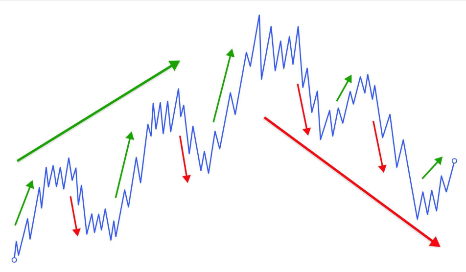
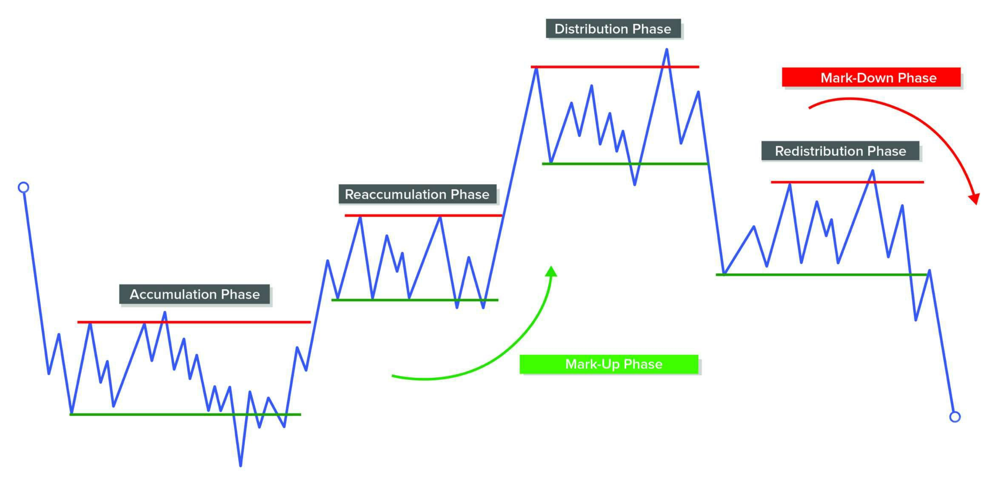
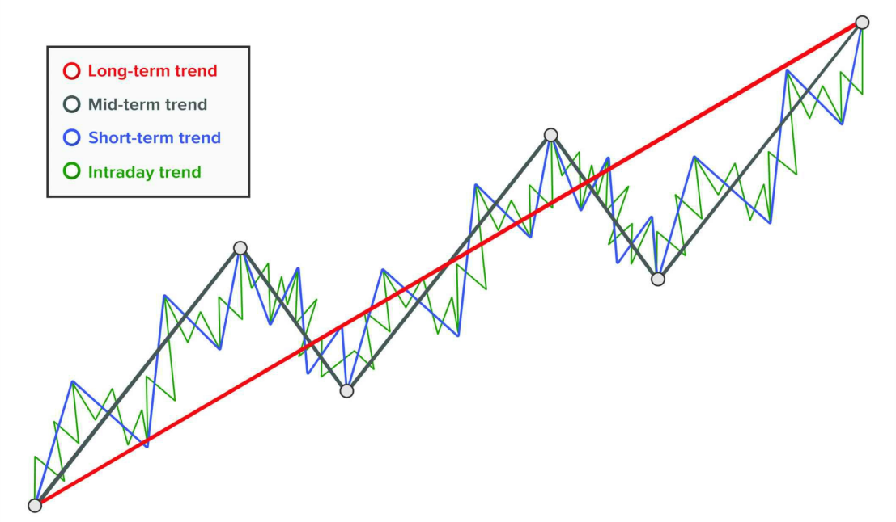
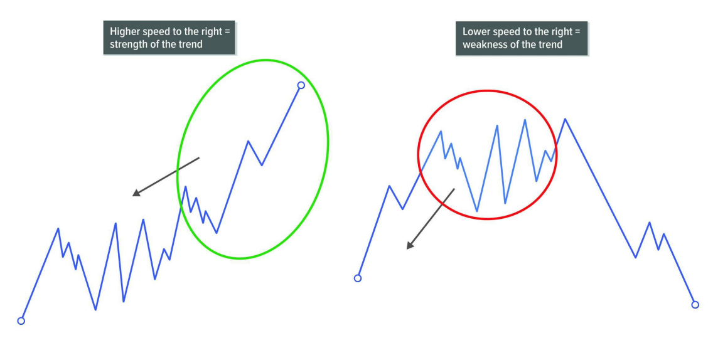
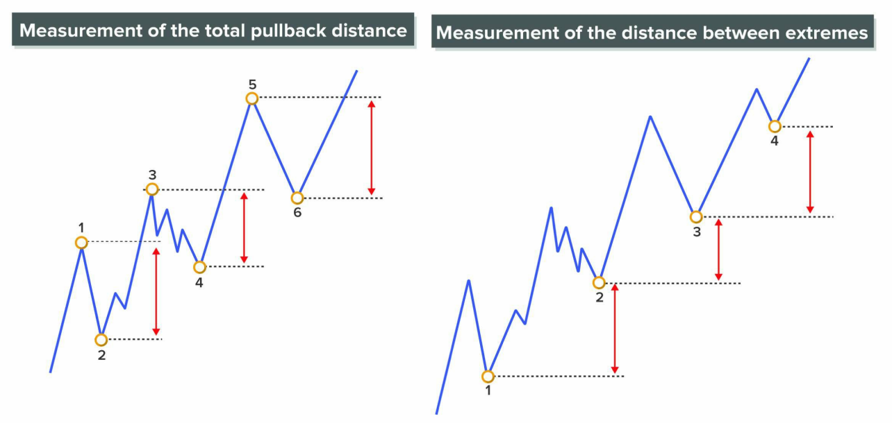
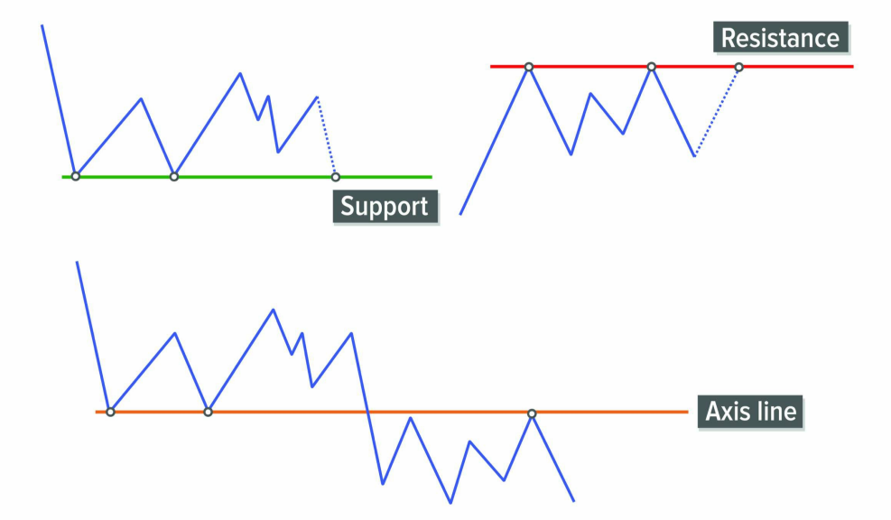
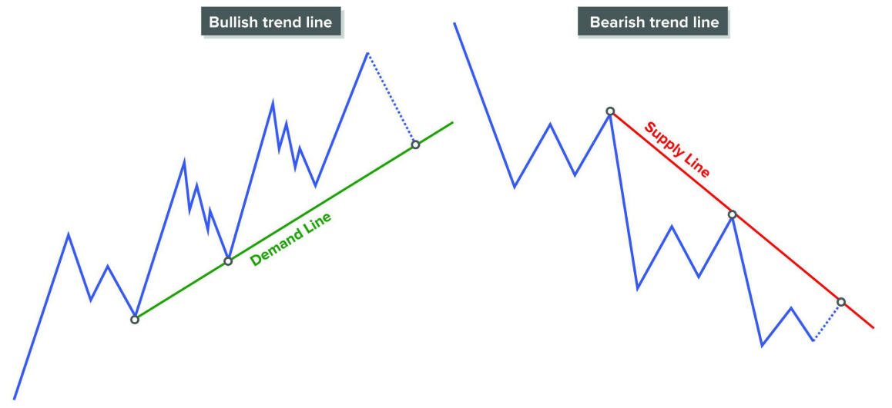
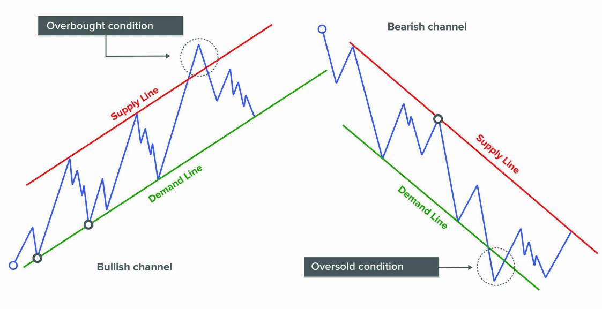
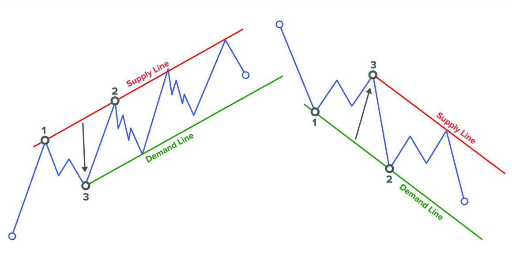
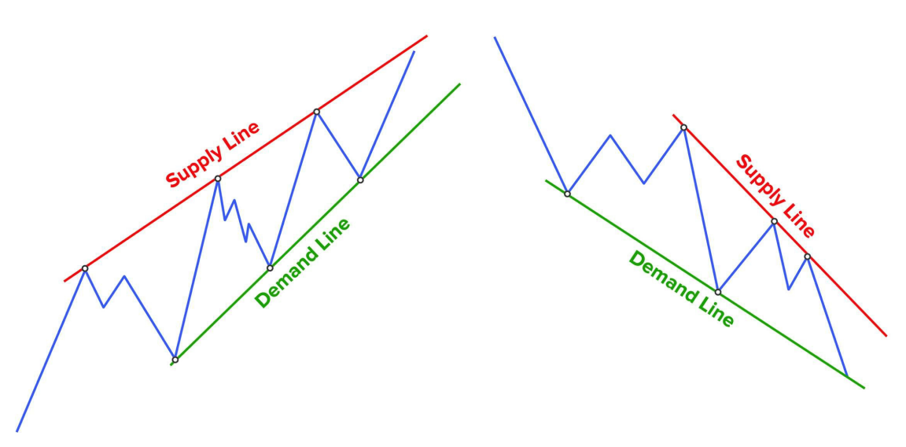

# **SÓNG**

Dưới góc nhìn của phương pháp Wyckoff, **giá luôn di chuyển theo dạng sóng**, thể hiện qua **các pha tích lũy – đẩy giá – phân phối – giảm giá**. Mỗi chu kỳ đều gồm **sóng đẩy (impulse wave)** khi giá đi theo xu hướng chính, và **sóng điều chỉnh (correction wave)** khi giá tạm nghỉ hoặc phản ứng ngược.

> _📌 Trong Wyckoff, sóng giá chính là kết quả của hành vi mua – bán của các "tay to" (Composite Man), và việc đọc được sóng nghĩa là đọc được dấu chân của họ trên biểu đồ._

## 📈 Giá không di chuyển theo thời gian cố định mà theo sóng

- Wyckoff và những người đầu tiên đọc tape (băng ghi giao dịch) nhận thấy:  
  ➤ **Giá không tăng hoặc giảm theo khoảng thời gian đều đặn**.  
  ➤ Thay vào đó, giá di chuyển theo **các đợt sóng có kích thước và thời gian khác nhau**, gọi là **waves**.

## 🔄 Mô hình sóng có cấu trúc dạng fractal

- Giá **không đi theo đường thẳng**, mà dao động lên xuống thành từng nhịp.
- Các sóng nhỏ nằm trong các sóng trung bình, và các sóng trung bình lại là một phần của sóng lớn hơn.  
  → Đây là **tính chất fractal** (cấu trúc lặp lại trong nhiều cấp độ).

## ⚖️ Phân tích sóng giúp hiểu sâu cung – cầu

- Việc so sánh **sóng tăng và sóng giảm** sẽ cho biết:  
  ➤ Ai đang chiếm ưu thế: người mua hay người bán?  
  ➤ Xu hướng có còn mạnh hay đã yếu đi?

- Khi phân tích các yếu tố như:
  - **Độ dài của sóng (range)**
  - **Thời gian diễn ra (duration)**
  - **Tốc độ (speed)**  
  ➤ Ta sẽ **nhận biết được bản chất của xu hướng** hiện tại (uptrend hay downtrend, mạnh hay yếu).

## 🎯 Kỹ năng phát hiện điểm đảo chiều sẽ được cải thiện

- Qua luyện tập, **trader sẽ dần nhận ra khi nào một sóng kết thúc và sóng ngược chiều bắt đầu**.
- Điều này cực kỳ quan trọng trong việc:
  - **Xác định điểm vào lệnh tối ưu**
  - **Giữ vị thế hợp lý**
  - **Thoát lệnh trước khi xu hướng đảo chiều**

---

# **CHU KỲ GIÁ**

Thị trường luôn chuyển động theo một chu kỳ, và trong chu kỳ này sẽ có những giai đoạn nhất định. Hiểu được thị trường đang ở giai đoạn nào sẽ giúp bạn đưa ra các quyết định giao dịch hiệu quả hơn.

## 🔍 Hai dạng chính của thị trường

- **Xu hướng**: Giá di chuyển rõ ràng theo một hướng, có thể là tăng (đi lên) hoặc giảm (đi xuống).

- **Vùng đi ngang**: Giá không rõ xu hướng, dao động trong một khoảng nhất định. Vùng đi ngang này có thể là:
  - Vùng tích lũy (Accumulation): Thường nằm ở đáy, trước khi giá tăng mạnh.
  - Vùng phân phối (Distribution): Thường nằm ở đỉnh, trước khi giá giảm mạnh.

## 📦 Giai đoạn gom hàng (Tích lũy - Accumulation)

Ở giai đoạn này, những người rất giàu, có thông tin tốt (gọi là người chuyên nghiệp) bắt đầu âm thầm mua vào. Họ không mua hết ngay một lần, mà họ từ từ mua để tránh giá tăng nhanh. Họ gom hàng đến khi nào thị trường hết người muốn bán ra nữa thì mới thôi. Giống như một người đang mua hàng giá rẻ để chờ tăng giá bán lại.

## 🚀 Giai đoạn giá tăng (Xu hướng tăng - Uptrend)

Khi họ đã gom đủ hàng và biết chắc thị trường hết người muốn bán, lúc này họ sẽ đẩy giá lên. Vì sao giá tăng được? Vì lượng người muốn mua bắt đầu nhiều hơn lượng người muốn bán. Thị trường bây giờ thu hút nhiều người khác vào mua thêm nữa (những người này thường đến sau và không có thông tin tốt bằng). Giá cứ thế tăng cao dần. Càng nhiều người mua vào, giá càng tăng mạnh. Giống như hàng hóa hiếm dần, nhiều người muốn mua khiến giá càng lên cao.

## 📉 Giai đoạn bán ra (Phân phối - Distribution)

Khi giá đã tăng đủ cao, những người ban đầu mua rẻ giờ sẽ bắt đầu bán dần để kiếm lời. Nhưng họ không bán hết cùng lúc. Họ bán từ từ để giá không giảm quá nhanh, để vẫn có người vào mua với giá cao (những người đến sau, nghĩ rằng giá còn tăng tiếp). Ở lúc này, những người thiếu kinh nghiệm, quá tham lam vẫn tiếp tục mua vào. Còn người chuyên nghiệp thì âm thầm bán ra. Giống như khi giá đã rất cao, người khôn ngoan bán hàng ra để kiếm lời, người ít kinh nghiệm lại vào mua với giá đắt.

## 📉 Giai đoạn giá giảm (Xu hướng giảm - Downtrend)

Sau khi bán hết hàng, thị trường bây giờ còn rất ít người muốn mua tiếp với giá cao như vậy nữa. Lúc này lượng người bán lại nhiều hơn người mua. Giá bắt đầu giảm xuống nhanh chóng.
Những người tham lam đến sau thấy giá giảm nhanh sẽ hoảng sợ và bắt đầu bán tháo. Giá sẽ càng ngày càng giảm.
Giống như hàng đã hết người mua, ai cũng muốn bán nhanh đi thì giá sẽ tụt xuống rất nhanh.

## 🔁 Chu kỳ này lặp đi lặp lại

Sau khi giá giảm đủ sâu, những người chuyên nghiệp lúc đầu lại quay trở lại để gom hàng giá rẻ một lần nữa. Chu kỳ cứ lặp lại như thế, gồm 4 bước chính rõ ràng:

_**📦 Gom hàng (giá rẻ) → 🚀 Giá tăng → 📉 Bán ra (giá cao) → 📉 Giá giảm.**_

**Tại sao bạn cần hiểu chu kỳ này?**
Nếu bạn biết thị trường đang ở giai đoạn nào thì bạn sẽ tránh mắc sai lầm:

- Khi thị trường đang trong giai đoạn giá tăng, bạn sẽ tránh việc bán ra sớm, vì giá còn tăng nữa.
- Khi thị trường đang trong giai đoạn giá giảm, bạn sẽ tránh mua vào quá sớm, vì giá còn giảm nữa.

> _📌 Bạn không cần giỏi bắt đúng lúc mua hoặc bán tốt nhất. Nhưng ít nhất khi biết thị trường đang trong giai đoạn nào, bạn sẽ không đi ngược lại nó. Từ đó bạn tránh được rủi ro thua lỗ._

# **XU HƯỚNG**

Giá thay đổi, và những con sóng được tạo ra từ sự thay đổi giá đó sẽ hình thành nên xu hướng. Giá di chuyển bằng một chuỗi các sóng đi theo xu hướng chính (gọi là sóng đẩy hoặc sóng xung lực – impulses), được ngắt quãng bởi các sóng đi ngược xu hướng (gọi là sóng điều chỉnh – reversals).
Xu hướng đơn giản là "con đường ít kháng cự nhất" mà giá sẽ đi theo, từ điểm này đến điểm khác. Vì giá luôn chọn con đường dễ đi nhất, nên nhiệm vụ của nhà giao dịch là xác định được xu hướng và giao dịch thuận theo nó.

---

Khi thị trường đang tăng và gặp phải lực cản (áp lực bán), nó có thể:

- Vượt qua kháng cự và tiếp tục tăng,
- Hoặc quay đầu giảm nếu lực bán đủ mạnh.

Tương tự, khi thị trường giảm và gặp lực mua mạnh, nó có thể:

- Vượt qua lực mua và tiếp tục giảm,
- Hoặc bật lên nếu có hỗ trợ tốt.

> _👉 Những điểm xoay chiều (pivot points) này là những khoảnh khắc quan trọng và là vị trí rất tốt để vào lệnh giao dịch._

## 🔺 Các loại xu hướng

Tùy theo hướng di chuyển của giá, có 3 loại xu hướng:

✅ **1. Xu hướng tăng (Bullish trend)**

- Giá liên tục tạo ra các đỉnh và đáy cao hơn (Higher Highs và Higher Lows).
- Các sóng đẩy lớn hơn sóng điều chỉnh.

✅ **2. Xu hướng giảm (Bearish trend)**

- Giá liên tục tạo ra các đỉnh và đáy thấp hơn (Lower Highs và Lower Lows).
- Các sóng giảm mạnh hơn sóng hồi.

✅ **3. Xu hướng đi ngang (Sideways / Lateral)**

- Giá dao động trong một vùng nhất định.
- Đỉnh và đáy không tăng cũng không giảm rõ ràng.

---

📏 **Phân loại xu hướng theo thời gian**

Xu hướng có thể chia theo độ dài thời gian thành 3 loại:

- Dài hạn (long-term)
- Trung hạn (medium-term)
- Ngắn hạn (short-term)

⚠️ Không có quy tắc cứng nhắc về thời gian cụ thể. Tuy nhiên:

> _Xu hướng ngắn hạn nằm bên trong xu hướng trung hạn, và xu hướng trung hạn lại nằm bên trong xu hướng dài hạn._

⚖️ **Các xu hướng có thể không trùng hướng**
Ba xu hướng (ngắn, trung, dài hạn) có thể không cùng hướng nhau. Điều này gây khó khăn cho người giao dịch, vì tín hiệu có thể mâu thuẫn.
👉 Để giao dịch hiệu quả, cần xác định rõ trước loại giao dịch bạn muốn thực hiện (theo khung thời gian nào).

---

## ⏱️ Tầm quan trọng của Timing (Thời điểm vào lệnh)

Giao dịch nào cũng cần thời điểm tốt, nhưng:
Giao dịch ngắn hạn thì cần thời điểm chính xác gần như hoàn hảo.
🎯 Vì vậy:
> _Nếu bạn là người mới, nên bắt đầu với giao dịch dài hạn cho đến khi bạn có được lợi nhuận ổn định._

🔄 Có thể vừa mua vừa bán không?
Do xu hướng thay đổi theo khung thời gian nên lý thuyết thì có thể:

- Mua theo xu hướng trung hạn (giữ vài tuần).
- Nhưng đồng thời bán khống theo xu hướng giảm ngắn hạn (vài ngày).

Tuy nhiên, việc này rất khó vì:

- Cần kỷ luật cực cao.
- Phải tách bạch cảm xúc của hai vị thế ngược nhau.

✅ Chỉ những nhà giao dịch có kinh nghiệm cao mới nên làm điều này.
🚫 Người mới **không nên giao dịch 2 chiều cùng lúc**, mà chỉ nên đi theo xu hướng chính.

## 💡 Hiểu thị trường là hiểu cảm xúc

- Thị trường tăng (bull market) được điều khiển bởi lòng tham – mọi người sợ bỏ lỡ cơ hội, đẩy giá lên cao.
- Thị trường giảm (bear market) bị điều khiển bởi nỗi sợ hãi – ai cũng sợ lỗ thêm, nên đua nhau bán tháo.

Lòng tham dẫn đến tình trạng mua quá mức (overbought).
Nỗi sợ dẫn đến bán quá mức (oversold).

---

# **ĐÁNH GIÁ XU HƯỚNG**

Sự tương tác giữa cung và cầu trong quá trình hình thành xu hướng sẽ để lại **dấu vết trên hành động giá**. Chúng ta có nhiều công cụ khác nhau để giúp đánh giá xu hướng.

**Đánh giá xu hướng một cách sáng suốt là yếu tố then chốt để xác định “sức khỏe” của thị trường.**  
Nó giúp chúng ta phát hiện liệu bên nào đang suy yếu, hoặc liệu bên đối lập có đang mạnh lên không.  
**Nhiệm vụ của nhà giao dịch là đi theo bên mạnh và tránh bên yếu.**

---

## 🎯 PHÂN TÍCH SỨC MẠNH/YẾU

Khi thị trường đang có xu hướng, ta kỳ vọng **bên đẩy giá (mua hoặc bán)** sẽ thể hiện sức mạnh vượt trội.

Hãy tưởng tượng đây là một trận chiến giữa bên mua và bên bán, và chúng ta cố gắng **đo lường sức mạnh hoặc sự suy yếu của mỗi bên**.

🔑 **Cách tốt nhất để đánh giá sức mạnh/yếu là so sánh chuyển động hiện tại với những chuyển động trước đó.**  
Chúng ta không tìm giá trị tuyệt đối, mà chỉ quan tâm đến sự **so sánh tương đối**.

Lưu ý: Một dấu hiệu yếu không đồng nghĩa với đảo chiều xu hướng – nó chỉ là cảnh báo rằng xu hướng có thể đang yếu đi, và ta nên chuẩn bị cho những kịch bản khác.

---

## ⚡ CÁC CÁCH PHÂN TÍCH SỨC MẠNH/YẾU

---

### 1. 🔺 TỐC ĐỘ (Speed)

Tốc độ đề cập đến **góc nghiêng của giá** trên biểu đồ.

- Nếu giá **di chuyển nhanh hơn trước** → thị trường **có sức mạnh**.
- Nếu giá **di chuyển chậm hơn trước** → thị trường **đang yếu đi**.

---

### 2. 📏 ĐỘ DÀI SÓNG ĐẨY (Projection)

Công cụ này dùng để **so sánh độ dài của các đợt sóng đẩy (impulse)** – nếu sóng mới dài hơn sóng trước → xu hướng đang mạnh lên; nếu ngắn hơn → xu hướng đang yếu đi.

#### a. Khoảng cách sóng đẩy

- Khoảng cách từ điểm 3 đến 4 > điểm 1 đến 2 → xu hướng mạnh.
- Khoảng cách từ điểm 5 đến 6 < điểm 3 đến 4 → xu hướng yếu.

#### b. Khoảng cách giữa các đỉnh/đáy

- Từ điểm 2 đến 3 > điểm 1 đến 2 → xu hướng mạnh.
- Từ điểm 3 đến 4 < điểm 2 đến 3 → xu hướng yếu.

---

### 3. 🔽 ĐỘ SÂU (Depth)

Dùng để đánh giá **độ sâu của các sóng điều chỉnh (pullback)**.

#### a. Khoảng cách hồi giá

- Từ điểm 3 đến 4 < điểm 1 đến 2 → xu hướng mạnh.
- Từ điểm 5 đến 6 > điểm 3 đến 4 → xu hướng yếu.

#### b. Khoảng cách giữa các cực trị

- Từ điểm 2 đến 3 < điểm 1 đến 2 → xu hướng yếu.
- Từ điểm 3 đến 4 > điểm 2 đến 3 → xu hướng mạnh.

---

## 📐 CÁC ĐƯỜNG GIÁ – LINES

Các đường vẽ trên biểu đồ giúp xác định:

- **Góc độ tiến của xu hướng**,  
- **Vùng kiệt sức của giá**,  
- **Vùng có thể đảo chiều**,  
- **Vùng hỗ trợ/kháng cự tiềm năng**.

> **Càng nhiều lần giá chạm lại một đường thì đường đó càng có độ tin cậy.**

⚠️ Đừng vẽ quá nhiều đường linh tinh – chỉ nên vẽ khi có ý nghĩa rõ ràng.

---

## 🔳 ĐƯỜNG NẰM NGANG – HORIZONTAL LINES

- Nối **ít nhất hai đáy** → **đường hỗ trợ**: Vùng giá mà người mua đã từng thắng thế, kỳ vọng sẽ tiếp tục xuất hiện.
- Nối **ít nhất hai đỉnh** → **đường kháng cự**: Vùng mà người bán từng thắng thế, có thể tiếp tục đẩy giá xuống.

📌 Nếu một đường từng là kháng cự rồi bị phá → sau đó có thể trở thành hỗ trợ (và ngược lại). Đó gọi là **đường trục (shaft line)** – nơi giá thường quay quanh.

---

## 📈 ĐƯỜNG XU HƯỚNG – TREND LINES

Sau khi xác định xu hướng, bước tiếp theo là **vẽ đường xu hướng** để tận dụng chuyển động giá.

- Trong xu hướng giảm → nối **2 đỉnh giảm dần** → gọi là **đường cung (supply line)**.
- Trong xu hướng tăng → nối **2 đáy tăng dần** → gọi là **đường cầu (demand line)**.

Càng nhiều điểm chạm → đường càng mạnh.

⚠️ Đường quá dốc → dễ bị phá → không nên dùng.

> Khi giá chạm vào đường xu hướng → có thể sắp xảy ra breakout → phải quan sát kỹ hành vi giá tại đó.

Một cú phá vỡ **chưa chắc** là đảo chiều – cần xem xét **bối cảnh, khối lượng, và hành vi trước/sau đó.**

---

## 📊 KÊNH GIÁ – CHANNELS

Kênh giá tốt sẽ:

- Có nhiều điểm chạm cả trên và dưới,
- Bao trùm phần lớn hành động giá.

### ✅ Kênh tăng (upward channel)

- Vẽ đường xu hướng tăng (nối 2 đáy),
- Kéo song song lên đỉnh nằm giữa 2 đáy đó → tạo **đường quá mua** (overbought line).

👉 Nếu giá vượt quá đường trên → đang quá mua → dễ bị điều chỉnh giảm.

### ✅ Kênh giảm (downward channel)

- Vẽ đường xu hướng giảm (nối 2 đỉnh),
- Kéo song song xuống đáy nằm giữa 2 đỉnh đó → tạo **đường quá bán** (oversold line).

👉 Nếu giá rơi dưới đường dưới → đang quá bán → dễ có nhịp hồi phục.

---

### 🧠 Cảm xúc và kênh giá

- Khi thị trường tăng quá nhanh → lòng tham khiến nhà đầu tư mua đuổi → sinh ra **tình trạng quá mua (overbought)**.
- Khi thị trường giảm mạnh → nỗi sợ khiến nhà đầu tư bán tháo → sinh ra **tình trạng quá bán (oversold)**.

Hiện tượng này có thể xảy ra **trên mọi khung thời gian**.

---

## 🔄 ĐƯỜNG NGƯỢC (INVERTED LINES)

Trong giai đoạn đầu của xu hướng, khi chưa có đường xu hướng rõ ràng, ta có thể dùng cách vẽ ngược:

- Trong xu hướng tăng: vẽ **đường cung trước**, kéo song song xuống tạo **đường cầu**.
- Trong xu hướng giảm: vẽ **đường cầu trước**, kéo song song lên tạo **đường cung**.

Phương pháp này giúp ta **ước lượng trước vùng giá có thể hồi về**.

---

## 🔀 ĐƯỜNG HỘI TỤ – CONVERGING LINES

Đôi khi đường quá mua/quá bán gốc không còn hiệu quả vì **giá không chạm tới chúng**.

Khi đó, có thể:

- Tạo đường mới bằng cách nối **2 đỉnh (đường quá mua)** hoặc **2 đáy (đường quá bán)** **mà không phụ thuộc vào đường xu hướng chính.**

👉 Trong xu hướng tăng:

- Nếu giá không thể chạm được đường quá mua → **dấu hiệu suy yếu**.

👉 Trong xu hướng giảm:

- Nếu giá không thể chạm được đường quá bán → **dấu hiệu đang có sức mạnh ngầm**.

---

# **VÙNG ĐI NGANG (TRADING RANGES)**

---

## 🧭 Tổng quan

Thị trường dành **phần lớn thời gian** để di chuyển trong trạng thái này, vì vậy **các vùng đi ngang (trading ranges)** là **rất quan trọng**.

Đây là những khu vực mà xu hướng trước đó đã **dừng lại**, và **cung – cầu tạm thời cân bằng**. Trong vùng đi ngang, các chiến dịch **tích lũy** hoặc **phân phối** được hình thành để **chuẩn bị cho một xu hướng mới** (tăng hoặc giảm).

> Chính sức mạnh tích lũy hoặc phân phối trong vùng này sẽ **tạo ra nguyên nhân (cause)** cho xu hướng sắp xảy ra (hiệu ứng – **effect** ).

---

## 📌 Vùng đi ngang – cơ hội giao dịch tối ưu

Các vùng giá này:

- Tạo ra **cơ hội giao dịch hấp dẫn** với tỷ lệ rủi ro/lợi nhuận rất tốt.
- Nhưng **những giao dịch lớn nhất** lại đến từ việc bạn **định vị đúng trong vùng này**, để **hưởng lợi khi xu hướng mới bắt đầu**.

⚠️ Trong xu hướng rõ ràng, bạn vào trễ sẽ bỏ lỡ một phần đoạn giá đi.  
✅ Nhưng nếu bạn giao dịch ngay **trong vùng đi ngang**, bạn có cơ hội **bắt được cú đi lớn hơn**.

---

## 🔍 Làm sao để định vị đúng trong vùng?

Muốn làm được điều đó, bạn phải biết:

- **Phân tích hành động giá và khối lượng (volume)** khi vùng đang hình thành.
- **Phương pháp Wyckoff** cung cấp **hướng dẫn cực kỳ rõ ràng** để bạn đọc vùng đi ngang hiệu quả:
  - Nhận diện các **sự kiện chính (events)**.
  - Phân tích các **giai đoạn (phases)** trong range.

---

## 📉 Khi nào thị trường đang trong vùng đi ngang?

Khi bạn **không thấy có xu hướng rõ ràng**, rất có thể thị trường đang ở trong một vùng sideway.

Range này có thể thuộc 1 trong 3 dạng:

1. **Tích lũy**: chuẩn bị cho cú tăng giá.
2. **Phân phối**: chuẩn bị cho cú giảm giá.
3. **Trung tính**: chỉ dao động lên xuống mà không có ý đồ rõ ràng.

> ⚠️ Những vùng dao động ngẫu nhiên, không có dấu hiệu tích lũy hay phân phối, **nên bỏ qua**, vì **không có dòng tiền lớn tham gia**.

---

## ⏳ Luật Nhân – Quả (Cause and Effect)

Dựa trên **nguyên lý Wyckoff**, thị trường phải **tiêu tốn thời gian trong range** để:

- **Tạo lực đẩy (cause)** cho cú đi tiếp theo (effect).

> ⏱ **Range càng dài → cú đi càng xa.**  
> ⏱ **Range ngắn → cú đi ngắn.**

---

## 📐 Cách xác định vùng đi ngang

- Cần **2 điểm (đỉnh và đáy)** để xác định kênh giá.
- Khi giá vẫn còn nằm trong range → **chưa có xu hướng lớn xảy ra**.
- Mấu chốt nằm ở **biên trên – biên dưới**.

> Khi giá phá ra khỏi biên trên/dưới → có thể là tín hiệu khởi động xu hướng → **cơ hội giao dịch tốt**.

---

## 🧠 Lưu ý quan trọng: Không thể có xu hướng nếu chưa có mất cân bằng

> 📌 Một cú phá vỡ **chỉ có ý nghĩa thực sự** khi thị trường **đã hình thành mất cân bằng cung – cầu rõ ràng**.

Ví dụ:

- Nếu người chuyên nghiệp đã **tích lũy xong**, họ sẽ:
  - **Kiểm tra** để chắc rằng sẽ không có lực bán nào cản giá lên.
  - Khi thấy **không còn kháng cự**, họ mới **bắt đầu đẩy giá lên**.

- Nếu họ đang **phân phối**, họ sẽ:
  - **Kiểm tra lực mua (demand)** xem có còn mạnh không.
  - Nếu thấy **ít người mua**, họ sẽ **đẩy giá xuống**.

---

## ✅ Kết luận

- Vùng đi ngang không chỉ là nơi "nghỉ ngơi" của giá, mà còn là nơi **người chuyên nghiệp chuẩn bị cho trận đánh lớn**.
- Nếu bạn đọc được vùng này bằng phân tích Wyckoff (sự kiện + pha), bạn có thể **đi trước thị trường một bước**.
- Hãy nhớ rằng: **giá đi bao xa phụ thuộc vào thời gian tích lũy/phân phối** trước đó.

---
