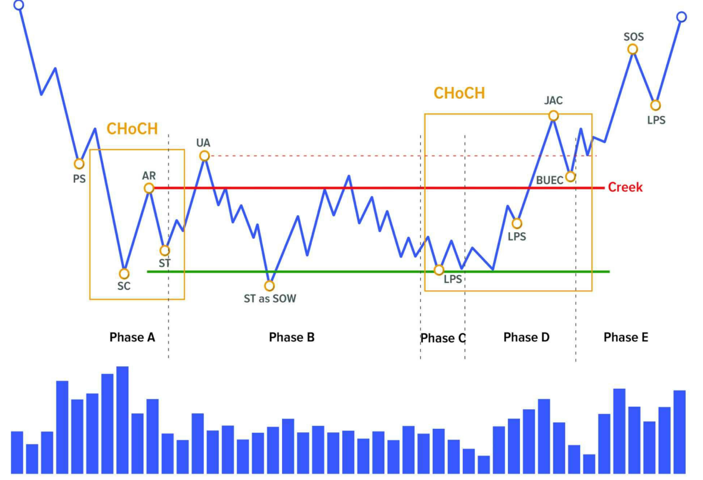

# 🎓 **CẤU TRÚC WYCKOFF**

---

## 🧠 1. Thị trường luôn thay đổi – không bao giờ giống nhau

Bạn có từng vẽ biểu đồ, thấy mô hình này giống hôm qua, nhưng hôm sau thì khác hẳn?

👉 Đó là vì **thị trường không lặp lại chính xác**, bởi nó là một hệ thống sống, liên tục thay đổi theo hành vi của người mua và người bán.

Do đó, **không thể dùng mô hình cố định để áp dụng mọi lúc**. Nhưng tin vui là: có **một số nguyên tắc cơ bản luôn tồn tại**, giúp bạn nhận ra điều gì đang xảy ra.

---

## 🧭 2. Wyckoff giúp bạn đọc hành vi thị trường

Phương pháp Wyckoff không đòi hỏi bạn phải dự đoán tương lai.  
Thay vào đó, nó giúp bạn **đọc hiểu hiện tại** bằng cách nhìn vào **giá và khối lượng giao dịch**, giống như bạn đọc "dấu chân" của cá mập trên biểu đồ.

Để làm được điều đó, Wyckoff chia thị trường thành:

- **Các sự kiện (events)** – như các cột mốc quan trọng.
- **Các giai đoạn (phases)** – như từng màn trong một vở kịch.

---

## 🧱 3. Cấu trúc tích lũy – khi cá mập âm thầm gom hàng

### 🌱 Hãy tưởng tượng như thế này:

- Giá đã giảm một thời gian → ai cũng chán nản bán ra.
- Một nhóm "tay to" bắt đầu **mua dần**, từng chút một, không để người khác chú ý.
- Sau một thời gian, họ gom đủ hàng → **bắt đầu đẩy giá lên** → xu hướng tăng mới bắt đầu.

Đó chính là **cấu trúc tích lũy**.

---

## 🟢 **CẤU TRÚC TÍCH LŨY**

---

> _Tích lũy là quá trình các nhà giao dịch lớn hấp thụ hết lượng cổ phiếu có sẵn trên thị trường → Chuyển giao từ "tay yếu" sang "tay mạnh"._

✅ **Các khái niệm:**

- **Creek**: Vùng kháng cự trong tích lũy hoặc tái tích lũy (tạo bởi AR và đỉnh trong Phase B).
- **CHoCH** (Change of Character): Dấu hiệu thay đổi đặc tính xu hướng:
  - CHoCH 1: giá chuyển từ giảm sang tích lũy.
  - CHoCH 2: giá chuyển từ tích lũy sang tăng.

### 🧱 **Phase A – Dừng xu hướng giảm**

Giai đoạn này giống như cú phanh khi xe đang lao dốc. Giá đang giảm mạnh, nhưng **bắt đầu có ai đó mua vào**.

**Các sự kiện trong Phase A:**

- **PS – Preliminary Support**  
  Lực mua ban đầu xuất hiện, cố gắng chặn đà giảm → nhưng chưa đủ, giá vẫn rơi.

- **SC – Selling Climax**  
  Một cú rơi mạnh cuối cùng, ai cũng bán tháo → tay to **mua vào mạnh nhất** ở đây.

- **AR – Automatic Rally**  
  Giá bật lên nhanh → do hết người bán + bên mua chiếm ưu thế → tạo **đỉnh vùng tích lũy**.

- **ST – Secondary Test**  
  Giá quay lại đáy để **kiểm tra cung còn không**. Nếu volume thấp và không tạo đáy mới → là dấu hiệu tốt.

---

### 🧱 **Phase B – Giai đoạn gây nhiễu & tích lũy**

Tay to bây giờ bắt đầu **gom hàng dần dần**. Trong khi đó, thị trường trông rất "khó đoán" với nhiều cú phá vỡ giả.

**Các sự kiện trong Phase B:**

- **UA – Upthrust Action**  
  Giá tạm thời vượt lên trên vùng kháng cự (đỉnh AR) → rồi quay ngược xuống → lừa người mua.

- **ST as SOW – Secondary Test as Sign of Weakness**  
  Giá phá đáy giả (dưới SC) → rồi lại quay lại range → kiểm tra cung lần nữa.

🧠 Đây là giai đoạn tay to “làm ảo thuật” → bạn thấy giá lúc tăng lúc giảm mà không biết phải làm gì → đó là điều họ muốn.

---

### 🧱 **Phase C – Bẫy cuối cùng (Spring)**

Giai đoạn này như một cú lừa cuối cùng để ép những người còn lại bán ra.

**Các kiểu Spring (giả vờ rớt):**

- **Test Spring**: Giá xuống gần đáy cũ rồi bật lại.
- **LPS (Last Point of Support)**: Giá không xuống tới đáy → cho thấy sức mua mạnh.
- **TSO (Terminal Shakeout)**: Cú rơi sâu bất ngờ phá đáy → rồi bật lại rất nhanh → tay to “quét sạch” trước khi tăng mạnh.

---

### 🧱 **Phase D – Bắt đầu tăng trong range**

Giá bắt đầu tăng mạnh. Lúc này thị trường bắt đầu "nở hoa".

**Các sự kiện:**

- **SOS – Sign of Strength**  
  Giá bật lên khỏi range → đi thẳng đến vùng đỉnh.

- **LPS – Last Point of Support**  
  Các đáy cao dần xuất hiện khi giá test lại vùng hỗ trợ → điểm vào lệnh tốt.

- **BU / BUEC – Back Up / Back Up to Edge of Creek**  
  Giá quay lại test vùng breakout → giống như “lùi lại lấy đà”.

---

### 🧱 **Phase E – Xu hướng tăng thật sự**

Không còn nghi ngờ gì nữa. Giá đang trong xu hướng tăng rõ ràng với **đỉnh và đáy cao dần**.

---

## 🟢 **CẤU TRÚC TÍCH LŨY #2 – KHÔNG CÓ SPRING**

- Tay to không để giá rơi xuống đáy → họ **mua sớm**.
- Không có cú “Spring” phá đáy → khiến nhiều người **không tin giá sẽ tăng**.
- **Cơ hội vào lệnh duy nhất** là khi giá **test lại vùng breakout (BUEC)**.

---

## 🔴 **CẤU TRÚC PHÂN PHỐI**

Ngược lại với tích lũy, đây là lúc tay to **bán dần** khi người khác đang hưng phấn.

---

### 🧱 **Phase A – Dừng xu hướng tăng**

**Các sự kiện:**

- **PSY – Preliminary Supply**: Lực bán xuất hiện lần đầu.
- **BC – Buying Climax**: Mọi người mua mạnh nhất → tay to bán ra nhiều nhất.
- **AR – Automatic Reaction**: Giá giảm nhanh → tạo đáy của vùng phân phối.
- **ST – Secondary Test**: Giá quay lại đỉnh để test lực mua → volume thấp → dấu hiệu xấu.

---

### 🧱 **Phase B – Lừa đảo và xả hàng**

**Các sự kiện:**

- **UT – Upthrust**: Giá phá đỉnh tạm thời rồi rớt xuống.
- **mSOW – Minor Sign of Weakness**: Giá phá đáy nhẹ → quay về range.

Tay to lừa bạn mua thêm → rồi **họ âm thầm xả hàng**.

---

### 🧱 **Phase C – Cú bẫy UTAD**

- **UTAD – Upthrust After Distribution**: Phá đỉnh mạnh → mọi người đổ vào mua → rồi… sập!
- Là cú đánh cuối để dụ người vào mua ở giá cao nhất.

---

### 🧱 **Phase D – Xu hướng giảm bắt đầu**

**Các sự kiện:**

- **MSOW – Major Sign of Weakness**: Cú giảm mạnh xuyên đáy.
- **LPSY – Last Point of Supply**: Giá hồi yếu, tạo đỉnh thấp hơn → cơ hội bán ra.

---

### 🧱 **Phase E – Xu hướng giảm rõ ràng**

Giá tạo **đỉnh thấp – đáy thấp** → xu hướng giảm xác lập.

---

## 🔴 **CẤU TRÚC PHÂN PHỐI #2 – KHÔNG CÓ UTAD**

- Giá không phá được đỉnh → vì lực bán đã áp đảo từ sớm.
- Không có cú "bẫy cuối" → khó nhận ra cú sập.
- Chỉ còn một điểm vào: **bán tại LPSY khi giá hồi nhẹ rồi rớt tiếp**.

---

## ✅ Tổng kết siêu ngắn gọn

| Tích lũy (Accumulation)           | Phân phối (Distribution)         |
|----------------------------------|----------------------------------|
| Tay to mua dần                   | Tay to bán dần                   |
| Giá dao động quanh đáy           | Giá dao động quanh đỉnh          |
| Có thể có cú Spring              | Có thể có cú UTAD                |
| Mua tại LPS hoặc BUEC            | Bán tại LPSY hoặc sau SOW        |
| Đỉnh – đáy tăng dần              | Đỉnh – đáy giảm dần              |

---