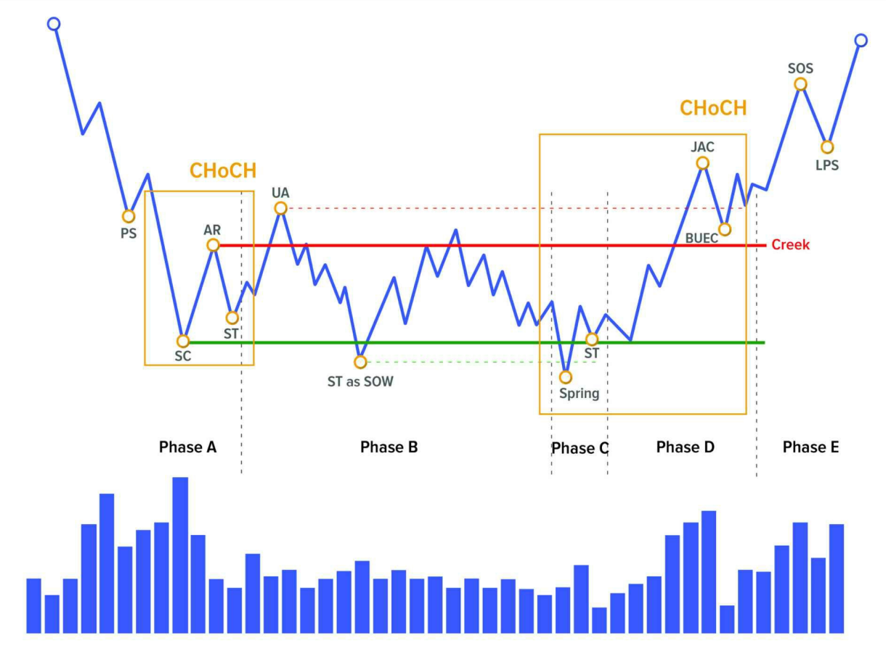
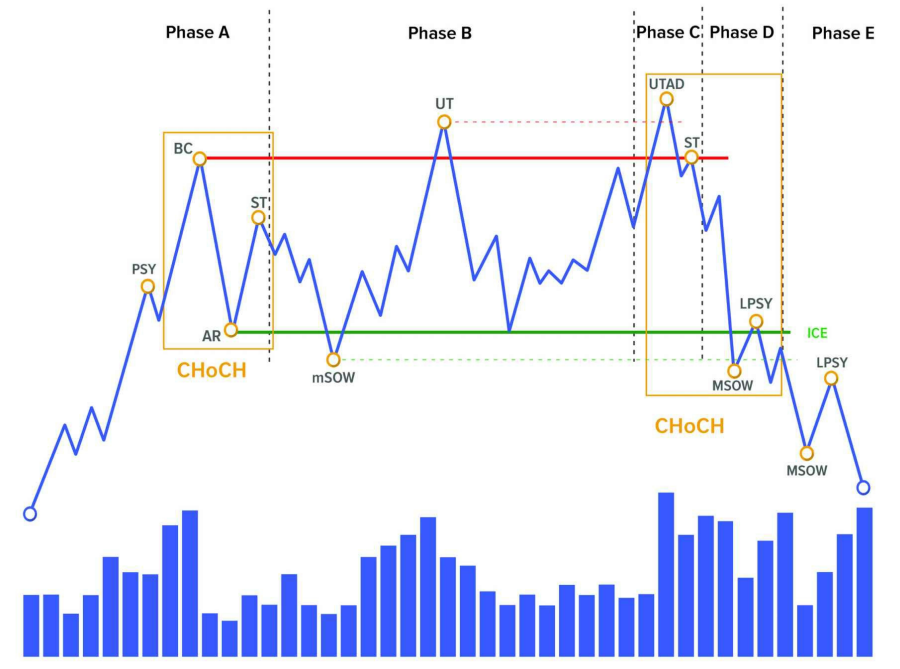
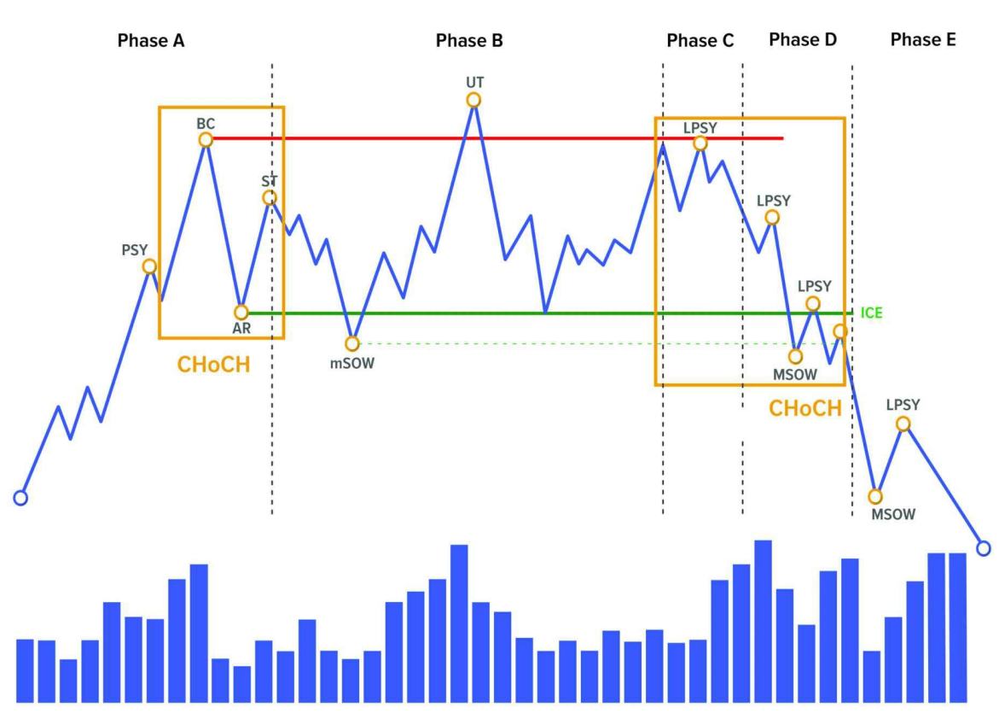

> _**🧠 Thị trường luôn thay đổi – không bao giờ giống nhau**_

Bạn có từng vẽ biểu đồ, thấy mô hình này giống hôm qua, nhưng hôm sau thì khác hẳn?

👉 Đó là vì **thị trường không lặp lại chính xác**, bởi nó là một hệ thống sống, liên tục thay đổi theo hành vi của người mua và người bán.

Do đó, **không thể dùng mô hình cố định để áp dụng mọi lúc**. Nhưng tin vui là: có **một số nguyên tắc cơ bản luôn tồn tại**, giúp bạn nhận ra điều gì đang xảy ra.

---

> _**🧭 Wyckoff giúp bạn đọc hành vi thị trường**_

Phương pháp Wyckoff không đòi hỏi bạn phải dự đoán tương lai.  
Thay vào đó, nó giúp bạn **đọc hiểu hiện tại** bằng cách nhìn vào **giá và khối lượng giao dịch**, giống như bạn đọc "dấu chân" của cá mập trên biểu đồ.

Để làm được điều đó, Wyckoff chia thị trường thành:

- **Các sự kiện (events)** – như các cột mốc quan trọng.
- **Các giai đoạn (phases)** – như từng màn trong một vở kịch.

---

## 🟢 **CẤU TRÚC TÍCH LŨY**

Khi cá mập âm thầm gom hàng, hãy tưởng tượng như thế này:

- Giá đã giảm một thời gian → ai cũng chán nản bán ra.
- Một nhóm "tay to" bắt đầu **mua dần**, từng chút một, không để người khác chú ý.
- Sau một thời gian, họ gom đủ hàng → **bắt đầu đẩy giá lên** → xu hướng tăng mới bắt đầu.

Đó chính là **cấu trúc tích lũy**.

> _Tích lũy là quá trình các nhà giao dịch lớn hấp thụ hết lượng cổ phiếu có sẵn trên thị trường → Chuyển giao từ "tay yếu" sang "tay mạnh"._

✅ **Các khái niệm:**

- **Creek**: Vùng kháng cự trong tích lũy hoặc tái tích lũy (tạo bởi AR và đỉnh trong Phase B).
- **CHoCH** (Change of Character): Dấu hiệu thay đổi đặc tính xu hướng:
  - CHoCH 1: giá chuyển từ giảm sang tích lũy.
  - CHoCH 2: giá chuyển từ tích lũy sang tăng.

---

### 🧱 **Phase A – Dừng xu hướng giảm**

#### 🧠 Tại sao lại có Phase A?

##### 📉 Trước Phase A là gì?

Là **một đợt giảm giá mạnh kéo dài** — xu hướng giảm, panic, máu me, mất niềm tin.

- Ai cũng sợ.
- Ai cũng muốn **thoát hàng**.
- Ai cũng nghĩ rằng **giá sẽ còn rơi nữa**.

Và trong lúc đó, **tay to (big players)** – những người có kiến thức, nguồn vốn và kinh nghiệm – **bắt đầu quan sát** thị trường.

##### 🧠 Vậy tại sao lại cần Phase A?

> Vì **xu hướng giảm không thể tiếp diễn mãi mãi** – đến một lúc, **lực bán sẽ cạn kiệt**.  
Và **người mua đầu tiên** bắt đầu **thử vào thị trường**.

Phase A **không phải là đáy chính thức**, cũng **chưa phải lúc để mua mạnh**.  
Mà là **giai đoạn “phanh gấp” của xu hướng giảm** — nơi thị trường bắt đầu **giảm chậm lại** và **có dấu hiệu phản ứng ngược.**

**🏗️ Hình dung đơn giản:**  

> Một chiếc xe đang đổ dốc cực nhanh (giá giảm mạnh).  
> Phase A là lúc **ai đó bắt đầu đạp phanh**, và **bánh xe bắt đầu rít lên, khựng lại**.

- Xe chưa dừng hẳn.
- Nhưng **tốc độ giảm đã chậm**.
- **Có dấu hiệu đổi chiều**, dù chưa rõ ràng.

##### 🧲 Tay to bắt đầu làm gì trong Phase A?

- Họ **không vội vàng mua**.  
- Họ chỉ **quan sát** → rồi **đặt lệnh mua nhỏ**, để **thử xem thị trường phản ứng ra sao**.

Họ muốn biết:

- “Còn ai bán tháo không?”
- “Còn ai đang sợ hãi chưa cắt lỗ?”
- “Nếu mình mua, có bị đè giá không?”

> 👉 Tức là **Phase A là giai đoạn thăm dò, test trước**.

##### 📉 Vì sao giá vẫn có thể tiếp tục rơi trong Phase A?

> Vì đây là **giai đoạn giao thoa giữa phe bán hoảng loạn và phe mua thận trọng**.

- Người bán vẫn còn → nên giá có thể tạo đáy mới.
- Nhưng **mỗi lần rơi, lại có lực mua âm thầm hấp thụ**.

Lực bán **mạnh dần yếu**, lực mua **yếu dần mạnh** → như hai bên kéo co, nhưng không ai thắng ngay.

##### ✳️ Phase A là lời thì thầm đầu tiên của thị trường

> “Có lẽ... đáy đang đến gần.”  
Không chắc chắn. Không rõ ràng. Nhưng **đủ để những người tinh ý bắt đầu nghi ngờ rằng xu hướng giảm đã già cỗi**.

##### 🧠 Vậy Phase A xuất hiện để làm gì?

| Mục đích | Ý nghĩa |
|---------|--------|
| Làm chậm đà giảm | Chuẩn bị tâm lý cho đảo chiều |
| Phơi bày lực bán còn lại | Tay to có thể đánh giá tình hình |
| Kiểm tra độ hấp thụ của thị trường | Bắt đầu dò cung |
| Khởi đầu cho sự hình thành vùng tích lũy | Tiền đề cho Phase B |

> Phase A là **lúc đám đông bắt đầu rã đám sau một cơn mưa lớn** – người thì chạy, người thì ướt, người ngồi thở.  
> Và **người quan sát bắt đầu mở dù, nhìn bầu trời, chờ cầu vồng**.

👉 Nếu bạn cố bắt đáy trong Phase A — **rủi ro rất cao**.  
Nếu bạn quan sát tốt — bạn sẽ sớm nhận ra:  
> **“Đây là lúc nên dừng bán. Nhưng chưa phải lúc nên mua.”**

---

#### 🔍 Bản chất hình thành Phase A

##### 🧠 Phase A hình thành khi… thị trường **đã mệt mỏi**

Trước Phase A, thị trường đang trong một xu hướng **giảm kéo dài**.  
Mọi người **đã bán, đã sợ, đã tuyệt vọng**. Không còn hứng thú. Không còn kỳ vọng. Không còn máu liều.

Lúc này:

- **Lực bán không còn mạnh** như trước nữa.
- **Lực mua chưa xuất hiện rõ**, nhưng **bắt đầu manh nha**.
- **Cán cân cung–cầu dần tiệm cận điểm cân bằng**.

> **Phase A là khoảnh khắc “im lặng đáng ngờ” sau cơn bão.**

##### 📉 Giá có thể vẫn giảm… nhưng **không còn dễ giảm sâu**

Bởi vì:

- Người muốn bán **đã bán gần hết**.
- Người còn giữ hàng thì **không muốn bán rẻ hơn nữa**.
- Người sợ quá thì **đã đứng ngoài** rồi.

Giá có thể **vẫn còn rơi**, nhưng mỗi lần rơi đều **bị mua lên** một chút → giống như có ai đó đang **chống lại lực rơi**.

→ **Đó là lúc lực bán đã yếu, và lực mua bắt đầu âm thầm xuất hiện.**

##### 🧲 Vì sao tay to chưa mua ngay?

Vì họ không vội.

- Họ muốn chắc chắn rằng **người bán đã kiệt sức**.
- Họ muốn xem thị trường **phản ứng thế nào khi có “đẩy giá nhẹ” lên hay xuống**.
- Họ **không muốn lộ diện sớm**.

Phase A là **giai đoạn quan sát – thăm dò – xác nhận** rằng:
> “Đây là vùng mà nếu mình bắt đầu gom hàng, sẽ không bị đè ngược.”

##### 🔍 Bản chất sâu xa

> Phase A là nơi thị trường chuyển từ trạng thái **sợ hãi → nghi ngờ**, nhưng chưa tới **niềm tin**.

Nó là **điểm giao thời** giữa:

- Một quá khứ giảm giá dai dẳng
- Và một tương lai chưa chắc chắn

Giống như **trời vừa tạnh mưa**, bạn không biết là sắp nắng, hay chỉ là **tạm ngưng để mưa tiếp**.

##### 🧠 Cốt lõi của Phase A

| Yếu tố | Diễn giải |
|--------|-----------|
| **Cung giảm dần** | Không còn ai bán tháo nữa |
| **Cầu chưa tăng mạnh** | Người mua chỉ mới bắt đầu quan tâm |
| **Thị trường nghi ngờ** | Không rõ là đáy hay chỉ là nghỉ chân |
| **Tâm lý giằng co** | Người bán yếu dần – người mua thăm dò |

---

#### 📊 Các sự kiện (Events) trong Phase A

##### 1. **PS – Preliminary Support (Hỗ trợ sơ bộ)**

> Đây là dấu hiệu đầu tiên cho thấy **ai đó đang cố gắng chặn đà giảm**.

- Sau một chuỗi giảm giá mạnh, **volume (khối lượng giao dịch) tăng vọt**, giá bắt đầu **phản ứng bật nhẹ**.
- Đây là **dấu hiệu tay to xuất hiện** – họ chưa vào mạnh, chỉ đang “chống đỡ” nhẹ để xem phản ứng thị trường.

⛏ **Hiểu đơn giản:** Giống như người nào đó dang tay hứng trái bóng đang rơi – bóng chưa dừng, nhưng lực rơi đã chậm lại.

##### 2. **SC – Selling Climax (Cao trào bán tháo)**

> Đây là **cú rơi cuối cùng** và **mạnh nhất**, khi ai cũng tuyệt vọng.

- Người bán **hoảng loạn, bán tháo hàng loạt**.
- Khối lượng tăng đột biến (panic volume).
- Nhưng điều đặc biệt: **giá chạm đáy và bật ngược rất nhanh** ⇒ vì **tay to đang âm thầm mua vào rất mạnh.**

💡 **Tại sao tay to mua ở đây?**  
Vì họ biết tâm lý đám đông sợ hãi → giá rất rẻ → họ “gom hàng” một cách hiệu quả.

##### 3. **AR – Automatic Rally (Đợt hồi tự động)**

> Sau cú SC, không còn nhiều người bán nữa. Giá bật lên rất mạnh.

- Đây là **pha hồi kỹ thuật**: do thiếu áp lực bán + lực mua bắt đầu mạnh lên.
- Nó tạo ra **biên độ (range)** cho vùng tích lũy: đỉnh của AR là đỉnh đầu tiên của biên tích lũy.
- Có thể tăng 10%–20% rất nhanh chỉ trong vài ngày (nếu trong crypto).

📈 **Tín hiệu quan trọng:** Không phải là tăng bền vững, nhưng là “dấu chân đầu tiên” của lực mua thật sự.

##### 4. **ST – Secondary Test (Kiểm tra lại cung)**

> Giá quay lại gần đáy SC để xem thử còn ai muốn bán nữa không.

- Nếu volume thấp, giá không tạo đáy mới → xác nhận rằng **người bán yếu rồi**.
- ST có thể tạo đáy cao hơn SC → càng tốt.
- Nếu tạo đáy mới nhưng volume giảm → cũng là tín hiệu tích cực.

Tay to thả giá xuống nhẹ để “thử” xem còn ai bán không. Nếu không ai bán nữa → họ yên tâm gom hàng.

---

#### ✅ Các mấu chốt để nhận diện Phase A

1. **Đà giảm đang chậm lại** – giá có thể vẫn giảm nhưng **momentum (đà)** yếu dần.
2. **Xuất hiện volume tăng mạnh ở đáy** (thường là SC hoặc PS) → gợi ý có lực hấp thụ hàng.
3. **Bắt đầu có phản ứng bật lên** (AR) – không cần đẹp, chỉ cần rõ ràng.
4. **Giá quay lại kiểm tra đáy mà không phá vỡ đáy mạnh** (ST) → càng củng cố khả năng tạo đáy.

---

#### 🔄 Một số biến thể thường gặp của Phase A

##### 🧩 Biến thể 1: **Không có PS rõ ràng**

- Trong một số trường hợp, **giá rơi rất nhanh, gần như không có lực chống đỡ ban đầu (PS)**.
- **SC xảy ra trực tiếp**, rất rõ ràng, volume bùng nổ và bật mạnh ngay sau đó.
- Lúc này, **Phase A rút gọn chỉ còn SC, AR và ST**.

📌 **Gợi ý:** Ưu tiên quan sát **volume và phản ứng giá sau SC** để xác nhận.

##### 🧩 Biến thể 2: **ST tạo đáy mới so với SC**

- Thường khiến người chưa quen dễ nhầm rằng trend giảm tiếp diễn.
- Nhưng nếu **volume thấp**, **giá nhanh chóng phục hồi lại trong biên AR** ⇒ vẫn là ST hợp lệ.
- Tay to đang cố “rũ hàng lần cuối” để gom triệt để.

📌 **Gợi ý:** Đừng nhìn mỗi giá, hãy **so volume và thời gian hồi phục**.

##### 🧩 Biến thể 3: **AR yếu – không bật mạnh**

- Có thể do thị trường chưa đủ lực mua hoặc bị đè giá.
- Nhưng nếu sau đó giá không phá đáy SC nữa, và volume cạn dần → vẫn có thể là Phase A.
- Gặp nhiều trong thị trường yếu (hoặc cuối downtrend dài hơi).

📌 **Gợi ý:** Kiên nhẫn, quan sát thêm trong Phase B để xác nhận tích lũy.

##### 🧩 Biến thể 4: **ST xuất hiện nhiều lần**

- Giá có thể kiểm tra đáy **2–3 lần**, mỗi lần **volume thấp dần**, **biên dao động co lại**.
- Đây là tín hiệu tốt vì tay to **muốn chắc chắn không còn ai bán**.
- Gặp nhiều trong những vùng tích lũy dài.

📌 **Gợi ý:** Đếm số lần test đáy + đo biên độ dao động → càng nhỏ càng tích cực.

---

#### 🧠 Lưu ý khi nhận diện Phase A

##### 🎯 Vì sao phải cẩn trọng khi xác định Phase A?

> Vì Phase A **không phải là điểm đảo chiều**, mà **chỉ là giai đoạn thị trường bắt đầu “bớt giảm”**.

Nó giống như **chiếc xe vừa đạp phanh – chưa dừng hẳn**, nhưng đà đã chậm lại.

👉 Nếu bạn nhầm Phase A là “đáy” → bạn dễ **vào lệnh quá sớm**, **bị cuốn vào cú rũ sau đó** (ở Phase C).  
👉 Nếu bạn bỏ qua Phase A hoàn toàn → bạn **mất luôn cơ hội đọc cấu trúc tích lũy**.

###### 🔻 1. **Phase A không phải là điểm mua – mà là điểm dừng quan sát**

- Nhiều người thấy giá không rơi nữa → nghĩ đã tạo đáy → **vào lệnh bắt đáy**.
- Nhưng tay to **chưa vào mạnh ở đây** – họ chỉ đang quan sát.
- Phase A là lúc thị trường **giảm ít hơn**, không phải lúc nó **bắt đầu tăng**.

📌 **Đừng vội đoán đáy – hãy xác nhận hành vi.**

###### 🔻 2. **Cẩn thận với các cú hồi mạnh – dễ bị nhầm là breakout**

- Sau Selling Climax (SC), giá bật mạnh (Automatic Rally – AR) → **rất dễ khiến bạn tưởng trend tăng bắt đầu**.
- Nhưng thực chất đây chỉ là **phản ứng kỹ thuật do cung cạn**, không phải sức mua thật.

📌 Cú hồi càng mạnh → càng dễ “dụ” những ai không hiểu cấu trúc Wyckoff.

###### 🔻 3. **Không phải lúc nào cũng có PS, SC, AR, ST rõ ràng**

- Nhiều Phase A trong thực tế **không textbook**:
  - SC và AR có thể rất gần nhau, hoặc nhập làm một.
  - Volume không tăng mạnh như kỳ vọng.
  - ST có thể xuất hiện muộn.

📌 Nếu cố gắng “gán nhãn” cho biểu đồ, bạn có thể **bóp méo thực tế để vừa với khuôn mẫu**.

###### 🔻 4. **Dễ nhầm lẫn với pullback trong downtrend**

- Đôi khi giá hồi kỹ thuật trong một đợt giảm lớn → trông rất giống AR.
- Nếu không quan sát volume, không xem hành vi tại đáy → **sẽ nhầm Phase A với pullback thông thường**.

📌 Hỏi lại: “Liệu đáy vừa rồi có volume lớn, hấp thụ thật, hay chỉ là hồi yếu?”

###### 🔻 5. **Phase A trong phân phối trông gần giống Phase A trong tích lũy – nhưng ngược logic**

- Cả hai đều có dấu hiệu đảo chiều.
- Nhưng một bên là **dừng giảm → tích lũy để tăng**, một bên là **dừng tăng → phân phối để giảm**.
- Cần đặt Phase A vào **bối cảnh xu hướng trước đó**:
  - Trước đó giảm dài → Phase A khả năng là tích lũy
  - Trước đó tăng dài → Phase A có thể là phân phối

###### 🧭 Checklist an toàn khi đánh giá Phase A

| Câu hỏi tự kiểm tra | Mục tiêu |
|----------------------|---------|
| Đã có volume tăng mạnh ở đáy chưa? | Tìm SC |
| Đợt hồi có bị bán ngược ngay không? | Xác định AR hay chỉ pullback |
| Volume ở cú hồi giảm dần? | Gợi ý cung cạn dần |
| Giá còn test lại đáy không? | Xem còn ST hay không |
| Xu hướng trước đó là gì? | Xác định bối cảnh tích lũy hay phân phối |

> **Phase A là giai đoạn để học thị trường đang thở thế nào.**  
Không phải lúc hành động – mà là lúc quan sát, ghi chú, định vị cấu trúc tích lũy đang hình thành.

---

#### 🧩 Ý nghĩa chiến lược của Phase A

> Phase A là **giai đoạn thị trường dừng rơi – nhưng chưa đảo chiều.**  
Đây là nơi **xu hướng giảm bắt đầu mỏi**, lực bán yếu dần, và những người tinh ý **bắt đầu đặt dấu hỏi**:  
> “Có phải đây là đáy không?”

Tuy nhiên, tay to chưa mua thật sự. Đám đông thì vẫn còn sợ. Giá còn giằng co.  
**Phase A chỉ là điểm dừng kỹ thuật, chưa phải tín hiệu hành động.**

##### 🎯 Vậy **vai trò chiến lược của Phase A** là gì?

| Mục tiêu | Chiến lược phù hợp |
|----------|--------------------|
| **Nhận diện sự suy yếu của xu hướng giảm** | Quan sát các dấu hiệu: SC, AR, ST, volume bất thường |
| **Xác định vùng biên tích lũy sớm** | Đánh dấu đáy SC và đỉnh AR → chuẩn bị cấu trúc Wyckoff |
| **Bắt đầu ghi nhận ý đồ thị trường** | Tự hỏi: tay to có can thiệp không? Có dấu hiệu hấp thụ không? |
| **Tuyệt đối tránh giao dịch mạo hiểm** | Không bắt đáy, không fomo theo cú hồi AR |

##### 🧭 Nếu bạn là trader theo Wyckoff, thì trong Phase A

- 👀 **Bạn quan sát.**
- 🧾 **Bạn ghi chép.**
- 📐 **Bạn đánh dấu vùng range.**
- 😶‍🌫️ **Bạn chưa hành động.**

> Phase A là lúc bạn **cầm ống nhòm, không phải tay cầm chuột.**

##### 📌 Những gì bạn chuẩn bị trong Phase A

…sẽ giúp bạn:

- Nhận diện chính xác **Phase B**
- Dự đoán trước vùng **Spring** ở Phase C
- Vào lệnh sớm, an toàn, xác suất cao trong Phase D

> **Phase A là nơi bạn quan sát tay to “đạp phanh thị trường”.**  
Đây không phải lúc để tăng tốc theo, mà là lúc bạn **hiểu họ đang chuẩn bị rẽ hướng – và bạn sẽ đi theo ở những pha sau.**

---

### 🧱 **Phase B – Giai đoạn gây nhiễu & tích lũy**

#### 🧠 Tư duy gốc rễ: Tại sao lại có Phase B?

##### 🧩 Gốc rễ của vấn đề

> **Tay to không thể gom hết hàng trong 1 lần mà không làm lộ dấu vết.**  
> Vì nếu họ làm thế → chính họ sẽ **khiến giá tăng mạnh** → và **phải mua với giá cao hơn chính mình tạo ra.**

##### 🎭 Vậy họ làm sao?

Họ phải **chia nhỏ việc mua**, gom từ từ – từng nhịp, từng ngày, từng đợt điều chỉnh – sao cho:

- Không làm giá tăng.
- Không bị phát hiện.
- Không đánh động thị trường.

Và để làm được điều đó, **thị trường phải trông giống như chẳng có gì xảy ra**.

##### ⛓️ Và để đạt được điều đó… họ cần **Phase B**

> Phase B là khoảng thời gian **giả vờ như không có gì**, nhưng thực chất là nơi **tích lũy hàng hóa quy mô lớn nhất**.

Nó là **giai đoạn cần thiết**, không thể bỏ qua, trong toàn bộ chu kỳ Wyckoff.  
Nếu Phase A là “bước thắng xe”, thì Phase B là “quãng nghỉ dài trước khi rẽ hướng”.

##### 🏗️ Phase B giúp tay to làm gì?

| Mục tiêu | Hành động của tay to |
|----------|----------------------|
| **Gom hàng thật sự** | Mua từ từ trong range giá |
| **Kiểm tra cung còn lại** | Thả giá test đáy liên tục |
| **Làm đám đông nghi ngờ** | Tạo nhiễu, lên xuống bất định |
| **Giữ giá không bị tăng mạnh** | Bán nhẹ khi giá lên quá cao |
| **Giấu dấu vết gom hàng** | Tạo phá vỡ giả, bẫy tâm lý |

Bạn đi siêu thị, muốn mua hết 100 thùng mì để tích trữ.

- Nếu bạn chất hết lên xe một lượt → nhân viên siêu thị báo lại quản lý, tăng giá.
- Nhưng nếu bạn quay lại mua 5 thùng mỗi lần, mỗi 15 phút, đổi lối đi khác nhau → chẳng ai để ý.

→ **Bạn tích lũy được tất cả, mà không làm ai nghi ngờ gì.**

**Đó chính xác là Phase B trong thị trường tài chính.**

##### 🌀 Vì sao không gom luôn trong Phase A?

Vì Phase A là lúc:

- Vẫn còn nhiều người sợ hãi.
- Lực bán vẫn mạnh, chưa kiểm tra xong.
- Tâm lý đám đông còn chưa “mệt mỏi”.

👉 **Mua trong Phase A là liều lĩnh.**  
👉 **Mua trong Phase B là an toàn hơn.**

> **Phase B tồn tại để giúp tay to gom hàng mà không làm giá tăng, không bị phát hiện, và không phá vỡ cấu trúc thị trường.**
> Nếu không có Phase B → tay to **sẽ làm lộ dấu vết**, và **không gom được số lượng đủ lớn** để tạo cú tăng giá thật sự trong Phase D–E.

---

#### 🎭 Bản chất hình thành Phase B

##### 🎯 Mục tiêu của Phase B là gì?

> **Tay to cần tích lũy hàng hóa số lượng lớn một cách âm thầm, không bị thị trường phát hiện.**

Nếu bạn gom quá nhanh:

- Bạn **đẩy giá lên cao**.
- Người khác sẽ **phát hiện ý đồ**, nhảy vào theo → **đẩy giá lên trước khi bạn gom đủ.**

→ **Bạn không chỉ trả giá cao, mà còn mất thế kiểm soát.**

##### 🎭 Vậy Phase B là gì?

> Là **một sân khấu gây nhiễu hoàn hảo**:  
>
> - Giá **không rõ xu hướng**  
> - Tâm lý thị trường **mù mờ, bất định**  
> - Người mua bán **liên tục bị lừa**

Mọi hành vi đều được thiết kế để:

- **Làm bạn nghi ngờ**  
- **Làm bạn mất kiên nhẫn**  
- **Làm bạn đứng ngoài hoặc cắt lỗ**

##### 🛠️ Tay to làm gì trong Phase B?

| Hành động của tay to | Mục đích |
|-----------------------|----------|
| Đẩy giá lên nhẹ → rồi đạp xuống | Kiểm tra lực bán – tạo "bẫy tăng" |
| Phá đáy nhẹ rồi kéo lên lại | Gài short – tạo "bẫy giảm" |
| Tăng volume đột biến tại điểm không quan trọng | Đánh lạc hướng người phân tích |
| Cố ý để giá đi ngang lâu | Làm trader nhỏ lẻ mất kiên nhẫn và thoát lệnh |

> ✳️ Trong lúc mọi người bị rối, **tay to là người duy nhất biết mình đang làm gì.**

**Bạn đang chơi cờ bịt mắt:**

Người đối diện **là kiện tướng quốc gia**, nhưng lại **giả vờ đi nước ngớ ngẩn**.  
Bạn tưởng họ yếu → bạn liều → và bạn **bị phản đòn**.

**Phase B là lúc thị trường giả ngu. Nhưng tay to đang tính toán từng bước.**

> **Phase B không phải để tạo xu hướng.**  
> Mà để tạo **sự hỗn loạn đủ lâu, đủ nhiễu, đủ mệt mỏi** → giúp tay to gom hết hàng mà bạn không nhận ra.
> Nếu Phase A là "điểm dừng chân", thì **Phase B là căn phòng tối – nơi tay to chuẩn bị cho một cú nhảy xa.**

---

#### 🔎 Các sự kiện quan trọng trong Phase B

> Phase B là **giai đoạn tích lũy thực sự** – nơi tay to **gom hàng từ từ**, đồng thời tạo **nhiễu loạn thị trường**.  
> Các sự kiện xảy ra nhằm **kiểm tra lực cung**, **đánh lừa đám đông**, và **củng cố vùng biên của range**.

##### 1. **ST – Secondary Test (Kiểm tra cung lần nữa)**

> Giá quay về vùng đáy (SC) để **kiểm tra xem còn người bán không**.

- Có thể xảy ra **nhiều lần** trong Phase B.
- Mỗi lần test → volume giảm → giá giữ được đáy → cung đã yếu.
- Nếu test thất bại → có thể phá đáy (dẫn đến SOW hoặc Spring sau đó).

📌 **Vai trò:** Làm rõ xem **cung đã kiệt chưa**, trước khi gom mạnh hơn.

##### 2. **UA – Upthrust Action (Phá vỡ đỉnh giả)**

> Giá vượt lên trên đỉnh AR (Automatic Rally) → rồi **rơi ngay lại vào range**.

- Trader FOMO tưởng breakout → nhảy vào mua → bị "úp sọt".
- Volume có thể tăng nhẹ → nhưng không duy trì được lực mua.

📌 **Vai trò:** Bẫy phe long, đồng thời **xả hàng nhẹ để điều chỉnh giá về vùng gom**.

##### 3. **SOW (Sign of Weakness)** (trong một số mô hình đặc biệt)

> Giá phá nhẹ đáy SC → rồi hồi trở lại vùng range.

- Không phải Spring → vì không có cú bật mạnh.
- Volume thấp → chỉ là kiểm tra nhẹ, không phải panic dump.
- Đôi khi gọi là **ST as SOW** (Secondary Test dưới dạng tín hiệu yếu).

📌 **Vai trò:** Rũ bớt người bán yếu tay, **kiểm tra cung một cách tinh tế**.

##### 4. **Shakeout nhỏ và phá vỡ giả liên tục**

> Giá bị đẩy lên rồi đạp xuống – lặp lại nhiều lần, **không theo xu hướng rõ ràng**.

- Cấu trúc này làm trader nhỏ lẻ **lúng túng**, dễ bị mất phương hướng.
- Dễ bị nhiễu bởi tín hiệu kỹ thuật thông thường (RSI, MACD, MA...).

📌 **Vai trò:** Làm đám đông **mất định hướng, mất kiên nhẫn** → rơi vào bẫy tay to.

##### 5. **Biến động co hẹp dần về cuối Phase B**

> Khi lực cung sắp cạn hẳn, **biên độ dao động dần co lại**.

- Volume giảm đều.
- Giá dần ổn định ở vùng giữa hoặc trên range.
- Đây là tín hiệu rằng **Phase B đang gần kết thúc**.

📌 **Vai trò:** Tích lũy hoàn tất, chuẩn bị bước sang Phase C (Spring hoặc Test).

##### 🧭 Tóm gọn chuỗi sự kiện điển hình

| Thứ tự | Sự kiện | Vai trò |
|--------|---------|---------|
| 1️⃣ | ST (lặp lại) | Kiểm tra cung |
| 2️⃣ | UA (Upthrust Action) | Bẫy người mua |
| 3️⃣ | ST as SOW | Kiểm tra nhẹ phía đáy |
| 4️⃣ | Shakeout giả | Làm nhiễu, rũ bỏ người yếu tay |
| 5️⃣ | Biến động thu hẹp | Dấu hiệu tay to gom xong |

> **📌 Lưu ý quan trọng**

- Không phải Phase B nào cũng có đầy đủ các sự kiện trên.  
- Thứ tự có thể **không cố định**, **có thể lặp lại nhiều lần.**
- Cốt lõi là: **phá vỡ giả, kiểm tra cung, giữ giá trong range → để gom hàng kín đáo.**

---

#### 🤹‍♂️ Các mấu chốt để nhận diện Phase B

> **Phase B là sân khấu chính của tay to**, nơi họ tích lũy hàng và **dẫn dắt đám đông đi vào mê cung**.

##### 1. **Giá đi ngang trong một khung biên độ rõ ràng (range)**

- Sau cú SC và AR (ở Phase A), giá bắt đầu **giằng co trong khung SC–AR**.
- Không có đỉnh cao dần, không có đáy thấp dần → **không phải uptrend, cũng không phải downtrend**.

📌 **Tín hiệu đầu tiên**: “Thị trường mất xu hướng”.

##### 2. **Phá vỡ giả xảy ra liên tục**

- Giá **vượt đỉnh rồi quay đầu** → người long bị úp sọt.
- Giá **phá đáy rồi bật ngược lại** → người short bị tiêu diệt.
- Có khi những cú phá này **diễn ra chỉ trong vài cây nến**.

📌 **Kết luận**: Nếu bạn thấy thị trường **liên tục “lừa bạn”**, có thể bạn đang ở Phase B.

##### 3. **Volume thất thường, không theo logic thông thường**

- Lúc giá tăng → volume cao  
- Nhưng có lúc giá **giảm nhẹ → volume cũng cao**  
- Có lúc **sideway → volume đột biến**

📌 Vì sao? → **Tay to đang mua – bán – kiểm tra cung – gây nhiễu**.

##### 4. **Tâm lý thị trường hỗn loạn, mất phương hướng**

- Trader nhỏ lẻ **không biết nên long hay short**.
- Mua bị đạp → bán bị kéo → ai cũng bị dính bẫy.
- Các chỉ báo kỹ thuật **liên tục cho tín hiệu sai** (RSI, MACD, EMA, v.v.)

📌 Nếu bạn nghe mọi người nói:  
> “Chart xấu vãi, không biết vào lệnh sao cho đúng…”  
→ Chúc mừng, bạn đang ở đúng nơi tay to muốn bạn ở: **Phase B**.

##### 5. **Thời gian kéo dài khó chịu**

- Phase B có thể kéo dài **hàng tuần, thậm chí hàng tháng** (đặc biệt trên daily/weekly).
- Mục đích là làm cho **người thiếu kiên nhẫn tự thoát lệnh.**
- Nhiều người bỏ cuộc ngay trước khi giá thật sự tăng ở Phase C–D–E.

📌 Đây là nơi **kiểm tra tâm lý bền vững của nhà đầu tư cá nhân.**

##### 6. **Biến động thu hẹp dần về cuối Phase B**

- Khi gần kết thúc, giá bắt đầu **dao động ít hơn**.
- Volume giảm dần.
- Thị trường “trông chán hơn bao giờ hết” — nhưng đó là tín hiệu rằng **tay to sắp gom xong.**

📌 Gần như là **tiếng thở dài cuối cùng** trước khi Phase C bùng nổ.

##### 🧭 Tổng hợp đặc điểm dễ nhớ

| Đặc điểm | Ý nghĩa |
|----------|--------|
| Giá sideway rõ rệt | Tay to giữ giá trong biên gom |
| Phá vỡ giả liên tục | Lừa đám đông để gom dễ hơn |
| Volume lúc cao lúc thấp | Không tuân thủ quy luật – do thao túng |
| Tâm lý thị trường hỗn loạn | Không ai chắc xu hướng |
| Kéo dài dai dẳng | Làm nhà đầu tư nản, chán, rời cuộc chơi |
| Biến động co hẹp cuối phase | Dấu hiệu gần xong tích lũy |

👉 Nếu bạn **thấy những đặc điểm này hội tụ**, đừng hành động vội.  
Hãy quan sát thêm Phase C → để xác nhận điểm vào lệnh chính xác.

---

#### 📚 Một số biến thể thường gặp của Phase B

**Trước hết, vì sao lại có biến thể?**

> Vì **tay to không bao giờ lặp lại cùng một chiêu thức.**  
Nếu Phase B lúc nào cũng giống sách vở — ai cũng nhận ra → trò chơi kết thúc.

Do đó, Phase B được **“thiết kế lại” linh hoạt**, tùy vào:

- Mức độ hoảng loạn trước đó
- Mức cung còn sót lại
- Tâm lý đám đông đang nghiêng về long hay short
- Điều kiện thị trường (uptrend lớn, tin tức, thị phần...)

##### 🔸 **1. Phase B yên tĩnh – Sideway hẹp, không bẫy mạnh**

> Biến thể ít nhiễu nhất – nhưng dễ bị bỏ qua nhất.

- Giá dao động **rất hẹp**, như "đang chết lâm sàng".
- Không có Spring, không có Upthrust, không có biến động lớn.
- Volume thấp → ai nhìn vào cũng nghĩ “coin này chết rồi”.

📌 **Bẫy tâm lý:** Bạn bỏ qua nó vì "chán", trong khi đó tay to **gom không bị phát hiện**.

##### 🔸 **2. Phase B dữ dội – Lên xuống như sóng thần**

> Biến thể tạo nhiều cú “quét” phá vỡ giả cực mạnh.

- Giá phá đáy liên tục → rồi bật mạnh.
- Giá phá đỉnh vài lần → rồi rơi rất nhanh.
- Biểu đồ giống như đang có trend, nhưng… **vẫn ở trong range SC–AR**.

📌 **Bẫy tâm lý:** Trader bị cuốn theo sóng nhỏ → mất định hướng → cháy tài khoản trong range sideway.

##### 🔸 **3. UA xuất hiện sớm – Lừa breakout ngay từ đầu**

> Giá phá đỉnh AR ngay khi mới bước vào Phase B → rồi rơi lại nhanh.

- Nhiều người tưởng giá đã breakout → nhảy vào long.
- Bị úp sọt rất nhanh.
- Không có dấu hiệu tạo đáy mới → chỉ bẫy bên trên.

📌 **Bẫy tâm lý:** FOMO vào sớm → dính bull trap → mất niềm tin vào mô hình.

##### 🔸 **4. Không có Upthrust – Chỉ test đáy nhiều lần**

> Giá chỉ test đáy SC liên tục → nhưng không bao giờ thủng rõ ràng.

- Dễ khiến người theo Wyckoff **chờ mãi Upthrust mà không thấy**.
- Có khi chỉ là sideway đơn điệu → nhưng vẫn là tích lũy thật.

📌 **Bẫy tâm lý:** Muốn nhìn đủ textbook nên bạn “ngồi chờ Phase B cho đủ chi tiết” → và bỏ lỡ hành động thực tế.

##### 🔸 **5. Test đáy nhiều lần, mỗi lần yếu hơn**

> Mỗi cú test đáy (ST) có biên độ nhỏ hơn, volume thấp hơn.

- Tín hiệu cực tích cực → cung cạn dần theo thời gian.
- Nhưng nếu bạn không để ý kỹ → sẽ tưởng là “giá đang lình xình vô ích”.

📌 **Đây là Phase B “âm thầm hiệu quả” – thường dẫn đến cú Spring cực đẹp ở Phase C.**

##### 🧠 Tổng kết biến thể Phase B

| Biến thể | Đặc điểm chính | Bẫy tâm lý đi kèm |
|----------|----------------|------------------|
| Sideway hẹp, yên tĩnh | Không có hành động rõ ràng | Bỏ qua vì chán |
| Biến động cực mạnh | Rũ lệnh liên tục | Trader mất phương hướng |
| Upthrust sớm | Bẫy breakout ngay đầu range | Vào lệnh sớm – đu đỉnh |
| Không có Upthrust | Chỉ test đáy nhẹ | Ngồi chờ breakout – bỏ lỡ |
| ST lặp lại | Đáy test nhiều lần, cung yếu dần | Không nhận ra sức mạnh ngầm |

> **🎯 Lưu ý khi xử lý biến thể**

- **Đừng kỳ vọng Phase B lúc nào cũng có Upthrust và Spring.**
- Quan sát kỹ **volume, biên độ dao động, và tâm lý thị trường.**
- Có lúc Phase B **trông chán**, nhưng lại là nơi **tích lũy hiệu quả nhất**.
- Nếu bạn thấy “bị lừa liên tục, khó đoán xu hướng” → rất có thể bạn đang ở đúng trung tâm Phase B.

---

#### 🧠 Lưu ý khi nhận diện Phase B

> Phase B là **giai đoạn khó đọc nhất trong toàn bộ chu kỳ Wyckoff.**

- Không có trend rõ ràng  
- Liên tục có các cú phá vỡ giả (false breakouts)  
- Tâm lý thị trường hỗn loạn, dễ bị ảnh hưởng bởi tin tức hoặc cộng đồng  
- Dễ nhầm lẫn với giai đoạn sideway vô nghĩa hoặc phân phối sớm

👉 Nếu nhận diện sai Phase B, bạn sẽ **vào lệnh quá sớm**, **bị tay to rũ sạch**, hoặc **bỏ lỡ cả xu hướng sắp tới.**

##### 🔻 1. **Nhầm Phase B với phân phối (Distribution)**

- Cả hai đều là sideway, có UA, có test đáy.
- Nhưng **Volume & Cấu trúc khác nhau.**
- Nếu volume tăng ở nhịp giảm + giá không giữ được đáy → có thể là phân phối.
- Nếu volume giảm dần khi test đáy + giá giữ vững → là tích lũy.

📌 Lưu ý: Hãy luôn **đặt Phase B trong bối cảnh trước đó là xu hướng giảm dài hạn.**

##### 🔻 2. **Đòi hỏi Phase B phải “đẹp như sách vở”**

- Không phải Phase B nào cũng có đủ SC, AR, UA, ST rõ ràng.
- Có phase gom âm thầm, không có phá đỉnh/đáy, chỉ đơn giản là đi ngang mỏi mệt.
- Trader đợi đủ textbook → **chờ mãi không dám vào**.

📌 Thị trường thật **không cần phải giống giáo trình**, mà vẫn đúng bản chất.

##### 🔻 3. **Bị cuốn vào các phá vỡ giả (fake breakout)**

- Lúc giá phá đỉnh AR, tưởng breakout → vào long → bị úp sọt.
- Lúc giá phá đáy SC, tưởng breakdown → short → giá bật lại.

📌 Đây là **đòn tâm lý chủ lực của tay to trong Phase B** → nếu bạn không giữ được bình tĩnh, bạn sẽ mất cả niềm tin.

##### 🔻 4. **Không đánh dấu rõ biên tích lũy (range)**

- Không xác định được rõ ràng SC và AR → không vẽ được vùng tích lũy → không biết mình đang ở đâu.
- Từ đó dễ nhầm Phase B với A hoặc C.

📌 Việc xác định được range SC–AR chính là “bản đồ hành trình” để định vị chính xác.

##### 🔻 5. **Giao dịch quá sớm – khi chưa có xác nhận**

- Nhiều trader thấy sideway là muốn “đánh breakout trước người khác”.
- Vào lệnh trong Phase B = **vào giữa vùng bẫy**.
- Giao dịch lúc chưa có Spring, Test hoặc LPS = **tự lao vào dao tay to đang xoay.**

📌 Giao dịch trong Phase B **chỉ dành cho người cực kỳ nhiều kinh nghiệm**, còn lại nên kiên nhẫn quan sát.

##### ✅ Tóm lại – những điều cần ghi nhớ khi đọc Phase B

| Lưu ý | Diễn giải |
|-------|-----------|
| Không vội vàng giao dịch | Phase B không sinh lời – nó sinh tín hiệu |
| So sánh với phân phối | Cẩn trọng với các dấu hiệu ngược chiều |
| Không kỳ vọng textbook | Mỗi Phase B là một trò chơi mới của tay to |
| Luôn xác định rõ range SC–AR | Để biết đang ở đâu trong cấu trúc |
| Quan sát volume + phản ứng giá | Làm la bàn để định hướng ý đồ thị trường |

> 🧠 Nếu Phase A là “cảnh báo xu hướng giảm đã yếu”, thì Phase B là “bài kiểm tra tâm lý và kiên nhẫn”.  
> Ai **sống sót** và **hiểu được nó**, mới xứng đáng nhận phần thưởng ở Phase C và Phase D.

---

#### 🧩 Ý nghĩa chiến lược của Phase B

##### 🎯 Ý nghĩa chiến lược của Phase B đối với trader

| Giai đoạn | Hành động chiến lược |
|----------|----------------------|
| ✋ Trader thông minh | **Đứng ngoài – quan sát hành vi tay to** chứ không giao dịch lung tung |
| 👀 Trader có kinh nghiệm | **Ghi nhật ký thị trường**: xác định range, volume, các sự kiện như ST, UA… |
| 📈 Trader rất giỏi | Có thể **scalp ngắn hạn trong range**, nhưng cực kỳ cẩn thận và luôn ưu tiên quản lý vốn |

##### 📌 Phase B KHÔNG phải là nơi để “mua cho bằng được”

Nó là nơi để bạn:

- **Hiểu ý đồ của tay to**
- **Vẽ được khung cấu trúc tổng thể của vùng tích lũy**
- **Chờ đợi tín hiệu rõ ràng từ Phase C & D mới vào lệnh với xác suất cao**

##### 🧠 Nếu bạn hành động sai trong Phase B?

- Bạn sẽ bị lôi vào các cú **Upthrust giả**
- Bị đá văng bởi các cú **test đáy bất ngờ**
- Bị **cháy tài khoản** vì đánh theo hướng mà thị trường không đi tới

Phase B là **giai đoạn “bào mòn tài sản”** nếu bạn chưa đủ vững.

##### ✅ Tóm gọn chiến lược theo Wyckoff

| Mục tiêu | Hành động |
|----------|-----------|
| Hiểu thị trường | Quan sát hành vi tay to trong range SC–AR |
| Xác định biên độ tích lũy | Vẽ được cấu trúc tích lũy rõ ràng |
| Không mất tiền | Tránh bị cuốn vào false breakout |
| Chuẩn bị vào lệnh | Đánh dấu vùng entry tiềm năng ở Phase C (Spring, LPS) hoặc Phase D |

> 📣 **Phase B không cho bạn tiền. Nó cho bạn bản đồ.**  
Và **ai có bản đồ trước** thì sẽ là người **đi nhanh nhất khi Phase C–D đến.**

---

### 🧱 **Phase C – Bẫy cuối cùng (Spring)**

#### 🧠 Tại sao lại có Phase C?

##### 🧭 Nhắc lại dòng thời gian một chút

- **Phase A** → thị trường **dừng rơi**, bắt đầu có dấu hiệu tạo đáy.  
- **Phase B** → tay to **gom hàng**, nhưng **âm thầm và gây nhiễu**.  
👉 Tới đây: **giá vẫn còn sideway**, chưa có gì rõ ràng.

Nhưng gom xong rồi thì sao?

> Tay to cần **kiểm tra lần cuối**:  
> ✅ Đã gom đủ chưa?  
> ✅ Cung thật sự đã cạn chưa?  
> ✅ Đã rũ sạch đám đông non tay chưa?

👉 Và để làm được điều đó, **Phase C xuất hiện.**

##### 🧠 Vậy… **Phase C là gì về bản chất?**

> Phase C là **“bài kiểm tra cuối cùng” trước khi bứt phá**.  
> Nó là nơi thị trường **thử phản ứng với cú lừa** — gọi là **Spring**.

Tay to cố tình:

- **Phá thủng đáy range tích lũy**
- Gây cảm giác “sập thật rồi”
- Khi đám đông **hoảng loạn bán tháo** → họ **gom nốt phần còn lại**

##### 🧲 Tại sao tay to không mua lên luôn sau Phase B?

Vì họ **không bao giờ mạo hiểm đẩy giá lên khi còn lực bán sót lại.**  
→ Nếu còn người sẵn sàng bán ra → đẩy lên rồi lại bị đè xuống → thất bại.

**Họ cần chắc chắn** rằng:

- Cung đã cạn
- Ai yếu tay đã rớt
- Không còn ai ngáng đường

📌 Phase C là **bộ lọc cuối cùng** – giống như việc **rũ cát, chỉ giữ vàng.**

> Bạn đang chuẩn bị cất cánh chiếc máy bay (giá).  
Bạn cần chạy đường băng thật dài, gom đủ vận tốc.  
Phase A & B là chạy đà.  
Phase C là **lùi bánh xe xuống thấp hơn một chút** – **để bật mạnh lên**.

**Cú lùi cuối cùng → chính là cú bật mạnh nhất.**

##### 🎭 Phase C cũng là “màn kịch cuối cùng”

- Đám đông nhìn thấy **giá phá đáy → tin rằng giá sẽ sập**  
- Họ **short vào**, hoặc **bán cắt lỗ**  
- Ngay sau đó, giá bật mạnh trở lại → đám đông **bị bỏ lại phía sau**

👉 Tay to **không chỉ gom hàng** → mà còn **tống tiễn đám đông yếu tay ra khỏi tàu.**

##### 📌 Tổng kết

| Câu hỏi | Trả lời |
|---------|---------|
| Tại sao Phase C tồn tại? | Để tay to kiểm tra lần cuối trước khi markup |
| Tại sao không mua lên luôn từ Phase B? | Vì chưa chắc chắn cung đã cạn, chưa rũ đủ người |
| Mục tiêu chính? | Gây bẫy – ép đám đông rơi khỏi tàu – xác nhận cung |
| Ai hành động ở đây? | Tay to hành động rất mạnh – nhưng ngụy trang như "sụp đổ" |

> ✳️ **Hiểu Phase C = hiểu điểm đảo chiều thật sự.**  
Vì đây là nơi **tay to ra tay rõ ràng nhất**, không còn thăm dò như Phase A, không còn giấu diếm như Phase B.

---

#### 🔍 Bản chất hình thành Phase C

##### 📌 Phase C không còn là thăm dò – đây là **hành động thật sự của tay to**

Sau khi gom đủ hàng ở Phase B, tay to **không vội đẩy giá lên ngay**, mà phải **làm một việc quan trọng cuối cùng**:

> **Xác nhận cung đã cạn tuyệt đối.**

##### 🎯 Vậy họ làm gì?

Họ **thả giá rơi xuống dưới đáy vùng tích lũy** – nơi mà đám đông cho rằng “nếu thủng chỗ này → sập thật rồi”.

→ Điều gì xảy ra?

- Người giữ lệnh lâu trong range **cắt lỗ hàng loạt**  
- Người đứng ngoài tưởng breakdown **nhảy vào short**  
- Người yếu tâm lý **bán ra bằng mọi giá**

🧠 **Đó chính là điều tay to muốn: ép tất cả người không kiên định phải thoát ra.**

##### 🔁 Nhưng chuyện chưa dừng ở đó

Ngay sau cú rơi, **giá bật mạnh ngược trở lại vùng tích lũy**.  
> Đó là lúc tay to đang **gom nốt phần còn lại** từ đám đông bỏ chạy.

📌 Cú phá đáy đó không phải là breakdown thật → nó là **Spring**.  
Nó giống như **nhún người xuống để bật lên cao hơn**.

---
> Bạn nhún người để nhảy cao hơn.  
> Bạn lùi lại một bước để lấy đà chạy.  
> Bạn rút cây cung về phía sau để bắn mũi tên đi xa hơn.

**Spring là lực bật sinh ra nhờ sự lùi có chủ đích.**

##### 📊 Nếu không có Spring, thì sao?

Vẫn có thể có Phase C — nhưng thay vì Spring mạnh:

- Giá chỉ test nhẹ lại đáy SC → gọi là **Test Spring**
- Hoặc tạo đáy cao hơn → gọi là **LPS (Last Point of Support)**

📌 Cốt lõi vẫn là: **kiểm tra lực bán còn lại**  
→ Nếu test xong mà không còn ai bán nữa → **giá sẵn sàng tăng thật**.

##### 🧠 Vậy bản chất của Phase C là

| Thành tố | Giải thích |
|----------|------------|
| **Tay to hành động công khai** | Lần đầu ra tay mạnh để ép đám đông bung lệnh |
| **Rũ bỏ lực cung còn sót lại** | Bằng Spring hoặc Test đáy nhẹ |
| **Xác nhận rằng thị trường đã sạch sẽ** | Không còn người bán → có thể markup |
| **Tạo cú lừa để gom thêm hàng** | Đánh lừa cả phe long lẫn short |

##### 🧩 Cốt lõi của Phase C – hiểu theo Wyckoff thực chiến

> Đây là **bước chuyển giao từ tích lũy → tăng giá thật sự**  
> Nếu Phase A là “phanh xe”, Phase B là “đổ xăng”, thì **Phase C là “lên ga thử nước rút lần đầu”**

---

#### 📊 Các sự kiện trong Phase C

**Mục đích của Phase C là gì?**

> ✔️ **Rũ bỏ lực cung còn sót lại**  
> ✔️ **Xác nhận thị trường đã sẵn sàng để tăng**  
> ✔️ **Tạo cú “bẫy” cuối cùng – để gom hàng thêm lần chót**

Các sự kiện trong Phase C giúp tay to hoàn thành 3 việc trên **một cách kín đáo nhưng dứt khoát**.

##### 1. **Spring – Cú rũ mạnh cuối cùng**

> Giá **phá thủng đáy SC** (Selling Climax) → tạo cảm giác sập → rồi bật mạnh trở lại trong range.

- Xảy ra với **volume cao**
- Thường là một cây nến có **bóng dưới rất dài**
- Phe short vào mạnh → **tay to hấp thụ toàn bộ**

📌 **Đây là cú “nhún” để bật lên** – không phải breakdown thật, mà là “bẫy”.

##### 2. **Test – Kiểm tra lại Spring**

> Sau Spring, tay to **cho giá quay lại vùng đáy vừa phá**, để kiểm tra xem **còn lực bán không**.

- Volume thấp
- Giá **không thủng đáy nữa**
- Nến rút chân hoặc nến doji → dấu hiệu hấp thụ tốt

📌 Nếu Test thành công → Phase C được **xác nhận là hoàn tất**.

##### 3. **LPS – Last Point of Support**

> Nếu **không có Spring**, thị trường có thể chỉ tạo một **đáy cao hơn đáy SC** → và bật lên luôn.

- Volume thấp ở đáy → không còn cung
- Không cần phải "rũ mạnh" → vì **không còn ai để rũ**

📌 LPS có thể xảy ra sau Spring/Test hoặc thay thế Spring hoàn toàn.

##### 4. **TSO – Terminal Shakeout** (một dạng Spring cực mạnh)

> Là **một cú sập cực sâu, rất mạnh**, quét toàn bộ lệnh stoploss và short.

- Giá phá đáy rất xa → ai cũng nghĩ “sập thật rồi”
- Ngay sau đó bật cực mạnh về lại range → **tăng không kịp trở tay**

📌 Đây là Spring theo kiểu **“tàn khốc”** – tay to gom nhanh và nhiều.

##### 🧩 Tổng hợp các sự kiện Phase C

| Sự kiện | Vai trò | Dấu hiệu nhận biết |
|--------|---------|--------------------|
| **Spring** | Rũ bỏ & gom hàng | Phá đáy SC → bật nhanh lên lại |
| **Test** | Xác nhận không còn cung | Giá quay lại đáy → volume thấp |
| **LPS** | Bắt đầu đẩy giá | Tạo đáy cao hơn, không còn lực bán |
| **TSO** | Rũ gắt – gom cực mạnh | Phá đáy sâu, volume lớn, hồi cực nhanh |

##### 🧠 Cốt lõi để hiểu

> Không phải **mọi Phase C đều có Spring** –  
> Nhưng **mọi Phase C đều cố gắng xác nhận rằng “không còn ai bán nữa.”**

#### ✅ Các mấu chốt để nhận diện Phase C

> **Phase C là “chìa khóa vàng” của toàn bộ mô hình Wyckoff**.

Nếu bạn nhận diện được Phase C, bạn sẽ:

- Biết **tay to đang hành động thật sự**
- Biết **bẫy đã giăng xong**
- Biết **lệnh mua sắp tới của mình là theo dòng tiền lớn**

##### 1. **Giá phá đáy SC → nhưng bật ngược trở lại nhanh**

- Đây là **Spring kinh điển**
- Nếu giá **chạm đáy cũ rồi bật lên** → có thể là Test Spring
- Nếu giá tạo đáy cao hơn → có thể là **LPS**

📌 Quan trọng: **không có đà giảm tiếp theo sau cú phá đáy** → nghĩa là **đó là cú lừa**.

##### 2. **Cú bật lên đi kèm với volume cao, rồi test lại với volume thấp**

- Volume cao → cho thấy có **sự hấp thụ lớn**
- Volume thấp trong lần test lại → cho thấy **không còn người bán**

📌 **Đẩy lên = có người mua → Test lại = không còn ai bán nữa.**

##### 3. **Giá không phá được đáy lần nữa sau cú Spring/Test**

- Càng test đáy mà không thủng → càng cho thấy **cung đã cạn**
- Mỗi đáy sau **càng cao hơn đáy trước** → dấu hiệu sức mua tăng

📌 Nếu bạn vẽ đường kẻ dưới đáy SC → giá **từ chối thủng nó nhiều lần** → đó là Phase C rất rõ ràng.

##### 4. **Tâm lý thị trường lúc đó rất tiêu cực**

- Tin tức xấu → ai cũng nghĩ "sập nữa rồi"
- Cộng đồng gọi “breakdown”, “short mạnh”, “rớt sâu”
- Nhưng **giá không đi tiếp xuống**

📌 **Cảm xúc đám đông chạm đáy** → là dấu hiệu tay to đang gom xong.

##### 5. **Cú hồi sau Spring tạo ra đáy cao dần (LPS)**

- Sau khi Spring/Test thành công → giá **không về lại vùng thấp**
- Mỗi lần giảm đều tạo đáy cao hơn → volume giảm dần → phe bán yếu hẳn

📌 LPS là “nấc thang đầu tiên” để bước sang Phase D.

##### 🧭 Checklist nhanh nhận diện Phase C

| Dấu hiệu | Có hay không? |
|----------|----------------|
| Phá đáy SC → rồi bật lại nhanh? | ✅ |
| Bật lên kèm volume cao → test lại volume thấp? | ✅ |
| Không tạo đáy thấp mới sau Spring? | ✅ |
| Tâm lý thị trường cực kỳ tiêu cực lúc giá thấp? | ✅ |
| Đáy sau cao hơn đáy trước? | ✅ |

> Nếu có **từ 3–5 dấu hiệu trên cùng xuất hiện**, bạn **rất có thể đang nhìn thấy Phase C.**

##### ⚠️ Cảnh báo nhầm lẫn phổ biến

| Nhầm với | Lý do nhầm | Cách tránh |
|----------|------------|------------|
| Breakdown thật | Giá phá đáy mạnh | Quan sát volume + phản ứng sau đó |
| Fake pump | Giá bật lên rồi rơi lại | Xem đáy sau có thủng đáy SC không |
| Phase B (kéo dài) | Không rõ Spring | Phân biệt bằng thời gian + cú hồi mạnh |

---

#### 🔄 Một số biến thể thường gặp của Phase C

**Nhắc lại mục tiêu Phase C:**

> ✔️ **Kiểm tra lực cung còn sót lại**  
> ✔️ **Rũ bỏ các vị thế yếu tay**  
> ✔️ **Tạo bàn đạp cho cú tăng thực sự ở Phase D–E**

Nhưng không phải lúc nào Phase C cũng xuất hiện “đẹp như sách vở”.  
Tùy vào tâm lý thị trường, lực bán còn lại, và chiến lược tay to → Phase C sẽ **biến hóa theo nhiều kiểu.**

##### 🔸 **1. Spring cổ điển – Phá đáy SC rồi bật lên ngay**

- Giá phá thủng đáy SC → tạo panic
- Sau đó **hồi cực nhanh** về lại range
- Volume lớn → lực mua hấp thụ rõ

📌 Đây là dạng textbook → dễ nhận, nhưng lại **hiếm xảy ra trong thị trường hiện đại** vì nhiều người đã biết.

##### 🔸 **2. Test Spring – Không phá đáy, chỉ chạm đáy rồi bật lên**

- Giá tiếp cận đáy SC → nhưng **không thủng**
- Volume thấp → chứng tỏ **không còn người bán**
- Thường là **1–2 cây nến nhỏ, rút bóng dưới**

📌 Biến thể nhẹ nhàng hơn của Spring → dễ bị **bỏ lỡ nếu trader cứ chờ “phá đáy mới mua”**.

##### 🔸 **3. LPS (Last Point of Support) – Đáy cao hơn, không có Spring**

- Không có cú phá đáy nào cả  
- Giá đơn giản tạo **đáy cao hơn SC**, volume thấp → rồi bắt đầu leo dốc
- Gặp ở các coin lớn, nơi mà **tay to đã gom xong ở Phase B**

📌 Biến thể “êm đềm” – dễ khiến người ta nghi ngờ vì **quá nhẹ nhàng để tin được**.

##### 🔸 **4. TSO – Terminal Shakeout (Spring mạnh bất ngờ)**

- Spring dạng **đập cực mạnh** → phá đáy rất sâu
- Volume cực lớn → stoploss toàn thị trường bị kích hoạt
- Ngay sau đó bật lên cực nhanh → **tăng liên tục không cho ai vào**

📌 Dạng này thường xảy ra khi tay to cần **dọn sạch sàn** lần cuối.

##### 🔸 **5. Không có Phase C rõ ràng – “Spring vô hình”**

- Giá đi ngang lâu → rồi **bắt đầu tăng dần từ từ**
- Không có cú rũ nào cụ thể
- Lý do: **Cung đã cạn từ Phase B**, không cần thêm Spring

📌 Dạng này dễ **bị trader bỏ qua vì quá mờ nhạt**.

##### 🧠 Vậy trader cần lưu ý gì?

| Biến thể | Bẫy tâm lý kèm theo |
|----------|---------------------|
| Spring mạnh | Trader tưởng breakdown → short → bị úp sọt |
| Test Spring | Trader bỏ qua vì không thấy “đập đáy” |
| LPS | Trader không tin vì "chưa thấy rũ ai cả" |
| TSO | Trader bị đá stoploss → không dám vào lại |
| Không có Phase C rõ | Trader nghĩ “chưa có Spring thì chưa tăng” → bỏ lỡ cả Phase D |

> **Đừng đòi hỏi Phase C phải "đủ chi tiết mới hành động".**  
> Hãy hiểu bản chất: **Spring chỉ là công cụ kiểm tra cung**.  
> Nếu cung đã cạn → Phase C có thể **rất nhẹ nhàng mà vẫn hợp lý**.

---

#### 🧠 Lưu ý khi nhận diện Phase C

##### 📌 Vì sao Phase C dễ nhầm?

> Vì **Spring – cú phá đáy cuối cùng – trông giống hệt như... một cú breakdown thật**  
Và nếu bạn không hiểu ngữ cảnh, bạn sẽ:

- Bán ra đúng đáy  
- Short ngay trước khi giá bật  
- Đứng ngoài khi thị trường bắt đầu chạy

##### 🔻 1. **Spring KHÔNG PHẢI lúc nào cũng có**

- Nhiều người cứ chờ “Spring textbook” → không thấy thì nghĩ “chưa vào Phase C”.
- Nhưng thực tế có rất nhiều Phase C chỉ là **Test nhẹ** hoặc **LPS (Last Point of Support)** → không phá đáy, không có cú rũ lớn.

📌 **Nếu bạn cứ đợi Spring cho đủ bài bản → bạn sẽ bị thị trường bỏ lại.**

##### 🔻 2. **Spring KHÔNG PHẢI breakdown thật**

- Spring là cú phá đáy nhưng phải có:
  - **Hồi lại nhanh**
  - **Volume lớn lúc phá → volume thấp lúc test**
  - **Không có lực bán tiếp theo**

- Nếu giá phá đáy mà **volume tăng + giá giảm tiếp → đó là breakdown thật**.

📌 **Phân biệt Spring với sập thật = kỹ năng sống còn.**

##### 🔻 3. **Đừng vào lệnh ngay trong Spring**

- Spring là cú “tạo nhiễu” → ngay lúc đó **bạn đang ở giữa vùng bẫy**.
- Lệnh vào tốt nhất là:
  - Sau khi Spring hồi lại vào range
  - Hoặc sau khi Test thành công
  - Hoặc sau khi tạo LPS và giá tạo đáy cao dần

📌 **Vào lệnh ngay trong Spring = tự lao vào giữa sóng gió.**

##### 🔻 4. **Volume phải xác nhận hành vi giá**

- Spring: volume lớn → do hấp thụ mạnh
- Test: volume thấp → do không còn cung
- Nếu Spring bật lên mà volume yếu → khả năng cao là trap giả

📌 Không có volume → không có hành vi tay to → không phải Phase C.

##### 🔻 5. **Tâm lý đám đông đang cực kỳ tiêu cực**

- Đó là lúc ai cũng:
  - Chán nản
  - Short
  - Nói “coin chết rồi”

→ Nhưng giá không giảm nữa, thậm chí bắt đầu tăng = dấu hiệu Phase C rất mạnh.

📌 Phase C thật thường đi kèm **tâm lý thị trường ở đáy tuyệt vọng.**

##### 🧭 Checklist an toàn khi kiểm tra Phase C

| Câu hỏi | Trả lời lý tưởng |
|---------|------------------|
| Giá có phá đáy SC rồi bật lại không? | ✅ |
| Volume có tăng mạnh khi phá đáy? | ✅ |
| Có test lại đáy sau Spring không? | ✅ |
| Test có volume thấp không? | ✅ |
| Tâm lý cộng đồng đang rất tiêu cực? | ✅ |
| Đáy sau cao hơn đáy trước? | ✅ |

> **Phase C là nơi bạn cần tỉnh táo nhất** – vì tay to sẽ cố đánh lừa bạn mọi cách.  
> Nếu bạn đủ kiên nhẫn, hiểu hành vi, và không bị FOMO → bạn sẽ là người **vào lệnh gần đáy, với rủi ro thấp và lợi nhuận cao.**

---

#### 🧩 Tổng kết: Ý nghĩa chiến lược của Phase C

> **cuộc tổng duyệt cuối cùng** của tay to trước khi “ra sân khấu thật” ở Phase D–E.

- Nếu còn cung → họ **rũ sạch** bằng Spring  
- Nếu không còn cung → họ chỉ **test nhẹ hoặc tạo đáy cao hơn (LPS)**  
- Sau đó → **giá không quay lại vùng đáy nữa** → sẵn sàng tăng mạnh

**🎯 Ý nghĩa chiến lược của Phase C:**

| Mục tiêu | Ý nghĩa chiến lược |
|----------|---------------------|
| ✅ Rũ bỏ lực cung còn lại | Bạn biết **phe bán đã kiệt sức** |
| ✅ Xác nhận lực mua mạnh xuất hiện | Bạn thấy tay to đã “vào hàng” |
| ✅ Thị trường phục hồi vào lại range | **Cú hồi sau Spring chính là cơ hội entry đầu tiên** |
| ✅ Tạo đáy cao dần (LPS) | Bạn có thể vào lệnh sớm với stoploss ngắn và tỷ lệ risk:reward lớn |

##### 🧭 Cơ hội vào lệnh trong Phase C nằm ở đâu?

| Thời điểm | Mô tả | Mức độ an toàn |
|-----------|------|----------------|
| ⭐ Sau khi Spring hồi lại vào range | Entry cực sớm – rủi ro cao nếu chưa test | Trung bình–cao |
| ⭐ Sau khi Test thành công | Volume thấp, giá không phá đáy nữa → xác nhận cung đã cạn | Cao |
| ⭐ Tại LPS (đáy cao hơn sau Test) | Điểm vào lý tưởng nhất trước Phase D | Rất cao |

##### ⚠️ Nếu bạn hành động sai trong Phase C?

- Vào lệnh **ngay khi giá phá đáy** (Spring) → dễ bị hút stoploss
- Chờ quá lâu đợi “Spring textbook” → bỏ lỡ luôn cả Phase D
- Không xác nhận bằng volume → nhầm lẫn với **breakdown thật**

📌 **Phase C đòi hỏi bạn phải “hiểu hành vi”, không chỉ nhìn mô hình.**

##### ✅ Kết luận hành động

> Khi bạn nhận diện đúng Phase C, bạn sẽ **vào lệnh gần đáy nhất có thể, với mức rủi ro thấp nhất và lợi nhuận tiềm năng cao nhất.**

📌 Đây là **giai đoạn duy nhất mà bạn có thể “ngồi cùng tay to trên tàu” ngay từ lúc nó sắp lăn bánh.**

### 🧱 **Phase D – Bắt đầu tăng trong range**

#### 🧠 Tại sao lại có Phase D?

##### 🎯 Giai đoạn trước đó

- **Phase A** → thị trường **dừng rơi**  
- **Phase B** → tay to **gom hàng âm thầm**, gây nhiễu  
- **Phase C** → tay to **rũ bỏ nốt lực cung**, xác nhận **đã kiểm soát thị trường**

👉 Sau khi “gom đủ” và “kiểm tra xong”… thì chuyện gì xảy ra?

> Tay to **không còn lý do gì để giữ giá thấp nữa**.  
> Họ bắt đầu **đẩy giá lên – công khai, rõ ràng, không che giấu**.

Đó chính là **Phase D**.

##### 🧠 Phase D là gì?

> Là **giai đoạn markup ban đầu** – nơi tay to **chuyển từ tích lũy → tấn công.**

- Không còn lừa, không còn sideway.  
- Giá bắt đầu **tạo đáy cao dần – đỉnh cao dần**.  
- Volume tăng khi giá tăng → dấu hiệu **mua thật**.

##### 📌 Vì sao tay to đợi đến Phase D mới công khai hành động?

Vì nếu họ:

- Đẩy giá quá sớm (ở Phase B) → sẽ **chưa gom đủ**
- Đẩy giá khi còn cung → sẽ **bị lực bán đè xuống**
- Đẩy giá khi đám đông còn nghi ngờ → **ít người vào theo → dễ kiểm soát trend**

👉 Phase D là lúc họ:

- **Tự tin kiểm soát hoàn toàn thị trường**
- **Kéo giá lên để tạo FOMO**
- **Cho phép người khác bắt đầu “thấy sóng” → đu theo trend**

> Tay to đã gom xong, đã khóa cửa nhà kho, đã đuổi hết người yếu tay ra ngoài.  
> Giờ họ **bật đèn sân khấu, tăng âm thanh, mở rèm**  
> Và bắt đầu **cho show diễn bắt đầu thật sự.**

Phase D là lúc “**bữa tiệc bắt đầu**”.

##### 💡 Phase D = "giai đoạn tăng có kiểm soát"

> Không tăng hỗn loạn, mà tăng **có cấu trúc**:

- LPS (Last Point of Support) tạo nền liên tục
- SOS (Sign of Strength) breakout khỏi vùng tích lũy
- Back Up to Edge of Creek (BUEC) → kiểm tra lại vùng breakout → rồi đi tiếp

##### ✅ Tổng kết ý nghĩa gốc rễ

| Mục tiêu | Ý nghĩa chiến lược |
|----------|---------------------|
| Đẩy giá sau khi kiểm soát cung | Tăng có volume, có cấu trúc |
| Tạo xu hướng tăng rõ ràng | Dễ thu hút dòng tiền mới |
| Chuẩn bị phân phối sau này | Bắt đầu “dọn đường” cho Phase E |
| Mở đầu đợt markup chính | Người có kiến thức vào lệnh – người FOMO bắt đầu để ý |

---

#### 🔍 Bản chất hình thành Phase D

##### 🧠 Sau Phase C, điều gì đã xảy ra?

- Lực cung đã bị **rũ bỏ hoàn toàn** qua Spring/Test  
- Tay to đã **gom đủ hàng** và **nắm quyền kiểm soát thị trường**
- Cấu trúc tích lũy đã **được hình thành đầy đủ**

👉 Giờ đây, **không còn rào cản để đẩy giá lên nữa**.

##### 📈 Vậy bản chất Phase D là gì?

> Là giai đoạn **markup có kiểm soát**, nơi giá **tăng thật, rõ ràng**, nhưng vẫn nằm **trong sự kiểm soát chặt chẽ của tay to.**

Không phải pump điên loạn, mà là:

- **Tăng kèm theo cấu trúc**
- **Tăng nhưng có nghỉ, có test lại**
- **Tăng nhưng không cho FOMO vào lệnh dễ dàng**

##### 📊 Điều gì đang diễn ra bên trong Phase D?

| Thành phần thị trường | Hành vi trong Phase D |
|------------------------|------------------------|
| **Tay to** | Đẩy giá lên có chủ đích để tạo đà tăng và gây FOMO dần |
| **Trader nhỏ lẻ** | Vẫn còn nghi ngờ, đứng ngoài hoặc vào trễ |
| **Dòng tiền mới** | Bắt đầu chú ý → vào sau breakout |
| **Thị trường chung** | Chuyển từ nghi ngờ → sang chấp nhận đà tăng |

##### 🔁 Đặc điểm hành vi trong Phase D

1. **Giá bắt đầu phá đỉnh của vùng tích lũy (AR/SOS)**
2. **Volume tăng khi giá tăng → xác nhận có cầu thật**
3. **Mỗi lần giảm đều tạo đáy cao hơn (LPS)**
4. **Không còn phá đáy nữa → xu hướng tăng hình thành**
5. **Đôi khi có cú pullback – gọi là BUEC (Back-Up to Edge of Creek)**

📌 Giá vừa tăng, vừa kiểm tra lại vùng breakout → **rất lý tưởng để vào lệnh theo trend.**

> Phase D giống như **một chiếc máy bay vừa rời đường băng**.  
Cất cánh nhẹ nhàng, đều đặn, có lúc rung nhẹ để lấy thăng bằng, rồi **bắt đầu tăng độ cao**.

Không lao vút lên (vì đó là Phase E) – nhưng đủ để:

- Ai còn hoài nghi sẽ bắt đầu tin  
- Ai tin rồi sẽ **đu theo muộn**

##### 💡 Cốt lõi của Phase D

| Cốt lõi | Giải thích |
|---------|------------|
| **Markup có kiểm soát** | Giá tăng nhưng không hỗn loạn, có điểm dừng, có pullback |
| **Dẫn dắt tâm lý** | Đẩy giá sao cho đám đông từ nghi ngờ → tin tưởng → FOMO |
| **Tạo vùng vào lệnh tốt** | LPS, BUEC là cơ hội cuối cùng trước khi tăng mạnh |
| **Xác nhận trend tăng bắt đầu** | Không còn nghi ngờ gì nữa – dòng tiền bắt đầu đổ vào |

> 🔑 **Nếu bạn đã quan sát tốt từ Phase A–C**, thì Phase D chính là lúc **bạn triển khai lệnh với xác suất cao nhất, rủi ro thấp nhất**.

---

#### 📊 Các sự kiện trong Phase D

**🧠 Nhắc lại mục tiêu Phase D:**

> Đây là giai đoạn tay to **đẩy giá lên thật**, sau khi đã gom xong và kiểm tra cung ở Phase C.

Giai đoạn này:

- Giá **tăng có cấu trúc**
- Volume tăng cùng chiều với giá
- **Trader thông minh bắt đầu vào lệnh**
- **Trader fomo thì… vẫn còn nghi ngờ**

##### 1. **SOS – Sign of Strength (Dấu hiệu sức mạnh)**

> Là cú **breakout đầu tiên vượt khỏi vùng tích lũy**, đi kèm **volume lớn**, giá **bật mạnh**.

- Thường phá lên đỉnh của AR (Automatic Rally)
- Volume tăng → chứng tỏ **lực cầu thực sự xuất hiện**
- Là “tuyên bố đầu tiên” của tay to: **“tôi bắt đầu kéo giá”**

📌 Đây là **tín hiệu xác nhận rằng tích lũy đã xong**, thị trường **đang bắt đầu tăng thật.**

##### 2. **LPS – Last Point of Support**

> Là điểm giá quay lại test hỗ trợ (sau breakout), nhưng **không giảm sâu**, **volume thấp**, rồi **bật lên tiếp**.

- Có thể có **nhiều LPS nhỏ** → mỗi lần là một “nấc thang” đi lên
- Là cơ hội tuyệt vời để vào lệnh **theo xu hướng nhưng rủi ro thấp**

📌 LPS thường là **điểm vào lệnh tối ưu nhất trong toàn bộ chu kỳ Wyckoff.**

##### 3. **BUEC – Back-Up to Edge of Creek** _(hoặc BU – Back-Up)_

> Sau cú SOS breakout, giá **quay lại test lại “bờ khe” (Creek)** – tức là vùng kháng cự cũ → nay đã thành hỗ trợ.

- Có thể hơi sâu hơn LPS một chút
- Volume thường giảm dần khi giá test lại
- Thường xảy ra **ngay trước khi giá tăng mạnh ở Phase E**

📌 Là dấu hiệu cho thấy: **giá đang “lùi lại để lấy đà”.**

##### 4. **Đáy cao dần – cấu trúc tăng hình thành**

> Mỗi lần giá điều chỉnh, đều dừng lại ở **mức cao hơn lần trước**

- Đây không phải một sự kiện cụ thể, mà là **mô hình giá liên tục củng cố sức mạnh**
- Đáy sau cao hơn đáy trước → xu hướng tăng rõ ràng

📌 Đây là dấu hiệu **trend đã hình thành và được giữ vững bởi tay to**.

##### 🧭 Tổng hợp sự kiện Phase D

| Sự kiện | Vai trò | Dấu hiệu nhận biết |
|--------|----------|--------------------|
| **SOS** | Breakout xác nhận markup bắt đầu | Giá phá AR, volume tăng |
| **LPS** | Vùng hỗ trợ khi điều chỉnh nhẹ | Giá chỉnh nhẹ, volume thấp, bật tiếp |
| **BUEC** | Retest hỗ trợ sâu hơn | Giá lùi về test vùng breakout, volume thấp |
| **Đáy cao dần** | Xác nhận trend tăng | Cấu trúc higher lows rõ rệt |

- **Phase D không phải để chờ đợi nữa – mà là để hành động**  
- Bạn có thể:
  - Vào lệnh tại LPS  
  - Vào lại tại BUEC  
  - Giữ vị thế đến Phase E

> ✳️ Nếu bạn đã quan sát tốt từ Phase B và C, thì Phase D là **“thời điểm thu hoạch” của trader có kiên nhẫn và hiểu cấu trúc.**

---

#### ✅ Các mấu chốt để nhận diện Phase D

> **Phase D là “đèn xanh” cho hành động**:  
> Đây là lúc bạn có thể **vào lệnh theo xu hướng tăng mới hình thành**, với:

- Rủi ro thấp (SL gần đáy cũ)  
- Xác suất cao (có volume xác nhận)  
- Phần thưởng lớn (sắp bước vào Phase E – markup mạnh)

##### 🔹 1. **Giá phá đỉnh AR/SOS → có volume tăng**

- Đây là **tín hiệu breakout thật**, chứ không còn là bẫy.
- Không chỉ vượt đỉnh vùng tích lũy, mà còn **đi kèm lực cầu lớn**.
- Đây là **Sign of Strength (SOS)** → xác nhận xu hướng tăng bắt đầu.

📌 Nếu giá vượt AR mà volume thấp → cần cẩn thận → có thể là Upthrust giả.

##### 🔹 2. **Giá điều chỉnh nhưng không thủng đáy cũ**

- Mỗi lần pullback, giá:
  - Không rơi sâu
  - Volume thấp
  - Bật lên nhanh

→ Đây là **Last Point of Support (LPS)**

📌 LPS là dấu hiệu rằng: **tay to đang hỗ trợ giá ở vùng mới – không cho rơi nữa.**

##### 🔹 3. **Xuất hiện cấu trúc “đáy cao dần” (Higher Lows)**

- Bạn vẽ các đáy gần nhất → thấy mỗi đáy **cao hơn đáy trước**
- Điều đó cho thấy:
  - Phe bán không còn đè được giá
  - Phe mua kiểm soát rõ rệt

📌 Đây là **bằng chứng hành vi mạnh mẽ** rằng trend tăng đang được duy trì.

##### 🔹 4. **BUEC (Back-Up to Edge of Creek) → test lại vùng breakout**

- Sau cú breakout SOS, giá thường “quay đầu” về test vùng breakout
- Nếu:
  - Giá rơi về vùng kháng cự cũ (giờ là hỗ trợ mới)
  - Volume giảm dần khi rơi
  - Giá không rơi sâu → bật lại → tiếp tục tăng

→ Đó là **BUEC thành công**

📌 Đây là **cơ hội entry rất tốt** với SL gần vùng hỗ trợ, RR cao.

##### 🔹 5. **Tâm lý thị trường bắt đầu chuyển từ nghi ngờ → tin tưởng**

- Bạn bắt đầu thấy:
  - Trader nhỏ lẻ bàn luận: “Sắp breakout rồi đó”
  - Tin tức bắt đầu “tích cực hơn”
  - Người ta… vẫn chưa dám vào lệnh, nhưng bắt đầu FOMO ngầm

📌 Phase D là lúc thị trường **vừa mới tin**, nhưng **chưa FOMO điên cuồng** → là cơ hội lý tưởng để vào.

##### 🧭 Checklist nhận diện Phase D

| Dấu hiệu | Có hay không? |
|----------|----------------|
| Giá phá đỉnh AR (breakout) với volume tăng? | ✅ |
| Giá pullback nhẹ → giữ đáy cũ → volume thấp? | ✅ |
| Xuất hiện LPS hoặc BUEC? | ✅ |
| Cấu trúc đáy cao dần (Higher Lows)? | ✅ |
| Thị trường bắt đầu chuyển từ nghi ngờ → tin tưởng? | ✅ |

> Nếu bạn thấy **từ 3 dấu hiệu trở lên cùng lúc**, khả năng rất cao bạn đang ở Phase D.
> **Phase C là lúc tay to “thử máy”**  
> **Phase D là lúc họ “lên ga nhẹ và bắt đầu chạy”**

Nếu bạn muốn **giao dịch theo Wyckoff một cách thực chiến**, thì Phase D chính là:

- Thời điểm vào lệnh lý tưởng  
- Tỷ lệ Risk:Reward tốt nhất  
- Vùng “ít nhiễu, dễ đọc nhất” sau giai đoạn chờ đợi dài

---

#### 🔄 Một số biến thể thường gặp của Phase D

> Thị trường thực tế **không tuân theo giáo trình Wyckoff một cách hoàn hảo**.

- Tay to có thể **kéo nhanh hoặc kéo chậm** tùy mục tiêu
- Mức độ “kháng cự tâm lý” của đám đông khác nhau
- Các coin nhỏ, coin lớn, thị trường vĩ mô… → đều có ảnh hưởng đến cách Phase D thể hiện

👉 Vì vậy, Phase D **có thể khác nhau rất nhiều**, nhưng vẫn mang cùng bản chất:  
**Giá đang được đẩy lên theo cách có kiểm soát.**

##### 🔸 **1. Phase D tăng nhanh – không có LPS rõ ràng**

- Sau cú Spring ở Phase C → giá **bật mạnh một lèo**, **tăng thẳng không nghỉ**
- Không có BUEC, không có LPS dễ thấy
- Đám đông đứng ngoài → không dám vào vì sợ “đu đỉnh”

📌 Biến thể này thường xảy ra khi:

- Đã gom quá kỹ ở Phase B
- Không còn lực bán sót lại

🧠 Đây là “cú bốc hơi” sạch → chỉ những ai vào từ Phase C mới ăn trọn sóng.

##### 🔸 **2. Phase D tăng có kiểm soát – textbook đẹp**

- Giá breakout (SOS) → pullback nhẹ về LPS → tiếp tục tăng → có thể có BUEC cuối cùng
- Volume đi kèm chuẩn chỉnh: tăng khi breakout, giảm khi pullback

📌 Đây là dạng textbook → dễ vào lệnh, nhưng hiếm khi xuất hiện hoàn hảo ngoài đời.

🧠 Là dạng dễ dạy – khó gặp.

##### 🔸 **3. Phase D kéo dài – giá lình xình dù đã breakout**

- Giá breakout xong → đi ngang lại 1 thời gian trong vùng cao hơn
- Trader tưởng là phân phối → nhưng thật ra chỉ là **sideway để tích lũy thêm**

📌 Biến thể này rất dễ khiến bạn:

- Bán non vì “không thấy tăng nữa”
- Nhầm lẫn với phân phối sớm

🧠 Phase D kéo dài = tay to **đang cho bạn thêm cơ hội vào lệnh… nhưng bạn lại rời đi.**

##### 🔸 **4. Phase D có cú false drop → BUEC rất sâu**

- Giá breakout (SOS) rồi **rơi về test lại vùng biên dưới** rất sâu → gần chạm SC
- Trader hoảng loạn tưởng breakdown → thoát hàng
- Sau đó giá bật mạnh trở lại

📌 Đây là biến thể **BUEC sâu** → có thể trông như Spring thứ 2.

🧠 Mục tiêu: **dọn nốt trader yếu tay** trước khi Phase E tăng thật.

##### 🔸 **5. Phase D không có volume lớn – nhưng vẫn đi lên**

- Giá tăng chậm, bền vững, không đột biến volume
- Không có SOS rõ ràng – chỉ là các đỉnh cao dần, đáy cao dần

📌 Biến thể thường gặp ở các coin có **volume thấp hoặc bị lãng quên**  
→ Nhưng vẫn tăng vì **đã được tích lũy trước đó**.

🧠 Dễ bị bỏ qua vì… “trông không hấp dẫn”.

##### 🧠 Tổng hợp các biến thể Phase D

| Biến thể | Đặc điểm | Bẫy tâm lý |
|----------|----------|------------|
| Tăng mạnh không LPS | Không có điểm vào lại | Trader tiếc rẻ, không dám vào |
| Textbook đẹp | Có SOS – LPS – BUEC | Dễ nhận – nhưng hiếm |
| Sideway kéo dài | Không giảm, cũng không tăng | Trader chán nản, bán non |
| BUEC sâu bất ngờ | Retest gần SC | Trader tưởng sập – bán đáy |
| Volume thấp nhưng vẫn tăng | Tăng đều không ồn ào | Trader nghĩ “coin này yếu” – nhưng lại là trend mạnh |

> 🔑 Ghi nhớ:
> **Phase D không phải lúc để chờ đợi nữa – mà là để đọc kỹ cấu trúc và hành động.**  
> Dù biến thể nào, nếu bạn hiểu bản chất:

- Giá đang được **giữ không rơi**
- Đáy ngày càng cao
- Cung không còn → thì **Phase D vẫn là Phase D.**

---

#### 🧠 Lưu ý khi nhận diện Phase D

> Phase D là **“thời điểm hành động thật sự”**, nhưng nếu **nhận diện sai** thì:

- Bạn có thể **đu ngay trước khi thị trường rũ lần cuối (BUEC sâu)**
- Hoặc **ngồi chờ mãi một Phase D textbook mà không bao giờ tới**
- Hoặc **nhầm lẫn Phase D với phân phối sớm**

👉 Phase D **tưởng dễ** vì "giá tăng", nhưng **đọc sai = hành động sai = mất tiền.**

##### 🔻 1. **Không phải cú breakout nào cũng là Phase D**

- Có những cú **Upthrust (false breakout)** ở Phase B hoặc C → rất giống SOS
- Nếu bạn thấy giá phá đỉnh AR nhưng **volume thấp**, hoặc bị kéo ngược lại ngay → **chưa chắc là Phase D**

📌 **Luôn xác minh bằng volume và phản ứng giá sau breakout.**

##### 🔻 2. **Không phải lúc nào cũng có LPS hoặc BUEC rõ ràng**

- Có những Phase D **tăng liền tù tì**, không cho retest
- Hoặc giá chỉ **lùi rất nhẹ**, không đủ để gọi là BUEC

📌 Nếu bạn cứ **đợi điểm entry textbook**, bạn sẽ **bị thị trường bỏ lại phía sau.**

##### 🔻 3. **Nếu thấy đáy cao dần – đừng coi thường!**

- Cấu trúc **higher lows liên tiếp** là tín hiệu cực mạnh của Phase D
- Nhiều trader bỏ qua vì “chưa thấy pump” → nhưng Phase D là **giai đoạn “bật nhẹ – chỉnh nhẹ – giữ đáy”**

📌 **Không phải lúc nào tăng mạnh mới là trend.**

##### 🔻 4. **Cẩn thận khi Phase D bị kéo dài**

- Nếu giá đi ngang quá lâu **sau breakout**:
  - Có thể là Phase D kéo dài thật → chờ thêm một LPS rồi bật
  - Nhưng cũng có thể là **tích lũy thất bại → phân phối sớm**

📌 Cách kiểm tra:

- Volume có tiếp tục giảm khi giá đi ngang không? ✅ → vẫn là Phase D  
- Giá có phá đáy cũ không? ❌ → vẫn giữ trend tăng

##### 🔻 5. **Tâm lý đám đông bắt đầu tin – nhưng chưa cuồng**

- Phase D là lúc:
  - Nhiều người bắt đầu “ngó nghiêng”, nhưng chưa dám vào
  - Một số trader FOMO nhỏ lẻ nhảy vào theo tin tức
  - Nhưng **đa số vẫn còn nghi ngờ**

📌 Khi thấy **niềm tin bắt đầu xuất hiện**, **chart có cấu trúc tăng**, **volume xác nhận**, đó là Phase D thực sự.

##### 🧭 Checklist kiểm tra Phase D

| Câu hỏi | Đáp án lý tưởng |
|---------|-----------------|
| Có phá đỉnh AR/SOS với volume cao? | ✅ |
| Có xuất hiện LPS/BUEC hoặc đáy cao dần? | ✅ |
| Pullback nhẹ – volume thấp – bật lên nhanh? | ✅ |
| Không bị kéo ngược lại phá đáy cũ? | ✅ |
| Tâm lý thị trường bắt đầu nghiêng về lạc quan? | ✅ |

> Nếu bạn tick được từ **3–4 dấu hiệu**, khả năng cao bạn đang nhìn thấy **Phase D thật sự**.

**🔑 Ghi nhớ:**

> Phase D là giai đoạn **tay to không còn giấu bài**, nhưng **vẫn chưa gọi đám đông vào cuộc**.  
> Nếu bạn đủ tỉnh táo và hiểu hành vi thị trường, Phase D là nơi:

- Bạn vào **theo dòng tiền lớn**
- Với **rủi ro thấp**
- Trước khi đám đông FOMO ở Phase E

---

#### 🧩 Tổng kết: Ý nghĩa chiến lược của Phase D

> Là **thời điểm tay to bắt đầu đẩy giá lên công khai**, sau khi đã:

- 🧺 Gom hàng xong (Phase B)  
- 🧪 Kiểm tra lực cung (Phase C)

Không còn nghi ngờ nữa → giá bắt đầu tăng **có cấu trúc, có kiểm soát, có volume**, và **có cơ hội thực sự cho trader nhỏ lẻ hành động đúng.**

##### 🎯 Ý nghĩa chiến lược của Phase D

| Mục tiêu thị trường | Ý nghĩa với trader |
|---------------------|--------------------|
| ✅ Tay to bắt đầu markup giá | Bạn có thể **vào lệnh thuận xu hướng** |
| ✅ Cấu trúc đáy cao dần hình thành | Bạn có thể **đặt SL ngắn – RR lớn** |
| ✅ Đám đông bắt đầu tin tưởng | Bạn vào **trước khi FOMO xảy ra** |
| ✅ Có LPS / BUEC hỗ trợ | Có điểm entry rõ ràng – dễ quản lý rủi ro |
| ✅ Volume xác nhận sức mua | Tăng xác suất thắng lệnh rất cao |

##### 📌 Đây là lúc bạn nên

- ✅ **Vào lệnh thuận xu hướng** (sau LPS, SOS hoặc BUEC)
- ✅ **Tối ưu điểm vào** → dựa trên cấu trúc hỗ trợ mới
- ✅ **Tự tin giữ lệnh** → vì bạn hiểu tại sao giá tăng
- ❌ **Không chase giá** nếu đã bỏ lỡ LPS → hãy chờ BUEC

##### ⚠️ Nếu bạn hành động sai trong Phase D

- Bạn **đu giá** quá cao → dễ bị đá khi có pullback BUEC  
- Bạn **ngồi chờ Spring nữa** vì chưa hiểu cấu trúc → bỏ lỡ entry  
- Bạn **không tin trend** → bị mắc kẹt tâm lý giữa Phase D & E

📌 **Phase D là giai đoạn kiếm tiền – không phải lúc còn nghi ngờ.**

##### 🧭 Ghi nhớ chiến lược

> 🟩 **Phase A–B–C là quan sát & chuẩn bị**  
> 🟦 **Phase D là hành động & vào lệnh**  
> 🟥 **Phase E là gồng lời & thoát đúng lúc**
> **Phase D là nơi bạn vào lệnh theo tay to – chứ không đu theo đám đông.**  
Nếu bạn đã quan sát tốt từ đầu cấu trúc → Phase D là **phần thưởng dành cho sự kiên nhẫn và hiểu biết.**

---

### 🧱 **Phase E – Xu hướng tăng thật sự**

#### 🧠 Tại sao lại có Phase E?

**🎯 Nhắc lại: Tay to đã làm gì từ A → D?**

| Phase | Hành động |
|-------|-----------|
| A | Quan sát, thăm dò – "phanh xu hướng giảm" |
| B | Gom hàng từ từ – gây nhiễu |
| C | Rũ bỏ cung còn lại – xác nhận kiểm soát thị trường |
| D | Đẩy giá công khai – nhưng vẫn kiểm soát trend |

👉 Đến đây: Tay to **đã gom đủ**, **đã giữ trend**, **đã dọn sạch đường**  
→ Họ **không còn lý do gì để kiềm chế giá nữa.**

##### 🧠 Vậy Phase E là gì?

> Phase E là **giai đoạn tăng mạnh mẽ & rõ ràng**, khi giá **thoát khỏi vùng tích lũy hoàn toàn** → và **không nhìn lại nữa.**

- Trend tăng hình thành rõ ràng  
- Trader nhỏ lẻ bắt đầu tin  
- Tin tức, truyền thông, cộng đồng bắt đầu FOMO  
- **Tay to phân phối dần trong quá trình markup**

📌 Đây là **thành quả** của quá trình tích lũy kéo dài trước đó.

##### 📊 Bản chất thị trường lúc này là gì?

| Yếu tố | Diễn biến trong Phase E |
|--------|--------------------------|
| **Cung** | Gần như đã hấp thụ xong → không còn kháng cự lớn |
| **Cầu** | Tăng mạnh do FOMO, dòng tiền mới vào |
| **Giá** | Tăng mạnh, ít điều chỉnh – hoặc chỉnh rất nhanh |
| **Tay to** | Bắt đầu phân phối dần → nhưng kín đáo |

> **🧠 Một hình ảnh dễ hiểu**
> Hãy tưởng tượng một con tàu tên lửa:  

- Phase A–D là **nạp nhiên liệu, kiểm tra hệ thống, đếm ngược**  
- Phase E là lúc **nút đỏ được bấm** → **tên lửa cất cánh**, không ai ngăn được nữa.

##### ❗ Tại sao Phase E không phải là lúc vào lệnh lý tưởng?

> Vì **rủi ro bắt đầu tăng dần**:

- Giá đã chạy một đoạn
- SL ngày càng xa
- Đám đông FOMO nhiều → dễ tạo phân phối sớm
- Tâm lý “chắc chắn ăn” xuất hiện → dễ chủ quan

📌 Phase E không xấu – nhưng không còn "rẻ" như Phase D.

##### ✅ Tóm lại

| Mục tiêu thị trường | Ý nghĩa chiến lược |
|---------------------|---------------------|
| Trend tăng được xác lập | Trader nhỏ lẻ đổ vào |
| Tay to bắt đầu chốt dần | Phân phối ẩn xảy ra từ từ |
| Ai vào muộn sẽ gặp rủi ro cao | SL rộng, entry dễ đu đỉnh |
| Không còn nghi ngờ – chỉ còn FOMO | Thị trường lúc này đã “rõ ràng với mọi người” |

> 🧠 **Phase E tồn tại để kết thúc chu kỳ tích lũy** và **chuyển dần sang phân phối**.  
Đây là **mùa gặt của tay to** – và cũng là **mùa đu đỉnh của trader thiếu kiến thức**.

---

#### 🔍 Bản chất hình thành Phase E

##### 🧠 Phase E là gì về mặt “cơ chế vận hành”?

> Là **kết quả cuối cùng** của cả chuỗi tích lũy từ Phase A → D.  
Giá không còn bị kìm hãm nữa → **bắt đầu di chuyển tự do theo xu hướng tăng**.

Tay to **đã làm xong mọi việc:**

- Đã gom hàng (B)  
- Đã kiểm tra cung (C)  
- Đã xác nhận kiểm soát thị trường (D)  

👉 Giờ là lúc họ **thu hoạch – hiện thực hóa lợi nhuận**.

##### 📈 Điều gì đang xảy ra trong Phase E?

| Thành phần thị trường | Hành vi điển hình |
|------------------------|-------------------|
| **Tay to** | Bắt đầu **bán ra dần** (phân phối ẩn) khi giá được kéo lên |
| **Trader nhỏ lẻ** | **FOMO vào lệnh** vì thấy rõ trend tăng |
| **Media / cộng đồng** | Tin tốt bắt đầu xuất hiện → xác nhận trend |
| **Cấu trúc giá** | Tăng mạnh, **điều chỉnh ít hoặc rất nhanh** |

##### 🧠 Phase E = giai đoạn “**tăng bằng tiền của đám đông**”

Ở Phase D, tay to **tạo trend** bằng vốn của chính họ.  
Sang Phase E, **tay to rút vốn ra**, còn đám đông → **đẩy giá giúp họ**.

📌 Đó là sự khác biệt sâu sắc:

- **Phase D: mua để tích lũy**  
- **Phase E: bán để phân phối**

##### 🎭 Bản chất tâm lý của Phase E

> Là giai đoạn mà **ai cũng bắt đầu tin rằng thị trường đã “an toàn để mua”**  
Nhưng thực chất:

- **Giá đã tăng đáng kể**
- **Chi phí vốn của tay to rất thấp**
- Họ có thể “bán mỗi ngày” trong lúc **giá vẫn tiếp tục tăng**

🧠 Điều nguy hiểm là: **giá đang tăng thật → nhưng bạn không biết mình đang mua từ ai.**

##### 🔁 Tín hiệu bản chất

| Dấu hiệu | Giải thích |
|----------|------------|
| Đáy – đỉnh cao dần, ít chỉnh | Trend rõ ràng, hút dòng tiền mới |
| Volume tăng theo giá → rồi bắt đầu phân kỳ dần | Tay to bán ra dần khi đám đông FOMO |
| Pullback rất nhanh, không cho vào lại | Ai thoát non → không kịp lên tàu |
| Cộng đồng cực kỳ lạc quan | Tâm lý đạt đỉnh → dấu hiệu phân phối đang đến gần |

> Phase E giống như **tay to kéo màn trình diễn lên sân khấu thật to – đèn sáng, pháo nổ, đám đông reo hò.**  
Nhưng sau sân khấu, **tay to đang lặng lẽ rút lui qua cửa sau.**

##### ✅ Cốt lõi cần ghi nhớ

| Bản chất | Ý nghĩa |
|----------|--------|
| Tay to không còn mua nữa | Bạn không được vào như ở Phase D |
| Giá tăng là để bán ra, không phải gom thêm | Hạn chế FOMO, chỉ giữ vị thế nếu vào từ trước |
| Tăng mạnh nhưng rủi ro lớn dần | Entry mới = SL rộng, dễ đu đỉnh |
| Dễ chuyển sang phân phối (Phase A phân phối) | Cần tỉnh táo theo dõi dấu hiệu đảo chiều |

---

#### 📊 Các sự kiện trong Phase E

> Phase E là giai đoạn giá **thoát hoàn toàn khỏi vùng tích lũy**, tăng mạnh nhờ dòng tiền đổ vào.  
Nhưng ẩn sâu bên trong, **tay to đang bắt đầu phân phối dần.**

##### 🔸 1. **Markup mạnh (Tăng giá liên tục, rõ ràng)**

- Giá **vượt khỏi đỉnh của Phase D**, tăng liên tục nhiều cây nến
- Ít có pullback, hoặc nếu có thì **rất nhanh – không cho entry đẹp**
- Volume có thể tăng mạnh lúc đầu, sau đó bắt đầu **phân kỳ nhẹ**

📌 Đây là dấu hiệu: **xu hướng tăng đã hình thành**, thị trường mở cửa cho dòng tiền FOMO.

##### 🔸 2. **Breakout nhiều vùng kháng cự – tạo đỉnh cao dần**

- Giá phá vỡ các vùng kháng cự quan trọng (swing high)
- Mỗi lần breakout → có thể có “tin tốt” xuất hiện hỗ trợ
- Trader nhỏ lẻ bắt đầu “đu vào mọi đỉnh”

📌 Dấu hiệu cho thấy thị trường đang được **thúc đẩy bởi tâm lý đám đông.**

##### 🔸 3. **Pullback nhanh – test thất bại**

- Khi giá giảm, **không giảm sâu được**
- Volume khi giảm thấp, và **giá hồi lại cực nhanh**
- Trader nào chốt lời non hoặc sợ → **bị bỏ lại**

📌 Đây là cách thị trường "giữ trend" → ép bạn vào lại với giá cao hơn.

##### 🔸 4. **Phân phối ẩn bắt đầu xuất hiện**

- Một số nến tăng có volume rất cao → nhưng **giá không đi xa**
- Đôi khi xuất hiện các nến **rút chân hoặc đuôi dài**, biến động mạnh
- Những cú “pump” thất thường → có thể là **tay to đang xả hàng từng phần**

📌 Đây là **tín hiệu đầu tiên** cho thấy thị trường **sắp hết lực đẩy**.

##### 🔸 5. **Tâm lý cộng đồng: tin tưởng tuyệt đối**

- Mọi người bắt đầu nói: “coin này không thể giảm”  
- Truyền thông tung tin tốt dồn dập  
- Trader FOMO → bỏ qua quản lý rủi ro

📌 Đây là dấu hiệu thị trường **gần chạm đỉnh tâm lý**.

##### 🧠 Tóm gọn các sự kiện Phase E

| Sự kiện | Vai trò | Tín hiệu nhận biết |
|---------|---------|--------------------|
| **Markup mạnh** | Đẩy giá công khai | Tăng liên tục, ít chỉnh |
| **Break kháng cự** | Thu hút FOMO | Giá phá đỉnh, volume tăng |
| **Pullback nhanh** | Không cho entry tốt | Điều chỉnh rất nông, hồi lại nhanh |
| **Volume tăng nhưng giá chậm lại** | Bắt đầu phân phối | Volume lớn, nến không đi xa |
| **Tâm lý đám đông cực kỳ lạc quan** | Dấu hiệu chu kỳ sắp đảo chiều | "Lên mãi không ngừng" |

**🧠 Hình ảnh ví von:**

> Phase E giống như bạn đang xem một vở kịch hoành tráng, ánh sáng rực rỡ, tiếng hò reo khắp nơi...  
> Nhưng **người diễn chính (tay to)** đã rời khỏi hậu trường, để lại sân khấu cho đám đông tung hô.

---

#### ✅ Các mấu chốt để nhận diện Phase E

> Phase E **trông cực kỳ hấp dẫn – nhưng cũng cực kỳ nguy hiểm.**  
Nếu không phân biệt được, bạn sẽ:

- Đu đỉnh ngay sau khi tay to rút chân  
- Bỏ lỡ thời điểm chốt lời tối ưu  
- Giao dịch với **tâm lý sai (FOMO)** → dính bẫy phân phối

##### 🔹 1. **Giá vượt hoàn toàn khỏi vùng tích lũy – tăng mạnh, rõ xu hướng**

- Giá phá vỡ đỉnh của Phase D/SOS → chạy thẳng lên
- Không còn sideway – không còn nhịp test
- Volume tăng trong các nhịp breakout

📌 Đây là **xác nhận trend tăng thật sự đã hình thành**.

##### 🔹 2. **Đáy và đỉnh cao dần – không còn về lại vùng cũ**

- Cấu trúc rõ ràng: Higher High – Higher Low
- Mỗi lần chỉnh đều nông và hồi rất nhanh
- Ai “chốt lời non” → bị bỏ lại

📌 Đặc trưng của Phase E: **tăng mạnh, giữ giá, không cho vào lại đẹp.**

##### 🔹 3. **Volume lớn → nhưng giá bắt đầu phản ứng chậm**

- Ở đầu Phase E → volume tăng = giá tăng → bình thường  
- Nhưng dần về sau:
  - Volume lớn hơn → giá đi chậm hơn
  - Xuất hiện **nến bóng dài**, **giá bị từ chối**

📌 Dấu hiệu: **tay to bắt đầu xả ra → nhưng giá vẫn giữ vì FOMO đẩy lên.**

##### 🔹 4. **Pullback rất nhanh → ai rớt là mất cơ hội**

- Không còn các LPS hay BUEC đẹp nữa
- Pullback = 1–2 cây nến → bật ngay
- Dễ khiến bạn “chờ entry” → rồi bỏ lỡ cả Phase

📌 Nếu thấy pullback quá nông, quá nhanh → bạn **đang ở cuối sóng**, không phải đầu sóng.

##### 🔹 5. **Tâm lý thị trường cực kỳ tích cực – gần như không còn nghi ngờ**

- Ai cũng nói “giá còn lên nữa”
- Các chỉ báo kỹ thuật đều báo mua
- Cộng đồng, truyền thông tràn ngập tin tốt

📌 Khi **sự lạc quan lên đỉnh**, cũng là lúc **chu kỳ tăng có thể sắp kết thúc.**

##### 🧠 Checklist nhận diện Phase E

| Câu hỏi | Dấu hiệu lý tưởng |
|---------|------------------|
| Giá đã vượt hẳn vùng tích lũy? | ✅ |
| Cấu trúc higher high – higher low rõ ràng? | ✅ |
| Volume tăng nhưng giá đi chậm dần? | ✅ |
| Pullback rất nhanh, không cho vào lại? | ✅ |
| Đám đông cực kỳ lạc quan, không còn sợ? | ✅ |

> Nếu bạn tick được **4/5 dấu hiệu**, rất có thể bạn **đang ở Phase E.**

**⚠️ Lưu ý đặc biệt:**

| Sai lầm phổ biến | Cách tránh |
|------------------|------------|
| Vào lệnh muộn vì FOMO | Hành động từ Phase C–D mới là lý tưởng |
| Nhầm Phase E là Phase D (chờ entry) | Nhìn lại cấu trúc trước đó – nếu đã có SOS/LPS → Phase E rồi |
| Nghĩ “còn lên nữa” mãi mãi | Theo dõi volume phân kỳ & tín hiệu phân phối ẩn |

> 🧠 **Phase E là đoạn kết của cuộc chơi tích lũy.**  
Nếu bạn đã vào lệnh từ trước → hãy gồng lời.  
Nếu bạn đang đứng ngoài → **đừng nhảy vào muộn khi tay to đang rút hàng.**

---

#### 🔄 Một số biến thể thường gặp của Phase E

> **mục tiêu của Phase E không còn là kéo giá lên** để gom nữa – mà là **tạo ra một thị trường “có vẻ an toàn” để tay to xả dần.**

Tùy vào:

- Sức nóng của tin tức
- Tâm lý đám đông  
- Khung thời gian  
- Mức độ kiểm soát của tay to

→ **Phase E có thể diễn ra êm ái, bùng nổ, hay cực kỳ hỗn loạn.**

##### 🔸 1. **Tăng mạnh một lèo – không chỉnh, không vào lại được**

> Giá chạy thẳng lên, không cho bất kỳ điểm entry nào đẹp:

- Mỗi cây nến là breakout mới  
- Volume tăng đều  
- Ai chưa vào từ Phase D → đứng ngoài và tiếc

📌 Dạng này thường xảy ra khi tay to muốn “kéo gắt” để phân phối thật nhanh.

🧠 Trader nhìn thấy quá trễ → chỉ còn… đu đỉnh hoặc đứng ngoài.

##### 🔸 2. **Pump + Dump nhanh – Phase E siêu ngắn**

> Giá bứt phá rất mạnh chỉ vài ngày/cây nến → rồi **sập thẳng đứng**:

- Volume rất lớn tại đỉnh  
- Nến rút chân, rút đầu → biến động cực mạnh  
- Không có thời gian để quan sát cấu trúc

📌 Dạng này thường xảy ra với **coin rác, coin tin tức, meme** – hoặc sau cú “news shock”.

🧠 Trader tưởng breakout → nhảy vào → sập ngay sau đó.

##### 🔸 3. **Tăng dần đều – lừa sự an toàn**

> Giá tăng chậm rãi, đều đặn, không đột biến  
> Pullback nhỏ nhưng đều → như đang “rất lành tính”  
> Đột ngột: **xả mạnh – và không phục hồi nữa**

📌 Tay to phân phối nhẹ nhàng → khó phát hiện → **khi bạn nhận ra thì đã quá muộn.**

🧠 Dạng này đánh vào tâm lý “càng tăng đều càng an toàn”.

##### 🔸 4. **Phase E “giả” – phân phối đã bắt đầu**

> Giá vừa mới breakout khỏi Phase D → tăng được một đoạn → rồi **quay đầu liền**

- Không có tiếp tục tăng → giá đi ngang → volume tăng mạnh → nến phân phối
- Trader tưởng đang ở Phase E → thực tế đã vào **Phase A của phân phối**

📌 Dạng này cực nguy hiểm nếu không nhận diện đúng **ngữ cảnh chu kỳ.**

🧠 Trader nhầm Phase E với Phase D bị kéo dài → dễ đu ngay trước khi phân phối bắt đầu.

##### 🔸 5. **FOMO toàn diện – tăng vì truyền thông, không vì cấu trúc**

> Giá tăng chủ yếu nhờ:

- “Coin này sắp list sàn”
- “Đội A bơm”
- “Influencer nói chuẩn”
- …nhưng không có cấu trúc Wyckoff tích lũy trước đó

📌 Đây **không phải là Phase E thật sự**, vì **không có Phase A–B–C–D trước đó.**

🧠 Dạng này là “Pump & Dump” trá hình → ai nhảy vào chỉ còn… hy vọng.

##### 🧭 Tổng hợp biến thể Phase E

| Biến thể | Đặc điểm chính | Bẫy đi kèm |
|----------|----------------|------------|
| Tăng mạnh một lèo | Không có điểm entry đẹp | Trader tiếc – đu đỉnh |
| Pump & dump siêu ngắn | Bật cực nhanh → sập cực mạnh | FOMO chết chóc |
| Tăng đều → xả nhẹ nhàng | Phân phối ẩn trong xu hướng | Khó phát hiện, chốt non |
| Phase E “giả” → sang phân phối | Breakout xong không chạy | Trader tưởng sóng chưa hết |
| Tăng nhờ tin tức / hype | Không có nền tích lũy | Không có bệ đỡ – rơi tự do |

**✅ Ghi nhớ:**

> **Không phải cứ tăng là Phase E, và không phải Phase E nào cũng nên tham gia.**  
Hãy **đọc lại toàn bộ cấu trúc từ A → D**, kiểm tra:

- Đã có Spring?  
- Đã có LPS?  
- Đã có markup rõ ràng?  
- Hay đây chỉ là cú kéo giả?

---

#### 🧠 Lưu ý khi nhận diện Phase E

> Phase E **trông giống một giấc mơ đẹp**:

- Giá tăng rõ ràng  
- Mọi người bắt đầu kiếm được tiền  
- Cộng đồng hưng phấn  
- Truyền thông tích cực

→ Nhưng **thực chất là lúc tay to bắt đầu phân phối âm thầm.**

##### 🔻 1. **Đừng nhầm Phase E là khởi đầu – nó là kết thúc**

- Rất nhiều trader mới thấy breakout là… nhảy vào ngay
- Nhưng nếu bạn nhìn lại:  
  ✅ Đã có Spring  
  ✅ Đã có LPS  
  ✅ Đã có SOS  
→ Thì **breakout đó là Phase E – không phải D.**

📌 **Đừng mua ngay tại ngọn sóng nếu bạn không ở trong sóng từ gốc.**

##### 🔻 2. **Volume cao + giá đi chậm = cảnh báo sớm**

- Nếu volume tăng nhưng:
  - Giá không tăng bao nhiêu  
  - Có nhiều nến rút chân, rút đầu  
  - Có “pump” rồi bị dội xuống  
→ Đây là **dấu hiệu tay to đang xả**, không còn mua nữa.

📌 Volume là công cụ “soi hành vi” → nếu lệch nhịp → cần cẩn thận.

##### 🔻 3. **Cẩn trọng với các cú "pullback đẹp như sách vở" trong Phase E**

- Phase D có LPS → vào lệnh an toàn  
- Phase E có chỉnh → nhưng rất nhanh, hoặc **không chỉnh nữa**

📌 Nếu bạn thấy "đây là điểm vào đẹp" nhưng không chắc đã ở Phase nào → khoan vào!

##### 🔻 4. **FOMO giết bạn khi Phase E đã quá xa vùng tích lũy**

- Nếu giá đã tăng 50–100% khỏi đáy SC  
- Nếu trend đã chạy 3–5 sóng  
- Nếu coin đang nằm trên top gainers  
→ Bạn không còn lợi thế về giá nữa

📌 Lúc này, **vào lệnh mới là hành động muộn – không phải khôn ngoan.**

##### 🔻 5. **Phase E thật sự → không cần phải chase**

- Nếu bạn vào từ Phase C hoặc D → Phase E chỉ là phần thưởng
- Nếu bạn đứng ngoài → tốt nhất là **quan sát dấu hiệu phân phối**

📌 **Gồng lời** giỏi trong Phase E còn quan trọng hơn **đua lệnh**.

##### 🧭 Checklist kiểm tra bạn có đang ở Phase E

| Câu hỏi | Trả lời lý tưởng |
|---------|------------------|
| Giá đã breakout khỏi toàn bộ vùng tích lũy? | ✅ |
| Cấu trúc đã có SOS, LPS rõ ràng trước đó? | ✅ |
| Volume bắt đầu tăng nhưng giá phản ứng chậm? | ⚠️ |
| Cộng đồng đang cực kỳ FOMO, không nghi ngờ gì nữa? | ✅ |
| Bạn cảm thấy "bỏ lỡ cơ hội" nếu không vào? | ⚠️ Cảnh báo FOMO |

**🧠 Ghi nhớ:**

> Phase E là **giai đoạn đẹp nhất về giá – và nguy hiểm nhất về tâm lý.**  
Bạn không nên bước vào cuộc chơi muộn, khi người tạo cuộc chơi **đang âm thầm rời đi.**

---

#### 🧩 Ý nghĩa chiến lược của Phase E

**🧠 Phase E là gì?**

> Là giai đoạn giá **thoát hoàn toàn khỏi vùng tích lũy**, bước vào **xu hướng tăng rõ ràng**, nhưng cũng là lúc **tay to bắt đầu phân phối dần.**

Nói cách khác:
> **Giá tăng không còn vì gom hàng – mà để… thoát hàng.**

##### 🎯 Ý nghĩa chiến lược của Phase E

| Mục tiêu thị trường | Ý nghĩa với trader |
|---------------------|--------------------|
| ✅ Trend tăng hình thành rõ | Gồng lệnh đã vào từ Phase C/D |
| ✅ Dòng tiền FOMO đổ vào | Không nên mở lệnh mới trễ |
| ✅ Tay to âm thầm phân phối | Theo dõi tín hiệu phân kỳ volume |
| ✅ Giá chạy mạnh, ít chỉnh | Không chase giá – dễ đu đỉnh |
| ✅ Gần chuyển sang phân phối | Quan sát dấu hiệu đảo chiều sớm |

##### ✅ Nếu bạn đã vào lệnh từ Phase C–D

- Đây là lúc **gồng lời mạnh mẽ**
- Nên:
  - Dời SL theo đáy cao dần  
  - Không chốt toàn bộ 1 lần  
  - Chia lệnh ra theo vùng kháng cự/TP

📌 **Chiến lược: Giữ vị thế – không hoảng loạn – gồng thông minh.**

##### ❌ Nếu bạn chưa vào lệnh mà đang cân nhắc "đu theo"

- Dừng lại.
- Hỏi:
  - Giá đã tăng bao nhiêu % rồi?  
  - Volume có đang phân kỳ không?  
  - Mình đang mua từ ai?

📌 **Chiến lược: Tránh vào lệnh mới – chỉ theo dõi và học.**

##### 🧠 Phase E trong ngữ cảnh tổng thể Wyckoff

| Giai đoạn | Vai trò |
|-----------|---------|
| A → B → C | Chuẩn bị |
| D | Hành động (vào lệnh tốt nhất) |
| E | **Thu hoạch – và thoát hàng khôn ngoan** |

> 🧠 **Phase E không còn là lúc tìm điểm vào – mà là lúc kiểm soát tâm lý khi giá đã “bay”.**  
> Trader giỏi Phase E **không phải người mua giỏi – mà là người gồng lời và thoát lệnh thông minh.**

---

## 🔴 **CẤU TRÚC PHÂN PHỐI**

Ngược lại với tích lũy, đây là lúc tay to **bán dần** khi người khác đang hưng phấn.

---

### 🧱 **Phase A – Dừng xu hướng tăng**

**Các sự kiện:**

- **PSY – Preliminary Supply**: Lực bán xuất hiện lần đầu.
- **BC – Buying Climax**: Mọi người mua mạnh nhất → tay to bán ra nhiều nhất.
- **AR – Automatic Reaction**: Giá giảm nhanh → tạo đáy của vùng phân phối.
- **ST – Secondary Test**: Giá quay lại đỉnh để test lực mua → volume thấp → dấu hiệu xấu.

---

### 🧱 **Phase B – Lừa đảo và xả hàng**

**Các sự kiện:**

- **UT – Upthrust**: Giá phá đỉnh tạm thời rồi rớt xuống.
- **mSOW – Minor Sign of Weakness**: Giá phá đáy nhẹ → quay về range.

Tay to lừa bạn mua thêm → rồi **họ âm thầm xả hàng**.

---

### 🧱 **Phase C – Cú bẫy UTAD**

- **UTAD – Upthrust After Distribution**: Phá đỉnh mạnh → mọi người đổ vào mua → rồi… sập!
- Là cú đánh cuối để dụ người vào mua ở giá cao nhất.

---

### 🧱 **Phase D – Xu hướng giảm bắt đầu**

**Các sự kiện:**

- **MSOW – Major Sign of Weakness**: Cú giảm mạnh xuyên đáy.
- **LPSY – Last Point of Supply**: Giá hồi yếu, tạo đỉnh thấp hơn → cơ hội bán ra.

---

### 🧱 **Phase E – Xu hướng giảm rõ ràng**

Giá tạo **đỉnh thấp – đáy thấp** → xu hướng giảm xác lập.

---

## 🔴 **CẤU TRÚC PHÂN PHỐI #2 – KHÔNG CÓ UTAD**

- Giá không phá được đỉnh → vì lực bán đã áp đảo từ sớm.
- Không có cú "bẫy cuối" → khó nhận ra cú sập.
- Chỉ còn một điểm vào: **bán tại LPSY khi giá hồi nhẹ rồi rớt tiếp**.

---

## ✅ Tổng kết siêu ngắn gọn

| Tích lũy (Accumulation)           | Phân phối (Distribution)         |
|----------------------------------|----------------------------------|
| Tay to mua dần                   | Tay to bán dần                   |
| Giá dao động quanh đáy           | Giá dao động quanh đỉnh          |
| Có thể có cú Spring              | Có thể có cú UTAD                |
| Mua tại LPS hoặc BUEC            | Bán tại LPSY hoặc sau SOW        |
| Đỉnh – đáy tăng dần              | Đỉnh – đáy giảm dần              |

---
