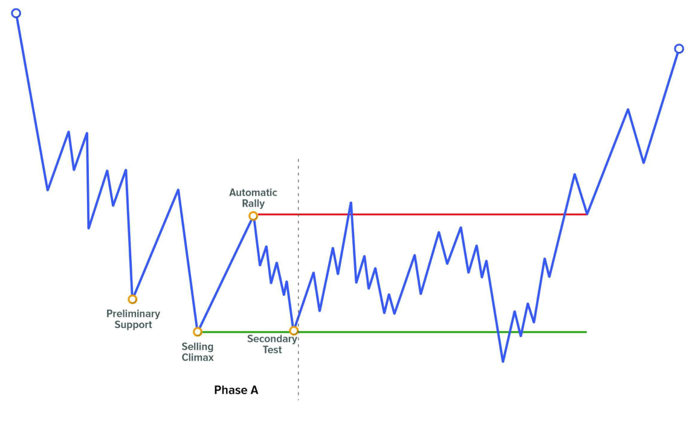
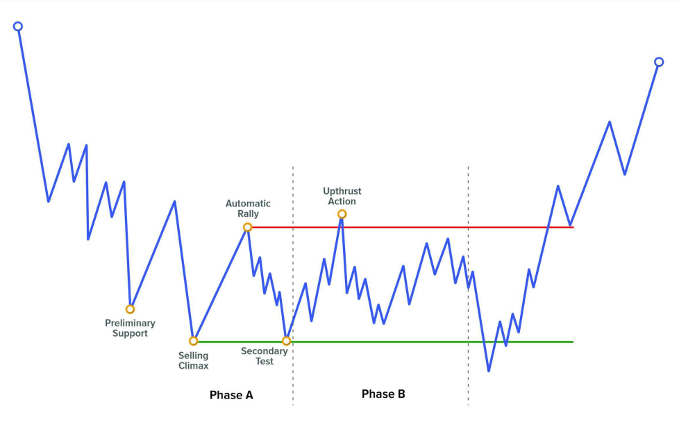
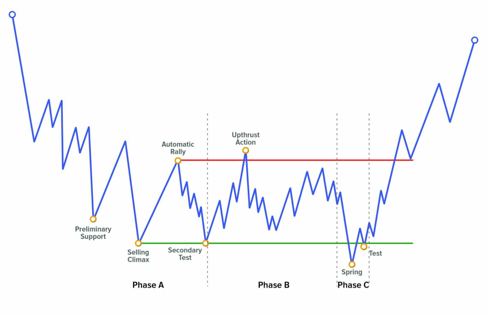
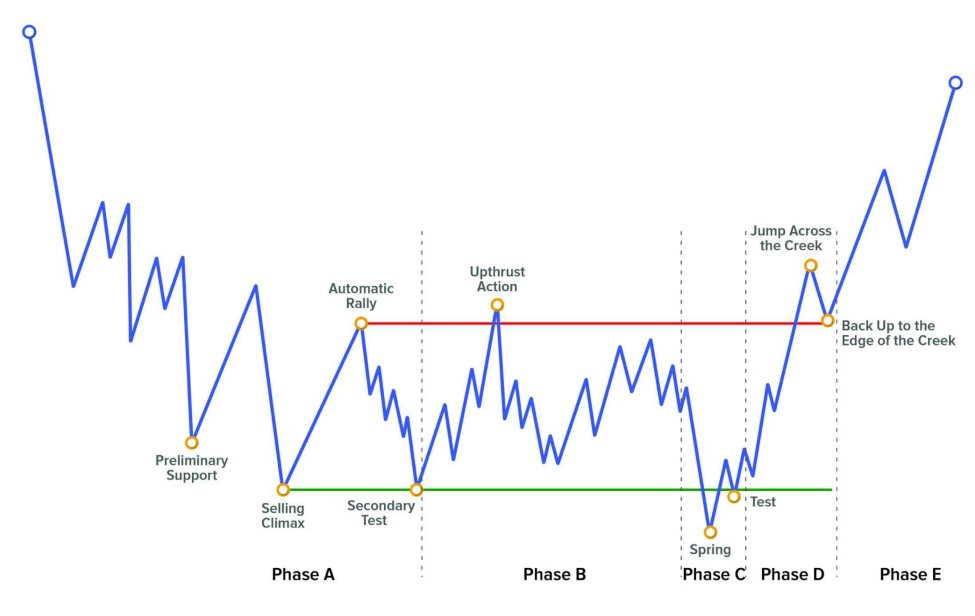
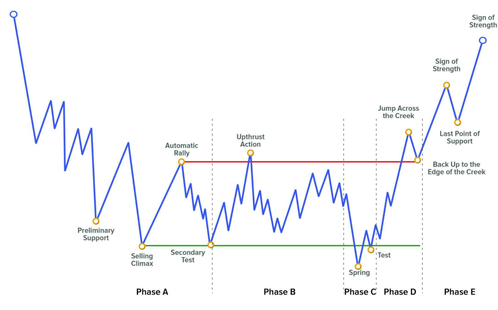

## **PHASES**

Phân tích theo Phases giúp chúng ta cấu trúc các quá trình Accumulation và Distribution, từ đó cung cấp bối cảnh tổng thể cho thị trường. Một khi đã xác định được bối cảnh, ta sẽ có khuynh hướng chờ đợi điều gì đó xảy ra nhiều hơn thay vì điều ngược lại.

**Context (bối cảnh)** là một yếu tố rất quan trọng trong phương pháp Wyckoff, và nó đem lại lợi thế lớn so với các phương pháp phân tích kỹ thuật khác. Ví dụ, một trader dựa trên phân tích kỹ thuật truyền thống có thể thấy một kháng cự và tìm cách Short ở đó với kỳ vọng thị trường đảo chiều. Trong khi đó, một Wyckoff trader – nếu đã xác định đúng các Phase – có thể cho rằng xác suất cao là giá sẽ **phá vỡ kháng cự** và thậm chí còn cân nhắc **vào lệnh Buy**, chờ đợi sự khởi đầu của một xu hướng tăng bên ngoài vùng range.

Trong phương pháp Wyckoff, chúng ta có **năm Phase từ A đến E**; và mỗi Phase có một chức năng riêng:

- **Phase A:** Dừng xu hướng trước đó  
- **Phase B:** Xây dựng nguyên nhân (build the cause)  
- **Phase C:** Kiểm tra (test)  
- **Phase D:** Xu hướng bên trong range  
- **Phase E:** Xu hướng thoát khỏi range  

Bằng cách phân tích hành động giá và khối lượng, ta sẽ xác định được **khi nào các Phase bắt đầu và kết thúc**. Điều rất quan trọng là cho đến thời điểm đó, phân tích của ta phải chính xác – vì chỉ khi đó ta mới có thể tận dụng thông điệp nằm bên trong diễn biến giá.

Các Phase dựa trên thực tế là tất cả các chiến dịch (Accumulation và Distribution) đều cần một khoảng thời gian nhất định để hoàn thành. Trong thời gian đó, giá phát triển thành các cấu trúc mà ta đã biết. **Sức mạnh của phân tích theo Phase nằm ở chỗ các cấu trúc này thường tuân theo mô hình lặp lại**. Điều đó có nghĩa là nếu ta có thể xác định chính xác thị trường đang làm gì (đang tích lũy hay phân phối), thì khả năng cao là chúng ta có thể xây dựng được các kịch bản giao dịch xác suất cao hơn.

---

## **PHASE A: DỪNG XU HƯỚNG TRƯỚC ĐÓ**

Chức năng chính của Phase A là **dừng chuyển động xu hướng trước đó** và đưa thị trường quay trở lại trạng thái cân bằng giữa lực Cung và Cầu – tức là giữa người bán và người mua. Chúng ta chuyển từ môi trường xu hướng sang môi trường đi ngang (range).

**Phase A bao gồm 4 sự kiện đầu tiên:**

- Preliminary Support và Preliminary Supply  
- Selling Climax và Buying Climax  
- Automatic Rally và Automatic Reaction  
- Secondary Test  

Trước khi Phase A bắt đầu, thị trường được kiểm soát bởi một phía – bên bán hoặc bên mua. Nếu là bên bán, ta thấy xu hướng giảm; nếu là bên mua, là xu hướng tăng.

Lúc này, giá có thể đang tiếp cận mức mà các nhà giao dịch lớn bắt đầu **nhìn thấy giá trị** – tức là họ thấy **khoảng chênh lệch lợi nhuận tiềm năng** giữa giá họ đánh giá và giá thực tế. Đây là thời điểm họ bắt đầu **chiến dịch hấp thụ cổ phiếu (stock absorption campaign)**.

Tuy nhiên, ta **chỉ có thể nhận diện tín hiệu quan tâm thực sự khi những sự kiện đầu tiên của phương pháp Wyckoff xuất hiện**. Preliminary Stop với khối lượng đột biến sẽ cảnh báo về **sự gia tăng trong mức độ tham gia thị trường** và khả năng **đóng lệnh hàng loạt**. Rất có thể các nhà giao dịch lớn đã thấy tình trạng giá quá bán hoặc quá mua và bắt đầu chốt lời.

Climax – như chúng ta đã biết – **có thể xuất hiện mà không có Volume cao bất thường** (ví dụ Selling Exhaustion hoặc Buying Exhaustion). Đây là **một cực biên của cấu trúc giá** và là hành động quan trọng để triệt tiêu lực kiểm soát từ phía trước.

Sự xuất hiện của **Reaction** là một trong những tín hiệu rõ ràng nhất vì nó xác nhận điều gì đó đang xảy ra. Giá trước đó đang theo một xu hướng mạnh, nhưng cú phản ứng này cho thấy có dấu hiệu **xuất hiện lực đối lập đáng kể**.

**Test** là bước cuối cùng của Phase A, đánh dấu sự khởi đầu của **Phase B**.

---

## **PHASE B: XÂY DỰNG NGUYÊN NHÂN (BUILDING THE CAUSE)**

Sau khi xuất hiện Secondary Test, **Phase B bắt đầu**, với mục đích là **xây dựng nguyên nhân (build the cause)** nhằm chuẩn bị cho chuyển động giá sau đó (the effect).

**Phase B bao gồm các lần test lặp lại (Secondary Test in B)** có thể diễn ra ở cả hai cực của cấu trúc:

- Upthrust Action và Upthrust  
- Secondary Test as Sign of Weakness và minor Sign Of Weakness  

Trong giai đoạn này, thị trường ở trạng thái cân bằng – và **đây là lúc các nhà giao dịch lớn tận dụng để hấp thụ phần lớn cổ phiếu cần thiết** trước khi giai đoạn kết thúc.

**Về mặt tỷ lệ thời gian**, chúng ta muốn Phase B **kéo dài hơn** Phase A và C. Đây là một quy tắc chung – vì tuy có những ngoại lệ như hành động Hypodermic (V-turn), đa số trường hợp Phase B dài hơn.

Nếu Phase B **ngắn hơn** Phase A hoặc C, điều đó **thể hiện sự cấp bách** từ phía nhà giao dịch lớn, và đồng thời **tăng cường sức mạnh của xu hướng sau đó**.

---

## **PHASE C: TEST**

Phase C bắt đầu với hành động **Shake** và kết thúc sau khi **Test của Shake** hoàn tất.

Trong Phase này, **các nhà giao dịch lớn kiểm tra mức độ quan tâm của phần còn lại của thị trường** đối với một số mức giá nhất định.

Phase C bao gồm hành động Shaking:

- Spring / Shakeout  
- Upthrust After Distribution (UTAD)  

Trước khi bắt đầu xu hướng mới, các nhà giao dịch lớn **rất có thể sẽ tạo ra một hành động Shake** để xác nhận rằng **không còn lực phản kháng đáng kể nào** – tức là đường đi ít kháng cự nhất (path of least resistance) đang ủng hộ họ.

Nếu tại vùng đó vẫn còn khối lượng tham gia cao, điều đó có nghĩa là thị trường **chưa hấp thụ đủ cổ phiếu**, và quyền kiểm soát chưa nghiêng hẳn về một phía.

Khi đó, khả năng cao là:

- Họ **tạm ngưng chiến dịch**, giá tiếp tục đi theo xu hướng cũ  
- Hoặc **tiếp tục kéo dài Phase B** để hấp thụ đủ trước khi tạo xu hướng mới  
- Và có thể sẽ thực hiện **những lần test tiếp theo** cho đến khi không còn lực cản

Một điểm rất quan trọng là **Shake không nhất thiết phải vượt qua cực biên của cấu trúc** – điều đó là lý tưởng vì càng đâm sâu vào vùng thanh khoản, càng tạo được nhiều “xăng” cho cú nhảy giá sau đó.

Dù vậy, ngay cả khi hành động Shake không phá vỡ cực biên, nó vẫn là một phần của Phase C. Có thể dán nhãn là **Spring / Upthrust minor**, hoặc đơn giản là **Last Point of Support / Supply** – điều quan trọng là hiểu được chức năng thực sự của hành động, chứ không phải nhãn hiệu.

---

## **PHASE D: XU HƯỚNG TRONG RANGE**

Phase D bắt đầu **sau khi Shake đã được Test thành công**, và kéo dài cho đến khi **Confirmation Event** được hoàn tất.

Lúc này, **không còn kháng cự đáng kể nào**, và thị trường đã mất cân bằng. Trên biểu đồ, điều đó được thể hiện qua hành động Breakout.

**Phase D bao gồm các sự kiện Breakout và Confirmation:**

- Sign of Strength / Jump Across the Creek  
- Sign of Weakness  
- Last Point of Support / Back Up to the Edge of the Creek  
- Last Point of Supply  

Nếu phân tích đúng, sau cú Shake, giá sẽ bắt đầu phát triển một xu hướng rõ ràng bên trong range – với các cây nến mạnh và khối lượng tăng lên – để phá vỡ cấu trúc.

Nếu vùng Creek hoặc Ice (được xác định từ Reaction) vẫn còn lực cản mạnh, thì có ba khả năng:

1. Giá thoái lui để tạo **Last Point of Support / Supply** rồi mới tiếp tục phá  
2. Giá **chấp nhận trả giá cao hơn** để hấp thụ kháng cự và phá vỡ luôn  
3. Cú Break thất bại, tạo thành **một cú Shake mới**, tức là một **Test ở Phase C**, và thị trường quay đầu theo hướng ngược lại

Nếu cấu trúc đã phát triển đúng, kịch bản 3 là **ít khả năng nhất**, nhưng ta luôn phải đề phòng.

---

## **PHASE E: XU HƯỚNG THOÁT RANGE**

Phase E bắt đầu **sau khi Confirmation Event xuất hiện thành công**.

Nếu Test sau cú Break xác nhận rằng **không còn trader đi ngược chiều**, ta có thể chắc chắn rằng **một bên đã hoàn toàn kiểm soát thị trường** – và từ đó, chỉ nên tìm lệnh theo hướng đó.

Phase này bao gồm **các chu kỳ sóng đẩy và sóng điều chỉnh:**

- Sign of Strength và Sign of Weakness  
- Last Point of Support và Last Point of Supply  

Giá rời khỏi vùng range – nơi nguyên nhân (cause) đã được tích lũy trước đó – và bắt đầu xu hướng mới (effect). Việc có Breakout + Confirmation là **tín hiệu rõ ràng cho thấy các nhà giao dịch lớn đã vào vị thế theo hướng đó**.

Từ điểm này, ta bắt đầu triển khai các công cụ phân tích xu hướng.

---
