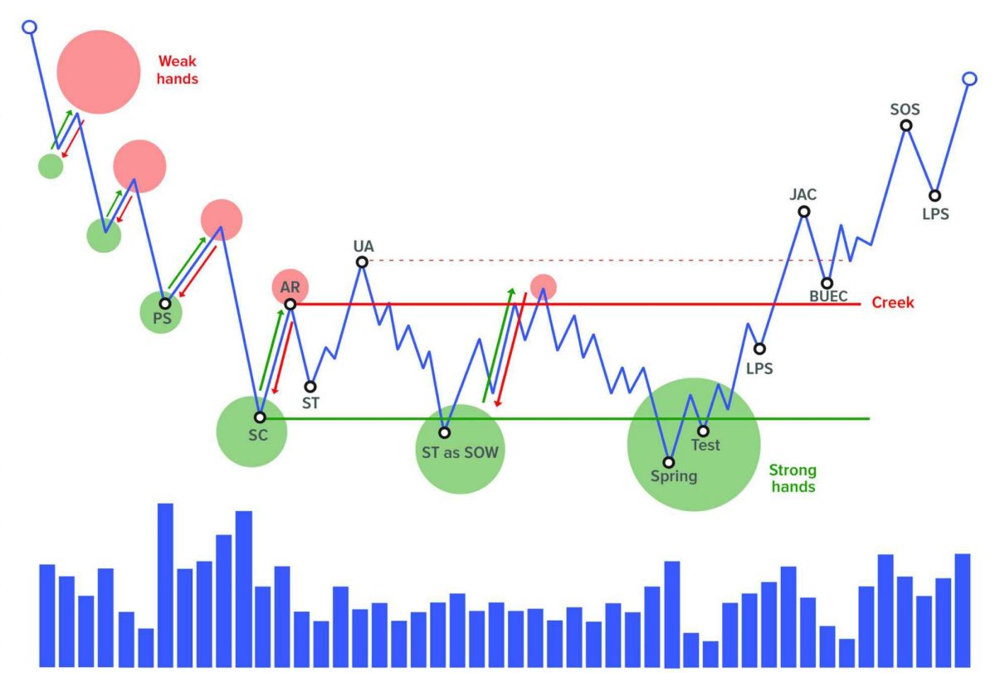
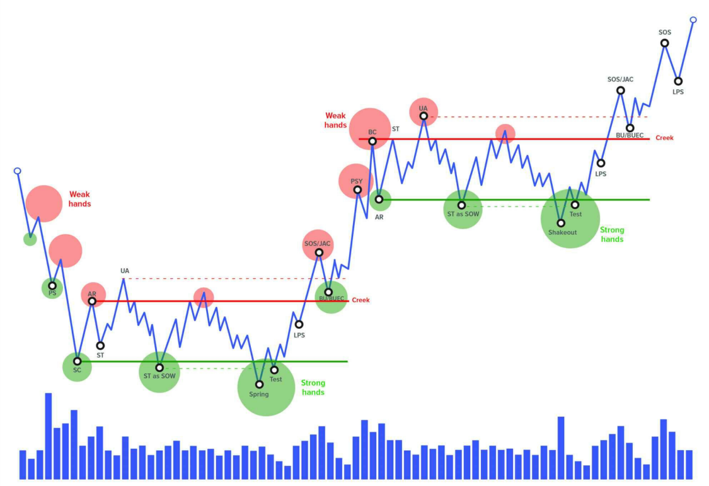
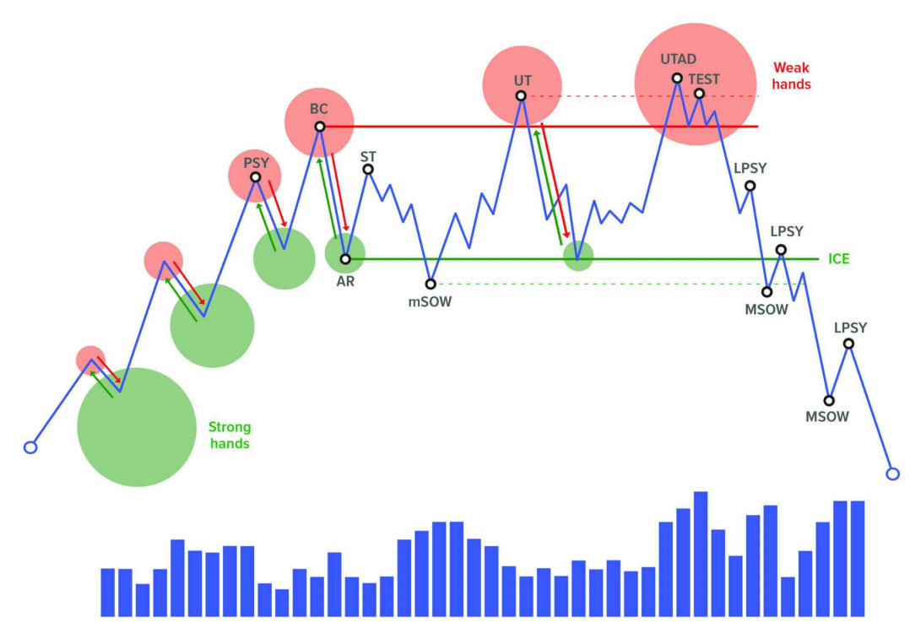
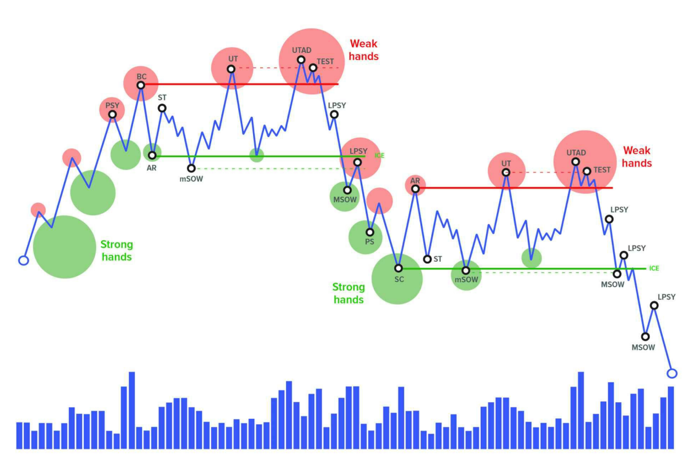

# 📘 **TÍCH LŨY (ACCUMULATION)**

---

## 🎯 **Vùng tích lũy là gì?**

Vùng tích lũy là một giai đoạn giá **đi ngang (sideways)** sau khi thị trường **giảm giá trước đó**. Trong vùng này, các **nhà giao dịch lớn** (tay to) thực hiện các chiến lược **hấp thụ lượng cung còn lại**, nhằm mục đích mua vào càng nhiều càng tốt tại vùng giá thấp, để **bán lại ở mức giá cao hơn trong tương lai** và thu lợi từ chênh lệch giá.

---

## 🔄 **Kiểm soát cổ phiếu**

Trong đợt giảm giá trước đó, **cổ phiếu phần lớn nằm trong tay “tay nhỏ” (weak hands)** – những người ít thông tin, dễ bị ảnh hưởng tâm lý.  
Để thị trường có thể đảo chiều, **tay to cần phải kiểm soát lượng hàng hóa (stock)**.

- Càng giảm sâu → càng có nhiều tay nhỏ hoảng loạn bán ra → tay to dễ dàng mua vào.
- Vùng tích lũy chính là nơi mà **quá trình hấp thụ cuối cùng** diễn ra trước khi thị trường bắt đầu tăng.

---

## ⚖️ **Luật Nhân – Quả trong vùng tích lũy**

Đây là nơi thể hiện rõ **quy luật Nhân – Quả (Cause and Effect)** của Wyckoff:

- **Nguyên nhân (Cause)**: quá trình mua tích lũy âm thầm.  
- **Kết quả (Effect)**: xu hướng tăng sau đó.

📌 Tích lũy càng kỹ → xu hướng tăng càng mạnh.  
Tay to không thể mua ồ ạt một lần vì **chính họ sẽ làm giá tăng**. Vì vậy, họ phải **chia nhỏ, hấp thụ từng chút một** để giữ giá thấp.

---

## 🧠 **Chiêu trò thao túng (Handling maneuvers)**

Để tích lũy thuận lợi, tay to thường **tạo ra bối cảnh tiêu cực**:

- Tin tức xấu, thị trường ảm đạm → nhiều người **bán ra sai thời điểm**.
- Giá được **kéo xuống mạnh và bất ngờ** → gọi là **Shakeout** hay **Spring**.

### 🎯 Mục tiêu của Spring

1. **Kích hoạt Stop Loss** của người đang mua đúng.
2. **Dụ người thiếu hiểu biết bán ra**, tưởng thị trường còn giảm.
3. **Mua được thêm hàng giá thấp** từ cả 2 hành động trên.

📌 Tuy nhiên, không phải lúc nào cũng có Spring. Có những vùng tích lũy **tăng lên mà không có cú phá đáy** → khó nhận biết hơn, nhưng vẫn hợp lệ.

---

## 🔁 **Loại bỏ "tay yếu" (weak hands)**

“Tay yếu” là những người:

- Mua xong thì **chốt lời sớm**, không kiên nhẫn.
- Tâm lý yếu → dễ thoát lệnh vì nhàm chán hoặc sợ hãi.

💡 Tay to **cố tình tạo một thị trường buồn tẻ, ít biến động** để làm nản lòng tay yếu → họ chốt lời sớm → tay to mua lại hết.

---

## 💧 **Thanh khoản và đối tác khớp lệnh (Counterparty, Liquidity)**

- Khi trader nhỏ bị dính stop loss hoặc bán ra → họ đang tạo ra **lệnh bán thị trường (market sell)**.
- Tay to cần những lệnh bán này để **khớp với lệnh mua của họ** → tức là **có đối tác khớp lệnh**.

📌 Sau khi Spring xảy ra → nếu giá bật lên mạnh → những người bán khống cũng **phải mua lại để cắt lỗ**, càng đẩy giá tăng nhanh hơn.

---

## 🛣 **Chờ xác nhận “đường ít kháng cự nhất”**

Tay to sẽ không đẩy giá lên ngay. Họ cần kiểm tra xem:

- **Còn ai muốn bán ở vùng cao không?**
- Nếu **không có khối lượng bán xuất hiện khi giá test vùng cao**, họ sẽ biết đường đã “thoáng”.

📌 Do đó, có thể thấy **nhiều cú Spring liên tiếp** – là các đợt **test kiểm tra cung**, không phải thật sự phá đáy.

---

## 📌 **Đặc điểm chung của vùng tích lũy**

1. **Khối lượng và biến động giảm dần** theo thời gian.
2. **Giá test lên vùng đỉnh mà không có volume** → không còn người bán.
3. **Spring** tại vùng hỗ trợ hoặc các đáy nhỏ trong range.
4. **Sóng tăng rộng và mượt**, sóng giảm ngắn và yếu → lực mua chất lượng tốt.
5. **Tạo đáy sau cao hơn đáy trước** ở giai đoạn cuối → báo hiệu xu hướng tăng đang chuẩn bị bắt đầu.

---

## 🚀 **Khi xu hướng tăng bắt đầu**

Khi lượng hàng trên thị trường **đã được hấp thụ hết**, tay to **đã kiểm soát giá trị**.

Chỉ cần một chút cầu xuất hiện → giá sẽ **bật lên mạnh mẽ** vì không còn lực bán nào cản trở.

🎯 Từ đây, xu hướng tăng chính thức hình thành – người đến sau sẽ “đu trend”, còn tay to bắt đầu **xả hàng dần ở vùng cao hơn**.

---

# 📘 **TÁI TÍCH LŨY (REACCUMULATION)**

---

## 🔁 **Quá trình tái tích lũy là gì?**

Quá trình **tái tích lũy** về bản chất **giống hệt với tích lũy ban đầu**.  
Điểm khác biệt duy nhất là **cách cấu trúc bắt đầu**:

- **Tích lũy**: xảy ra sau khi một xu hướng giảm kết thúc.  
- **Tái tích lũy**: xảy ra sau khi một **xu hướng tăng dừng lại**.

---

## 📦 **Hấp thụ cổ phiếu trong tái tích lũy**

Tái tích lũy diễn ra khi một xu hướng tăng đã diễn ra trước đó, nhưng **cần được củng cố lại**.

### 🧠 Điều gì xảy ra sau một đợt tăng?

- Lúc đầu, cổ phiếu nằm trong tay các **nhà đầu tư mạnh (tay to)**.
- Khi giá tăng → nhiều người mua vào → cổ phiếu **dần rơi vào tay tay nhỏ**.

💡 Lúc này, lực cầu trở nên **kém chất lượng**.  
Để tiếp tục đẩy giá cao hơn, **thị trường cần khởi động lại một quá trình tích lũy** để tay to lấy lại quyền kiểm soát.

---

## ⏳ **Thời gian tái tích lũy kéo dài bao lâu?**

Rất quan trọng!

- Nếu phần lớn cổ phiếu vẫn trong tay tay to → quá trình tái tích lũy **diễn ra nhanh**.
- Nếu phần lớn đã nằm trong tay nhỏ lẻ → cần **thêm thời gian** để hấp thụ lại cổ phiếu.

Mục tiêu của tái tích lũy là:

- **Tăng thêm lực cầu mới**, để tiếp tục xu hướng tăng và **đạt đến mục tiêu đã định của giai đoạn tích lũy ban đầu**.

---

## ❗ **Dễ nhầm lẫn: Tái tích lũy hay Phân phối?**

Một trong những sai lầm nghiêm trọng nhất với trader Wyckoff là:

> ❓ **Phân biệt nhầm giữa tái tích lũy và phân phối.**

Vì sao?

- Cả hai đều bắt đầu sau khi xu hướng tăng dừng lại.
- Cả hai đều có cấu trúc giá đi ngang (range), volume phức tạp.
  
📌 Vì vậy, **việc phân tích hành động giá và khối lượng thật cẩn thận** là **bắt buộc** nếu muốn xác định đúng.

---

## ✅ Lời khuyên quan trọng

Hãy **hiểu rõ đặc điểm của cấu trúc tích lũy** (volume giảm dần, test không có cung, Spring...)  
→ từ đó so sánh với vùng bạn đang phân tích để **tránh vào lệnh sai phía**.

---

# 📘 **PHÂN PHỐI (DISTRIBUTION)**

---

## 🔻 **Vùng phân phối là gì?**

Vùng phân phối là một giai đoạn **giá đi ngang**, diễn ra **sau một xu hướng tăng**, nơi các **chuyên gia giàu kinh nghiệm (tay to)** âm thầm **bán ra cổ phiếu** để chuẩn bị cho một xu hướng giảm trong tương lai.  
Mục tiêu của họ là **xả hàng ở giá cao** cho các trader nhỏ lẻ, rồi **mua lại ở giá thấp**, thu lợi từ chênh lệch.

---

## ⚖️ **Luật Nhân – Quả trong phân phối**

Quy luật Nhân – Quả (Cause and Effect) được áp dụng tương tự như vùng tích lũy:

- **Nguyên nhân (Cause)**: Quá trình bán âm thầm.  
- **Kết quả (Effect)**: Xu hướng giảm sau đó.

📌 **Thời gian phân phối càng dài** → **giá giảm sau đó càng mạnh**.

> Tay to không thể bán hết một lúc, vì họ sẽ tự khiến giá tụt.  
> Họ cần **thời gian để hấp thụ toàn bộ lực cầu** ở vùng cao nhất có thể.

---

## 🧠 **Chiêu trò thao túng (Handling maneuvers)**

Trong quá trình phân phối, tay to thường **tạo ra cảm giác thị trường cực mạnh**:

- Tin tức tốt, sự hưng phấn, kỳ vọng tăng mạnh...
- Mục tiêu: **Thu hút càng nhiều người mua càng tốt** → để **bán dần mà không làm giá giảm**.

### 🎯 **Chiêu kinh điển: Upthrust (UT)**

Upthrust là một cú **phá vỡ giả lên phía trên** vùng kháng cự → khiến trader tưởng giá sẽ tiếp tục tăng, nên lao vào mua.

**Tay to dùng Upthrust để:**

1. Kích hoạt stop loss của những người bán khống.
2. Dụ người thiếu kinh nghiệm mua vào.
3. Bán ra chính tại vùng giá cao đó.

---

## 😵 **Loại bỏ "tay yếu"**

“Tay yếu” là những người:

- Bán khống sớm → thấy thị trường đi ngang, buồn chán → chốt lãi sớm.
- Mua theo tin tức → dễ hoảng loạn khi có biến.

Tay to sẽ:

- **Tạo thị trường đi ngang, nhàm chán** → ép tay yếu thoát lệnh.
- Dễ dàng hấp thụ các lệnh mua để hoàn tất quá trình phân phối.

---

## 💧 **Thanh khoản & đối tác khớp lệnh**

Tay to **cần lệnh mua để bán ra** → và họ **tạo điều kiện để có thanh khoản**, bằng:

- Kích hoạt stop loss (người bán cắt lỗ).
- Dụ người mua vào.
- Lấy hết lực mua → rồi quay đầu → đẩy thị trường rơi mạnh.

> Khi thị trường đảo chiều, người đã mua sẽ phải **cắt lỗ** → càng khiến giá rơi nhanh hơn.

---

## 🛣 **Đường ít kháng cự nhất**

Khi vùng phân phối gần hoàn tất, tay to sẽ **kiểm tra xem còn ai muốn mua không**.

Họ làm điều này bằng cách:

- Đẩy giá lên nhẹ → xem có ai mua theo không.
- Nếu **volume thấp** khi giá tăng → tức là **không còn người mua hứng thú**.

📌 Khi chắc chắn không còn cầu, họ sẽ **bắt đầu xu hướng giảm**.

---

## 📌 **Đặc điểm nhận biết vùng phân phối**

1. **Volume cao và biến động lớn** trong suốt quá trình đi ngang.
2. Giá test lại đáy nhưng **volume yếu** → không còn người mua.
3. **Upthrust** tại đỉnh → phá đỉnh giả.
4. Sóng giảm **rộng và mượt**, sóng tăng ngắn, yếu.
5. Xuất hiện dần **đỉnh thấp – đáy thấp hơn**, đặc biệt cuối range → cho thấy bên bán đang mạnh dần.

---

## ⛷ **Khi xu hướng giảm bắt đầu**

Khi lực mua đã cạn → tay to kiểm soát thị trường → chỉ cần **một chút cung mới vào** là **giá rơi rất nhanh**.

🎯 Đây là lúc xu hướng giảm chính thức khởi phát.

---

# 📘 **TÁI PHÂN PHỐI (REDISTRIBUTION)**

---

## 📉 **Tái phân phối là gì?**

Tái phân phối là một **giai đoạn đi ngang của giá** nằm **giữa hai xu hướng giảm**.  
Nói cách khác, thị trường đang trong xu hướng giảm → dừng lại để “nghỉ” → rồi **tiếp tục giảm tiếp**.

> Tái phân phối chính là **“nghỉ giữa hiệp”** của xu hướng giảm.

Trong một thị trường giá xuống lớn, có thể xuất hiện **nhiều pha tái phân phối** trước khi đáy thực sự hình thành.

---

## ⚖️ **Tái phân phối hay tích lũy?**

Một vấn đề rất lớn đối với trader Wyckoff là:

> ❗ Làm sao phân biệt tái phân phối với tích lũy?

Vì cả hai **đều bắt đầu giống nhau**:

- Giá giảm → tạo range đi ngang.
- Volume, dao động... khá tương đồng.

📌 Nếu đọc sai → bạn sẽ **mua đáy trong một xu hướng giảm mạnh**.

Do đó, cần **phân tích thật kỹ hành động giá và khối lượng**, đặc biệt là sự hiện diện hay thiếu vắng của cầu (demand).

---

## 📦 **Kiểm soát cổ phiếu trong tái phân phối**

Trong vùng tái phân phối:

- Tay to **đã có vị thế bán khống (short)** từ trước.
- Họ sẽ:
  - **Bán thêm ở vùng đỉnh của range**
  - **Chốt lời một phần ở đáy của range** để **giữ giá không rơi quá sớm**, nhằm **tiếp tục bán thêm**.

> Họ **dùng các cú hồi kỹ thuật để lôi kéo lực mua**, tạo thanh khoản cho việc bán ra thêm.

Sau khi hoàn tất việc phân phối lại, họ sẽ để thị trường **rơi tiếp** theo xu hướng giảm chính.

---

## 🔄 **Thay đổi quyền kiểm soát thị trường**

Tương tự như xu hướng tăng, trong xu hướng giảm cũng có sự thay đổi “tay”:

- Lúc đầu thị trường rơi mạnh → cổ phiếu chủ yếu nằm trong tay tay to (người bán khống).
- Khi giá hồi → có những người mua mới nhảy vào → cổ phiếu dần **vào tay nhỏ lẻ**.

➡️ Lúc này, cung trở nên **kém chất lượng** → thị trường cần một quá trình “hấp thụ cung yếu” → chính là **tái phân phối**.

---

## ⏳ **Thời gian tái phân phối kéo dài bao lâu?**

- Nếu phần lớn cổ phiếu **vẫn nằm trong tay tay to** → quá trình tái phân phối **diễn ra nhanh**.
- Nếu phần lớn **đã vào tay nhỏ lẻ** → cần thêm thời gian để tay to hấp thụ lại.

---

## 🎯 **Mục tiêu của tái phân phối**

Cấu trúc này được hình thành để:

- **Tạo thêm vị thế bán mới** cho tay to,
- Từ đó tiếp tục **đẩy giá về các mục tiêu thấp hơn** được xác định từ vùng phân phối chính trước đó.

---

## ✅ Kết luận nhanh

| Vùng           | Diễn ra khi nào?                  | Mục tiêu thực sự                 |
|----------------|-----------------------------------|----------------------------------|
| **Tái phân phối** | Sau nhịp giảm, thị trường đi ngang | Tiếp tục xu hướng giảm ban đầu   |
| **Tích lũy**      | Sau nhịp giảm, thị trường đi ngang | Chuẩn bị cho xu hướng tăng mới   |

---