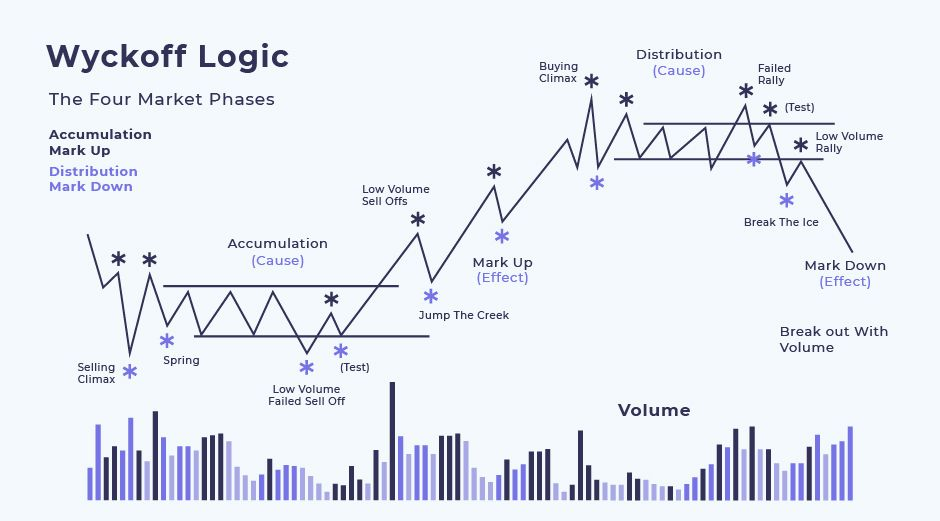

> _**🧠 Thị trường luôn thay đổi – không bao giờ giống nhau**_

Bạn có từng vẽ biểu đồ, thấy mô hình này giống hôm qua, nhưng hôm sau thì khác hẳn?

👉 Đó là vì **thị trường không lặp lại chính xác**, bởi nó là một hệ thống sống, liên tục thay đổi theo hành vi của người mua và người bán.

Do đó, **không thể dùng mô hình cố định để áp dụng mọi lúc**. Nhưng tin vui là: có **một số nguyên tắc cơ bản luôn tồn tại**, giúp bạn nhận ra điều gì đang xảy ra.

---

> _**🧭 Wyckoff giúp bạn đọc hành vi thị trường**_

Phương pháp Wyckoff không đòi hỏi bạn phải dự đoán tương lai.  
Thay vào đó, nó giúp bạn **đọc hiểu hiện tại** bằng cách nhìn vào **giá và khối lượng giao dịch**, giống như bạn đọc "dấu chân" của cá mập trên biểu đồ.

Để làm được điều đó, Wyckoff chia thị trường thành:

- **Các sự kiện (events)** – như các cột mốc quan trọng.
- **Các giai đoạn (phases)** – như từng màn trong một vở kịch.

---

