Các quyết định giao dịch và đầu tư của chúng ta sẽ dựa trên ba yếu tố mà tôi tin là quan trọng nhất cần xem xét trong việc đọc biểu đồ một cách chủ động, theo thứ tự: **bối cảnh (context), cấu trúc (structures)** và **vùng giao dịch (trading areas).**

---

## 1. **BỐI CẢNH (THE CONTEXT)**

Nó liên quan chủ yếu đến những gì nằm bên trái của biểu đồ, cả trong khung thời gian mà bạn chọn để giao dịch và trong khung thời gian cao hơn.

Quy tắc then chốt về bối cảnh rất rõ ràng: **giao dịch theo hướng của cấu trúc lớn hơn.** Điều này có nghĩa là, khi thị trường phát triển nhiều cấu trúc cùng lúc ở các khung thời gian khác nhau, chúng ta phải luôn ưu tiên sự phát triển của cấu trúc dài hạn hơn. Đây là cách logic nhất để chúng ta định hướng thị trường.

Ví dụ, nếu chúng ta thấy mình ở sau một cú bứt phá đi lên trong một cấu trúc tích lũy tiềm năng thuộc khung thời gian cao hơn, thì tại khu vực đó, chúng ta sẽ ưu tiên sự phát triển của một cấu trúc **reaccumulation** nhỏ hơn sẽ hoạt động theo dạng **BUEC** của cấu trúc lớn hơn.

Trong ví dụ này, chúng ta thấy rằng phân tích của mình đã có thành kiến (thiên về sự phát triển của **reaccumulation**) dựa trên những gì giá đã làm cho đến khi đạt đến điểm đó (cấu trúc tích lũy chính tiềm năng). Đây là tầm quan trọng của **context**.

Ngoài việc mang lại cho chúng ta cơ hội giao dịch an toàn hơn, việc xác định **context** còn giúp chúng ta tránh tìm kiếm các giao dịch ở phía sai của thị trường.

Nói cách khác, nếu phân tích cấu trúc của chúng ta nói rằng thị trường có thể đang tích lũy, thì kể từ thời điểm đó, chúng ta chỉ nên tìm kiếm các lệnh **buy**, và loại bỏ hoàn toàn các lệnh **sell**.

Điều này rất quan trọng vì đôi khi chúng ta có thể không tìm được điểm vào phù hợp trong xu hướng tăng hiện tại, nhưng ít nhất chúng ta cũng sẽ tránh được việc đứng ở phía sai – trong ví dụ này là phía **short**. Chúng ta có thể không thắng, nhưng ít ra cũng không thua.

---

## 2. **CẤU TRÚC (THE STRUCTURES)**

Đây là nền tảng của phương pháp Wyckoff. Nhiệm vụ của chúng ta là cố gắng hiểu điều gì đang xảy ra bên trong cấu trúc, ai đang giành quyền kiểm soát giữa bên mua và bên bán.

Mục tiêu duy nhất của việc nội tâm hóa toàn bộ lý thuyết đã học là để đến được giai đoạn này trong giao dịch – **đưa ra các kịch bản vững chắc nhất có thể.**

Nhiều trader đánh giá thấp phương pháp Wyckoff, viện lý do rằng nó được phát triển trong điều kiện thị trường rất khác so với hiện nay. Điều này hoàn toàn đúng, vì công nghệ và cơ cấu thị trường đã thay đổi đáng kể.

Tuy nhiên, điều không thay đổi là **sự tương tác giữa cung và cầu**. Bất kể ai thực hiện lệnh, sự tương tác này vẫn để lại dấu vết trên giá dưới dạng các **cấu trúc** lặp đi lặp lại.

Logic của cấu trúc dựa trên thực tế rằng, để giá có thể xoay chuyển, nó cần được **tích lũy (accumulated)** hoặc **phân phối (distributed)** trong một **quy trình có hệ thống** và cần thời gian để hình thành. Dù đôi khi thị trường có những cú quay đầu hình chữ V dữ dội, nhưng đây không phải là điều phổ biến.

Quy trình này gồm nhiều bước (các **phase** và **event** trong phương pháp) giúp chúng ta nhận biết khi nào giá có khả năng xoay chiều. Tóm tắt, các bước đó gồm:

1. **Dừng xu hướng trước đó**
2. **Xây dựng nguyên nhân (cause)**
3. **Đánh giá cuộc cạnh tranh**
4. **Bắt đầu xu hướng mới**
5. **Xác nhận tính định hướng**

Phương pháp Wyckoff đã **phóng đại kính hiển vi** vào từng bước này để tạo ra một **kỷ luật phân tích** có mục tiêu đánh giá dấu chân của cung và cầu thông qua giá và khối lượng, nhằm xác định nơi nào thị trường có khả năng mất cân bằng quyền kiểm soát. Đây chính là công việc của một Wyckoff trader.

Tóm lại, mục tiêu là **đưa ra kịch bản vững chắc**, điều mà sẽ **bất khả thi nếu chúng ta không hiểu toàn bộ các yếu tố cấu thành phương pháp.**

---

## 3. **VÙNG GIAO DỊCH (TRADING AREAS)**

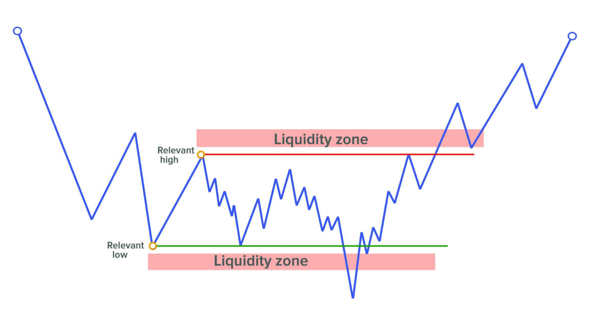

Nguyên lý cốt lõi ở đây là **lý thuyết đấu giá (auction theory)** và nhu cầu của thị trường trong việc tạo điều kiện cho giao dịch. Như chúng ta đã nói trước đó, các **big trader** cần tìm người giao dịch đối ứng khi mở hoặc đóng vị thế.

Vì vậy họ tận dụng các đợt **Shake** để mở vị thế, và giữ lệnh đó đến khi giá chạm đến **các vùng có thanh khoản lớn** để có thể đóng vị thế.

Điểm mấu chốt là **các vùng giao dịch này hoạt động như nam châm hút giá** vì chúng tạo ra đủ sự quan tâm để các trader khác đặt các lệnh chờ (pending orders) xung quanh khu vực đó – **thu hút thanh khoản (liquidity)**. Và chính thanh khoản này khiến giá có xu hướng quay về các vùng này.

Ví dụ, một **big trader** đã mua rất nhiều khi thị trường giảm (Spring), thì họ cần giữ vị thế **mua** cho đến khi tìm được vùng thanh khoản lớn để **đóng các lệnh mua** (tức là **bán** ra). Khi đó, họ cần **volume của người mua**, tức các trader sẵn sàng mua các lệnh **sell** của họ.

Vì lý do đó, họ gần như **bắt buộc phải đưa giá đến các vùng có nhiều lệnh chờ** để tìm **thanh khoản** – và chúng ta có thể **gián tiếp tận dụng thông tin này**. Chúng ta sẽ đi sâu vào từng vùng cụ thể trong phần sau.

---

## **VỊ THẾ CHÍNH (PRIMARY POSITIONS)**

Trong phương pháp Wyckoff, **chỉ có một số vùng nhất định được xem là hợp lệ để đánh giá khả năng vào lệnh**, gồm:

- **Phase C**: tại vùng có khả năng xuất hiện cú **Shake** (Spring hoặc Upthrust).
- **Phase D**: trong quá trình phát triển của xu hướng bên trong biên độ hoặc ở lần kiểm tra sau cú phá vỡ.
- **Phase E**: tìm kiếm các lần kiểm tra xu hướng hoặc các cấu trúc nhỏ thuận chiều với cấu trúc lớn hơn (**context**).

Chúng ta sẽ đi vào chi tiết từng vùng giao dịch, cũng như các sự kiện có thể xảy ra trong những vùng này.

---

### **So sánh ưu – nhược điểm của các vị thế giao dịch**

Điểm then chốt: **Cấu trúc phát triển càng đầy đủ, độ tin cậy khi giao dịch càng cao**, nhưng **lợi nhuận tiềm năng sẽ thấp hơn**. Nói cách khác, **càng vào lệnh sớm, lợi nhuận tiềm năng càng lớn nhưng độ tin cậy càng thấp.**

---

## ✅ **TRONG PHASE C**

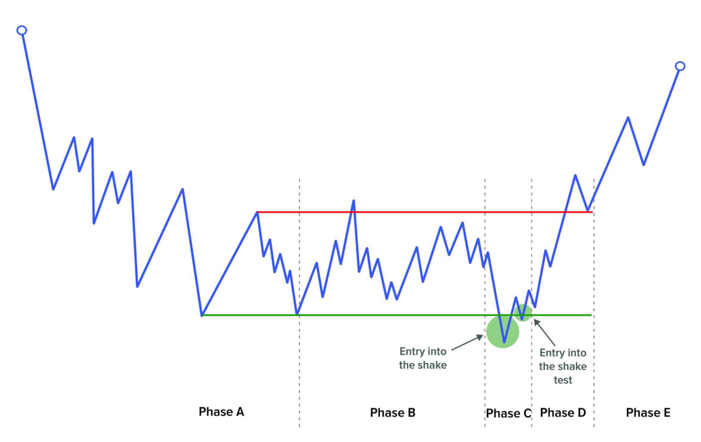

Đây là vị trí mang lại **tỷ lệ Risk:Reward tốt nhất** vì ta đang ở đầu mép cấu trúc và tiềm năng di chuyển của giá còn nhiều.

### 🔹 **Vào lệnh tại Shake (Spring/Upthrust)**

Chỉ nên vào nếu Shake diễn ra với **khối lượng thấp**. Vì chúng ta biết rằng khối lượng cao thường sẽ bị **test lại** để xác minh sự cam kết của các trader, nên việc vào lệnh ngay sau một Shake có volume lớn là **thiếu hợp lý**. Thay vào đó, **hãy chờ cú test**, thường sẽ mang lại **tỷ lệ Risk:Reward tốt hơn**.

Các Shake có thể nhận biết dễ dàng vì xảy ra ở **đầu mút của cấu trúc**. Không cần theo dõi từng phút, chỉ cần đặt **cảnh báo giá** tại các điểm cực trị là có thể chuẩn bị sẵn sàng để giao dịch.

---

### 🔹 **Vào lệnh tại Test của Shake**

Đây là **kiểu vào lệnh yêu thích nhất** của mọi Wyckoff trader.

Sau cú Shake, hãy **chờ giá quay lại khu vực đó**, với **biên độ co hẹp** và **volume giảm dần** (xem **Event #4: Test**).

Một điểm rất quan trọng là cú Test **phải giữ vững vùng biên**, không tạo đáy mới (nếu là Spring) hoặc không tạo đỉnh mới (nếu là Upthrust).

---

### 🔹 **Vào lệnh tại Last Point of Support (LPS)**

Đây là kiểu vào lệnh **khó phát hiện hơn**, vì ta **chỉ biết được nó là LPS sau khi cấu trúc đã bị phá vỡ** (ví dụ như trong **Accumulation Structure #2**).

**Phase C** có thể hình thành qua **Shake** hoặc qua sự kiện **LPS/LPSY**. Với Shake, ta có dấu hiệu rõ ràng (quét thanh khoản cuối cấu trúc). Nhưng với **LPS**, **ta không thể biết chính xác thời điểm nó đang diễn ra**, nên **thường không thể giao dịch** tại thời điểm đó.

---

## ✅ **TRONG PHASE D**

Nếu Shake + Test thành công, chúng ta sẽ thấy **một dấu hiệu thể hiện ý đồ rõ ràng** – **Sign of Strength (SOS)** hoặc **Sign of Weakness (SOW)** – dẫn giá đi theo hướng mới. Đây là **context** mà ta sẽ dựa vào để tiếp tục hành động.

### 🔹 **Vào lệnh trong xu hướng bên trong biên độ**

Trong quá trình giá di chuyển từ đầu này sang đầu kia, sẽ có nhiều cơ hội để vào lệnh.

- **Với một cây nến chủ động (Significant Bar)**:  
  Hãy chờ các cây nến thể hiện rõ chủ ý (như **SOS/SOW Bar**), thể hiện sự can thiệp của chuyên gia. Đây là tín hiệu rất đáng giá để vào lệnh.

- **Với cấu trúc nhỏ (Minor Structure)**:  
  Nếu vừa xác nhận một **Spring + Test**, bạn có thể xuống khung thời gian thấp hơn và tìm kiếm một cấu trúc **reaccumulation** nhỏ để kích hoạt lệnh **buy**. Ngược lại, sau **Upthrust + Test**, có thể tìm **redistribution** để vào **sell**.

- **Với cú Shake nhỏ (Minor Shake)**:  
  Đây là dạng Shake không xảy ra ở hai đầu của cấu trúc. Nếu bạn không muốn xuống khung thời gian thấp, có thể quan sát dạng này như một **mini LPS/LPSY**, giúp bạn vào lệnh thuận chiều xu hướng hiện tại.

---

### 🔹 **Vào lệnh tại lần kiểm tra phá vỡ (Break Test – Event #7)**

Như đã đề cập trong chương về sự kiện này, đây là **vị trí giao dịch ưa thích của Richard Wyckoff** bởi vì toàn bộ cấu trúc bên trái biểu đồ đã được hình thành, cho thấy khả năng **đồng hành cùng các chuyên gia** là rất cao.

Dù **lợi nhuận tiềm năng thấp hơn**, nhưng **xác suất thắng lại cao hơn**, vì ta đã **biết rõ cấu trúc thị trường trước đó**.

---

## ✅ **TRONG PHASE E**

Khi đã xác nhận cú phá vỡ là hiệu quả và bắt đầu xu hướng mạnh ra khỏi vùng tích lũy/phân phối, chúng ta sẽ **tìm cơ hội giao dịch thuận chiều với cấu trúc trước đó**.

Đây là kiểu giao dịch “**an toàn nhất**”, vì ta đang đi **thuận theo cấu trúc accumulation/distribution đã được xác nhận**. Tuy nhiên, nhược điểm là **biên lợi nhuận nhỏ hơn**, tùy vào độ “nguyên nhân” (cause) đã tích lũy trước đó.

---

### 🔹 **Vào lệnh trong xu hướng ra ngoài biên độ**

Giống như trong Phase D, chúng ta có thể vào lệnh theo các cách sau:

- **Với một cây nến chủ động (Significant Bar)**:  
  Khi thị trường di chuyển mạnh, bạn có thể **không có thời gian để chờ điểm vào hoàn hảo**. Trong trường hợp đó, chỉ cần thấy **một cây nến SOS/SOW mới xuất hiện**, có thể vào lệnh ngay để không bỏ lỡ sóng lớn.

- **Với cấu trúc nhỏ (Minor Structure)**:  
  Nếu cấu trúc lớn trước đó nằm trên khung H4 hoặc D1, bạn có thể xuống H1 hoặc thấp hơn để tìm **reaccumulation/redistribution nhỏ** nhằm **vào lệnh theo xu hướng hiện tại**.

- **Với Shake**:  
  Được xử lý giống như Shake trong **Phase C**, nhưng điểm khác biệt là **vị trí xuất hiện – nằm giữa xu hướng thuận chiều**. Những cú Shake này được gọi là:
  - **Ordinary Shakeout** (trong xu hướng tăng)
  - **Ordinary Upthrust** (trong xu hướng giảm)

Các cú Shake này có thể **không cần cấu trúc reaccumulation/redistribution đầy đủ** vì thị trường đã sẵn trong xu hướng mạnh.

Như đã nói, **giao dịch trong Phase E là an toàn nhất**, vì chúng ta đang đi cùng xu hướng chính sau accumulation/distribution đã xác nhận. Và cho đến khi **các sự kiện đầu tiên của Phase A** xuất hiện (dấu hiệu dừng xu hướng), thì **giả định hợp lý nhất vẫn là tiếp diễn xu hướng hiện tại**.

---

### **BẢNG TỔNG HỢP CƠ HỘI GIAO DỊCH**

| Hướng | Phase C                             | Phase D                                                                          | Phase E                                                                             |
|--------|-------------------------------------|----------------------------------------------------------------------------------|-------------------------------------------------------------------------------------|
|        | Tại Shake                           | Trong xu hướng bên trong biên độ giao dịch                                       | Trong xu hướng ra ngoài biên độ giao dịch                                          |
|        | Tại Test của Shake                  | Tại lần kiểm tra phá vỡ                                                           |                                                                                     |
|        | Tại điểm hỗ trợ cuối (LPS/LPSY)     |                                                                                  |                                                                                     |
| **Buy** | - Spring #3                         | - Sign of Strength bar - Cấu trúc nhỠreaccumulation - Minor Spring       | - Sign of Strength bar - Cấu trúc nhỠreaccumulation - Ordinary Shakeout      |
|        | - Spring test #1 & #2               | - Last Point of Support - Nến kiểm tra: “No Supply†                         |                                                                                     |
|        | - Last Point of Support             |                                                                                  |                                                                                     |
| **Sell**| - Upthrust không volume             | - Sign of Weakness bar - Cấu trúc nhỠredistribution - Minor Upthrust     | - Sign of Weakness bar - Cấu trúc nhỠredistribution - Ordinary Upthrust      |
|        | - Upthrust test                     | - Last Point of Supply - Nến kiểm tra: “No Demand†                          |                                                                                     |
|        | - Last Point of Supply              |                                                                                  |                                                                                     |

---

## **RA QUYẾT ĐỊNH (DECISION-MAKING)**

Mọi thứ đã được nghiên cứu cho đến thời điểm này đều có mục tiêu duy nhất là chuẩn bị cho chúng ta đạt được điều kiện tốt nhất trong khoảnh khắc quan trọng nhất của mọi trader: **thời điểm ra quyết định cuối cùng**.

Khi chúng ta đã xác định được những khu vực mà mình sẽ chờ đợi giá và những kịch bản khả thi mà ta muốn thấy trước khi hành động, chúng ta sẽ đi sâu hơn vào một số khái niệm mang tính đặc thù hơn trong giao dịch.

Mục tiêu chính của việc nội tâm hóa các khái niệm thuộc loại này là nhằm **đưa vào một mức độ khách quan nhất định trong cách đọc biểu đồ**, và quan trọng hơn, trong **các giao dịch của chúng ta**.

---

### **KHÁI NIỆM “SIGNIFICANT BAR”**

Rất khó để xác định khi nào giá sẽ đảo chiều trong ngắn hạn. Cách dễ nhất để xác định điều đó là thông qua xác nhận: **xác nhận rằng một giao dịch lớn đã được hoàn tất**.

Vấn đề nằm ở việc nhận biết sự hiện diện của các tổ chức trong ngắn hạn – những người vào thị trường để **buộc giá đảo chiều**. Một ví dụ về loại nến này là các nến **SOSbar (Sign of Strength Bar)** và **SOWbar (Sign of Weakness Bar)** đã được giới thiệu trước đó.

Đặc điểm của một **significant bar** là:

- Biên độ tương đối rộng hơn so với biên độ của các nến trước đó.
- Khối lượng giao dịch tương xứng với biên độ tổng thể đó, tức là **lớn hơn**.
- Giá đóng cửa nằm **ở giữa biên độ** của nến và theo hướng của chuyển động hiện tại.
  - Với một **significant bullish bar**, giá đóng cửa nằm ở **nửa trên** của biên độ.
  - Với một **significant bearish bar**, giá đóng cửa nằm ở **nửa dưới** của biên độ.
- Thể hiện sự **cam kết với hướng di chuyển hiện tại**:
  - Với nến tăng: giá đóng cửa **phải vượt lên trên một mức kháng cự trước đó**.
  - Với nến giảm: giá đóng cửa **phải dưới một mức hỗ trợ trước đó**.

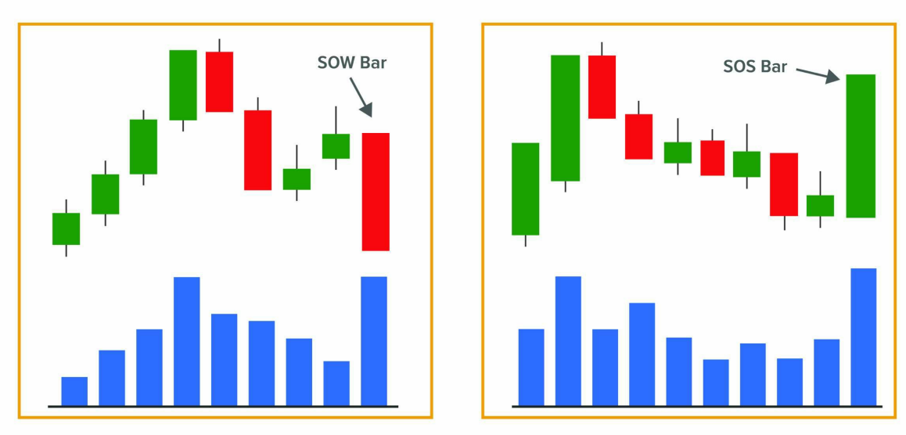

Một nến có những đặc điểm này thể hiện **ý đồ rõ ràng**, và thường được gắn liền với **sự hiện diện của tổ chức**. Vì ta giả định rằng có sự hiện diện của tổ chức, nên ta kỳ vọng rằng giá sẽ tiếp tục di chuyển theo hướng đó.

Nếu giá không hình thành rõ một **significant bar**, ta có thể đánh dấu **hai nến bình thường** và kết hợp chúng lại để tạo thành một **significant bar** sử dụng các đặc điểm tương tự.

➡️ Rất nên sử dụng khái niệm **significant bar** này để cố gắng **xác định các điểm đảo chiều của thị trường**.

---

### **KHÁI NIỆM “REVERSAL OF MOVEMENT” (ĐẢO CHIỀU XU HƯỚNG)**

Xác định điểm kết thúc của một xu hướng dài không phải là điều dễ dàng. Mục tiêu là xác định càng sớm càng tốt điểm mà tại đó **khả năng bắt đầu một chuyển động ngược lại có thể xảy ra**.

Điều đầu tiên cần làm là **xác định significant bar cuối cùng** của chuyển động mà giá hiện tại đang đứng. Và chúng ta giả định rằng nến đó **đánh dấu sự kiểm soát thị trường hiện tại**, vì xác suất là giá sẽ tiếp tục di chuyển theo hướng đó (theo hướng của bên đang kiểm soát thị trường).

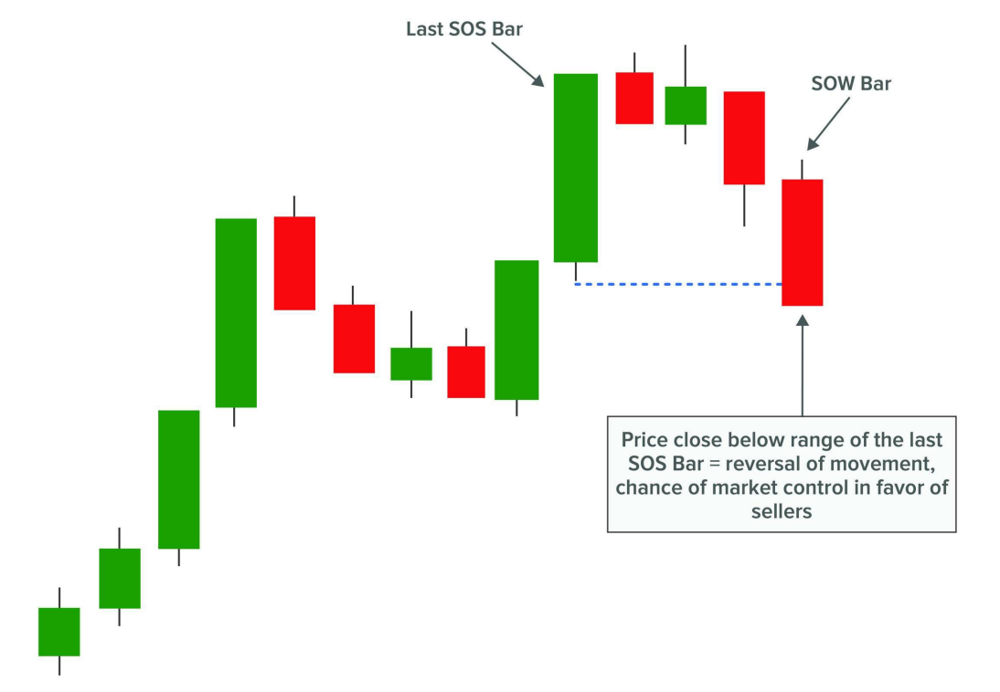

Nghĩa là:

- Nếu giá đang trong một xu hướng tăng và nằm **trên một significant bullish bar**, ta sẽ giả định rằng **người mua đang kiểm soát thị trường**.
- Ngược lại, nếu giá đang trong một xu hướng giảm và nằm **dưới một significant bearish bar**, ta sẽ nói rằng **người bán đang kiểm soát thị trường**.

Với sự xuất hiện của các **significant bar mới thuận chiều với xu hướng**, quyền kiểm soát thị trường sẽ tiếp tục dịch chuyển, neo vào các **significant bar mới** đó.

🔑 Điểm mấu chốt là chúng ta sẽ xác định rằng **quyền kiểm soát thị trường đã bị đảo chiều** khi **giá phá vỡ significant bar cuối cùng** đang đánh dấu quyền kiểm soát, bằng **một significant bar mới có ý đồ ngược hướng với chuyển động hiện tại**.

Để làm điều này, chúng ta **đánh dấu các cực biên của significant bar cuối cùng**, và một cú đóng cửa theo hướng ngược lại sẽ cảnh báo chúng ta về khả năng đảo chiều xu hướng:

- Để xác định **kết thúc xu hướng tăng** và khả năng **bắt đầu xu hướng giảm**, ta cần thấy **một reversal bar giảm** đóng cửa **dưới đáy** của **significant bullish bar** đánh dấu quyền kiểm soát của người mua.
- Để xác định **kết thúc xu hướng giảm** và khả năng **bắt đầu xu hướng tăng**, ta cần thấy **một reversal bar tăng** đóng cửa **trên đỉnh** của **significant bearish bar** đánh dấu quyền kiểm soát của người bán.

💡 Khái niệm đảo chiều xu hướng này rất quan trọng vì khi ta quan sát thấy **change of character**, ta **nhiều khả năng sẽ thấy các reversal bar**.

- Sau **Selling Climax**, ta nhiều khả năng sẽ thấy **nến đảo chiều tăng**.
- Khi xu hướng tăng bắt đầu, ta có thể thấy **nến đảo chiều giảm** báo hiệu kết thúc của **Automatic Rally**.
- Và điều đó cũng đúng với tất cả các sự kiện khác trong biên độ giao dịch.

---

Dưới đây là **phần tiếp theo** của bản dịch **nguyên bản đầy đủ chương 27 – Ra quyết định (Decision-Making)** từ sách phương pháp Wyckoff. Nội dung tiếp tục với các mục: **Position Management, Entry, Stop Loss, Trailing Stop, Take Profit, Liquidity Zones, Volume Profile Levels**, **giữ nguyên mọi từ khóa chuyên môn như SOSbar, SOWbar, LPSY, Creek, Ice, VWAP, VPOC, v.v.**

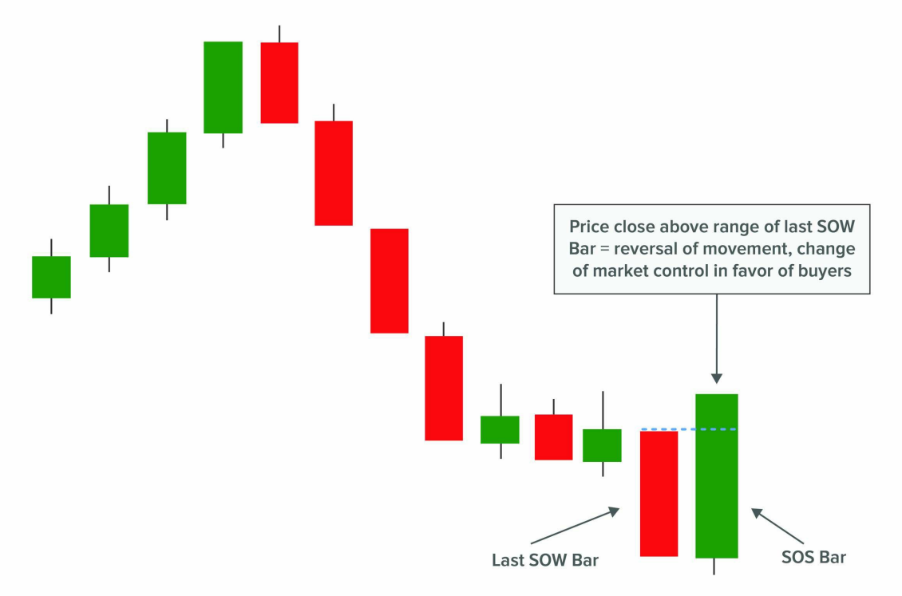

---

### **QUẢN LÝ VỊ THẾ (POSITION MANAGEMENT)**

Bây giờ chúng ta sẽ xem xét cách **vào và thoát khỏi thị trường**. Tôi **rất khuyến nghị** nên gửi cả **3 lệnh (vào lệnh – dừng lỗ – chốt lời)** cùng lúc để tránh các vấn đề **kỹ thuật và tâm lý** sau này.

Có thể trong trường hợp bạn chỉ thực hiện lệnh vào lệnh và sau đó giá đi ngược lại, **bạn không còn đủ bản lĩnh** để đặt lệnh dừng lỗ như ban đầu. Bạn có thể run rẩy ở thời điểm đó hoặc thậm chí **tự thuyết phục bản thân rằng điểm dừng ban đầu quá gần**, và rằng nên **di chuyển nó ra xa hơn**. Bạn đang đơn giản **tìm kiếm lý do để không đối mặt với thực tế thua lỗ**. Kết quả cuối cùng trong hầu hết trường hợp sẽ là **một khoản lỗ lớn hơn kỳ vọng ban đầu**.

Bạn cũng có thể gặp phải sự cố kỹ thuật như **mất kết nối với broker**. Đó chắc chắn là một tình huống rất khó chịu vì bạn sẽ bị kẹt trong một vị thế mở **mà không có bất kỳ biện pháp bảo vệ nào**.

➡️ Để tránh những tình huống như vậy, **không có lý do gì để không đặt cả 3 lệnh ngay từ đầu**. Nếu phân tích của bạn chính xác, thì điểm vào lệnh, điểm dừng lỗ và điểm chốt lời đều **đã được xác định trước** khi bạn tham gia thị trường.

---

#### **TÍNH TOÁN KÍCH THƯỚC LỆNH (CALCULATE THE SIZE OF THE POSITION)**

Một cách rất hữu ích để thực hiện quản lý rủi ro hợp lý là **tính kích thước lệnh dựa trên khoảng cách giữa mức vào lệnh và mức dừng lỗ**.

Cá nhân tôi làm việc với **rủi ro cố định dựa trên kích thước tài khoản**. Điều đó có nghĩa là với mỗi vị thế, tôi sẽ rủi ro **một tỷ lệ phần trăm** của tổng tài khoản được nạp vào broker. **Tỷ lệ này được khuyến nghị không vượt quá 1%.**

👉 Hiểu kỹ điều này, **khoảng cách giữa mức vào lệnh và stop loss sẽ xác định % rủi ro cho giao dịch** (ví dụ: 1%). Từ đó, khoảng cách đến take profit sẽ xác định tỷ lệ **R:R (Risk:Reward)** mà giao dịch đó cung cấp.

Ví dụ:

- **1% của tài khoản 5.000$ là 50$**. Nếu giao dịch của bạn có **tỷ lệ 1:3**, với kiểu quản lý này kết quả tiền tệ có thể là:
- **Lãi 150$** hoặc **lỗ 50$**.

Tùy thuộc vào loại giao dịch, nói chung **không nên nhận các lệnh có tỷ lệ R:R âm**, tức là **rủi ro lớn hơn phần thưởng**.

📌 Vấn đề quản lý vị thế là một chủ đề rất rộng và phức tạp. Tôi chỉ muốn đưa ra điểm nhỏ này vì **nó là đủ để thực hiện một giao dịch chắc chắn hơn**. Tôi khuyến khích bạn tìm đọc thêm các tài liệu chuyên sâu về chủ đề này – **rất đáng để nghiên cứu.**

---

### **VÀO LỆNH (ENTRY)**

Tôi quay lại các khái niệm đã nghiên cứu trước đó vì **chúng rất quan trọng với giao dịch thực tế của chúng ta**:

📌 Nếu sau một cú **phá vỡ xuống** của cấu trúc, và giá đang phát triển một chuyển động hồi lên để hình thành cú test sau phá vỡ (tức là một **LPSY tiềm năng**), thì sự xuất hiện của một **nến giảm mạnh (Significant Bar)** tại khu vực phù hợp (vùng **Ice**) và **đóng cửa dưới đáy của significant bar tăng trước đó**, có thể mang lại **cơ hội vào lệnh tốt**.

➡️ Đây chính xác là **tín hiệu vào lệnh (entry trigger)** mà chúng ta sẽ tìm kiếm trước khi đặt lệnh.

Về bản chất, đó là sự xuất hiện trong ngắn hạn của một **volume lớn (sự quan tâm)** gây ra sự phát triển của một **cây nến có chủ ý mạnh (significant bar, SOSbar/SOWbar)**. Lúc này chúng ta **ở đúng thời điểm và đúng vị trí**.

Với sự xuất hiện của sự kiện kỳ vọng này, **không còn gì để làm ngoài việc vào lệnh**.

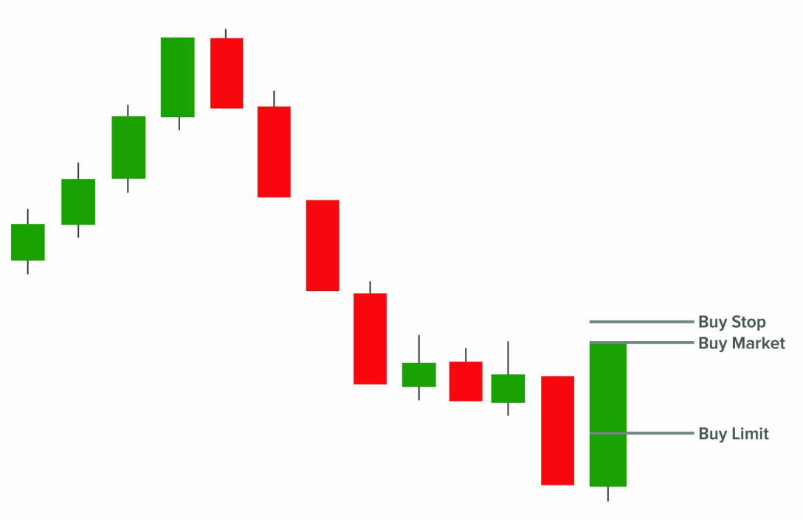

Ngày nay, các nền tảng giao dịch cung cấp cho chúng ta nhiều phương thức vào lệnh:

- **Market orders**: vào thị trường ngay lập tức ở giá khớp cuối cùng.
- **Stop orders**: vào thị trường một cách **thụ động theo hướng xu hướng**.
- **Limit orders**: vào thị trường **thụ động ngược xu hướng**.

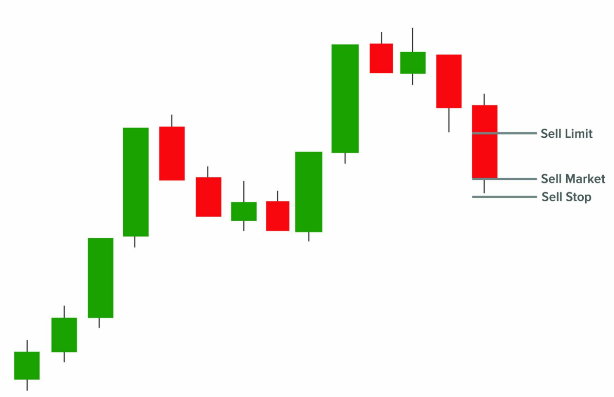

⚠️ Ở điểm này, tôi muốn nhấn mạnh lần nữa **tầm quan trọng của việc định lượng tín hiệu vào lệnh**. Như bạn thấy, có rất nhiều cách để vào thị trường và **mỗi cách sẽ có hiệu suất khác nhau trong chiến lược**.

➡️ Lời khuyên của tôi: hãy học cách **backtest một cách bài bản**, để **thu được các thống kê khách quan**. Qua đó, bạn có thể so sánh hiệu quả của các phương thức vào lệnh khác nhau.

---

### **DỪNG LỖ (STOP LOSS)**

Ý tưởng là đặt stop loss tại điểm mà **nếu bị chạm tới, kịch bản giao dịch sẽ bị vô hiệu hóa**.

Khi đặt stop loss, chúng ta cần xem xét **loại vào lệnh mà mình đang sử dụng**. Theo nguyên tắc chung, ta sẽ đặt stop loss:

- **Phía đối diện với hướng mà significant bar (SOS/SOWbar) phát triển**, và
- **Ở phía còn lại của toàn bộ kịch bản**.

Các trường hợp cụ thể:

🔹 **Vào lệnh trực tiếp tại Shake:**

- Với **Spring** → đặt stop **dưới đáy**.
- Với **Upthrust** → đặt stop **trên đỉnh**.

🔹 **Vào lệnh tại Shake test:**

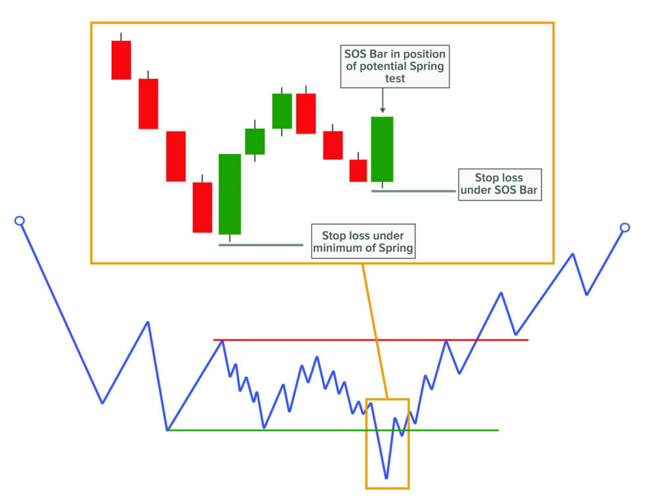

Có hai vị trí khả thi:

- Một là **phía bên kia của significant bar**,
- Hai là **tại đầu mút của toàn bộ giai đoạn**.

Ví dụ:

- **Spring test** → stop có thể đặt **dưới SOSbar** hoặc **dưới đáy của Spring**.
- **Upthrust test** → stop có thể đặt **trên SOWbar** hoặc **trên đỉnh của Upthrust**.

🔹 **Vào lệnh theo cấu trúc nhỏ (minor structure):**

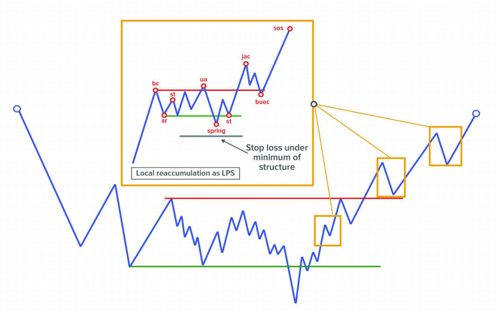

- **Reaccumulation nhỏ** → đặt dưới đáy cấu trúc.
- **Redistribution nhỏ** → đặt trên đỉnh cấu trúc.

🔹 **Vào lệnh tại Break Test (Event #7):**

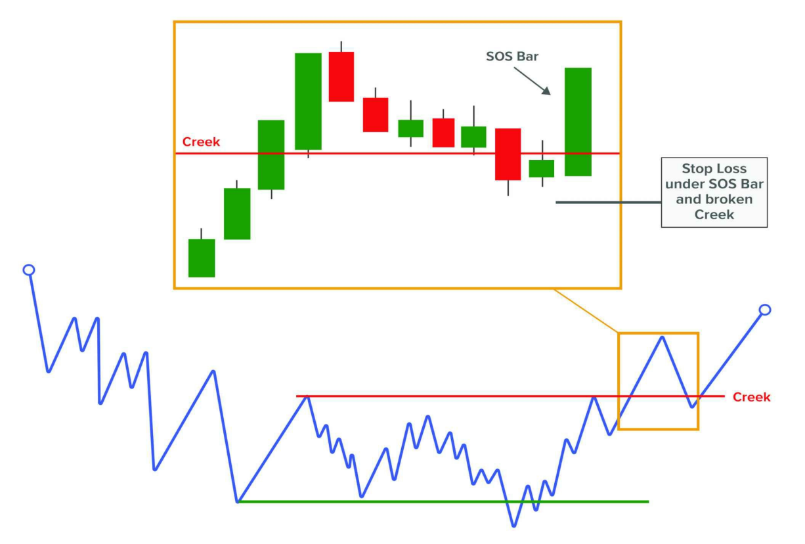

- Với cú **breakout test (BUEC/LPS)** → stop đặt **dưới SOSbar** và **dưới Creek bị phá**.
- Với cú **breakdown test (FTI/LPSY)** → stop đặt **trên SOWbar** và **trên Ice bị phá**.

---

### **TRAILING STOP**

Một cách khác để quản lý vị thế là sử dụng **trailing stop**, tức là **di chuyển vị trí stop loss theo hướng có lợi khi giá đi đúng kỳ vọng**.

➡️ Dù có vẻ là một ý tưởng tốt, **cá nhân tôi không sử dụng trailing stop**, vì:

- **Bản chất của nó là không cho giá đủ không gian để di chuyển**, dẫn đến việc stop bị hit dễ dàng.

Tuy nhiên, cũng là vấn đề thử nghiệm và định lượng xem chiến lược của bạn có cải thiện hiệu suất khi áp dụng trailing stop hay không.

---

### **CHỐT LỜI (TAKE PROFIT)**

Ban đầu, phương pháp Wyckoff sử dụng **biểu đồ Point and Figure** để xác định các mục tiêu giá tiềm năng.

Chúng ta hiểu rằng **cấu trúc thị trường hiện nay đã thay đổi quá nhiều** để tiếp tục sử dụng công cụ đó, do đó về mặt vận hành, **sử dụng các công cụ khác sẽ thiết thực hơn nhiều.**

Dựa trên phân tích thuần túy theo phương pháp Wyckoff, dưới đây là **những hành động có thể áp dụng để chốt lời:**

---

#### 🔸 **1. DẤU HIỆU CỦA CLIMACTIC BAR**

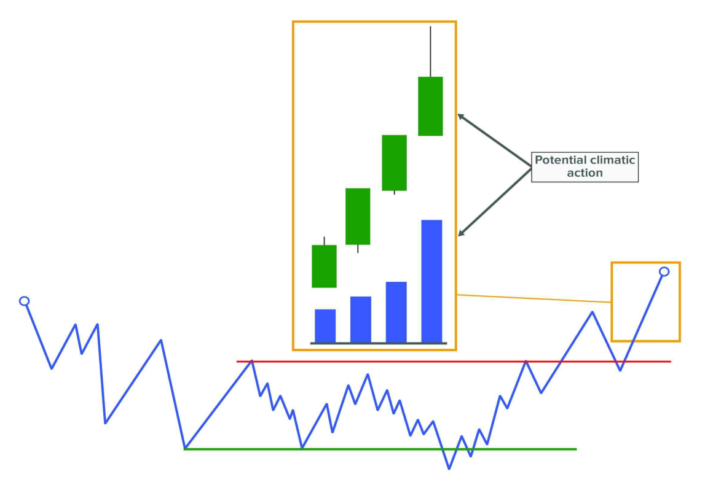

Một **Buying Climax** hoặc **Selling Climax** tiềm năng sẽ thể hiện qua:

- Biên độ lớn
- Tốc độ di chuyển nhanh
- Khối lượng cực cao

Đây là **nỗ lực để dự đoán điểm dừng của xu hướng trước đó**, nhưng cũng có thể **là tín hiệu đủ mạnh để đóng lệnh hoặc ít nhất là giảm vị thế.**

👉 Đây là **cách tuyệt vời để thoát khỏi thị trường** khi không còn hành động giá bên trái để tham chiếu (ở các điểm cực trị của thị trường).

Việc thiếu tham chiếu như vậy khiến chúng ta trở nên "mù quáng" trong hành động, dẫn đến một số bất lực trong vận hành. Lúc này hơn bao giờ hết, **chúng ta phải biết cách lắng nghe điều mà giá và khối lượng đang nói.**

Một khối lượng đỉnh điểm tại một đầu của thị trường **là lý do đủ để rút khỏi vị thế.**

---

#### 🔸 **2. SAU KHI PHÁT TRIỂN PHA A (PHASE A) CỦA VIỆC DỪNG XU HƯỚNG TRƯỚC ĐÓ**

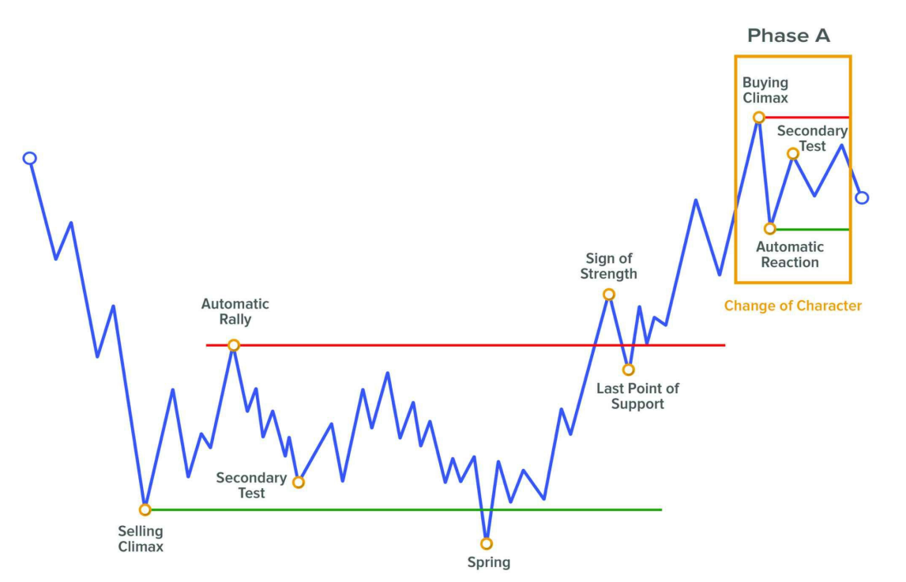

Việc xuất hiện **bốn sự kiện đầu tiên** đánh dấu sự hình thành của **Phase A** là **lý do đủ để hiểu rằng xu hướng trước đó đã kết thúc** và chúng ta cần **đóng vị thế.**

Sau đó xu hướng có thể tiếp tục theo cùng hướng, nhưng **tại thời điểm đó chúng ta không thể biết chắc**, vì vậy điều hợp lý nhất là **thực hiện chốt lời.**

⚠️ Quan trọng: cấu trúc mới nên được phát triển trong cùng khung thời gian mà ta đã xác định cấu trúc trước đó.

Hãy nhớ áp dụng **các khái niệm về significant bar và reversal of movement** để xác định kết thúc của các sự kiện này một cách tự tin hơn.

---

#### 🔸 **3. LIQUIDITY ZONES (CÁC VÙNG THANH KHOẢN)**

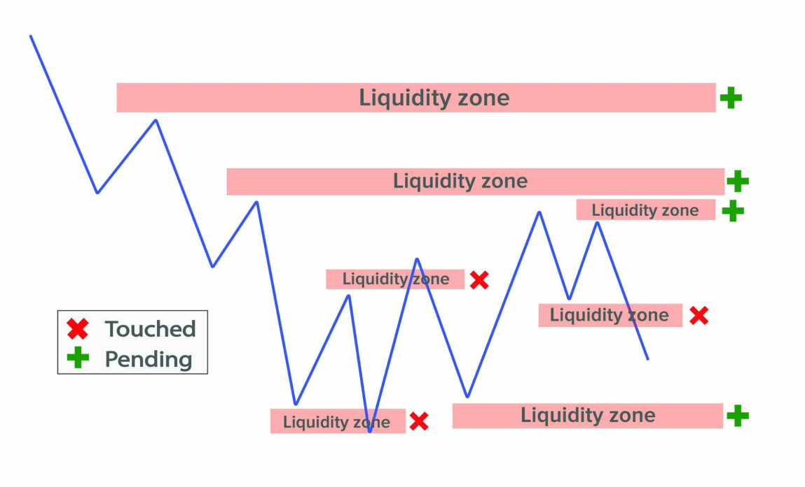

Đây là các điểm quay đầu giá – **các đỉnh và đáy trước đó.** Chúng ta biết rằng ở các vùng này **luôn tồn tại rất nhiều lệnh chờ**, do đó chúng là **vùng rất thú vị để chờ giá đến.**

Một số ví dụ:

- **Đáy của Selling Climax** (trong cấu trúc accumulation)
- **Đáy của Automatic Reaction** (trong cấu trúc distribution)
- **Đỉnh của Buying Climax**
- **Đỉnh của Automatic Rally**

👉 Một ví dụ khác là **các vùng thanh khoản trước đó** (không phụ thuộc vào cấu trúc), cả trong **khung thời gian giao dịch hiện tại** lẫn các khung thời gian cao hơn.

📌 Cách tốt nhất để tận dụng các Liquidity Zone là:

- **Xác định các vùng thanh khoản trên khung thời gian cao**
- Đặt các vùng đó làm **mục tiêu giá (target)**
- Từ đó, sử dụng các cấu trúc giá được hình thành để vào lệnh với các mức giá mục tiêu đã được xác định.

⚠️ Ta cần lưu ý rằng **thị trường luôn thay đổi liên tục** và sẽ tiếp tục tạo ra các điểm quay đầu mới (tức **các vùng thanh khoản mới**), vì vậy **các mục tiêu cũng cần được điều chỉnh theo thông tin mới từ thị trường**.

👉 Ví dụ: nếu ban đầu ta đặt Take Profit ở một vùng thanh khoản xa, nhưng sau đó trong quá trình di chuyển, giá tạo ra một vùng thanh khoản mới gần hơn → **chúng ta cũng cần tính đến vùng mới này.**

---

### **CÁC MỨC TRONG VOLUME PROFILE (VOLUME PROFILE LEVELS)**

**Volume Profile** là một phương pháp chuyên sâu dựa trên công cụ mạnh mẽ, giúp phân tích khối lượng giao dịch theo **các mức giá**, và xác định các mức giá thu hút **nhiều hoặc ít sự quan tâm nhất.**

Có nhiều loại Volume Profile khác nhau:

- **Theo phiên (session)**
- **Theo vùng (range)**
- **Tổng hợp (composite)**

Một số mức quan trọng nhất (được trình bày sâu hơn trong cuốn sách thứ hai *"Wyckoff 2.0: Structures, Volume Profile and Order Flow"*):

---

#### 🔹 **VPOC – Volume Point Of Control**

- Là **mức giá được giao dịch nhiều nhất** trong Volume Profile.
- Đại diện cho **mức giá có sự chấp nhận cao nhất** bởi cả bên mua và bên bán.

🧠 Logic đằng sau:

- Vì nó đã từng là mức mà cả hai phe cảm thấy thoải mái khi giao dịch → rất có khả năng rằng **trong tương lai nó sẽ tiếp tục được coi là mức giá hợp lý**.
- Do đó, mức này có **tính từ trường**, hút giá về phía nó như nam châm.

➡️ Cần xác định rõ:

- **VPOC của các phiên trước**
- **VPOC của phiên hiện tại**
- **Naked VPOC** – những VPOC cũ **chưa được kiểm định lại**

---

#### 🔹 **VWAP – Volume Weighted Average Price**

- Là **giá trung bình có trọng số theo khối lượng**, tại đó một tài sản được giao dịch trong giai đoạn chọn lọc.

👉 Là **mức giá tham chiếu cho các trader tổ chức** → **luôn tồn tại rất nhiều lệnh chờ tại đó** → lại một lần nữa, đây là **mức có tính “nam châm”**.

📌 Bạn có thể chọn VWAP theo thời gian phù hợp với chiến lược:

- **VWAP phiên** (Session VWAP) → phù hợp với Intraday
- **VWAP tuần/tháng** → phù hợp với Swing

---

📌 Ngoài VPOC và VWAP, trong Volume Profile còn có các mức như:

- **Volume Node cao/thấp (HVN/LVN)**
- **Value Area High / Low**

Tuy nhiên, **VPOC và VWAP là hai mức quan trọng nhất** để sử dụng trong giao dịch.

💡 Tôi khuyến nghị **nghiên cứu chuyên sâu về Volume Profile**, vì đây là một trong những công cụ tốt nhất để tăng cường hiệu quả phân tích chủ động (discretionary analysis).

---

#### **ÁP DỤNG VÙNG VOLUME TRADING KHÔNG CHỈ ĐỂ CHỐT LỜI**

⚠️ Những **volume trading areas** này **không chỉ nên dùng để chốt lời**.

Vì chúng **rất quan trọng trong vận hành hiện tại**, điều hợp lý nhất là:

- **Luôn đánh dấu sẵn trên biểu đồ**
- **Tận dụng chúng cả trong việc vào lệnh lẫn đặt stop loss**

---

#### **MỘT VÍ DỤ VỀ SỰ HỘI TỤ CÁC MỨC**

Một kịch bản hợp lý:

- Vào lệnh **Short tại một LPSY tiềm năng** (sau cú phá vỡ xuống)
- Tại **khu vực phù hợp về context** (Ice)
- Xuất hiện **trigger candle – một SOWbar**
- Phần trên của nến này **chạm một mức volume như VPOC/VWAP** → thể hiện sự từ chối tiếp tục tăng

➡️ Bạn có thể:

- Vào lệnh **ở cuối sự phát triển của cây nến đó**
- Đặt **Stop Loss trên SOWbar**, **trên Ice bị phá**, **trên mức volume bị từ chối**
- **Chốt lời ở một trong các vùng Liquidity Zones hoặc Volume Profile đã xác định trước đó**

---
