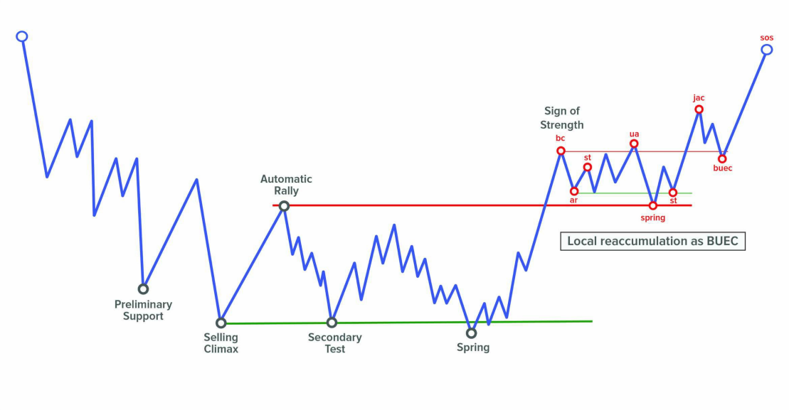
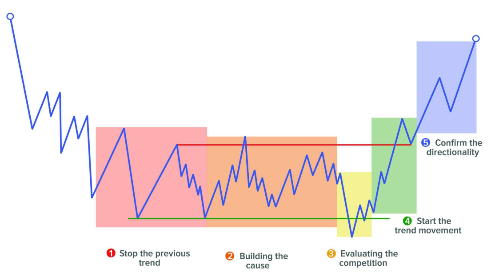
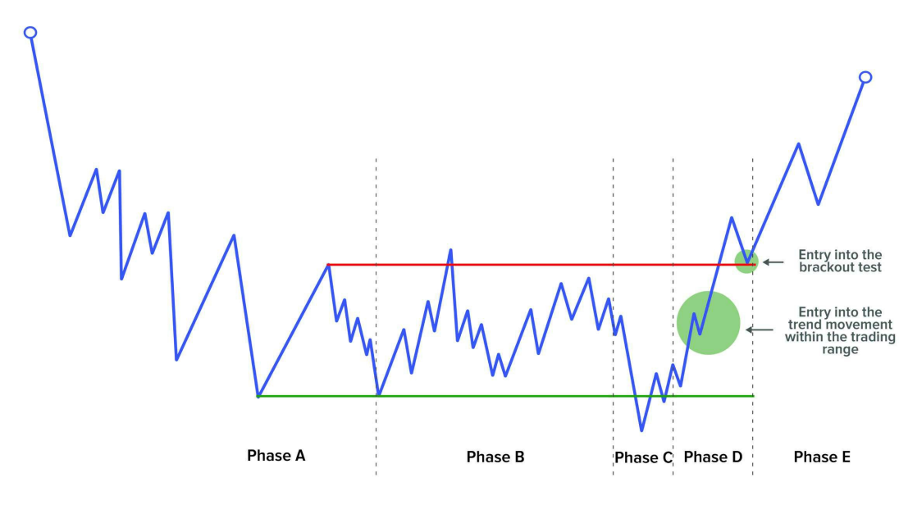
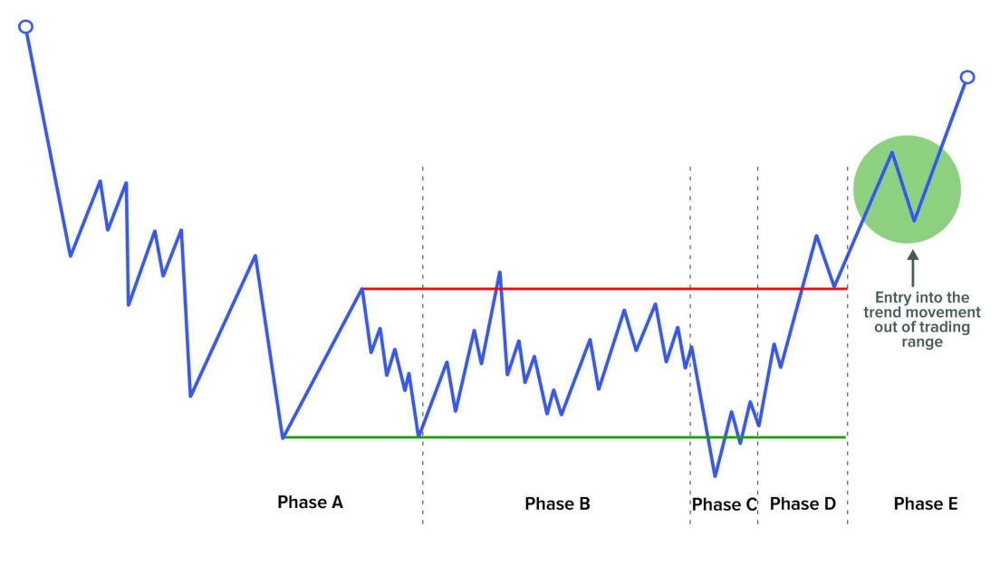

Các quyết định giao dịch và đầu tư của chúng ta sẽ dựa trên ba yếu tố mà tôi tin là quan trọng nhất cần xem xét trong việc đọc biểu đồ một cách chủ động, theo thứ tự: **bối cảnh (context), cấu trúc (structures)** và **vùng giao dịch (trading areas).**

---

## 1. **BỐI CẢNH (THE CONTEXT)**

Nó liên quan chủ yếu đến những gì nằm bên trái của biểu đồ, cả trong khung thời gian mà bạn chọn để giao dịch và trong khung thời gian cao hơn.

Quy tắc then chốt về bối cảnh rất rõ ràng: **giao dịch theo hướng của cấu trúc lớn hơn.** Điều này có nghĩa là, khi thị trường phát triển nhiều cấu trúc cùng lúc ở các khung thời gian khác nhau, chúng ta phải luôn ưu tiên sự phát triển của cấu trúc dài hạn hơn. Đây là cách logic nhất để chúng ta định hướng thị trường.

Ví dụ, nếu chúng ta thấy mình ở sau một cú bứt phá đi lên trong một cấu trúc tích lũy tiềm năng thuộc khung thời gian cao hơn, thì tại khu vực đó, chúng ta sẽ ưu tiên sự phát triển của một cấu trúc **reaccumulation** nhỏ hơn sẽ hoạt động theo dạng **BUEC** của cấu trúc lớn hơn.

Trong ví dụ này, chúng ta thấy rằng phân tích của mình đã có thành kiến (thiên về sự phát triển của **reaccumulation**) dựa trên những gì giá đã làm cho đến khi đạt đến điểm đó (cấu trúc tích lũy chính tiềm năng). Đây là tầm quan trọng của **context**.

Ngoài việc mang lại cho chúng ta cơ hội giao dịch an toàn hơn, việc xác định **context** còn giúp chúng ta tránh tìm kiếm các giao dịch ở phía sai của thị trường.

Nói cách khác, nếu phân tích cấu trúc của chúng ta nói rằng thị trường có thể đang tích lũy, thì kể từ thời điểm đó, chúng ta chỉ nên tìm kiếm các lệnh **buy**, và loại bỏ hoàn toàn các lệnh **sell**.

Điều này rất quan trọng vì đôi khi chúng ta có thể không tìm được điểm vào phù hợp trong xu hướng tăng hiện tại, nhưng ít nhất chúng ta cũng sẽ tránh được việc đứng ở phía sai – trong ví dụ này là phía **short**. Chúng ta có thể không thắng, nhưng ít ra cũng không thua.

---

## 2. **CẤU TRÚC (THE STRUCTURES)**

Đây là nền tảng của phương pháp Wyckoff. Nhiệm vụ của chúng ta là cố gắng hiểu điều gì đang xảy ra bên trong cấu trúc, ai đang giành quyền kiểm soát giữa bên mua và bên bán.

Mục tiêu duy nhất của việc nội tâm hóa toàn bộ lý thuyết đã học là để đến được giai đoạn này trong giao dịch – **đưa ra các kịch bản vững chắc nhất có thể.**

Nhiều trader đánh giá thấp phương pháp Wyckoff, viện lý do rằng nó được phát triển trong điều kiện thị trường rất khác so với hiện nay. Điều này hoàn toàn đúng, vì công nghệ và cơ cấu thị trường đã thay đổi đáng kể.

Tuy nhiên, điều không thay đổi là **sự tương tác giữa cung và cầu**. Bất kể ai thực hiện lệnh, sự tương tác này vẫn để lại dấu vết trên giá dưới dạng các **cấu trúc** lặp đi lặp lại.

Logic của cấu trúc dựa trên thực tế rằng, để giá có thể xoay chuyển, nó cần được **tích lũy (accumulated)** hoặc **phân phối (distributed)** trong một **quy trình có hệ thống** và cần thời gian để hình thành. Dù đôi khi thị trường có những cú quay đầu hình chữ V dữ dội, nhưng đây không phải là điều phổ biến.

Quy trình này gồm nhiều bước (các **phase** và **event** trong phương pháp) giúp chúng ta nhận biết khi nào giá có khả năng xoay chiều. Tóm tắt, các bước đó gồm:

1. **Dừng xu hướng trước đó**
2. **Xây dựng nguyên nhân (cause)**
3. **Đánh giá cuộc cạnh tranh**
4. **Bắt đầu xu hướng mới**
5. **Xác nhận tính định hướng**

Phương pháp Wyckoff đã **phóng đại kính hiển vi** vào từng bước này để tạo ra một **kỷ luật phân tích** có mục tiêu đánh giá dấu chân của cung và cầu thông qua giá và khối lượng, nhằm xác định nơi nào thị trường có khả năng mất cân bằng quyền kiểm soát. Đây chính là công việc của một Wyckoff trader.

Tóm lại, mục tiêu là **đưa ra kịch bản vững chắc**, điều mà sẽ **bất khả thi nếu chúng ta không hiểu toàn bộ các yếu tố cấu thành phương pháp.**

---

## 3. **VÙNG GIAO DỊCH (TRADING AREAS)**

Nguyên lý cốt lõi ở đây là **lý thuyết đấu giá (auction theory)** và nhu cầu của thị trường trong việc tạo điều kiện cho giao dịch. Như chúng ta đã nói trước đó, các **big trader** cần tìm người giao dịch đối ứng khi mở hoặc đóng vị thế.

Vì vậy họ tận dụng các đợt **Shake** để mở vị thế, và giữ lệnh đó đến khi giá chạm đến **các vùng có thanh khoản lớn** để có thể đóng vị thế.

Điểm mấu chốt là **các vùng giao dịch này hoạt động như nam châm hút giá** vì chúng tạo ra đủ sự quan tâm để các trader khác đặt các lệnh chờ (pending orders) xung quanh khu vực đó – **thu hút thanh khoản (liquidity)**. Và chính thanh khoản này khiến giá có xu hướng quay về các vùng này.

Ví dụ, một **big trader** đã mua rất nhiều khi thị trường giảm (Spring), thì họ cần giữ vị thế **mua** cho đến khi tìm được vùng thanh khoản lớn để **đóng các lệnh mua** (tức là **bán** ra). Khi đó, họ cần **volume của người mua**, tức các trader sẵn sàng mua các lệnh **sell** của họ.

Vì lý do đó, họ gần như **bắt buộc phải đưa giá đến các vùng có nhiều lệnh chờ** để tìm **thanh khoản** – và chúng ta có thể **gián tiếp tận dụng thông tin này**. Chúng ta sẽ đi sâu vào từng vùng cụ thể trong phần sau.

---

## **VỊ THẾ CHÍNH (PRIMARY POSITIONS)**

Trong phương pháp Wyckoff, **chỉ có một số vùng nhất định được xem là hợp lệ để đánh giá khả năng vào lệnh**, gồm:

- **Phase C**: tại vùng có khả năng xuất hiện cú **Shake** (Spring hoặc Upthrust).
- **Phase D**: trong quá trình phát triển của xu hướng bên trong biên độ hoặc ở lần kiểm tra sau cú phá vỡ.
- **Phase E**: tìm kiếm các lần kiểm tra xu hướng hoặc các cấu trúc nhỏ thuận chiều với cấu trúc lớn hơn (**context**).

Chúng ta sẽ đi vào chi tiết từng vùng giao dịch, cũng như các sự kiện có thể xảy ra trong những vùng này.

---

### **So sánh ưu – nhược điểm của các vị thế giao dịch**

Điểm then chốt: **Cấu trúc phát triển càng đầy đủ, độ tin cậy khi giao dịch càng cao**, nhưng **lợi nhuận tiềm năng sẽ thấp hơn**. Nói cách khác, **càng vào lệnh sớm, lợi nhuận tiềm năng càng lớn nhưng độ tin cậy càng thấp.**

---

## ✅ **TRONG PHASE C**

Đây là vị trí mang lại **tỷ lệ Risk:Reward tốt nhất** vì ta đang ở đầu mép cấu trúc và tiềm năng di chuyển của giá còn nhiều.

### 🔹 **Vào lệnh tại Shake (Spring/Upthrust)**

Chỉ nên vào nếu Shake diễn ra với **khối lượng thấp**. Vì chúng ta biết rằng khối lượng cao thường sẽ bị **test lại** để xác minh sự cam kết của các trader, nên việc vào lệnh ngay sau một Shake có volume lớn là **thiếu hợp lý**. Thay vào đó, **hãy chờ cú test**, thường sẽ mang lại **tỷ lệ Risk:Reward tốt hơn**.

Các Shake có thể nhận biết dễ dàng vì xảy ra ở **đầu mút của cấu trúc**. Không cần theo dõi từng phút, chỉ cần đặt **cảnh báo giá** tại các điểm cực trị là có thể chuẩn bị sẵn sàng để giao dịch.

---

### 🔹 **Vào lệnh tại Test của Shake**

Đây là **kiểu vào lệnh yêu thích nhất** của mọi Wyckoff trader.

Sau cú Shake, hãy **chờ giá quay lại khu vực đó**, với **biên độ co hẹp** và **volume giảm dần** (xem **Event #4: Test**).

Một điểm rất quan trọng là cú Test **phải giữ vững vùng biên**, không tạo đáy mới (nếu là Spring) hoặc không tạo đỉnh mới (nếu là Upthrust).

---

### 🔹 **Vào lệnh tại Last Point of Support (LPS)**

Đây là kiểu vào lệnh **khó phát hiện hơn**, vì ta **chỉ biết được nó là LPS sau khi cấu trúc đã bị phá vỡ** (ví dụ như trong **Accumulation Structure #2**).

**Phase C** có thể hình thành qua **Shake** hoặc qua sự kiện **LPS/LPSY**. Với Shake, ta có dấu hiệu rõ ràng (quét thanh khoản cuối cấu trúc). Nhưng với **LPS**, **ta không thể biết chính xác thời điểm nó đang diễn ra**, nên **thường không thể giao dịch** tại thời điểm đó.

---

## ✅ **TRONG PHASE D**

Nếu Shake + Test thành công, chúng ta sẽ thấy **một dấu hiệu thể hiện ý đồ rõ ràng** – **Sign of Strength (SOS)** hoặc **Sign of Weakness (SOW)** – dẫn giá đi theo hướng mới. Đây là **context** mà ta sẽ dựa vào để tiếp tục hành động.

### 🔹 **Vào lệnh trong xu hướng bên trong biên độ**

Trong quá trình giá di chuyển từ đầu này sang đầu kia, sẽ có nhiều cơ hội để vào lệnh.

- **Với một cây nến chủ động (Significant Bar)**:  
  Hãy chờ các cây nến thể hiện rõ chủ ý (như **SOS/SOW Bar**), thể hiện sự can thiệp của chuyên gia. Đây là tín hiệu rất đáng giá để vào lệnh.

- **Với cấu trúc nhỏ (Minor Structure)**:  
  Nếu vừa xác nhận một **Spring + Test**, bạn có thể xuống khung thời gian thấp hơn và tìm kiếm một cấu trúc **reaccumulation** nhỏ để kích hoạt lệnh **buy**. Ngược lại, sau **Upthrust + Test**, có thể tìm **redistribution** để vào **sell**.

- **Với cú Shake nhỏ (Minor Shake)**:  
  Đây là dạng Shake không xảy ra ở hai đầu của cấu trúc. Nếu bạn không muốn xuống khung thời gian thấp, có thể quan sát dạng này như một **mini LPS/LPSY**, giúp bạn vào lệnh thuận chiều xu hướng hiện tại.

---

### 🔹 **Vào lệnh tại lần kiểm tra phá vỡ (Break Test – Event #7)**

Như đã đề cập trong chương về sự kiện này, đây là **vị trí giao dịch ưa thích của Richard Wyckoff** bởi vì toàn bộ cấu trúc bên trái biểu đồ đã được hình thành, cho thấy khả năng **đồng hành cùng các chuyên gia** là rất cao.

Dù **lợi nhuận tiềm năng thấp hơn**, nhưng **xác suất thắng lại cao hơn**, vì ta đã **biết rõ cấu trúc thị trường trước đó**.

---

## ✅ **TRONG PHASE E**

Khi đã xác nhận cú phá vỡ là hiệu quả và bắt đầu xu hướng mạnh ra khỏi vùng tích lũy/phân phối, chúng ta sẽ **tìm cơ hội giao dịch thuận chiều với cấu trúc trước đó**.

Đây là kiểu giao dịch “**an toàn nhất**”, vì ta đang đi **thuận theo cấu trúc accumulation/distribution đã được xác nhận**. Tuy nhiên, nhược điểm là **biên lợi nhuận nhỏ hơn**, tùy vào độ “nguyên nhân” (cause) đã tích lũy trước đó.

---

### 🔹 **Vào lệnh trong xu hướng ra ngoài biên độ**

Giống như trong Phase D, chúng ta có thể vào lệnh theo các cách sau:

- **Với một cây nến chủ động (Significant Bar)**:  
  Khi thị trường di chuyển mạnh, bạn có thể **không có thời gian để chờ điểm vào hoàn hảo**. Trong trường hợp đó, chỉ cần thấy **một cây nến SOS/SOW mới xuất hiện**, có thể vào lệnh ngay để không bỏ lỡ sóng lớn.

- **Với cấu trúc nhỏ (Minor Structure)**:  
  Nếu cấu trúc lớn trước đó nằm trên khung H4 hoặc D1, bạn có thể xuống H1 hoặc thấp hơn để tìm **reaccumulation/redistribution nhỏ** nhằm **vào lệnh theo xu hướng hiện tại**.

- **Với Shake**:  
  Được xử lý giống như Shake trong **Phase C**, nhưng điểm khác biệt là **vị trí xuất hiện – nằm giữa xu hướng thuận chiều**. Những cú Shake này được gọi là:
  - **Ordinary Shakeout** (trong xu hướng tăng)
  - **Ordinary Upthrust** (trong xu hướng giảm)

Các cú Shake này có thể **không cần cấu trúc reaccumulation/redistribution đầy đủ** vì thị trường đã sẵn trong xu hướng mạnh.

Như đã nói, **giao dịch trong Phase E là an toàn nhất**, vì chúng ta đang đi cùng xu hướng chính sau accumulation/distribution đã xác nhận. Và cho đến khi **các sự kiện đầu tiên của Phase A** xuất hiện (dấu hiệu dừng xu hướng), thì **giả định hợp lý nhất vẫn là tiếp diễn xu hướng hiện tại**.

---

Dưới đây là bản dịch tiếng Việt của **Summary Table of Trading Opportunities** từ hình ảnh bạn cung cấp, giữ nguyên các từ khóa chuyên môn:

---

## **BẢNG TỔNG HỢP CƠ HỘI GIAO DỊCH**

| Hướng | Phase C                             | Phase D                                                                          | Phase E                                                                             |
|--------|-------------------------------------|----------------------------------------------------------------------------------|-------------------------------------------------------------------------------------|
|        | Tại Shake                           | Trong xu hướng bên trong biên độ giao dịch                                       | Trong xu hướng ra ngoài biên độ giao dịch                                          |
|        | Tại Test của Shake                  | Tại lần kiểm tra phá vỡ                                                           |                                                                                     |
|        | Tại điểm hỗ trợ cuối (LPS/LPSY)     |                                                                                  |                                                                                     |
| **Buy** | - Spring #3                         | - Sign of Strength bar - Cấu trúc nhỠreaccumulation - Minor Spring       | - Sign of Strength bar - Cấu trúc nhỠreaccumulation - Ordinary Shakeout      |
|        | - Spring test #1 & #2               | - Last Point of Support - Nến kiểm tra: “No Supply†                         |                                                                                     |
|        | - Last Point of Support             |                                                                                  |                                                                                     |
| **Sell**| - Upthrust không volume             | - Sign of Weakness bar - Cấu trúc nhỠredistribution - Minor Upthrust     | - Sign of Weakness bar - Cấu trúc nhỠredistribution - Ordinary Upthrust      |
|        | - Upthrust test                     | - Last Point of Supply - Nến kiểm tra: “No Demand†                          |                                                                                     |
|        | - Last Point of Supply              |                                                                                  |                                                                                     |

---